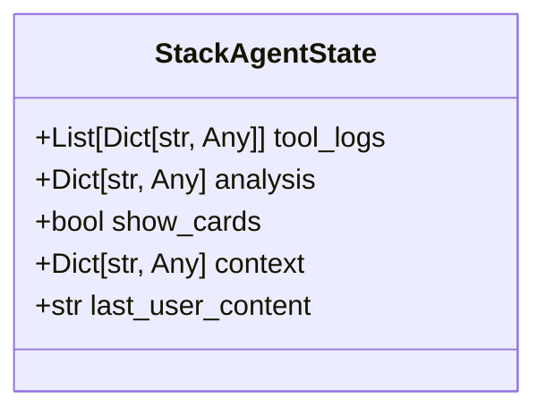
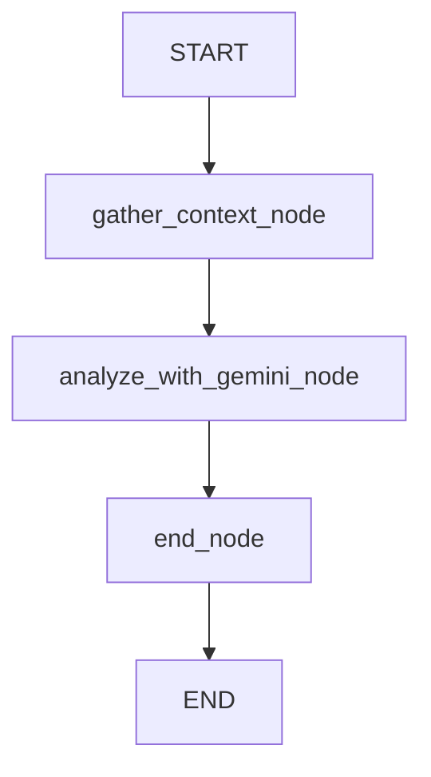
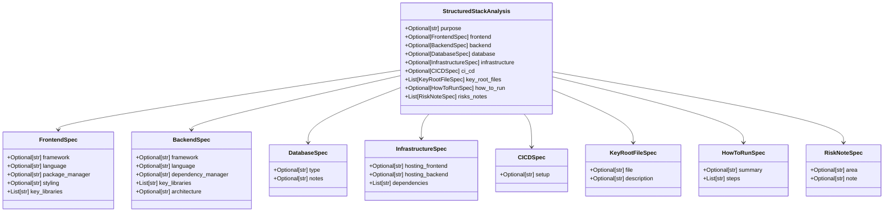
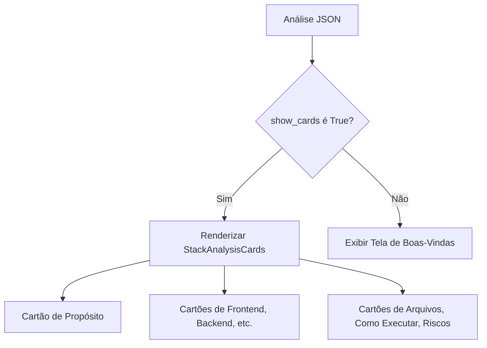

# Agente de Análise de Stack

<cite>
**Arquivos Referenciados neste Documento**  
- [agent/stack_agent.py](file://agent/stack_agent.py)
- [app/stack-analyzer/page.tsx](file://app/stack-analyzer/page.tsx)
- [components/ui/stack-analysis-cards.tsx](file://components/ui/stack-analysis-cards.tsx)
- [agent/main.py](file://agent/main.py)
</cite>

## Sumário
1. [Introdução](#introdução)
2. [Estrutura do Estado: StackAgentState](#estrutura-do-estado-stackagentstate)
3. [Fluxo do Grafo: stack_analysis_graph](#fluxo-do-grafo-stack_analysis_graph)
4. [Nó de Coleta de Contexto: gather_context_node](#nó-de-coleta-de-contexto-gather_context_node)
5. [Nó de Análise com Gemini: analyze_with_gemini_node](#nó-de-análise-com-gemini-analyze_with_gemini_node)
6. [Validação de Esquema com Pydantic](#validação-de-esquema-com-pydantic)
7. [Integração Frontend: Exibição de Resultados](#integração-frontend-exibição-de-resultados)
8. [Tratamento de Erros e Logs de Progresso](#tratamento-de-erros-e-logs-de-progresso)
9. [Conclusão](#conclusão)

## Introdução

O agente de análise de stack é um componente central do sistema Open Gemini Canvas, projetado para analisar repositórios do GitHub e inferir detalhes sobre sua arquitetura, propósito e tecnologias utilizadas. Este documento detalha a arquitetura, funcionamento interno e integração do agente, com foco no arquivo `stack_agent.py`. O sistema utiliza o framework LangGraph para orquestrar um fluxo de trabalho em grafo, coletando metadados do repositório, processando-os com um modelo de linguagem (Gemini via OpenRouter), e retornando uma análise estruturada ao frontend para exibição ao usuário.

## Estrutura do Estado: StackAgentState

A classe `StackAgentState` define o esquema de estado do agente, herdando de `CopilotKitState` para compatibilidade com o framework CopilotKit. Este estado é persistente durante a execução do grafo e é atualizado em cada nó para refletir o progresso da análise.



**Diagram sources**  
- [agent/stack_agent.py](file://agent/stack_agent.py#L29-L34)

**Section sources**  
- [agent/stack_agent.py](file://agent/stack_agent.py#L29-L34)

### Campos do Estado

- **`tool_logs`**: Uma lista de dicionários que registra o progresso da execução. Cada entrada contém um `id`, uma `message` descritiva (ex: "Fetching repository metadata") e um `status` ("processing", "completed"). Esses logs são emitidos em tempo real para o frontend via `copilotkit_emit_state`, fornecendo feedback visual ao usuário sobre as etapas sendo executadas.
- **`analysis`**: Um dicionário que armazena a análise final do stack em formato JSON. Este campo é preenchido com os dados estruturados retornados pelo modelo de linguagem e é o principal payload de saída do agente.
- **`show_cards`**: Um booleano que atua como um sinalizador para o frontend. Quando definido como `True`, indica que a análise foi concluída com sucesso e que o componente `StackAnalysisCards` deve ser exibido para o usuário.
- **`context`**: Um dicionário que armazena todos os dados brutos coletados do repositório do GitHub. Isso inclui metadados do repositório, linguagens utilizadas, conteúdo do README, arquivos raiz e manifestos de dependência. Este contexto é o insumo principal para a geração do prompt de análise.
- **`last_user_content`**: Armazena o conteúdo da última mensagem enviada pelo usuário, geralmente contendo a URL do repositório do GitHub a ser analisado. É usado para extrair a URL e para gerar um resumo final da análise.

## Fluxo do Grafo: stack_analysis_graph

O agente opera como um grafo de estado compilado pelo LangGraph. O grafo `stack_analysis_graph` é definido no final do arquivo `stack_agent.py` e orquestra a execução através de três nós principais.



**Diagram sources**  
- [agent/stack_agent.py](file://agent/stack_agent.py#L500-L504)

**Section sources**  
- [agent/stack_agent.py](file://agent/stack_agent.py#L500-L504)

### Nó `gather_context_node`

Este nó é o ponto de entrada do grafo. Ele é responsável por extrair a URL do GitHub da mensagem do usuário e coletar todos os dados necessários do repositório.

1.  **Extração da URL**: A função auxiliar `_parse_github_url` usa uma expressão regular para extrair o `owner` e o `repo` da URL fornecida pelo usuário.
2.  **Coleta de Dados**: Utilizando a API do GitHub, o nó faz várias chamadas para coletar:
    *   **Metadados do Repositório**: Via `_fetch_repo_info`.
    *   **Linguagens**: Via `_fetch_languages`, que retorna o uso de bytes por linguagem.
    *   **README**: Via `_fetch_readme`, que tenta acessar o README diretamente e, se falhar, procura por arquivos README em diferentes formatos.
    *   **Arquivos Raiz**: Via `_list_root`, que lista os arquivos e diretórios no nível raiz.
    *   **Manifestos**: Via `_fetch_manifest_contents`, que baixa o conteúdo de arquivos de configuração comuns (como `package.json`, `requirements.txt`, etc.) identificados na lista `ROOT_MANIFEST_CANDIDATES`.
3.  **Atualização de Estado**: Os dados coletados são agregados em um dicionário `context` e armazenados no estado do agente. Logs de progresso são adicionados ao `tool_logs` e emitidos em tempo real.

### Nó `analyze_with_gemini_node`

Este nó é o coração da análise, onde os dados coletados são processados por um modelo de linguagem para gerar uma visão estruturada do stack.

1.  **Construção do Prompt**: A função `_build_analysis_prompt` formata todos os dados do `context` em uma string de prompt bem estruturada. O prompt instrui o modelo a atuar como um arquiteto de software sênior e a retornar uma resposta em um formato JSON específico.
2.  **Chamada ao Modelo**: O modelo `ChatOpenAI` (configurado para usar o Gemini via OpenRouter) é invocado com o prompt. O agente tenta primeiro obter uma resposta estruturada usando a ferramenta `return_stack_analysis_tool`.
3.  **Fallback e Validação**: Se a chamada da ferramenta falhar, o agente usa o método `with_structured_output` do LangChain, que força o modelo a gerar uma saída compatível com o esquema `StructuredStackAnalysis`. A biblioteca Pydantic valida automaticamente a resposta.
4.  **Geração de Resumo**: Após obter a análise estruturada, um segundo modelo é chamado para gerar um resumo conciso e textual da análise, que é adicionado à conversa.
5.  **Atualização de Estado**: O JSON da análise é armazenado no campo `analysis` do estado, e `show_cards` é definido como `True`.

### Nó `end_node`

Este nó finaliza a execução do grafo. Ele emite um estado final vazio para os `tool_logs`, garantindo que o frontend pare de exibir o indicador de progresso, e encerra o fluxo de trabalho.

## Nó de Coleta de Contexto: gather_context_node

O nó `gather_context_node` é responsável pela fase de coleta de dados do agente. Sua principal função é transformar uma URL do GitHub fornecida pelo usuário em um conjunto estruturado de informações sobre o repositório.

**Section sources**  
- [agent/stack_agent.py](file://agent/stack_agent.py#L278-L378)

### Fluxo de Execução

1.  **Análise da Entrada do Usuário**: O nó acessa a última mensagem do usuário (`last_user_content`) e utiliza a função `_parse_github_url` para extrair o nome do proprietário (`owner`) e do repositório (`repo`). Se a URL não for encontrada, o nó retorna um comando para ir diretamente para o nó de análise com um contexto vazio, resultando em uma mensagem pedindo uma URL válida.
2.  **Registro de Progresso**: O nó utiliza o campo `tool_logs` para registrar cada etapa de coleta. Ele adiciona uma entrada com status "processing" antes de iniciar uma tarefa (como buscar metadados) e atualiza o status para "completed" após o sucesso. Essas atualizações são emitidas em tempo real para o frontend usando `copilotkit_emit_state`, fornecendo feedback visual ao usuário.
3.  **Interação com a API do GitHub**: O nó faz uso de uma série de funções auxiliares para interagir com a API do GitHub:
    *   `_github_headers()`: Constrói os cabeçalhos da requisição, incluindo um token de autorização se disponível.
    *   `_gh_get()`: Uma função wrapper para realizar requisições GET, tratando erros de rede e códigos de status HTTP.
    *   `_fetch_repo_info()`, `_fetch_languages()`, `_fetch_readme()`, `_list_root()`: Funções específicas para buscar diferentes tipos de dados do repositório.
    *   `_fetch_manifest_contents()`: Baixa o conteúdo de arquivos de configuração importantes (definidos em `ROOT_MANIFEST_CANDIDATES`) para fornecer contexto sobre as dependências do projeto.
4.  **Agregação de Contexto**: Todos os dados coletados são combinados em um dicionário `context` que contém chaves como `repo_info`, `languages`, `readme`, `root_files` e `manifests`. Este dicionário é então passado para o próximo nó no grafo.

## Nó de Análise com Gemini: analyze_with_gemini_node

O nó `analyze_with_gemini_node` é responsável por processar o contexto coletado e gerar uma análise estruturada do stack tecnológico do repositório.

**Section sources**  
- [agent/stack_agent.py](file://agent/stack_agent.py#L380-L498)

### Construção do Prompt

A função `_build_analysis_prompt` cria um prompt detalhado que fornece ao modelo de linguagem todo o contexto necessário. O prompt inclui:
*   Uma instrução clara de que o modelo deve atuar como um arquiteto de software sênior.
*   Metadados do repositório (nome, descrição, etc.).
*   A distribuição de linguagens de programação.
*   Uma lista dos arquivos no diretório raiz.
*   O conteúdo truncado dos principais arquivos de manifesto.
*   O conteúdo truncado do README.
*   Instruções para inferir frameworks e bibliotecas específicas e retornar uma resposta em um formato JSON estruturado.

### Geração e Validação da Análise

O nó implementa uma estratégia de fallback robusta para garantir uma saída estruturada:

1.  **Tentativa com Ferramenta**: O nó primeiro tenta invocar o modelo com a ferramenta `return_stack_analysis_tool` vinculada. Isso instrui o modelo a fazer uma chamada de ferramenta com os argumentos correspondentes ao esquema `StructuredStackAnalysis`.
2.  **Fallback com `with_structured_output`**: Se a chamada da ferramenta falhar (por exemplo, o modelo retorna texto livre), o nó usa o método `model.with_structured_output(StructuredStackAnalysis)`. Este método utiliza técnicas como *JSON mode* e *function calling* internamente para forçar o modelo a gerar uma saída que possa ser validada pelo Pydantic contra o esquema fornecido.
3.  **Tratamento de Erros**: Todo o processo de chamada ao modelo é envolvido em blocos `try-except` para lidar com falhas de rede ou erros de parsing. Se ambas as estratégias falharem, o nó ainda pode prosseguir com os dados brutos, embora a análise estruturada possa estar ausente.

## Validação de Esquema com Pydantic

O Pydantic desempenha um papel crucial na garantia da integridade e estrutura dos dados gerados pelo modelo de linguagem.

**Section sources**  
- [agent/stack_agent.py](file://agent/stack_agent.py#L85-L94)

### Esquema `StructuredStackAnalysis`

A classe `StructuredStackAnalysis` é um modelo Pydantic que define a estrutura exata da análise retornada pelo agente. Ele é composto por vários submodelos aninhados:



**Diagram sources**  
- [agent/stack_agent.py](file://agent/stack_agent.py#L85-L94)

### Função `return_stack_analysis_tool`

A função decorada com `@tool` chamada `return_stack_analysis_tool` é a interface entre o modelo de linguagem e o sistema. Ela recebe os argumentos da chamada da ferramenta, tenta criar uma instância de `StructuredStackAnalysis` com esses argumentos e retorna um dicionário serializável (usando `model_dump`). Se a validação do Pydantic falhar, ela retorna os argumentos crus, garantindo que a execução não seja interrompida por um erro de formatação.

## Integração Frontend: Exibição de Resultados

A análise gerada pelo agente é exibida ao usuário por meio de uma interface de usuário rica no frontend, construída com React.

**Section sources**  
- [app/stack-analyzer/page.tsx](file://app/stack-analyzer/page.tsx)
- [components/ui/stack-analysis-cards.tsx](file://components/ui/stack-analysis-cards.tsx)

### Componente `StackAnalysisCards`

O componente principal para exibir os resultados é `StackAnalysisCards`. Ele recebe a análise (como uma string JSON ou um objeto) e a renderiza em um conjunto de cartões organizados.



**Diagram sources**  
- [components/ui/stack-analysis-cards.tsx](file://components/ui/stack-analysis-cards.tsx#L118-L256)

O componente `StackAnalysisCards`:
1.  **Parseia a Entrada**: Converte a string JSON em um objeto JavaScript.
2.  **Renderiza Cartões**: Cria cartões separados para cada seção da análise (Propósito, Frontend, Backend, Banco de Dados, etc.). Cada cartão usa um ícone e uma lista de definições para apresentar os dados de forma clara.
3.  **Gerencia Layout**: Usa classes CSS para ajustar o layout da grade com base no número de cartões a serem exibidos.

### Lógica de Exibição na Página

Na página `stack-analyzer/page.tsx`, o estado do agente é gerenciado usando o hook `useCoAgent`. O campo `show_cards` do estado é usado como uma condição ternária para decidir se deve renderizar o componente `StackAnalysisCards` ou uma tela de boas-vindas com ações rápidas.

```tsx
{(state?.show_cards) ? (
    <StackAnalysisCards analysis={state?.analysis} />
) : (
    <div className="text-center py-16"> {/* Tela de Boas-Vindas */} </div>
)}
```

## Tratamento de Erros e Logs de Progresso

O agente implementa um sistema robusto para lidar com erros e fornecer feedback ao usuário.

**Section sources**  
- [agent/stack_agent.py](file://agent/stack_agent.py#L278-L498)

### Logs de Progresso (`tool_logs`)

O campo `tool_logs` é o mecanismo principal de feedback em tempo real. O nó `gather_context_node` adiciona entradas ao `tool_logs` antes e depois de cada etapa de coleta de dados (por exemplo, "Fetching repository metadata"). O frontend (usando `useCoAgentStateRender`) escuta essas mudanças de estado e renderiza um componente `ToolLogs` que exibe uma lista de tarefas com ícones de status (processamento/concluído). Isso informa o usuário sobre o que o agente está fazendo em cada momento.

### Tratamento de Erros

O agente trata erros em vários níveis:
*   **Erros de Rede/API**: As funções `_gh_get` e outras funções de busca de dados usam blocos `try-except` para capturar exceções de requisição e retornar `None` em caso de falha, permitindo que o fluxo continue com dados parciais.
*   **URL Inválida**: Se a função `_parse_github_url` falhar, o nó `gather_context_node` redireciona para o nó de análise, que então envia uma mensagem ao usuário solicitando uma URL válida.
*   **Falha na Análise Estruturada**: O nó `analyze_with_gemini_node` possui uma estratégia de fallback com dois níveis (`bind_tools` e `with_structured_output`) para maximizar a chance de obter uma saída estruturada válida. Se ambos falharem, o agente ainda pode gerar um resumo textual, embora a análise estruturada possa estar ausente.

## Conclusão

O agente de análise de stack é um sistema bem projetado que combina coleta de dados, processamento com IA e integração frontend para fornecer uma análise detalhada de repositórios do GitHub. A arquitetura baseada em grafos do LangGraph permite um fluxo de trabalho claro e modular. O uso do Pydantic garante a integridade dos dados estruturados, enquanto o mecanismo `tool_logs` e o sinalizador `show_cards` permitem uma integração suave com o frontend, proporcionando uma experiência de usuário informativa e responsiva. O agente demonstra uma abordagem robusta para lidar com a incerteza inerente à interação com APIs externas e modelos de linguagem, utilizando estratégias de fallback e tratamento de erros eficazes.