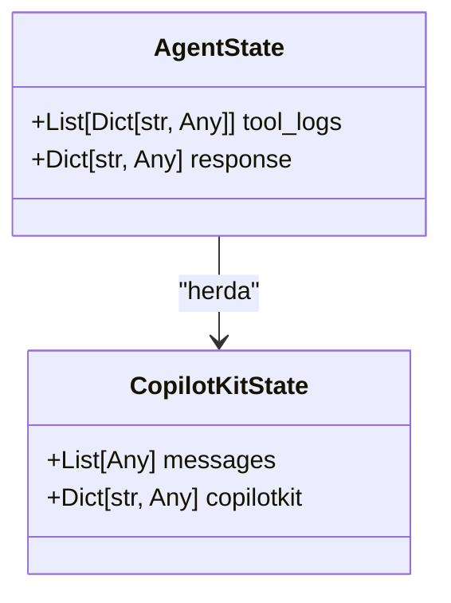
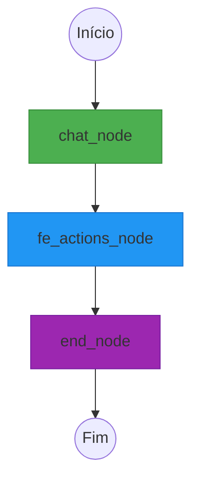
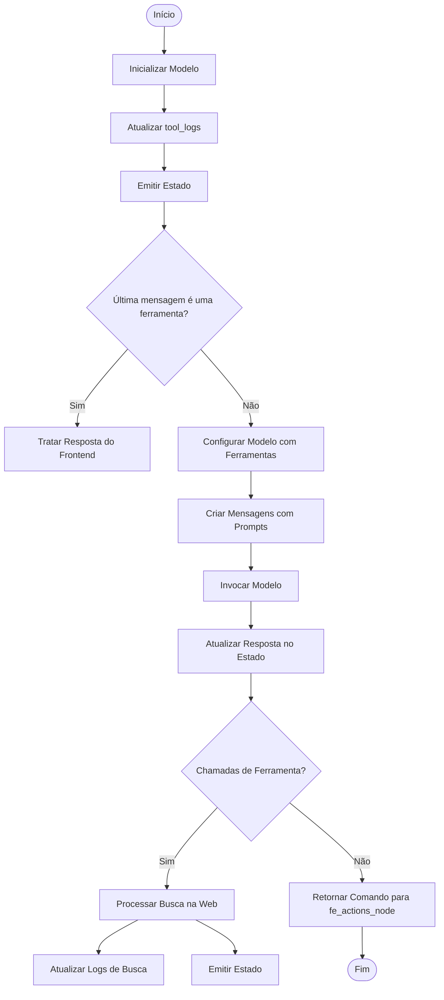
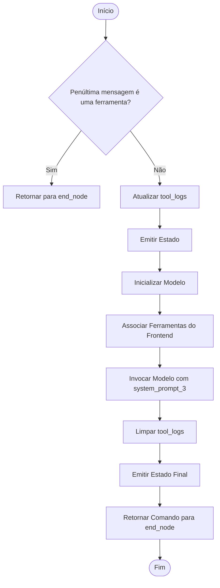
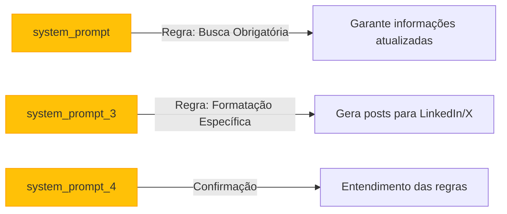
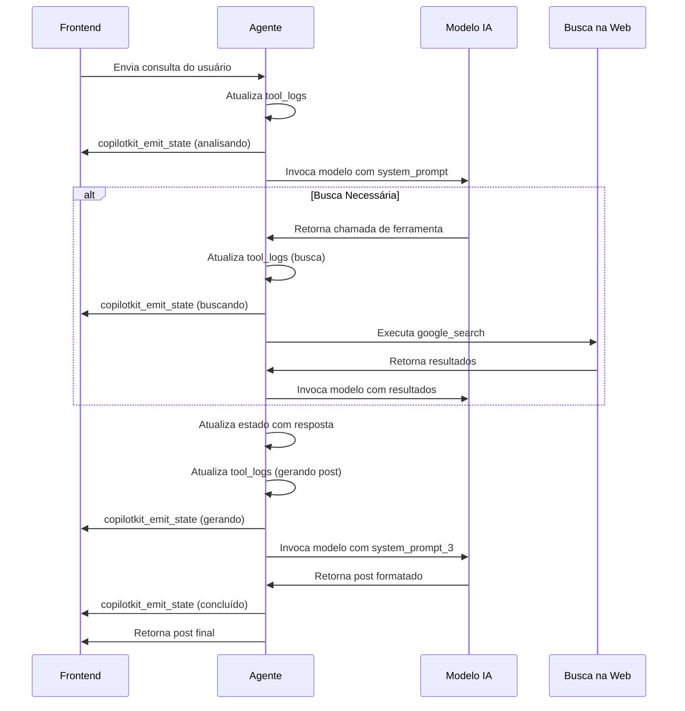

# Agente de Geração de Posts

<cite>
**Arquivos Referenciados neste Documento**  
- [posts_generator_agent.py](file://agent/posts_generator_agent.py)
- [prompts.py](file://agent/prompts.py)
- [main.py](file://agent/main.py)
</cite>

## Sumário
1. [Introdução](#introdução)
2. [Estrutura do Estado do Agente](#estrutura-do-estado-do-agente)
3. [Grafo de Geração de Posts](#grafo-de-geração-de-posts)
4. [Nós do Grafo](#nós-do-grafo)
   - [chat_node](#chat_node)
   - [fe_actions_node](#fe_actions_node)
   - [end_node](#end_node)
5. [Prompts do Sistema](#prompts-do-sistema)
6. [Integração com Frontend](#integração-com-frontend)
7. [Persistência de Estado](#persistência-de-estado)
8. [Conclusão](#conclusão)

## Introdução

O agente de geração de posts é um componente central do sistema Open-Gemini-Canvas, projetado para criar conteúdo otimizado para redes sociais como LinkedIn e X (Twitter). Este documento detalha a arquitetura, funcionamento e integração do agente, com foco no arquivo `posts_generator_agent.py`. O sistema utiliza uma combinação de inteligência artificial, busca na web e geração de conteúdo estruturado para produzir posts relevantes e atualizados.

**Section sources**
- [posts_generator_agent.py](file://agent/posts_generator_agent.py#L1-L20)

## Estrutura do Estado do Agente

A classe `AgentState` define o esquema de estado do agente, herdando de `CopilotKitState` para compatibilidade com o framework CopilotKit. Esta estrutura é fundamental para manter o contexto durante a execução do grafo de geração de posts.

Os campos principais da classe são:

- **tool_logs**: Uma lista de dicionários que registra as ações e status das ferramentas utilizadas durante o processo. Cada entrada contém um ID único, mensagem descritiva e status (processamento/concluído).
- **response**: Um dicionário que armazena a resposta gerada pelo modelo, usada como contexto para a geração final do post.

Essa estrutura permite rastrear o progresso do agente em tempo real e fornecer feedback à interface do usuário através do mecanismo `copilotkit_emit_state`.

**Diagram sources**
- [posts_generator_agent.py](file://agent/posts_generator_agent.py#L33-L35)

**Section sources**
- [posts_generator_agent.py](file://agent/posts_generator_agent.py#L33-L35)

## Grafo de Geração de Posts

O grafo `post_generation_graph` é construído usando o framework LangGraph e representa o fluxo de trabalho do agente. Ele é compilado com um `MemorySaver` para persistência de estado entre execuções.

O grafo possui três nós principais conectados em sequência:
1. `chat_node`: Realiza análise inicial e busca na web
2. `fe_actions_node`: Gera o conteúdo final do post
3. `end_node`: Finaliza o processo

O ponto de entrada é `chat_node`, e o ponto de término é `end_node`. O fluxo segue uma sequência linear com controle de fluxo baseado no estado atual.

**Diagram sources**
- [posts_generator_agent.py](file://agent/posts_generator_agent.py#L152-L173)

**Section sources**
- [posts_generator_agent.py](file://agent/posts_generator_agent.py#L152-L173)

## Nós do Grafo

### chat_node

O nó `chat_node` é responsável pela análise inicial da consulta do usuário e pela realização de buscas na web quando necessário. Ele utiliza o modelo Gemini via OpenRouter para processamento de linguagem natural.

O funcionamento do nó inclui:

1. Inicialização do modelo com configurações específicas (temperatura, retries)
2. Atualização dos logs de ferramentas com status de "analisando consulta"
3. Emissão de estado para feedback em tempo real na interface
4. Verificação se a última mensagem é uma ferramenta (para lidar com respostas do frontend)
5. Configuração do modelo com ferramentas disponíveis (atualmente apenas `google_search`)
6. Criação da conversa com prompts do sistema definidos em `prompts.py`
7. Invocação assíncrona do modelo com as mensagens
8. Atualização do estado com a resposta do modelo
9. Tratamento de chamadas de ferramentas (buscas na web)

Quando uma busca é necessária, o nó atualiza os logs de ferramentas com o status de "realizando busca na web" e emite o estado novamente para atualizar a interface do usuário.

**Diagram sources**
- [posts_generator_agent.py](file://agent/posts_generator_agent.py#L38-L110)

**Section sources**
- [posts_generator_agent.py](file://agent/posts_generator_agent.py#L38-L110)

### fe_actions_node

O nó `fe_actions_node` é responsável pela geração final do conteúdo do post, utilizando as ferramentas do frontend. Ele recebe o contexto da resposta do modelo e aplica formatação específica para as plataformas LinkedIn e X.

O funcionamento do nó inclui:

1. Verificação se a penúltima mensagem é uma ferramenta (para evitar loops)
2. Atualização dos logs de ferramentas com status de "gerando post"
3. Emissão de estado para feedback em tempo real
4. Inicialização do modelo com as ações do frontend disponíveis
5. Invocação do modelo com o prompt do sistema 3, substituindo o placeholder `{context}` com a resposta do modelo
6. Limpeza dos logs de ferramentas após a geração
7. Emissão final do estado
8. Retorno de comando para o nó final

Este nó utiliza o prompt `system_prompt_3` que contém regras específicas para formatação de posts, incluindo o uso de emojis, hashtags e tom apropriado para cada plataforma.

**Diagram sources**
- [posts_generator_agent.py](file://agent/posts_generator_agent.py#L113-L146)

**Section sources**
- [posts_generator_agent.py](file://agent/posts_generator_agent.py#L113-L146)

### end_node

O nó `end_node` é responsável por finalizar o processo de geração de posts. Ele representa o ponto de término do grafo e retorna um comando para encerrar a execução.

O nó simplesmente retorna um comando com:
- `goto=END` para indicar o término do fluxo
- Atualização do estado com as mensagens finais
- Limpeza dos logs de ferramentas

Este nó garante que o estado final seja retornado ao sistema de forma limpa e organizada, preparando o resultado para consumo pelo frontend.

**Section sources**
- [posts_generator_agent.py](file://agent/posts_generator_agent.py#L149-L150)

## Prompts do Sistema

Os prompts do sistema definidos em `prompts.py` são fundamentais para direcionar o comportamento do modelo de linguagem. Eles estabelecem regras claras e obrigatórias para a geração de conteúdo.

### system_prompt

Este prompt estabelece a regra fundamental de que o agente **DEVE SEMPRE** utilizar a ferramenta de busca na web para qualquer consulta. Ele enfatiza que:

- Toda pergunta deve ser precedida por uma busca no Google
- Os resultados da busca devem ser usados para fornecer informações precisas e atualizadas
- O modelo não deve confiar apenas em seus dados de treinamento
- A busca deve ser realizada para todos os tipos de consultas

Esta regra garante que o conteúdo gerado seja baseado em informações atualizadas e verificáveis.

### system_prompt_3

Este prompt orienta a geração final do post, com regras específicas para formatação:

- Posts do LinkedIn devem ser sofisticados com uso de emojis
- Posts do X (Twitter) devem usar hashtags e ter um tom mais casual
- Se o usuário especificar uma plataforma, apenas essa plataforma deve ser gerada
- Se não houver especificação, ambos os posts devem ser gerados
- O contexto da resposta anterior deve ser usado na geração

O prompt utiliza um placeholder `{context}` que é substituído dinamicamente com a resposta do modelo.

### system_prompt_4

Um prompt simples que confirma o entendimento das regras de busca, indicando que o agente usará a ferramenta de busca quando necessário para fornecer informações precisas e atualizadas.

**Diagram sources**
- [prompts.py](file://agent/prompts.py#L0-L47)

**Section sources**
- [prompts.py](file://agent/prompts.py#L0-L50)

## Integração com Frontend

A integração entre o agente e o frontend é facilitada pelo mecanismo `copilotkit_emit_state`, que permite atualizações de estado em tempo real na interface do usuário.

### Atualização de Estado

O método `copilotkit_emit_state` é chamado em vários pontos do fluxo para fornecer feedback imediato ao usuário:

- Quando o agente começa a analisar a consulta
- Durante buscas na web
- Quando está gerando o post final

Isso permite que a interface mostre mensagens de status como "Analisando sua consulta" ou "Realizando busca na web", melhorando a experiência do usuário.

### Controle de Fluxo

O controle de fluxo é gerenciado através da classe `Command`, que permite direcionar explicitamente o próximo nó a ser executado. Os comandos usados incluem:

- `Command(goto="fe_actions_node", update=...)` para avançar para a geração do post
- `Command(goto=END, update=...)` para finalizar o processo

### Ferramentas

A ferramenta `google_search` é utilizada para buscar informações na web. Embora a implementação atual seja simulada, ela poderia ser substituída por uma API de busca real como o Google Custom Search API em produção.

**Diagram sources**
- [posts_generator_agent.py](file://agent/posts_generator_agent.py#L22-L29)
- [posts_generator_agent.py](file://agent/posts_generator_agent.py#L38-L150)

**Section sources**
- [posts_generator_agent.py](file://agent/posts_generator_agent.py#L22-L150)

## Persistência de Estado

A persistência de estado é implementada usando `MemorySaver` do LangGraph, que permite que o estado do agente seja mantido entre execuções. Isso é crucial para:

- Manter o contexto de conversas longas
- Recuperar o estado após reinicializações
- Permitir a continuação de processos interrompidos

O `MemorySaver` é configurado no momento da compilação do grafo e armazena o estado do `AgentState` de forma segura e eficiente.

O agente é exposto como um serviço FastAPI através do arquivo `main.py`, onde é registrado como um `LangGraphAgent` no `CopilotKitSDK`. Isso permite que o frontend se comunique com o agente através de endpoints HTTP.

**Section sources**
- [posts_generator_agent.py](file://agent/posts_generator_agent.py#L173-L173)
- [main.py](file://agent/main.py#L19-L32)

## Conclusão

O agente de geração de posts é um sistema sofisticado que combina inteligência artificial, busca na web e formatação de conteúdo para criar posts otimizados para redes sociais. Sua arquitetura baseada em grafos permite um fluxo de trabalho claro e controlado, enquanto a integração com o CopilotKit possibilita feedback em tempo real na interface do usuário.

As práticas de tratamento de erros são implementadas de forma robusta, com blocos try-catch para lidar com exceções inesperadas. O uso de prompts do sistema bem definidos garante que o comportamento do modelo seja consistente e alinhado com os objetivos do sistema.

A separação clara de responsabilidades entre os nós do grafo (análise, geração, finalização) torna o sistema modular e fácil de manter. A persistência de estado permite experiências de usuário contínuas, mesmo em sessões longas ou após interrupções.

Este agente representa uma solução eficaz para automação de conteúdo social, combinando a precisão da busca na web com a criatividade da geração de linguagem natural.