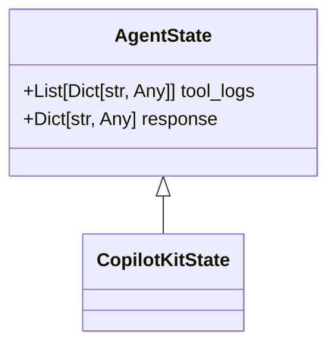
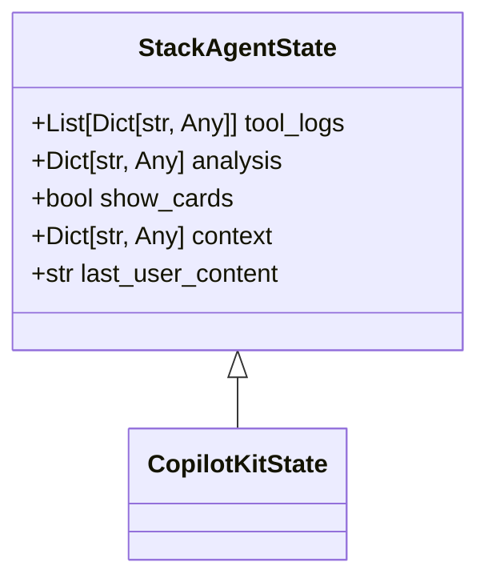
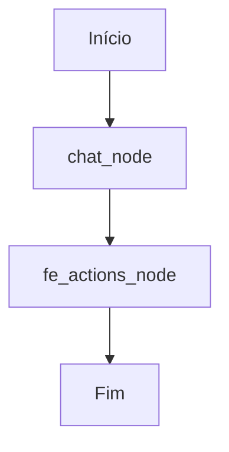
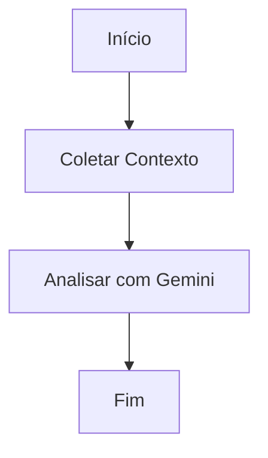
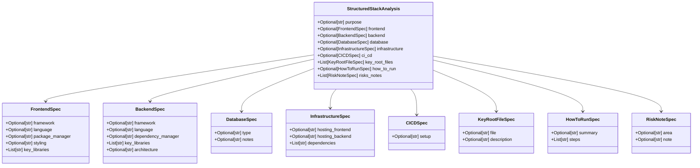

# Agentes de IA

<cite>
**Arquivos Referenciados neste Documento**  
- [posts_generator_agent.py](file://agent/posts_generator_agent.py)
- [stack_agent.py](file://agent/stack_agent.py)
- [prompts.py](file://agent/prompts.py)
- [main.py](file://agent/main.py)
</cite>

## Sumário
1. [Introdução](#introdução)
2. [Estrutura de Estado dos Agentes](#estrutura-de-estado-dos-agentes)
3. [Agente de Geração de Posts](#agente-de-geração-de-posts)
4. [Agente de Análise de Stack](#agente-de-análise-de-stack)
5. [Prompts e Direcionamento de Comportamento](#prompts-e-direcionamento-de-comportamento)
6. [Ferramentas Personalizadas](#ferramentas-personalizadas)
7. [Práticas de Tratamento de Erros e Logs](#práticas-de-tratamento-de-erros-e-logs)
8. [Conclusão](#conclusão)

## Introdução

Este documento detalha a arquitetura e funcionamento dos agentes de IA implementados no projeto `open-gemini-canvas`, com foco nos arquivos `posts_generator_agent.py` e `stack_agent.py`. Os agentes são construídos sobre o framework LangGraph e integrados ao CopilotKit, permitindo a criação de fluxos de trabalho complexos baseados em grafos de estado. O sistema utiliza o modelo Gemini via OpenRouter para processamento de linguagem natural, combinado com ferramentas personalizadas e prompts estruturados para direcionar o comportamento do modelo. A arquitetura é projetada para manter contexto durante a execução, permitir interações com ferramentas externas e fornecer feedback em tempo real à interface do usuário.

**Seção fontes**  
- [main.py](file://agent/main.py#L1-L63)

## Estrutura de Estado dos Agentes

A manutenção de contexto durante a execução dos grafos é realizada através de classes de estado que estendem `CopilotKitState`. Essas classes definem a estrutura de dados que persiste entre os nós do grafo, permitindo que informações sejam passadas e atualizadas ao longo do fluxo de execução.

### Estado do Agente de Geração de Posts

A classe `AgentState` define o estado para o agente de geração de posts, contendo dois campos principais:

- **tool_logs**: Uma lista de dicionários que registra as ações e o status das ferramentas chamadas durante a execução, permitindo feedback em tempo real à interface do usuário.
- **response**: Um dicionário que armazena a resposta gerada pelo modelo antes da formatação final.

Essa estrutura permite que o agente mantenha um histórico de operações e resultados intermediários, essencial para a transparência do processo e para a geração de posts baseados em pesquisas anteriores.



**Fontes do diagrama**  
- [posts_generator_agent.py](file://agent/posts_generator_agent.py#L33-L35)

**Seção fontes**  
- [posts_generator_agent.py](file://agent/posts_generator_agent.py#L33-L35)

### Estado do Agente de Análise de Stack

A classe `StackAgentState` define um estado mais complexo para o agente de análise de stack, com campos adicionais para armazenar informações específicas do domínio:

- **tool_logs**: Similar ao agente de posts, registra o progresso das operações.
- **analysis**: Armazena a análise estruturada do repositório GitHub em formato JSON.
- **show_cards**: Um booleano que controla se os cartões de análise devem ser exibidos na interface do usuário.
- **context**: Um dicionário que contém todo o contexto coletado do repositório GitHub (metadados, linguagens, README, etc.).
- **last_user_content**: Armazena o conteúdo da última mensagem do usuário para referência em etapas posteriores.

Essa estrutura mais rica permite que o agente mantenha um contexto detalhado sobre o repositório analisado, facilitando a geração de uma análise abrangente.



**Fontes do diagrama**  
- [stack_agent.py](file://agent/stack_agent.py#L29-L34)

**Seção fontes**  
- [stack_agent.py](file://agent/stack_agent.py#L29-L34)

## Agente de Geração de Posts

O agente de geração de posts é implementado no arquivo `posts_generator_agent.py` e é responsável por criar conteúdo para redes sociais como LinkedIn e X (Twitter) com base em pesquisas da web e formatação específica.

### Arquitetura do Grafo de Geração de Posts

O grafo `post_generation_graph` é composto por três nós principais que definem o fluxo de execução:



**Fontes do diagrama**  
- [posts_generator_agent.py](file://agent/posts_generator_agent.py#L155-L173)

**Seção fontes**  
- [posts_generator_agent.py](file://agent/posts_generator_agent.py#L155-L173)

### Nó chat_node

O nó `chat_node` é o ponto de entrada do grafo e tem várias responsabilidades críticas:

1. **Configuração do Modelo**: Inicializa o modelo Gemini via OpenRouter com parâmetros específicos, incluindo temperatura e número máximo de tentativas.
2. **Registro de Logs**: Adiciona entradas ao `tool_logs` para informar o usuário sobre o progresso da análise.
3. **Verificação de Mensagens de Ferramenta**: Verifica se a última mensagem é uma resposta de ferramenta, o que indica que uma pesquisa foi realizada.
4. **Integração com Ferramentas**: Vincula a ferramenta `google_search` ao modelo, permitindo que ele realize pesquisas da web quando necessário.
5. **Geração de Resposta**: Invoca o modelo com um prompt de sistema que exige o uso da ferramenta de busca para qualquer consulta.

O nó utiliza o prompt de sistema definido em `system_prompt` para garantir que o modelo sempre realize uma pesquisa antes de responder, promovendo respostas baseadas em informações atualizadas.

**Seção fontes**  
- [posts_generator_agent.py](file://agent/posts_generator_agent.py#L38-L110)

### Nó fe_actions_node

O nó `fe_actions_node` é responsável pela geração final dos posts para as redes sociais:

1. **Verificação de Condição**: Verifica se a penúltima mensagem é uma resposta de ferramenta, o que pode indicar que os posts já foram gerados.
2. **Registro de Progresso**: Adiciona um log indicando que os posts estão sendo gerados.
3. **Formatação de Posts**: Utiliza o prompt `system_prompt_3`, que contém regras específicas para formatar posts para LinkedIn e X (Twitter), incluindo o uso de emojis, hashtags e tom apropriado para cada plataforma.
4. **Geração Final**: Invoca o modelo com o contexto da resposta anterior para gerar os posts formatados.

Este nó é crucial para transformar a informação bruta obtida na etapa anterior em conteúdo publicável com formatação adequada para cada plataforma.

**Seção fontes**  
- [posts_generator_agent.py](file://agent/posts_generator_agent.py#L113-L146)

### Nó end_node

O nó `end_node` é simples mas essencial, pois finaliza o fluxo do grafo:

1. **Limpeza de Estado**: Remove todos os logs de ferramentas do estado, indicando que o processo foi concluído.
2. **Finalização do Grafo**: Retorna um comando para ir ao ponto final do grafo (END), encerrando a execução.

Este nó garante que o estado seja deixado limpo após a conclusão do processo, preparando o sistema para a próxima interação.

**Seção fontes**  
- [posts_generator_agent.py](file://agent/posts_generator_agent.py#L149-L150)

## Agente de Análise de Stack

O agente de análise de stack é implementado no arquivo `stack_agent.py` e é projetado para analisar repositórios GitHub, inferir seu propósito e tecnologias utilizadas, e gerar uma análise estruturada.

### Fluxo de Análise de Stack

O grafo `stack_analysis_graph` segue um fluxo sequencial bem definido:



**Fontes do diagrama**  
- [stack_agent.py](file://agent/stack_agent.py#L495-L502)

**Seção fontes**  
- [stack_agent.py](file://agent/stack_agent.py#L495-L502)

### Extração da URL do GitHub

O processo começa no nó `gather_context_node`, que extrai a URL do GitHub da mensagem do usuário usando uma expressão regular. Se uma URL válida for encontrada, o nó realiza as seguintes ações:

1. **Coleta de Metadados**: Busca informações gerais sobre o repositório, como nome, descrição e branch padrão.
2. **Análise de Linguagens**: Obtém a distribuição de linguagens de programação no repositório.
3. **Leitura do README**: Recupera o conteúdo do arquivo README, que geralmente contém informações importantes sobre o projeto.
4. **Listagem de Arquivos Raiz**: Enumera os arquivos e diretórios no nível raiz do repositório.
5. **Coleta de Manifestos**: Baixa o conteúdo de arquivos de manifesto comuns (como `package.json`, `requirements.txt`, etc.) para inferir as tecnologias utilizadas.

Todas essas informações são agregadas em um dicionário de contexto que é passado para a próxima etapa de análise.

**Seção fontes**  
- [stack_agent.py](file://agent/stack_agent.py#L273-L355)

### Análise com Gemini e Geração de JSON

O nó `analyze_with_gemini_node` recebe o contexto coletado e realiza a análise propriamente dita:

1. **Construção do Prompt**: Usa a função `_build_analysis_prompt` para criar um prompt detalhado que inclui todos os dados coletados do repositório.
2. **Instruções de Sistema**: Fornece instruções claras ao modelo para que ele não gere texto livre, mas sim chame a ferramenta `return_stack_analysis_tool` com uma estrutura JSON específica.
3. **Chamada de Ferramenta Estruturada**: O modelo é configurado para usar a ferramenta `return_stack_analysis_tool`, que espera um payload estruturado baseado na classe `StructuredStackAnalysis`.
4. **Fallback para Saída Estruturada**: Se a chamada de ferramenta falhar, o nó tenta uma abordagem alternativa usando `with_structured_output` para forçar o modelo a gerar um JSON válido.
5. **Geração de Resumo**: Após obter a análise estruturada, o nó gera um resumo textual conciso para o usuário.

Este nó demonstra uma abordagem robusta para garantir saídas estruturadas, utilizando múltiplas estratégias para lidar com possíveis falhas no modelo.

**Seção fontes**  
- [stack_agent.py](file://agent/stack_agent.py#L358-L474)

### Esquema de Análise Estruturada

A análise é modelada usando classes Pydantic que definem um esquema JSON rigoroso:



**Fontes do diagrama**  
- [stack_agent.py](file://agent/stack_agent.py#L60-L100)

**Seção fontes**  
- [stack_agent.py](file://agent/stack_agent.py#L60-L100)

## Prompts e Direcionamento de Comportamento

Os prompts definidos em `prompts.py` são fundamentais para direcionar o comportamento dos modelos de IA, garantindo que eles sigam regras específicas e gerem saídas consistentes.

### Prompt de Busca Obrigatória

O `system_prompt` estabelece uma regra estrita: o modelo **deve sempre** usar a ferramenta de busca da web para qualquer consulta. Isso garante que as respostas sejam baseadas em informações atualizadas e não apenas no conhecimento interno do modelo.

```python
system_prompt = """Você tem acesso a uma ferramenta de busca do Google que pode ajudá-lo a encontrar informações atuais e precisas.
Você DEVE SEMPRE usar a ferramenta de busca do Google para CADA consulta, independentemente do tópico. Isso é um requisito.

Para QUALQUER pergunta que receber, você deve:
1. SEMPRE realizar uma busca no Google primeiro
2. Use os resultados da busca para fornecer informações precisas e atualizadas
3. Nunca confie apenas nos seus dados de treinamento
4. Sempre busque pelas informações mais recentes disponíveis

Isso se aplica a TODOS os tipos de consultas, incluindo:
- Perguntas técnicas
- Eventos atuais
- Guias de como fazer
- Definições
- Melhores práticas
- Desenvolvimentos recentes
- Qualquer informação que possa ter mudado

Você é OBRIGADO a usar a ferramenta de busca do Google para cada resposta. Não responda a nenhuma pergunta sem antes pesquisar informações atuais."""
```

**Seção fontes**  
- [prompts.py](file://agent/prompts.py#L0-L18)

### Prompt de Formatação de Posts

O `system_prompt_3` contém regras detalhadas para formatar posts para diferentes plataformas de mídia social:

- **LinkedIn**: Posts devem ser "muito elegantes com emojis", sugerindo um tom profissional mas envolvente.
- **X (Twitter)**: Posts podem usar hashtags e emojis, com um tom "um pouco casual e criptico", adequado para a plataforma.

O prompt também especifica o comportamento quando o usuário solicita explicitamente um post para uma plataforma específica, garantindo que apenas a plataforma solicitada seja gerada.

```python
system_prompt_3 = """
Você é um assistente incrível. Você conhece os algoritmos do LinkedIn e do X (Twitter). Portanto, usará a ferramenta generate_post para gerar o post.

REGRAS:
- Use formatação adequada para o post.
   - Por exemplo, o post do LinkedIn deve ser muito elegante com emojis
   - Para o post do X (Twitter), você pode usar hashtags e emojis. O tom deve ser um pouco casual e criptico.
- Se o usuário pedir explicitamente para gerar um post do LinkedIn, então você deve gerar apenas o post do LinkedIn, deixando o X (Twitter) como string vazia.
- Se o usuário pedir explicitamente para gerar um post do X (Twitter), então você deve gerar apenas o post do X (Twitter), deixando o LinkedIn como string vazia.
- Se o usuário não especificar a plataforma, então você deve gerar ambos os posts.
- Sempre use a ferramenta generate_post para gerar o post.
- Ao gerar o post, você deve usar o contexto abaixo para gerar o post.

{context}

"""
```

**Seção fontes**  
- [prompts.py](file://agent/prompts.py#L32-L47)

### Confirmação de Comportamento

O `system_prompt_4` é uma simples confirmação de que o agente entende e seguirá as regras de busca, servindo como uma resposta padrão para indicar prontidão.

```python
system_prompt_4 = """Entendo. Usarei a ferramenta de busca do Google quando necessário para fornecer informações atuais e precisas.
"""
```

**Seção fontes**  
- [prompts.py](file://agent/prompts.py#L49-L50)

## Ferramentas Personalizadas

O projeto implementa ferramentas personalizadas que estendem as capacidades dos modelos de IA, permitindo interações com sistemas externos e geração de saídas estruturadas.

### Ferramenta de Busca da Web

A ferramenta `google_search` é uma implementação simples de busca da web que pode ser expandida para usar APIs reais como o Google Custom Search API. Atualmente, simula uma busca retornando uma string formatada com o termo pesquisado.

```python
@tool
async def google_search(query: str) -> str:
    """Realize uma busca no Google para a consulta fornecida."""
    try:
        # Implementação simples de busca no Google
        # Em produção, você pode querer usar a API do Google Custom Search
        return f"Resultados da busca para: {query}"
    except Exception as e:
        return f"Falha na busca: {str(e)}"
```

Esta ferramenta é vinculada ao modelo no `chat_node`, permitindo que o agente realize pesquisas quando necessário.

**Seção fontes**  
- [posts_generator_agent.py](file://agent/posts_generator_agent.py#L22-L29)

### Ferramenta de Análise de Stack

A ferramenta `return_stack_analysis_tool` é mais sofisticada, projetada para forçar o modelo a gerar saídas JSON estruturadas:

```python
@tool("return_stack_analysis", args_schema=StructuredStackAnalysis)
def return_stack_analysis_tool(**kwargs) -> Dict[str, Any]:
    """Retorna a análise final da stack em uma estrutura JSON estrita. Use esta ferramenta para gerar resultados."""
    try:
        validated = StructuredStackAnalysis(**kwargs)
        return validated.model_dump(exclude_none=True)
    except Exception:
        return kwargs
```

A ferramenta usa o esquema `StructuredStackAnalysis` como `args_schema`, garantindo que os argumentos passados estejam em conformidade com a estrutura esperada. A função valida os dados e os converte para um dicionário, excluindo campos nulos para uma saída mais limpa.

**Seção fontes**  
- [stack_agent.py](file://agent/stack_agent.py#L100-L106)

## Práticas de Tratamento de Erros e Logs

O sistema implementa várias práticas robustas para tratamento de erros e fornecimento de feedback ao usuário.

### Tratamento de Erros

Ambos os agentes utilizam blocos `try-except` para capturar exceções e evitar falhas catastróficas:

- **Busca da Web**: A função `google_search` captura exceções e retorna uma mensagem de erro descritiva.
- **Validação de URL**: O nó `gather_context_node` verifica se uma URL do GitHub é válida antes de prosseguir, retornando um comando para análise mesmo quando nenhuma URL é encontrada.
- **Análise Estruturada**: O nó `analyze_with_gemini_node` tem um mecanismo de fallback que tenta uma abordagem alternativa (`with_structured_output`) se a chamada de ferramenta falhar.

Essas camadas de proteção garantem que o sistema permaneça resiliente mesmo diante de entradas inesperadas ou falhas de API.

### Logs de Ferramentas

O sistema utiliza o mecanismo `tool_logs` para fornecer feedback em tempo real à interface do usuário:

1. **Registro de Progresso**: Cada etapa importante (extração de URL, busca de metadados, análise) é registrada como um log com status "processing".
2. **Atualização de Status**: Após a conclusão de uma etapa, o status é atualizado para "completed".
3. **Emissão de Estado**: A função `copilotkit_emit_state` é chamada após cada atualização de log, garantindo que a interface do usuário seja atualizada em tempo real.

Essa abordagem melhora significativamente a experiência do usuário, fornecendo transparência sobre o que o agente está fazendo em cada momento.

### Atualização de Estado

A função `copilotkit_emit_state` é usada extensivamente para sincronizar o estado do agente com a interface do usuário:

- **Após cada log**: O estado é emitido imediatamente após adicionar ou atualizar um log de ferramenta.
- **Durante a execução**: O estado é atualizado continuamente, permitindo que a UI mostre o progresso em tempo real.
- **No final**: O estado final é emitido para limpar os logs e indicar conclusão.

Essa prática é essencial para criar uma experiência de usuário responsiva e informativa.

**Seção fontes**  
- [posts_generator_agent.py](file://agent/posts_generator_agent.py#L38-L150)
- [stack_agent.py](file://agent/stack_agent.py#L273-L489)

## Conclusão

Os agentes de IA implementados no projeto `open-gemini-canvas` demonstram uma arquitetura sofisticada baseada em grafos de estado, que combina modelos de linguagem avançados com ferramentas personalizadas e prompts cuidadosamente elaborados. A separação clara entre agentes especializados (geração de posts e análise de stack) permite que cada componente se concentre em seu domínio específico, enquanto a estrutura comum de estado e mecanismos de feedback garantem consistência e transparência. A ênfase em saídas estruturadas, especialmente no agente de análise de stack, demonstra uma abordagem madura para integração com sistemas front-end. As práticas robustas de tratamento de erros e logs de ferramentas proporcionam uma experiência de usuário confiável e informativa. Esta arquitetura serve como um excelente exemplo de como construir agentes de IA eficazes e confiáveis para tarefas complexas.