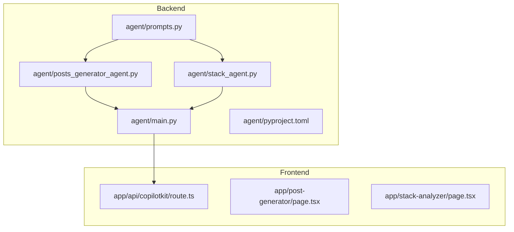
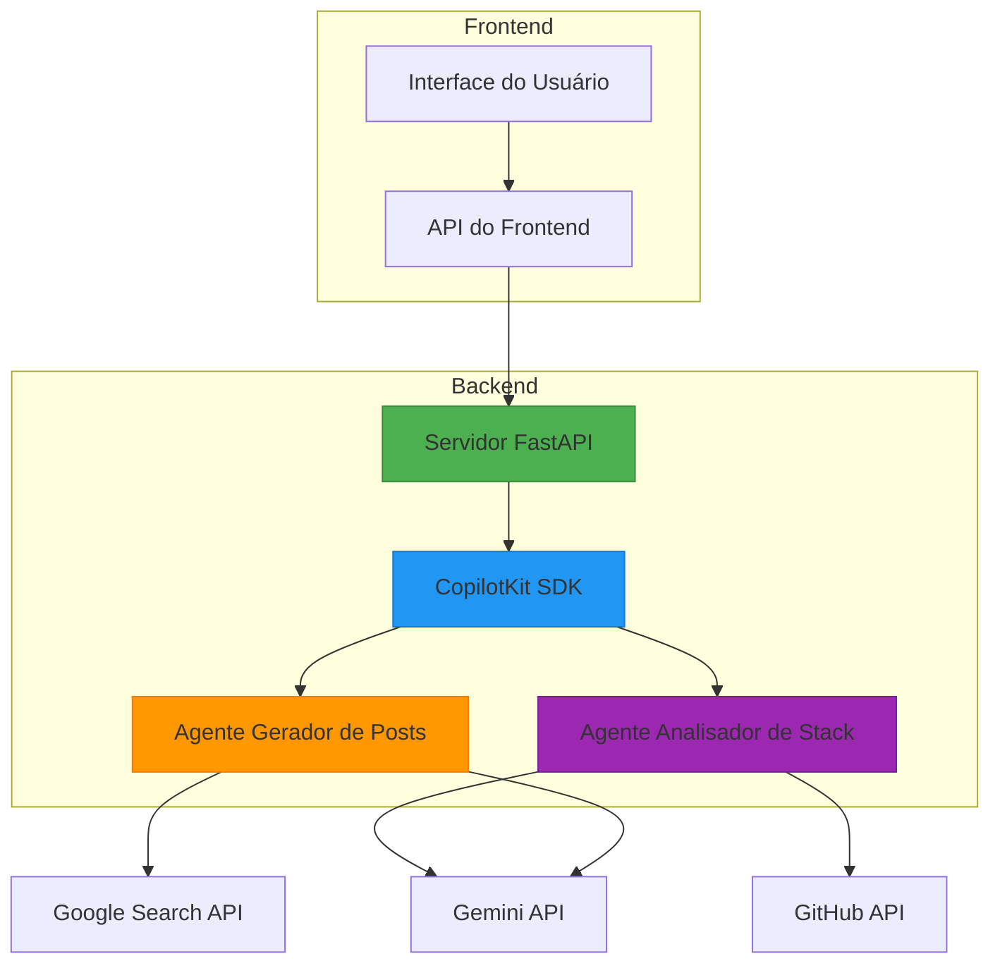
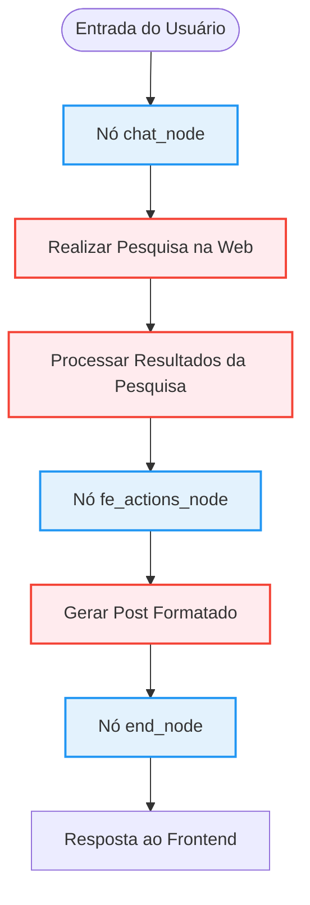
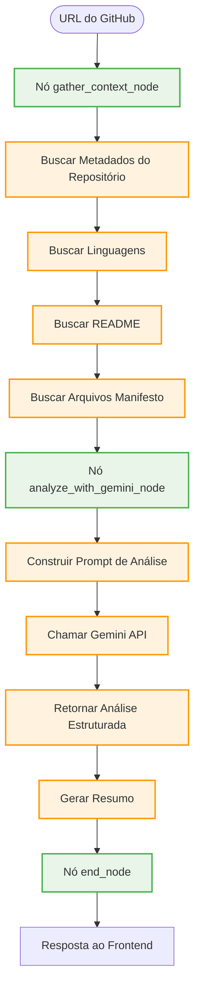
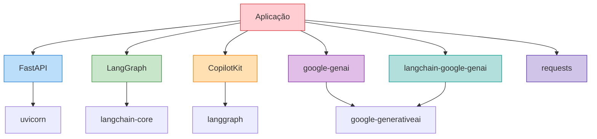

# Arquitetura do Backend

<cite>
**Arquivos Referenciados neste Documento**  
- [main.py](file://agent/main.py)
- [posts_generator_agent.py](file://agent/posts_generator_agent.py)
- [stack_agent.py](file://agent/stack_agent.py)
- [prompts.py](file://agent/prompts.py)
- [route.ts](file://app/api/copilotkit/route.ts)
- [pyproject.toml](file://agent/pyproject.toml)
</cite>

## Sumário
1. [Introdução](#introdução)
2. [Estrutura do Projeto](#estrutura-do-projeto)
3. [Componentes Principais](#componentes-principais)
4. [Visão Geral da Arquitetura](#visão-geral-da-arquitetura)
5. [Análise Detalhada dos Componentes](#análise-detalhada-dos-componentes)
6. [Análise de Dependências](#análise-de-dependências)
7. [Considerações de Desempenho](#considerações-de-desempenho)
8. [Guia de Solução de Problemas](#guia-de-solução-de-problemas)
9. [Conclusão](#conclusão)

## Introdução

Este documento apresenta a arquitetura do backend do projeto Open Gemini Canvas, uma aplicação baseada em inteligência artificial que utiliza FastAPI e LangGraph para fornecer agentes especializados. O sistema é projetado para gerar conteúdo de redes sociais e analisar stacks tecnológicas de repositórios GitHub, integrando-se com modelos de linguagem Gemini da Google e serviços externos. A arquitetura segue um padrão modular com agentes definidos como grafos de estado, permitindo fluxos de trabalho complexos e interações dinâmicas com o frontend.

## Estrutura do Projeto

A estrutura do projeto é organizada em diretórios funcionais que separam claramente as responsabilidades entre o backend de agentes e a interface frontend. O backend reside no diretório `agent/`, enquanto o frontend está localizado em `app/`. Esta separação clara facilita o desenvolvimento independente e a manutenção de cada camada.



**Diagram sources**
- [main.py](file://agent/main.py)
- [posts_generator_agent.py](file://agent/posts_generator_agent.py)
- [stack_agent.py](file://agent/stack_agent.py)

**Section sources**
- [main.py](file://agent/main.py)
- [posts_generator_agent.py](file://agent/posts_generator_agent.py)
- [stack_agent.py](file://agent/stack_agent.py)

## Componentes Principais

O backend é composto por dois agentes principais: o gerador de posts e o analisador de stack. Ambos são registrados no servidor FastAPI através do SDK CopilotKit, que atua como intermediário entre o frontend e os agentes especializados. O ponto de entrada principal é o arquivo `main.py`, que inicializa o servidor FastAPI e configura os endpoints para comunicação com os agentes.

**Section sources**
- [main.py](file://agent/main.py#L1-L62)
- [posts_generator_agent.py](file://agent/posts_generator_agent.py#L1-L163)
- [stack_agent.py](file://agent/stack_agent.py#L1-L503)

## Visão Geral da Arquitetura

A arquitetura do backend é baseada em um servidor FastAPI que serve como camada de apresentação e orquestração para agentes implementados com LangGraph. Os agentes são definidos como grafos de estado que representam fluxos de trabalho complexos, onde cada nó executa uma etapa específica do processamento. O SDK CopilotKit fornece a integração entre o FastAPI e os agentes LangGraph, permitindo que o frontend comunique-se com os agentes de forma padronizada.



**Diagram sources**
- [main.py](file://agent/main.py#L1-L62)
- [posts_generator_agent.py](file://agent/posts_generator_agent.py#L1-L163)
- [stack_agent.py](file://agent/stack_agent.py#L1-L503)

## Análise Detalhada dos Componentes

### Análise do Agente Gerador de Posts

O agente gerador de posts é responsável por criar conteúdo para LinkedIn e X (Twitter) com base em consultas do usuário. Ele utiliza uma abordagem em duas etapas: primeiro realiza uma pesquisa na web para coletar informações relevantes, e depois gera posts formatados especificamente para cada plataforma.

#### Diagrama de Fluxo do Agente Gerador de Posts



**Diagram sources**
- [posts_generator_agent.py](file://agent/posts_generator_agent.py#L24-L135)

**Section sources**
- [posts_generator_agent.py](file://agent/posts_generator_agent.py#L1-L163)
- [prompts.py](file://agent/prompts.py#L1-L50)

### Análise do Agente Analisador de Stack

O agente analisador de stack é projetado para examinar repositórios GitHub e inferir sua finalidade e stack tecnológica. Ele extrai metadados do repositório, analisa arquivos manifestos comuns e utiliza o modelo Gemini para gerar uma análise estruturada do stack tecnológico.

#### Diagrama de Fluxo do Agente Analisador de Stack



**Diagram sources**
- [stack_agent.py](file://agent/stack_agent.py#L273-L474)

**Section sources**
- [stack_agent.py](file://agent/stack_agent.py#L1-L503)
- [prompts.py](file://agent/prompts.py#L1-L50)

### Estado dos Agentes

Ambos os agentes utilizam classes de estado que estendem `CopilotKitState` para manter informações durante a execução do grafo. O estado inclui mensagens, logs de ferramentas e dados específicos do agente.

#### Diagrama de Classes dos Estados dos Agentes

```mermaid
classDiagram
class CopilotKitState {
+messages : List[Message]
+copilotkit : Dict
}
class AgentState {
+tool_logs : List[Dict]
+response : Dict
}
class StackAgentState {
+tool_logs : List[Dict]
+analysis : Dict
+show_cards : bool
+context : Dict
+last_user_content : str
}
CopilotKitState <|-- AgentState
CopilotKitState <|-- StackAgentState
classDef classStyle fill : #F3E5F5,stroke : #9C27B0,stroke-width : 2px;
classDef fieldStyle fill : #FFFFFF,stroke : #616161,stroke-width : 1px;
class CopilotKitState,AgentState,StackAgentState classStyle;
```

**Diagram sources**
- [posts_generator_agent.py](file://agent/posts_generator_agent.py#L15-L22)
- [stack_agent.py](file://agent/stack_agent.py#L85-L95)

## Análise de Dependências

O backend depende de várias bibliotecas Python para sua funcionalidade, conforme definido no arquivo `pyproject.toml`. As dependências principais incluem FastAPI para o servidor web, LangGraph para a definição de grafos de estado, e bibliotecas da Google para integração com o Gemini e Google Search.



**Diagram sources**
- [pyproject.toml](file://agent/pyproject.toml#L1-L27)

**Section sources**
- [pyproject.toml](file://agent/pyproject.toml#L1-L27)
- [main.py](file://agent/main.py#L1-L62)

## Considerações de Desempenho

O backend implementa várias estratégias para garantir desempenho e escalabilidade. O uso de checkpointer de memória em LangGraph permite que os grafos de estado sejam persistentes durante a execução. A integração com serviços externos é feita de forma assíncrona para evitar bloqueios, e o sistema utiliza mecanismos de retry para lidar com falhas temporárias em chamadas de API.

A arquitetura permite escalabilidade horizontal, onde múltiplas instâncias do servidor FastAPI podem ser executadas atrás de um balanceador de carga. Os agentes são stateful apenas durante a execução de uma sessão, o que facilita o escalonamento.

## Guia de Solução de Problemas

### Tratamento de Erros

O sistema implementa tratamento de erros em vários níveis. No nível do agente, exceções são capturadas e tratadas para evitar falhas no fluxo de trabalho. Quando uma URL do GitHub inválida é fornecida ao agente analisador de stack, ele retorna uma mensagem clara ao usuário solicitando uma URL válida.

### Problemas Comuns

1. **Falha na autenticação com APIs externas**: Verifique se as variáveis de ambiente `GOOGLE_API_KEY` e `GITHUB_TOKEN` estão corretamente configuradas.
2. **Timeout em chamadas de API**: Aumente o timeout nas configurações ou verifique a conectividade com os serviços externos.
3. **Respostas inconsistentes do Gemini**: Verifique se os prompts estão corretamente formatados e se o modelo está disponível.

**Section sources**
- [stack_agent.py](file://agent/stack_agent.py#L358-L474)
- [posts_generator_agent.py](file://agent/posts_generator_agent.py#L24-L135)

## Conclusão

A arquitetura do backend do Open Gemini Canvas demonstra um design robusto e modular que combina efetivamente FastAPI, LangGraph e serviços de IA da Google. A separação clara entre agentes especializados permite que novos agentes sejam adicionados facilmente ao sistema. A integração com o frontend através do CopilotKit fornece uma interface padronizada e eficiente para comunicação entre as camadas. O sistema está bem posicionado para escalar e evoluir com novas funcionalidades, mantendo alta disponibilidade e desempenho.