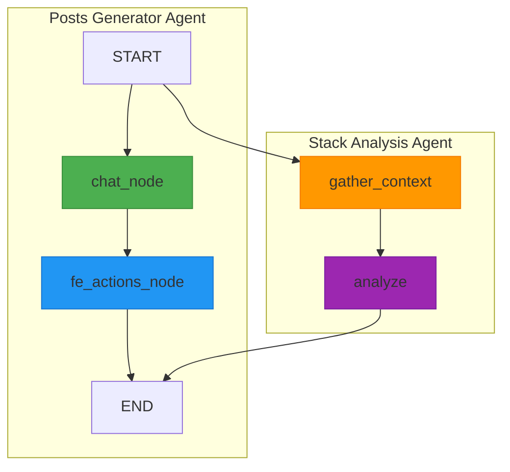
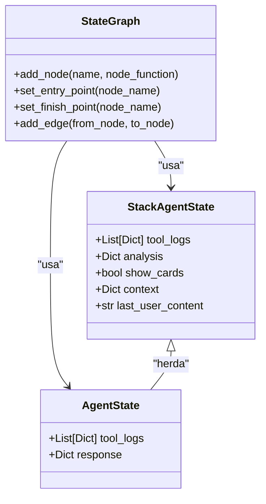
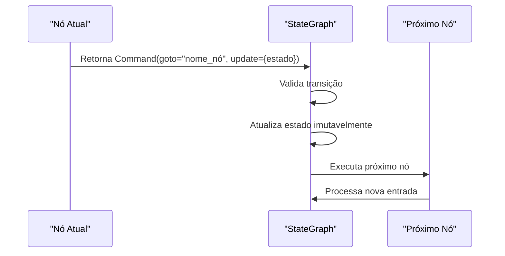
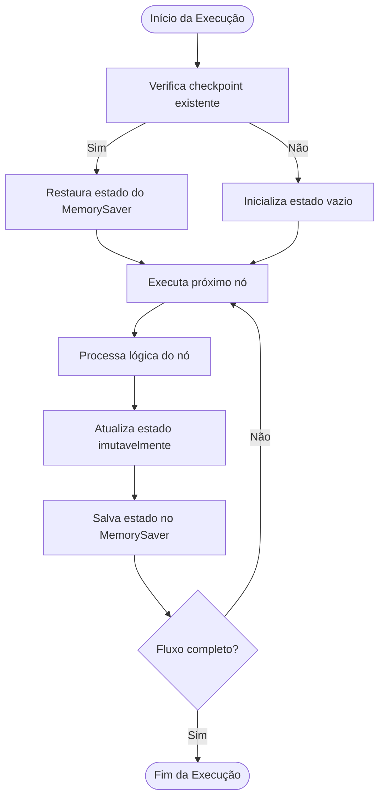
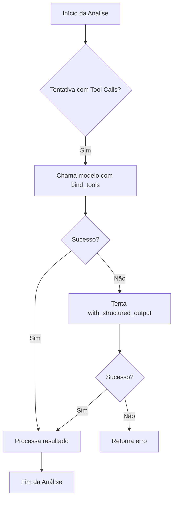

# Fluxos com LangGraph

<cite>
**Arquivos Referenciados neste Documento**  
- [agent/posts_generator_agent.py](file://agent/posts_generator_agent.py)
- [agent/stack_agent.py](file://agent/stack_agent.py)
- [agent/main.py](file://agent/main.py)
</cite>

## Sumário
1. [Introdução](#introdução)
2. [Arquitetura de Fluxo com StateGraph](#arquitetura-de-fluxo-com-stategraph)
3. [Definição de Nós Assíncronos](#definição-de-nós-assíncronos)
4. [Controle de Transições com Command](#controle-de-transições-com-command)
5. [Persistência de Estado com MemorySaver](#persistência-de-estado-com-memorysaver)
6. [Padrões de Reutilização de Configuração](#padrões-de-reutilização-de-configuração)
7. [Resiliência com Retries e Timeouts](#resiliência-com-retries-e-timeouts)
8. [Fluxos de Decisão e Validação](#fluxos-de-decisão-e-validação)
9. [Integração e Exposição de Agentes](#integração-e-exposição-de-agentes)
10. [Conclusão](#conclusão)

## Introdução

Este documento apresenta uma análise arquitetural detalhada dos fluxos de trabalho implementados com LangGraph no projeto Open-Gemini-Canvas. Os agentes implementados utilizam o framework LangGraph para orquestrar fluxos de execução complexos, permitindo a criação de sistemas multi-agentes com estado persistente. A arquitetura combina padrões de máquinas de estado com execução assíncrona, permitindo fluxos de trabalho robustos e resilientes para análise de repositórios GitHub e geração de conteúdo.

**Section sources**
- [agent/posts_generator_agent.py](file://agent/posts_generator_agent.py#L1-L20)
- [agent/stack_agent.py](file://agent/stack_agent.py#L1-L20)

## Arquitetura de Fluxo com StateGraph

O StateGraph é o componente central da arquitetura, modelando os fluxos de trabalho como máquinas de estado. Cada agente implementado utiliza um StateGraph para definir seu fluxo de execução, com pontos de entrada e saída claramente definidos. O StateGraph permite a definição de nós que representam funções ou agentes, conectados por arestas que definem as transições baseadas nas saídas dos nós.

A arquitetura implementada segue um padrão supervisor centralizado, onde um agente coordenador gerencia o fluxo de execução entre diferentes etapas especializadas. Este padrão oferece comportamento previsível e facilita o debugging, embora introduza um ponto central de controle. O uso de StateGraph permite a modelagem de aplicações stateful, onde o estado é mantido entre as execuções e atualizado de forma imutável.

**Diagram sources**
- [agent/posts_generator_agent.py](file://agent/posts_generator_agent.py#L140-L173)
- [agent/stack_agent.py](file://agent/stack_agent.py#L489-L504)

**Section sources**
- [agent/posts_generator_agent.py](file://agent/posts_generator_agent.py#L140-L173)
- [agent/stack_agent.py](file://agent/stack_agent.py#L489-L504)

## Definição de Nós Assíncronos

Os nós no StateGraph são definidos como funções assíncronas utilizando o decorador `async`, permitindo operações não bloqueantes e melhor utilização de recursos. A função `add_node` é utilizada para registrar esses nós no grafo, associando um nome ao nó e a função que será executada.

No agente de análise de stack, dois nós principais são definidos: `gather_context_node` e `analyze_with_gemini_node`. O primeiro é responsável por coletar informações do repositório GitHub, enquanto o segundo realiza a análise propriamente dita. No agente de geração de posts, os nós `chat_node`, `fe_actions_node` e `end_node` definem o fluxo de geração de conteúdo.

**Diagram sources**
- [agent/stack_agent.py](file://agent/stack_agent.py#L273-L355)
- [agent/stack_agent.py](file://agent/stack_agent.py#L358-L476)
- [agent/posts_generator_agent.py](file://agent/posts_generator_agent.py#L38-L110)

**Section sources**
- [agent/stack_agent.py](file://agent/stack_agent.py#L273-L355)
- [agent/stack_agent.py](file://agent/stack_agent.py#L358-L476)
- [agent/posts_generator_agent.py](file://agent/posts_generator_agent.py#L38-L110)

## Controle de Transições com Command

O controle de transições entre nós é realizado através do objeto `Command`, que especifica o próximo nó a ser executado (`goto`) e as atualizações no estado (`update`). Este mecanismo permite um controle explícito do fluxo de execução, com a capacidade de direcionar condicionalmente para diferentes nós com base na lógica de negócio.

O objeto Command também suporta a atualização imutável do estado, garantindo que cada transição produza um novo estado sem modificar o estado anterior. Isso é essencial para a consistência do sistema e para permitir o checkpointing eficaz. No agente de geração de posts, por exemplo, o nó `chat_node` utiliza `Command(goto="fe_actions_node")` para direcionar a execução após o processamento inicial.

**Diagram sources**
- [agent/posts_generator_agent.py](file://agent/posts_generator_agent.py#L108-L110)
- [agent/stack_agent.py](file://agent/stack_agent.py#L355-L358)

**Section sources**
- [agent/posts_generator_agent.py](file://agent/posts_generator_agent.py#L108-L110)
- [agent/stack_agent.py](file://agent/stack_agent.py#L355-L358)

## Persistência de Estado com MemorySaver

O `MemorySaver` é utilizado como checkpoint para manter o estado entre execuções, permitindo que os agentes sejam stateful e possam retomar de onde pararam em caso de falhas ou interrupções. Este componente é crucial para a durabilidade da execução, especialmente em fluxos de trabalho longos ou complexos.

Ao compilar o StateGraph, o `MemorySaver` é passado como parâmetro `checkpointer`, configurando o mecanismo de persistência. Isso permite que o estado seja automaticamente salvo após cada transição de nó, garantindo que o progresso não seja perdido. A persistência de estado é especialmente importante em ambientes de produção, onde falhas de sistema ou timeouts podem ocorrer.

**Diagram sources**
- [agent/posts_generator_agent.py](file://agent/posts_generator_agent.py#L173-L174)
- [agent/stack_agent.py](file://agent/stack_agent.py#L504-L505)

**Section sources**
- [agent/posts_generator_agent.py](file://agent/posts_generator_agent.py#L173-L174)
- [agent/stack_agent.py](file://agent/stack_agent.py#L504-L505)

## Padrões de Reutilização de Configuração

A função `copilotkit_customize_config` é utilizada para padronizar a configuração dos agentes, aplicando configurações comuns de forma consistente. Esta função permite a reutilização de configurações entre diferentes agentes, garantindo comportamento uniforme em relação à emissão de mensagens e chamadas de ferramentas.

No agente de geração de posts, por exemplo, a configuração é personalizada com `emit_messages=True` e `emit_tool_calls=True`, permitindo que o frontend acompanhe o progresso do agente em tempo real. Este padrão de reutilização reduz a duplicação de código e facilita a manutenção, pois as alterações na configuração podem ser feitas centralmente.

**Section sources**
- [agent/posts_generator_agent.py](file://agent/posts_generator_agent.py#L75-L76)
- [agent/stack_agent.py](file://agent/stack_agent.py#L275-L276)

## Resiliência com Retries e Timeouts

Os agentes implementam estratégias de resiliência através de configurações de retries e timeouts nas chamadas aos modelos de linguagem. O parâmetro `max_retries=2` é configurado nos clientes OpenRouter, permitindo tentativas automáticas em caso de falhas transitórias na API.

Além disso, as chamadas HTTP para a API do GitHub utilizam um timeout de 30 segundos, prevenindo que operações lentas bloqueiem o fluxo de execução. Estas estratégias combinadas garantem que os agentes possam lidar com falhas de rede e indisponibilidade de serviços de forma elegante, melhorando a confiabilidade geral do sistema.

**Section sources**
- [agent/stack_agent.py](file://agent/stack_agent.py#L242-L243)
- [agent/stack_agent.py](file://agent/_gh_get#L1-L10)

## Fluxos de Decisão e Validação

Os agentes implementam fluxos de decisão complexos, incluindo validação de URL do GitHub e fallbacks na geração de análise estruturada. No nó `gather_context_node`, a função `_parse_github_url` valida a URL fornecida pelo usuário, retornando um fluxo alternativo quando nenhuma URL válida é encontrada.

Para a geração de análise estruturada, o sistema implementa um mecanismo de fallback: primeiro tenta obter a saída estruturada através de chamadas de ferramentas, e se isso falhar, recorre ao método `with_structured_output` como alternativa. Este padrão de fallback garante que a análise seja realizada mesmo quando o método primário falha, aumentando a robustez do sistema.

**Diagram sources**
- [agent/stack_agent.py](file://agent/stack_agent.py#L400-L435)

**Section sources**
- [agent/stack_agent.py](file://agent/stack_agent.py#L400-L435)

## Integração e Exposição de Agentes

Os agentes são integrados e expostos através de um servidor FastAPI no arquivo `main.py`. O SDK CopilotKit é utilizado para criar um endpoint que expõe ambos os agentes, permitindo que sejam consumidos por interfaces frontend. Cada agente é registrado como um `LangGraphAgent` com nome, descrição e referência ao seu grafo.

Esta arquitetura de integração permite que múltiplos agentes coexistam no mesmo servidor, cada um com seu próprio fluxo de trabalho e responsabilidades especializadas. O endpoint `/copilotkit` serve como interface unificada para todos os agentes, facilitando a integração com aplicações frontend.

**Section sources**
- [agent/main.py](file://agent/main.py#L20-L35)

## Conclusão

A arquitetura implementada com LangGraph demonstra um uso eficaz de máquinas de estado para orquestrar fluxos de trabalho complexos de agentes de IA. O uso de StateGraph permite a definição clara de fluxos de execução com pontos de entrada e saída bem definidos, enquanto o MemorySaver garante a persistência de estado entre execuções.

Os padrões implementados, como a atualização imutável de estado, controle explícito de transições com Command, e estratégias de resiliência com retries e fallbacks, contribuem para um sistema robusto e confiável. A reutilização de configuração através de `copilotkit_customize_config` promove consistência e facilita a manutenção.

Esta arquitetura é adequada para aplicações stateful que requerem orquestração complexa de múltiplas etapas, oferecendo um equilíbrio entre flexibilidade e previsibilidade. Os agentes de análise de stack e geração de posts exemplificam como este padrão pode ser aplicado a diferentes domínios, mantendo uma estrutura arquitetural consistente.