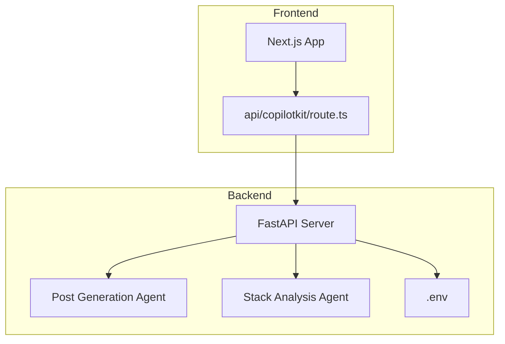
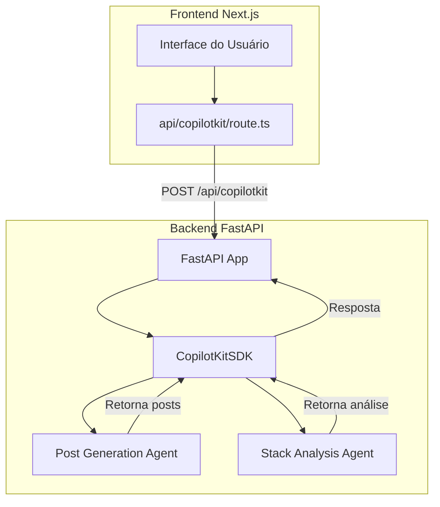
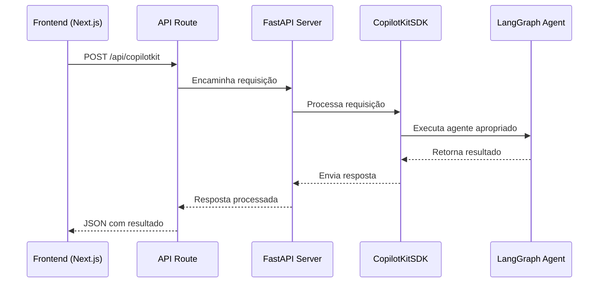
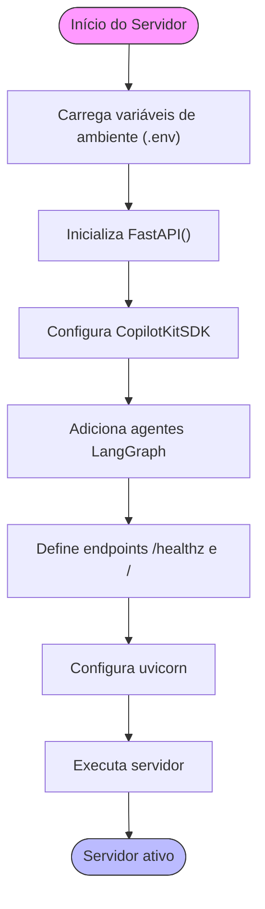
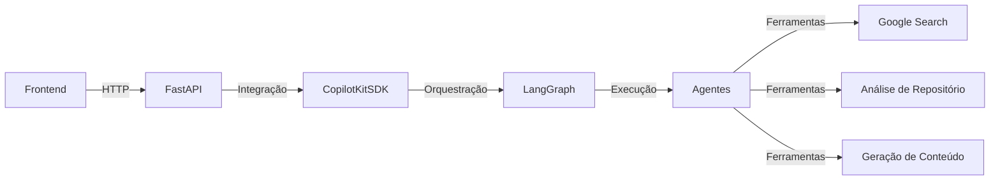
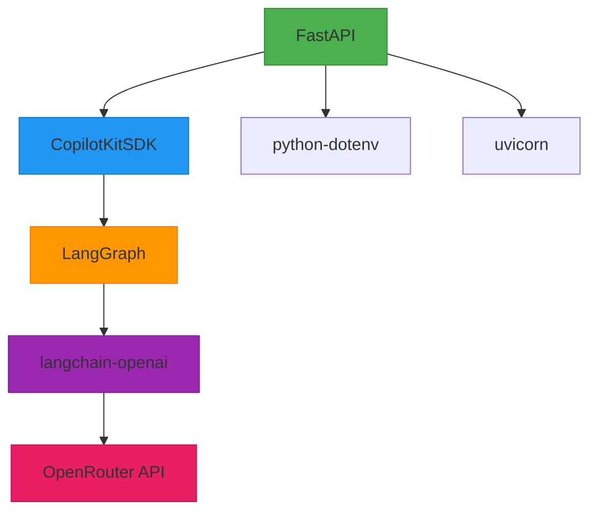

# Servidor FastAPI

<cite>
**Arquivos Referenciados neste Documento**   
- [main.py](file://agent/main.py)
- [posts_generator_agent.py](file://agent/posts_generator_agent.py)
- [stack_agent.py](file://agent/stack_agent.py)
- [pyproject.toml](file://agent/pyproject.toml)
- [route.ts](file://app/api/copilotkit/route.ts)
</cite>

## Sumário
1. [Introdução](#introdução)
2. [Estrutura do Projeto](#estrutura-do-projeto)
3. [Componentes Principais](#componentes-principais)
4. [Visão Geral da Arquitetura](#visão-geral-da-arquitetura)
5. [Análise Detalhada dos Componentes](#análise-detalhada-dos-componentes)
6. [Análise de Dependências](#análise-de-dependências)
7. [Considerações de Desempenho](#considerações-de-desempenho)
8. [Guia de Solução de Problemas](#guia-de-solução-de-problemas)
9. [Conclusão](#conclusão)

## Introdução

Este documento fornece uma análise detalhada do servidor FastAPI implementado no arquivo `main.py` do projeto Open Gemini Canvas. O servidor atua como uma camada intermediária entre o frontend Next.js e os agentes LangGraph, facilitando a geração de conteúdo e análise de tecnologias. A arquitetura combina FastAPI, CopilotKitSDK e LangGraph para criar uma solução robusta de agentes inteligentes que podem gerar posts para redes sociais e analisar repositórios GitHub.

## Estrutura do Projeto

O projeto possui uma arquitetura de microsserviços com separação clara entre frontend e backend. O backend em Python reside na pasta `agent/`, enquanto o frontend em Next.js está na raiz do projeto. Esta separação permite desenvolvimento independente e escalabilidade.

**Diagrama de fontes**
- [main.py](file://agent/main.py)
- [route.ts](file://app/api/copilotkit/route.ts)

**Fontes da seção**
- [main.py](file://agent/main.py)
- [pyproject.toml](file://agent/pyproject.toml)

## Componentes Principais

O servidor FastAPI centraliza a funcionalidade do sistema, integrando dois agentes principais: o gerador de posts e o analisador de stack. A inicialização do aplicativo ocorre através da instância `FastAPI()`, que cria um servidor web ASGI pronto para lidar com requisições HTTP. O padrão de execução com `if __name__ == '__main__': main()` garante que o servidor só seja iniciado quando o script for executado diretamente, permitindo que o módulo seja importado em outros contextos sem efeitos colaterais.

**Fontes da seção**
- [main.py](file://agent/main.py#L1-L62)
- [pyproject.toml](file://agent/pyproject.toml#L1-L27)

## Visão Geral da Arquitetura

A arquitetura do servidor FastAPI é projetada para expor agentes LangGraph através de endpoints REST, permitindo integração fácil com o frontend Next.js. O CopilotKitSDK atua como camada de abstração entre os agentes e o framework FastAPI, facilitando a integração e reduzindo a complexidade do código necessário para expor funcionalidades de agentes.

**Diagrama de fontes**
- [main.py](file://agent/main.py#L1-L62)
- [route.ts](file://app/api/copilotkit/route.ts#L1-L29)

## Análise Detalhada dos Componentes

### Análise do Componente Principal

O componente principal, implementado em `main.py`, é responsável por inicializar o servidor FastAPI, configurar o CopilotKitSDK com os agentes LangGraph e definir os endpoints da API. A integração entre CopilotKitSDK e LangGraph é realizada através da classe `LangGraphAgent`, que encapsula cada agente com seu nome, descrição e grafo de execução.

#### Para Componentes de API/Serviço:

**Diagrama de fontes**
- [main.py](file://agent/main.py#L1-L62)
- [route.ts](file://app/api/copilotkit/route.ts#L1-L29)

#### Para Componentes de Lógica Complexa:

**Diagrama de fontes**
- [main.py](file://agent/main.py#L1-L62)

**Fontes da seção**
- [main.py](file://agent/main.py#L1-L62)
- [posts_generator_agent.py](file://agent/posts_generator_agent.py#L1-L174)
- [stack_agent.py](file://agent/stack_agent.py#L1-L505)

### Visão Conceitual

A integração entre FastAPI e LangGraph através do CopilotKitSDK representa um padrão moderno de desenvolvimento de agentes inteligentes. Este padrão permite que agentes complexos com estado sejam expostos como serviços REST simples, ocultando a complexidade da orquestração de fluxos de trabalho de agentes do frontend.

## Análise de Dependências

A análise de dependências revela uma arquitetura bem definida com camadas claras de responsabilidade. O servidor FastAPI depende diretamente do CopilotKitSDK para integração com agentes, enquanto os agentes dependem de bibliotecas de IA como langchain-openai para comunicação com modelos de linguagem.

**Diagrama de fontes**
- [pyproject.toml](file://agent/pyproject.toml#L1-L27)
- [main.py](file://agent/main.py#L1-L62)

**Fontes da seção**
- [pyproject.toml](file://agent/pyproject.toml#L1-L27)
- [main.py](file://agent/main.py#L1-L62)

## Considerações de Desempenho

O servidor FastAPI é configurado para execução com uvicorn, um servidor ASGI de alto desempenho que suporta requisições assíncronas. A configuração de recarga automática (`reload=True`) durante o desenvolvimento melhora a produtividade, permitindo que mudanças no código sejam refletidas imediatamente sem reinicialização manual do servidor. Em produção, esta configuração deve ser desativada para melhor desempenho.

A utilização de `MemorySaver` como checkpointer nos grafos LangGraph armazena o estado dos agentes em memória, o que é eficiente para desenvolvimento mas pode não ser adequado para ambientes de produção com múltiplos processos ou necessidade de persistência de estado entre reinicializações.

## Guia de Solução de Problemas

### Problemas Comuns e Soluções

**Erro de Autenticação com OpenRouter:**
- Verifique se as variáveis de ambiente `OPENROUTER_API_KEY`, `OPENROUTER_MODEL` e `OPENROUTER_BASE_URL` estão corretamente definidas nos arquivos `.env`
- Confirme que a chave API é válida no dashboard do OpenRouter
- Certifique-se de que tanto o frontend quanto o backend têm acesso às variáveis de ambiente necessárias

**Servidor não inicia:**
- Verifique se todas as dependências foram instaladas corretamente
- Confirme que a versão do Python é compatível (>=3.12,<3.3)
- Valide se as portas necessárias (8000 para backend, 3000 para frontend) estão disponíveis

**Agentes não respondem:**
- Verifique a conexão entre frontend e backend
- Confirme que o endpoint `/copilotkit` está sendo acessado corretamente
- Valide se os grafos dos agentes foram compilados corretamente

**Fontes da seção**
- [main.py](file://agent/main.py#L1-L62)
- [README.md](file://README.md#L1-L160)

## Conclusão

O servidor FastAPI implementado em `main.py` representa uma solução elegante e eficiente para expor agentes LangGraph como serviços web. A combinação de FastAPI, CopilotKitSDK e LangGraph permite criar agentes inteligentes com estado que podem ser facilmente integrados a interfaces de usuário modernas. A arquitetura modular facilita a manutenção e expansão, permitindo a adição de novos agentes sem modificar significativamente a infraestrutura existente. O uso de padrões modernos de desenvolvimento, como a gestão de variáveis de ambiente e a execução condicional com `if __name__ == '__main__'`, demonstra boas práticas de engenharia de software.