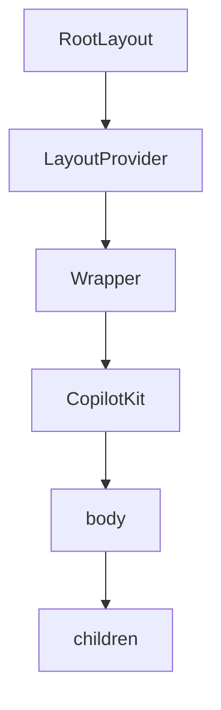
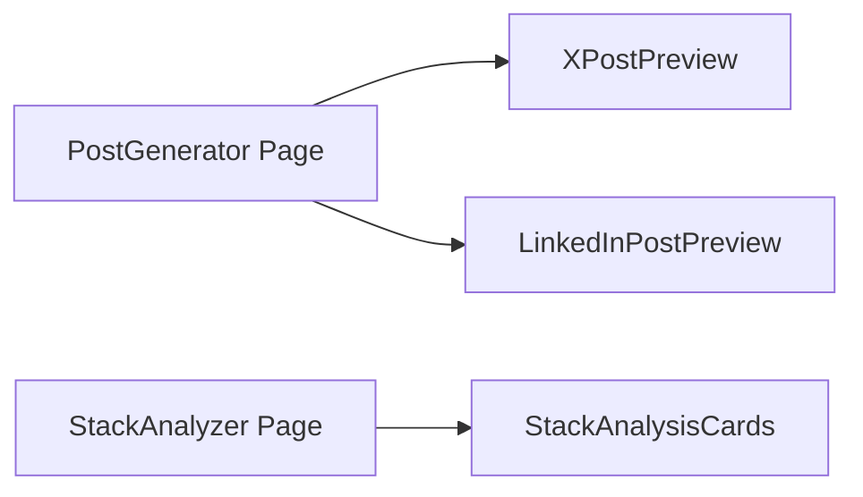
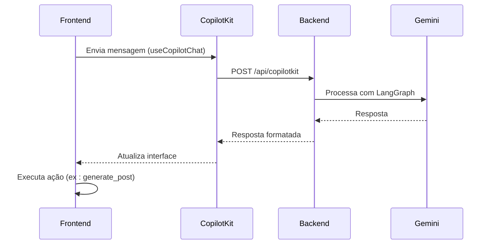
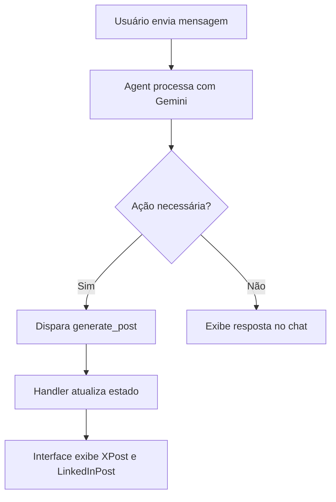

# Arquitetura do Frontend

<cite>
**Arquivos Referenciados neste Documento**  
- [app/page.tsx](file://app/page.tsx)
- [app/layout.tsx](file://app/layout.tsx)
- [app/contexts/LayoutContext.tsx](file://app/contexts/LayoutContext.tsx)
- [app/post-generator/page.tsx](file://app/post-generator/page.tsx)
- [app/stack-analyzer/page.tsx](file://app/stack-analyzer/page.tsx)
- [components/ui/x-post.tsx](file://components/ui/x-post.tsx)
- [components/ui/linkedin-post.tsx](file://components/ui/linkedin-post.tsx)
- [components/ui/stack-analysis-cards.tsx](file://components/ui/stack-analysis-cards.tsx)
- [app/wrapper.tsx](file://app/wrapper.tsx)
- [app/prompts/prompts.ts](file://app/prompts/prompts.ts)
- [app/api/copilotkit/route.ts](file://app/api/copilotkit/route.ts)
</cite>

## Sumário
1. [Introdução](#introdução)
2. [Estrutura do Projeto e Páginas](#estrutura-do-projeto-e-páginas)
3. [Gerenciamento de Estado com LayoutContext](#gerenciamento-de-estado-com-layoutcontext)
4. [Layout Compartilhado com layout.tsx](#layout-compartilhado-com-layouttsx)
5. [Componentes UI e Integração nas Páginas](#componentes-ui-e-integração-nas-páginas)
6. [Estilização com Tailwind CSS](#estilização-com-tailwind-css)
7. [Integração com CopilotKit e IA](#integração-com-copilotkit-e-ia)
8. [Padrões de Design: Server e Client Components](#padrões-de-design-server-e-client-components)
9. [Fluxo de Ações de Agente](#fluxo-de-ações-de-agente)
10. [Sincronização de Estado entre Camadas](#sincronização-de-estado-entre-camadas)

## Introdução
Este documento apresenta uma análise detalhada da arquitetura do frontend do projeto Open Gemini Canvas, implementado com Next.js. O sistema é centrado em dois fluxos principais: `/post-generator` e `/stack-analyzer`, ambos integrados a agentes de IA via CopilotKit e Google Gemini. A arquitetura utiliza React Server Components (RSC) em conjunto com Client Components, gerenciamento de estado global via contexto, e componentes reutilizáveis estilizados com Tailwind CSS. O documento explora como os componentes se comunicam, como o estado é sincronizado entre o frontend e os agentes, e como a interface responde dinamicamente às ações do usuário.

## Estrutura do Projeto e Páginas
O frontend é baseado na estrutura App Router do Next.js, com páginas definidas em diretórios específicos. A página inicial (`app/page.tsx`) redireciona automaticamente para `/post-generator`, definindo o agente padrão. As páginas principais são `/post-generator` e `/stack-analyzer`, cada uma com sua lógica de interface e integração com agentes distintos.

**Section sources**
- [app/page.tsx](file://app/page.tsx#L1-L18)
- [app/post-generator/page.tsx](file://app/post-generator/page.tsx#L1-L410)
- [app/stack-analyzer/page.tsx](file://app/stack-analyzer/page.tsx#L1-L347)

## Gerenciamento de Estado com LayoutContext
O estado global da aplicação é gerido pelo `LayoutContext.tsx`, que define um contexto React para armazenar informações como título, descrição, tema e o agente ativo. O estado inicial é configurado com base na rota atual (`pathname`), permitindo que o sistema saiba qual agente deve ser usado.

A interface `LayoutState` inclui campos como `title`, `description`, `theme` e `agent`, enquanto `LayoutContextType` expõe o estado e a função `updateLayout` para atualizações parciais. O hook `useLayout()` permite que qualquer componente acesse esse estado globalmente.

```mermaid
classDiagram
class LayoutState {
+string title
+string description
+boolean showHeader
+ReactNode headerContent
+ReactNode sidebarContent
+'light'|'dark'|'auto' theme
+string agent
}
class LayoutContextType {
+LayoutState layoutState
+updateLayout(updates : Partial~LayoutState~) : void
}
class LayoutProvider {
+LayoutProvider({ children } : { children : ReactNode }) : JSX.Element
}
class useLayout {
+() : LayoutContextType
}
LayoutProvider --> LayoutContextType : "provides"
useLayout --> LayoutContextType : "consumes"
```

**Diagram sources**
- [app/contexts/LayoutContext.tsx](file://app/contexts/LayoutContext.tsx#L5-L18)
- [app/contexts/LayoutContext.tsx](file://app/contexts/LayoutContext.tsx#L15-L18)
- [app/contexts/LayoutContext.tsx](file://app/contexts/LayoutContext.tsx#L30-L45)
- [app/contexts/LayoutContext.tsx](file://app/contexts/LayoutContext.tsx#L47-L53)

**Section sources**
- [app/contexts/LayoutContext.tsx](file://app/contexts/LayoutContext.tsx#L1-L53)

## Layout Compartilhado com layout.tsx
O arquivo `layout.tsx` define o layout raiz da aplicação, envolvendo todas as páginas com `LayoutProvider` e `Wrapper`. Ele configura metadados como título e descrição, e aplica a fonte `Inter`. O componente `Wrapper` envolve os filhos com `CopilotKit`, passando o agente ativo do `layoutState`.



**Diagram sources**
- [app/layout.tsx](file://app/layout.tsx#L16-L32)
- [app/wrapper.tsx](file://app/wrapper.tsx#L1-L11)

**Section sources**
- [app/layout.tsx](file://app/layout.tsx#L1-L33)
- [app/wrapper.tsx](file://app/wrapper.tsx#L1-L11)

## Componentes UI e Integração nas Páginas
Os componentes UI estão localizados em `components/ui/` e são integrados diretamente nas páginas. Os principais componentes são:

- `x-post.tsx`: Renderiza visualmente um post do X (Twitter), com versões compactas e de preview.
- `linkedin-post.tsx`: Similar ao anterior, mas para posts do LinkedIn.
- `stack-analysis-cards.tsx`: Exibe uma análise estruturada de um repositório GitHub em cartões organizados por categoria (frontend, backend, etc.).

Esses componentes são usados em `post-generator/page.tsx` e `stack-analyzer/page.tsx` para exibir os resultados gerados pelos agentes de IA.



**Diagram sources**
- [components/ui/x-post.tsx](file://components/ui/x-post.tsx#L1-L326)
- [components/ui/linkedin-post.tsx](file://components/ui/linkedin-post.tsx#L1-L366)
- [components/ui/stack-analysis-cards.tsx](file://components/ui/stack-analysis-cards.tsx#L1-L258)
- [app/post-generator/page.tsx](file://app/post-generator/page.tsx#L1-L410)
- [app/stack-analyzer/page.tsx](file://app/stack-analyzer/page.tsx#L1-L347)

**Section sources**
- [components/ui/x-post.tsx](file://components/ui/x-post.tsx#L1-L326)
- [components/ui/linkedin-post.tsx](file://components/ui/linkedin-post.tsx#L1-L366)
- [components/ui/stack-analysis-cards.tsx](file://components/ui/stack-analysis-cards.tsx#L1-L258)

## Estilização com Tailwind CSS
O projeto utiliza Tailwind CSS para estilização, com configurações personalizadas em `app/globals.css`. O arquivo define variáveis CSS para temas claro e escuro, e aplica estilos base via `@layer base`. Os componentes utilizam classes do Tailwind combinadas com `cn()` para composição condicional de classes, garantindo consistência visual e suporte a temas.

**Section sources**
- [app/globals.css](file://app/globals.css#L1-L146)

## Integração com CopilotKit e IA
A integração com IA é feita via CopilotKit, que conecta o frontend aos agentes Python em `agent/`. O endpoint `/api/copilotkit/route.ts` configura o `CopilotRuntime` com `GoogleGenerativeAIAdapter`, permitindo comunicação com o Gemini. O componente `CopilotChat` é usado nas páginas para exibir o chat, e `useCopilotAction` define ações que o agente pode executar, como `generate_post`.



**Diagram sources**
- [app/api/copilotkit/route.ts](file://app/api/copilotkit/route.ts#L1-L25)
- [app/post-generator/page.tsx](file://app/post-generator/page.tsx#L1-L410)
- [app/stack-analyzer/page.tsx](file://app/stack-analyzer/page.tsx#L1-L347)

**Section sources**
- [app/api/copilotkit/route.ts](file://app/api/copilotkit/route.ts#L1-L25)

## Padrões de Design: Server e Client Components
O projeto utiliza uma combinação de Server Components (RSC) e Client Components. O `layout.tsx` é um Server Component que define a estrutura comum, enquanto as páginas (`page.tsx`) são Client Components devido ao uso de hooks como `useRouter` e `useLayout`. Componentes interativos como `XPost` e `LinkedInPost` são Client Components por usarem estado e efeitos.

**Section sources**
- [app/layout.tsx](file://app/layout.tsx#L1-L33)
- [app/page.tsx](file://app/page.tsx#L1-L18)
- [app/post-generator/page.tsx](file://app/post-generator/page.tsx#L1-L410)

## Fluxo de Ações de Agente
Quando um usuário envia uma mensagem no chat, o agente processa a solicitação e pode disparar uma ação como `generate_post`. Essa ação é definida com `useCopilotAction`, que especifica os parâmetros (`tweet`, `linkedIn`) e o handler. O handler atualiza o estado local (`setPosts`) e exibe os resultados na interface.



**Diagram sources**
- [app/post-generator/page.tsx](file://app/post-generator/page.tsx#L1-L410)

**Section sources**
- [app/post-generator/page.tsx](file://app/post-generator/page.tsx#L1-L410)

## Sincronização de Estado entre Camadas
O estado é sincronizado entre o frontend e o backend via `useCoAgent`, que mantém o estado do agente (como `tool_logs` e `analysis`). O `wrapper.tsx` sincroniza o agente ativo com o `CopilotKit`, e o `LayoutContext` garante que a interface reflita o estado correto. Quando o usuário muda de página, o `updateLayout` altera o agente, e o `router.push` navega para a rota apropriada.

**Section sources**
- [app/contexts/LayoutContext.tsx](file://app/contexts/LayoutContext.tsx#L1-L53)
- [app/wrapper.tsx](file://app/wrapper.tsx#L1-L11)
- [app/post-generator/page.tsx](file://app/post-generator/page.tsx#L1-L410)
- [app/stack-analyzer/page.tsx](file://app/stack-analyzer/page.tsx#L1-L347)