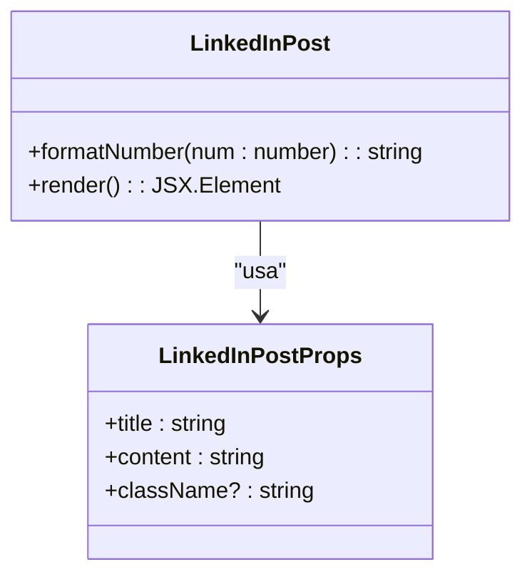
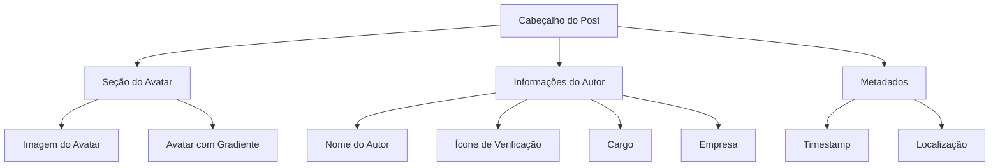
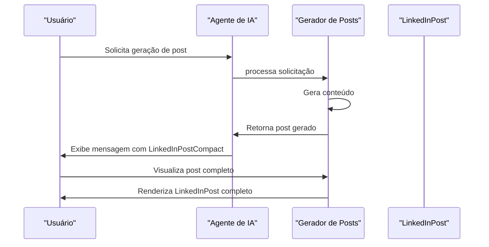
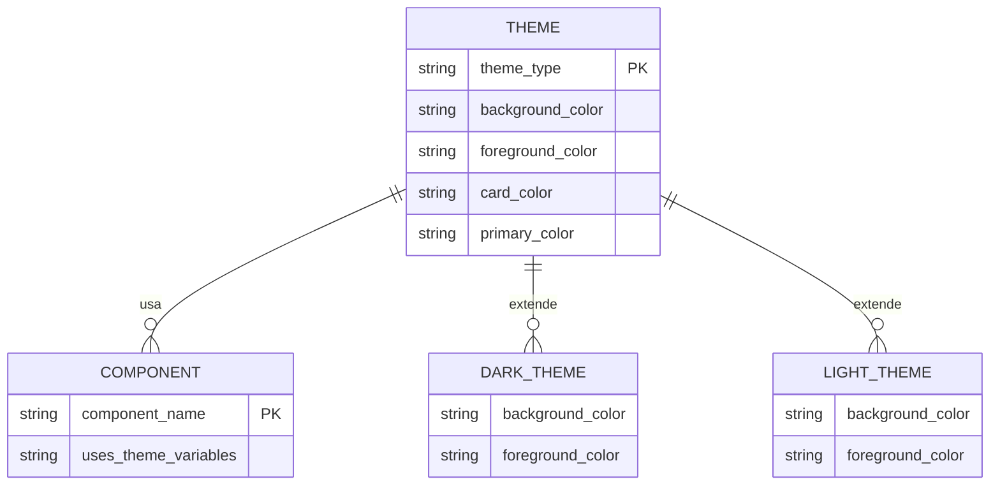

# Componente LinkedInPost

<cite>
**Arquivos Referenciados neste Documento**  
- [linkedin-post.tsx](file://components/ui/linkedin-post.tsx)
- [avatar.tsx](file://components/ui/avatar.tsx)
- [globals.css](file://app/globals.css)
- [post-generator/page.tsx](file://app/post-generator/page.tsx)
</cite>

## Sumário
1. [Introdução](#introdução)
2. [Estrutura e Props do Componente](#estrutura-e-props-do-componente)
3. [Cabeçalho do Post](#cabeçalho-do-post)
4. [Conteúdo e Título](#conteúdo-e-título)
5. [Estatísticas de Engajamento](#estatísticas-de-engajamento)
6. [Barra de Ações](#barra-de-ações)
7. [Versão Compacta (LinkedInPostCompact)](#versão-compacta-linkedinpostcompact)
8. [Integração com o Gerador de Posts](#integração-com-o-gerador-de-posts)
9. [Adaptação Responsiva](#adaptação-responsiva)
10. [Estilização Avançada](#estilização-avançada)
11. [Acessibilidade](#acessibilidade)
12. [Integração com Tema Escuro/Claro](#integração-com-tema-escuroclaro)
13. [Componentes Auxiliares](#componentes-auxiliares)

## Introdução

O componente `LinkedInPost` é uma implementação de interface de usuário que reproduz fielmente o estilo visual e funcional dos posts do LinkedIn. Este componente foi projetado para exibir conteúdo formatado em um layout que imita a plataforma profissional de redes sociais, permitindo a visualização de títulos, conteúdos, informações do autor, estatísticas de engajamento e uma barra de ações interativa. O componente faz parte de um sistema maior de geração de posts que utiliza inteligência artificial para criar conteúdo para redes sociais.

**Section sources**
- [linkedin-post.tsx](file://components/ui/linkedin-post.tsx#L1-L367)

## Estrutura e Props do Componente

O componente `LinkedInPost` aceita três props principais que permitem sua personalização e integração em diferentes contextos da aplicação:

- **title**: Define o título do post, exibido em destaque após o cabeçalho do autor.
- **content**: Contém o corpo principal do post, que pode incluir texto formatado com quebras de linha preservadas.
- **className**: Permite a aplicação de classes CSS adicionais para customização estilística específica do contexto de uso.

A interface `LinkedInPostProps` define claramente estas propriedades, tornando o componente tipado e seguro para uso em ambientes TypeScript. O componente utiliza o utilitário `cn` para combinar classes CSS de forma eficiente, garantindo que as classes padrão sejam mantidas enquanto permite a sobreposição ou adição de estilos personalizados.



**Diagram sources**
- [linkedin-post.tsx](file://components/ui/linkedin-post.tsx#L1-L367)

**Section sources**
- [linkedin-post.tsx](file://components/ui/linkedin-post.tsx#L1-L367)

## Cabeçalho do Post

O cabeçalho do post é uma seção crítica que apresenta informações sobre o autor do conteúdo. Esta seção inclui:

- **Avatar com Gradiente**: O avatar do autor utiliza um gradiente de cores (de azul-600 para azul-700) como fundo quando a imagem não está disponível, com a inicial do nome exibida em branco.
- **Nome do Autor**: Exibido em negrito com truncamento automático para evitar overflow.
- **Ícone de Verificação**: Um ícone de verificação azul é exibido ao lado do nome para indicar contas verificadas.
- **Informações Profissionais**: Cargo e empresa são exibidos em texto menor e cor mais clara.
- **Metadados Temporais e Geográficos**: Timestamp (ex: "2h") e localização (ex: "London, UK") são mostrados com ícones de calendário e localização.

O componente utiliza o componente `Avatar` do sistema de UI para garantir consistência visual com outros elementos da aplicação. A disposição em flexbox permite que o layout se adapte responsivamente a diferentes tamanhos de tela.



**Diagram sources**
- [linkedin-post.tsx](file://components/ui/linkedin-post.tsx#L27-L182)
- [avatar.tsx](file://components/ui/avatar.tsx#L1-L54)

**Section sources**
- [linkedin-post.tsx](file://components/ui/linkedin-post.tsx#L27-L182)

## Conteúdo e Título

A seção de conteúdo do componente é estruturada em duas partes principais:

### Título
O título do post é exibido em um elemento `h3` com formatação em negrito e cor escura, garantindo boa legibilidade. Utiliza a classe `text-base` para um tamanho de fonte adequado ao contexto.

### Corpo do Post
O conteúdo principal é renderizado em um parágrafo com as seguintes características:
- **Tipografia**: Utiliza `text-sm` para um tamanho de fonte menor que o título, mas ainda legível.
- **Espaçamento**: `leading-relaxed` proporciona um espaçamento de linha confortável para leitura.
- **Formatação de Texto**: `whitespace-pre-wrap` preserva quebras de linha e espaços múltiplos do conteúdo original, essencial para manter a formatação intencional do texto gerado.

Esta abordagem permite que o componente exiba conteúdo com formatação rica (como listas ou parágrafos separados) sem necessidade de processamento adicional do texto.

**Section sources**
- [linkedin-post.tsx](file://components/ui/linkedin-post.tsx#L27-L182)

## Estatísticas de Engajamento

A seção de estatísticas de engajamento exibe métricas importantes do post em um layout horizontal dividido em duas partes:

### Indicadores Visuais de Reações
- Três ícones pequenos (Curtida, Coração, Mais) são sobrepostos com espaçamento negativo (`-space-x-1`) para criar um efeito de pilha.
- Cada ícone tem um fundo colorido (azul, verde, roxo) correspondente ao tipo de reação.
- Os ícones são pequenos (`w-5 h-5`) para manter a proporção adequada no layout.

### Contadores Numéricos
- **Formato de Números**: Utiliza a função `formatNumber` para converter números grandes em formatos abreviados (ex: 1.2K, 456M).
- **Exibição de Métricas**: Mostra contadores para curtidas, comentários e compartilhamentos.
- **Estilização**: Texto em cor cinza médio (`text-gray-500`) para indicar que são metadados secundários.

A função `formatNumber` implementa uma lógica de formatação que automaticamente converte números acima de 1.000 para o formato "K" e acima de 1.000.000 para o formato "M", melhorando a legibilidade das métricas.

```mermaid
classDiagram
class LinkedInPost {
+formatNumber(num : number) : string
}
class EngagementStats {
+likes : number
+comments : number
+shares : number
}
LinkedInPost --> EngagementStats : "exibe"
LinkedInPost --> LinkedInPost : : formatNumber : "usa"
```

**Diagram sources**
- [linkedin-post.tsx](file://components/ui/linkedin-post.tsx#L27-L182)

**Section sources**
- [linkedin-post.tsx](file://components/ui/linkedin-post.tsx#L27-L182)

## Barra de Ações

A barra de ações fornece botões interativos que replicam as funcionalidades principais do LinkedIn:

- **Curtir**: Botão com ícone de polegar para cima e texto "Like".
- **Comentar**: Botão com ícone de balão de conversa e texto "Comment".
- **Repostar**: Botão com ícone de repetição e texto "Repost".
- **Enviar**: Botão com ícone de envio e texto "Send".

Cada botão utiliza o componente `Button` do sistema de UI com a variante "ghost" para um visual limpo e minimalista. Os estados de hover são estilizados para mudar a cor do texto para azul-600 e aplicar um fundo azul-50, fornecendo feedback visual claro ao usuário. A disposição em flexbox com `justify-between` garante um espaçamento uniforme entre os botões.

**Section sources**
- [linkedin-post.tsx](file://components/ui/linkedin-post.tsx#L27-L182)

## Versão Compacta (LinkedInPostCompact)

O componente `LinkedInPostCompact` é uma variação otimizada do componente principal, projetada especificamente para interfaces de chat e visualizações em miniatura:

### Diferenças Principais
- **Escala Reduzida**: Aplica `transform: 'scale(0.9)'` para diminuir o tamanho geral do componente.
- **Tamanhos de Elementos Menores**: Avatar reduzido de `w-12 h-12` para `w-8 h-8`.
- **Tipografia Menor**: Textos em `text-xs` em vez de `text-sm` ou `text-base`.
- **Truncamento de Conteúdo**: O conteúdo é limitado a 3 linhas com `WebkitLineClamp` e `overflow-hidden`.
- **Layout de Ações Modificado**: Botões com `size="icon"` e disposição com `gap-11` para economia de espaço.

### Casos de Uso
- **Visualizações em Chat**: Integrado no sistema de mensagens do agente.
- **Previews em Tempo Real**: Mostra como o post será renderizado antes da publicação.
- **Interfaces com Espaço Limitado**: Quando múltiplos posts precisam ser exibidos simultaneamente.

```mermaid
classDiagram
class LinkedInPost {
+title : string
+content : string
+className? : string
}
class LinkedInPostCompact {
+title : string
+content : string
+className? : string
}
LinkedInPostCompact --|> LinkedInPost : "estende funcionalidade"
note right of LinkedInPostCompact
Versão otimizada para
interfaces de chat e
visualizações compactas
end note
```

**Diagram sources**
- [linkedin-post.tsx](file://components/ui/linkedin-post.tsx#L217-L365)

**Section sources**
- [linkedin-post.tsx](file://components/ui/linkedin-post.tsx#L217-L365)

## Integração com o Gerador de Posts

O componente `LinkedInPost` é integrado ao sistema de geração de posts através do arquivo `post-generator/page.tsx`. A integração ocorre em dois contextos principais:

### Visualização Completa
Na interface principal do gerador de posts, o componente é usado em sua forma completa para exibir o post gerado com todo o seu conteúdo e formatação.

### Visualização Compacta em Chat
Durante a interação com o agente de IA, o componente `LinkedInPostCompact` é renderizado diretamente nas mensagens do chat, permitindo que o usuário visualize o post gerado em tempo real.

O sistema utiliza o mecanismo `useCopilotAction` para escutar quando a ação `generate_post` é disparada e então renderiza os componentes de post do LinkedIn e X com os dados gerados.



**Diagram sources**
- [linkedin-post.tsx](file://components/ui/linkedin-post.tsx#L1-L367)
- [post-generator/page.tsx](file://app/post-generator/page.tsx#L1-L411)

**Section sources**
- [post-generator/page.tsx](file://app/post-generator/page.tsx#L1-L411)

## Adaptação Responsiva

O componente `LinkedInPost` é projetado para ser responsivo e se adaptar a diferentes tamanhos de tela:

- **Container Flexível**: Utiliza `w-full` para ocupar 100% da largura disponível.
- **Quebra de Linha Automática**: `whitespace-pre-wrap` e `truncate` garantem que o texto se ajuste ao container.
- **Tamanhos Relativos**: Utiliza classes do Tailwind CSS com tamanhos relativos (sm, base, xs) que se adaptam ao breakpoint atual.
- **Overflow Controlado**: O uso de `min-w-0` e `flex-1` nos containers de texto previne overflow indesejado.

No caso do `LinkedInPostCompact`, a transformação de escala (`scale(0.9)`) permite que o componente se encaixe em espaços mais restritos sem perder sua estrutura visual principal.

**Section sources**
- [linkedin-post.tsx](file://components/ui/linkedin-post.tsx#L1-L367)

## Estilização Avançada

### Gradientes no Avatar
O componente utiliza gradientes CSS para criar um efeito visual moderno no avatar quando a imagem não está disponível:

```css
bg-gradient-to-r from-blue-600 to-blue-700
```

Este gradiente horizontal de azul escuro para azul mais escuro cria um fundo profissional e alinhado com a identidade visual do LinkedIn.

### Tipografia
Embora o código não mostre explicitamente o uso das fontes Roobert e Plus Jakarta Sans, a aplicação utiliza uma hierarquia tipográfica clara com diferentes tamanhos (text-xs, text-sm, text-base) e pesos (font-semibold) para criar uma hierarquia visual eficaz.

### Animações Sutis
- **Transição de Sombra**: `transition-shadow duration-200` aplica uma transição suave ao efeito de sombra quando o usuário passa o mouse sobre o card.
- **Pulsar no Status do Agente**: Embora não diretamente no componente LinkedInPost, o sistema utiliza animações CSS (como `animate-pulse`) para indicar estados ativos.

**Section sources**
- [linkedin-post.tsx](file://components/ui/linkedin-post.tsx#L1-L367)
- [globals.css](file://app/globals.css#L1-L147)

## Acessibilidade

O componente implementa várias práticas de acessibilidade:

- **Textos Alternativos**: O avatar inclui o atributo `alt` com o nome do autor para leitores de tela.
- **Hierarquia de Cabeçalhos**: Utiliza `h3` para o título do post, mantendo uma estrutura de cabeçalhos lógica.
- **Contraste de Cores**: As combinações de cores (texto escuro sobre fundo claro) atendem aos padrões de acessibilidade WCAG.
- **Foco Visível**: Os botões herdam estilos de foco do componente Button padrão, garantindo que sejam navegáveis por teclado.

**Section sources**
- [linkedin-post.tsx](file://components/ui/linkedin-post.tsx#L1-L367)

## Integração com Tema Escuro/Claro

O sistema de temas é gerenciado através das variáveis CSS definidas em `globals.css`, que define valores diferentes para `:root` e `.dark`. Embora o componente `LinkedInPost` use cores explícitas (como `text-gray-900`, `bg-white`), ele se integra ao sistema de temas geral da aplicação:

- **Variáveis de Cor**: O arquivo `globals.css` define variáveis como `--background`, `--foreground`, `--card`, etc., que são usadas em outros componentes do sistema.
- **Toggle de Tema**: O componente `theme-provider.tsx` (não analisado diretamente) provavelmente gerencia a alternância entre os temas claro e escuro.

O componente poderia ser aprimorado para usar essas variáveis de tema em vez de cores fixas, tornando-se verdadeiramente compatível com o modo escuro.



**Diagram sources**
- [globals.css](file://app/globals.css#L1-L147)

**Section sources**
- [globals.css](file://app/globals.css#L1-L147)

## Componentes Auxiliares

Além dos componentes principais, o arquivo define dois componentes auxiliares relacionados:

### LinkedInLogo
Um componente que exibe o logo do LinkedIn com o ícone e o nome da marca, usado principalmente em previews e identificação de plataforma.

### LinkedInPostPreview
Um wrapper que combina o `LinkedInLogo` com o `LinkedInPost` para criar uma visualização completa com identificação de plataforma, usado na interface principal do gerador de posts.

Esses componentes auxiliares demonstram uma abordagem modular, onde funcionalidades específicas são encapsuladas em componentes menores e reutilizáveis.

**Section sources**
- [linkedin-post.tsx](file://components/ui/linkedin-post.tsx#L1-L367)