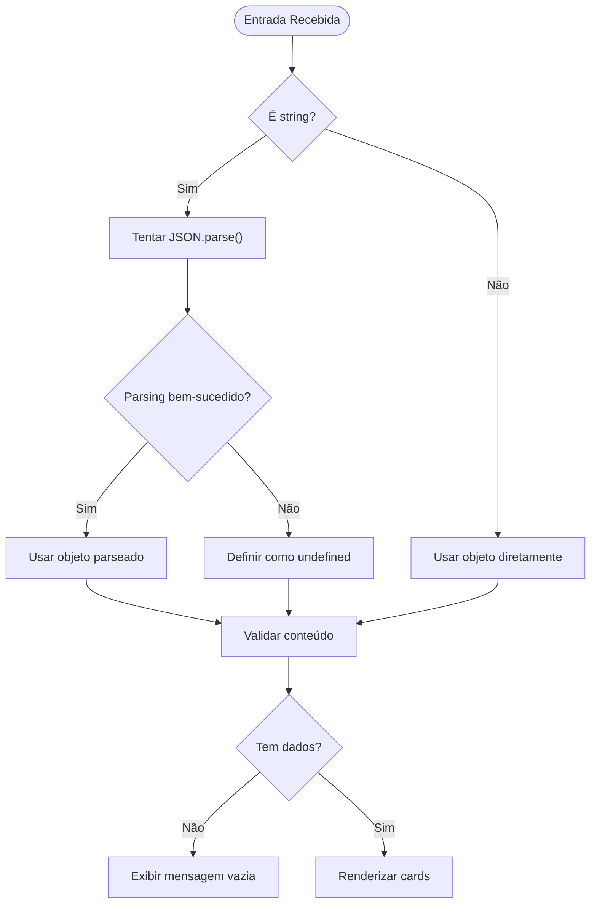
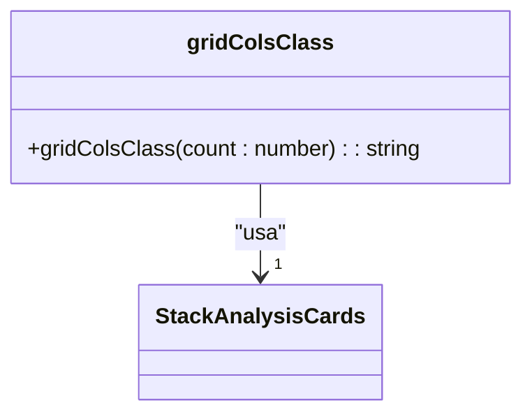
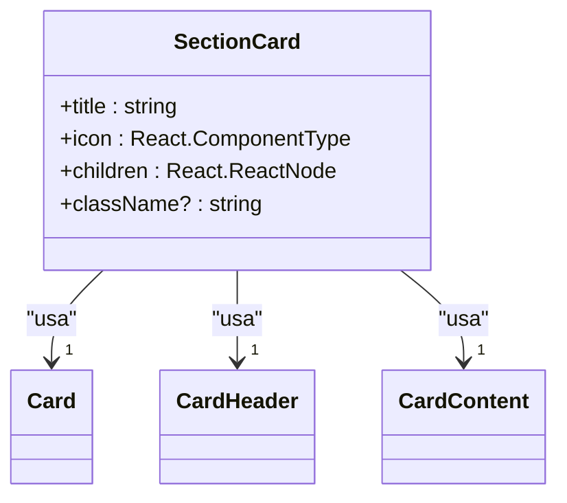
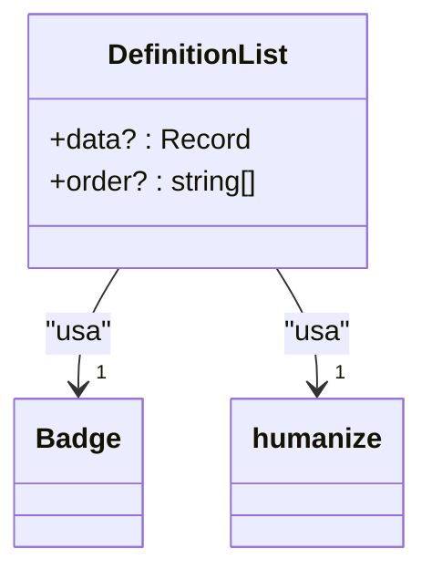
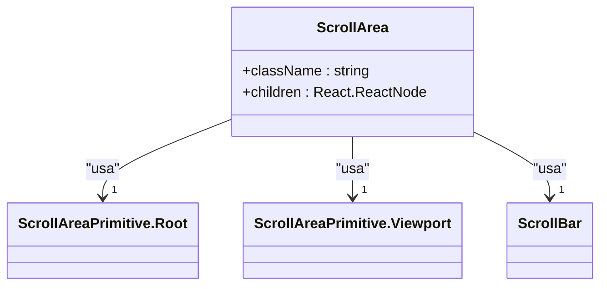
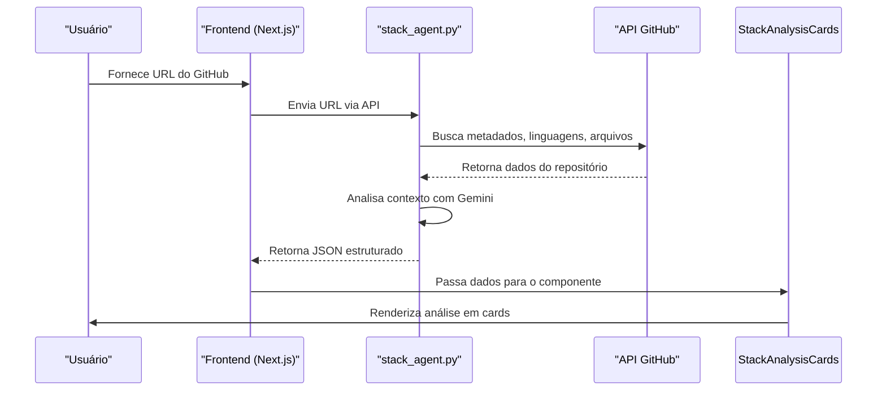

# Componente StackAnalysisCards

<cite>
**Arquivos Referenciados neste Documento**  
- [stack-analysis-cards.tsx](file://components/ui/stack-analysis-cards.tsx)
- [stack_agent.py](file://agent/stack_agent.py)
</cite>

## Sumário
1. [Introdução](#introdução)
2. [Estrutura de Tipos e Modelagem de Dados](#estrutura-de-tipos-e-modelagem-de-dados)
3. [Tratamento de Dados de Entrada](#tratamento-de-dados-de-entrada)
4. [Lógica de Renderização e Organização em Cards](#lógica-de-renderização-e-organização-em-cards)
5. [Componentes Aninhados: SectionCard e DefinitionList](#componentes-aninhados-sectioncard-e-definitionlist)
6. [Seções Inferiores com ScrollArea](#seções-inferiores-com-scrollarea)
7. [Integração com stack_agent.py via API](#integração-com-stack_agentpy-via-api)
8. [Usabilidade, Acessibilidade e Responsividade](#usabilidade-acessibilidade-e-responsividade)
9. [Conclusão](#conclusão)

## Introdução

O componente `StackAnalysisCards` é responsável por exibir de forma estruturada e visualmente clara a análise tecnológica de repositórios GitHub. Ele traduz dados complexos sobre stacks de desenvolvimento em uma interface de usuário organizada em cards temáticos, facilitando a compreensão da arquitetura, tecnologias e configurações de um projeto. Este documento detalha sua arquitetura interna, sistema de tipagem, fluxo de dados e decisões de design que garantem usabilidade e responsividade.

**Section sources**
- [stack-analysis-cards.tsx](file://components/ui/stack-analysis-cards.tsx#L1-L258)

## Estrutura de Tipos e Modelagem de Dados

O componente utiliza um sistema de tipagem robusto definido por interfaces TypeScript que modelam a estrutura esperada dos dados de análise. Essas interfaces garantem consistência e validação de tipos durante o desenvolvimento.

### Interface Principal: StackAnalysis

A interface `StackAnalysis` é o tipo raiz que define todas as seções possíveis de uma análise de stack. Ela é opcional em todos os campos, permitindo flexibilidade na exibição de dados parciais.

**Section sources**
- [stack-analysis-cards.tsx](file://components/ui/stack-analysis-cards.tsx#L31-L42)

### Seções de Stack: StackSection

A interface `StackSection` define um modelo genérico para seções como Frontend e Backend, incluindo campos comuns como linguagem, framework e gerenciador de dependências.

**Section sources**
- [stack-analysis-cards.tsx](file://components/ui/stack-analysis-cards.tsx#L17-L26)

### Entradas de Arquivos e Notas de Risco

- `RootFileEntry`: Representa um arquivo raiz do repositório com seu nome e descrição.
- `RiskNote`: Define uma nota de risco com uma área e uma descrição textual.

**Section sources**
- [stack-analysis-cards.tsx](file://components/ui/stack-analysis-cards.tsx#L28-L28)

## Tratamento de Dados de Entrada

O componente é projetado para aceitar dados de entrada em dois formatos: um objeto `StackAnalysis` ou uma string JSON. Isso aumenta sua flexibilidade ao integrar com diferentes fontes de dados.

### Lógica de Parsing

A função interna realiza o parsing da entrada:
1. Se a entrada for uma string, tenta fazer `JSON.parse`.
2. Se falhar, define como `undefined`.
3. Se já for um objeto, utiliza diretamente.
4. Valida se o objeto resultante está vazio.

Essa abordagem garante resiliência contra entradas malformadas.

**Diagram sources**
- [stack-analysis-cards.tsx](file://components/ui/stack-analysis-cards.tsx#L118-L138)

## Lógica de Renderização e Organização em Cards

O componente organiza a análise em duas áreas principais: cards superiores (tecnologias principais) e cards inferiores (informações complementares).

### Cards Superiores Temáticos

Os cards superiores representam as camadas principais da stack:
- **Frontend**: Ícone de caixa (`Box`)
- **Backend**: Ícone de servidor (`Server`)
- **Database**: Ícone de banco de dados (`Database`)
- **Infraestrutura**: Ícone de chave inglesa (`Wrench`)
- **CI/CD**: Ícone de ramificação Git (`GitBranch`)

Cada card é condicionalmente renderizado apenas se os dados correspondentes estiverem presentes.

### Grid Responsivo com gridColsClass

A função `gridColsClass` determina dinamicamente o layout da grade com base no número de cards:
- 1 card: Coluna única
- 2 cards: Duas colunas em telas médias e maiores
- 3 ou mais cards: Até três colunas em telas extra grandes

**Diagram sources**
- [stack-analysis-cards.tsx](file://components/ui/stack-analysis-cards.tsx#L52-L56)

**Section sources**
- [stack-analysis-cards.tsx](file://components/ui/stack-analysis-cards.tsx#L139-L194)

## Componentes Aninhados: SectionCard e DefinitionList

O componente utiliza dois subcomponentes internos para padronizar a apresentação de dados.

### SectionCard

`SectionCard` é um wrapper estilizado para cada seção, que inclui:
- Um ícone temático com fundo gradiente
- Um título formatado
- Conteúdo flexível via `children`

**Diagram sources**
- [stack-analysis-cards.tsx](file://components/ui/stack-analysis-cards.tsx#L58-L82)

### DefinitionList

`DefinitionList` transforma um objeto de dados em uma lista de definições (`<dl>`), com suporte a:
- Ordenação personalizada de campos
- Formatação de chaves (ex: `package_manager` → `Package Manager`)
- Exibição especial para `key_libraries` como badges

**Diagram sources**
- [stack-analysis-cards.tsx](file://components/ui/stack-analysis-cards.tsx#L84-L116)

**Section sources**
- [stack-analysis-cards.tsx](file://components/ui/stack-analysis-cards.tsx#L84-L116)

## Seções Inferiores com ScrollArea

Seções com conteúdo potencialmente longo são exibidas em containers com rolagem vertical.

### Seções Suportadas

- **Key Root Files**: Lista de arquivos importantes no diretório raiz
- **How To Run**: Instruções passo a passo para executar o projeto
- **Risks & Notes**: Notas sobre riscos ou considerações especiais

### ScrollArea

O componente `ScrollArea` envolve essas seções, limitando sua altura a 56 unidades e adicionando uma barra de rolagem quando necessário.

**Diagram sources**
- [scroll-area.tsx](file://components/ui/scroll-area.tsx#L7-L28)

**Section sources**
- [stack-analysis-cards.tsx](file://components/ui/stack-analysis-cards.tsx#L196-L256)

## Integração com stack_agent.py via API

Os dados exibidos pelo componente são gerados pelo agente Python `stack_agent.py`, que analisa repositórios GitHub e retorna uma estrutura JSON.

### Fluxo de Dados

1. O agente extrai metadados do repositório (linguagens, arquivos raiz, README).
2. Usa o modelo Gemini para inferir a stack tecnológica.
3. Retorna um objeto `StructuredStackAnalysis` mapeado para `StackAnalysis`.
4. O frontend recebe este JSON e o passa para `StackAnalysisCards`.

**Diagram sources**
- [stack_agent.py](file://agent/stack_agent.py#L1-L506)

**Section sources**
- [stack_agent.py](file://agent/stack_agent.py#L1-L506)

## Usabilidade, Acessibilidade e Responsividade

O componente foi projetado com foco em experiência do usuário em diferentes dispositivos.

### Responsividade

- **Mobile**: Layout de coluna única
- **Tela Média (md)**: Até duas colunas
- **Tela Grande (xl)**: Até três colunas
- Usa `backdrop-blur-sm` e transparência para efeitos visuais modernos

### Acessibilidade

- Uso de `<dl>` para listas de definição (semântica correta)
- Classes `sr-only` implícitas em ícones
- Contraste adequado entre texto e fundo
- Suporte a quebra de palavras com `break-words` e `hyphens-auto`

### Padrões de Design

- Cores neutras com acentos em gradientes suaves
- Espaçamento consistente com `gap-6` e `space-y-6`
- Altura fixa para cards com rolagem, garantindo layout estável

**Section sources**
- [stack-analysis-cards.tsx](file://components/ui/stack-analysis-cards.tsx#L1-L258)

## Conclusão

O componente `StackAnalysisCards` é uma solução eficaz para visualizar análises de stacks tecnológicos de forma clara e organizada. Sua arquitetura modular, com tipagem rigorosa e tratamento resiliente de dados, o torna robusto e fácil de manter. A integração com o agente Python permite análises profundas automatizadas, enquanto o design responsivo e acessível garante uma excelente experiência do usuário em todos os dispositivos.