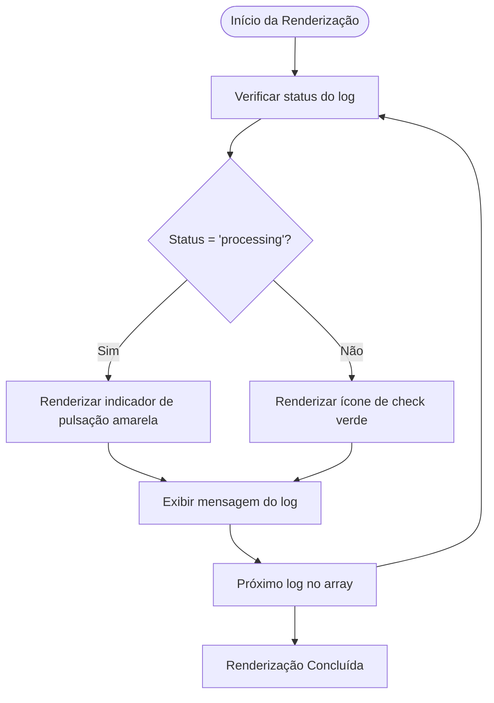
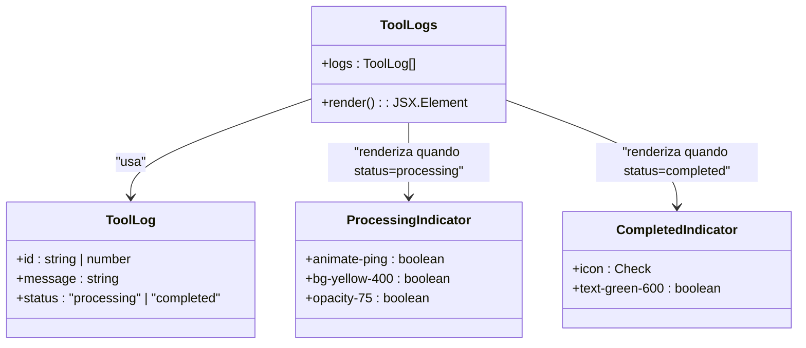
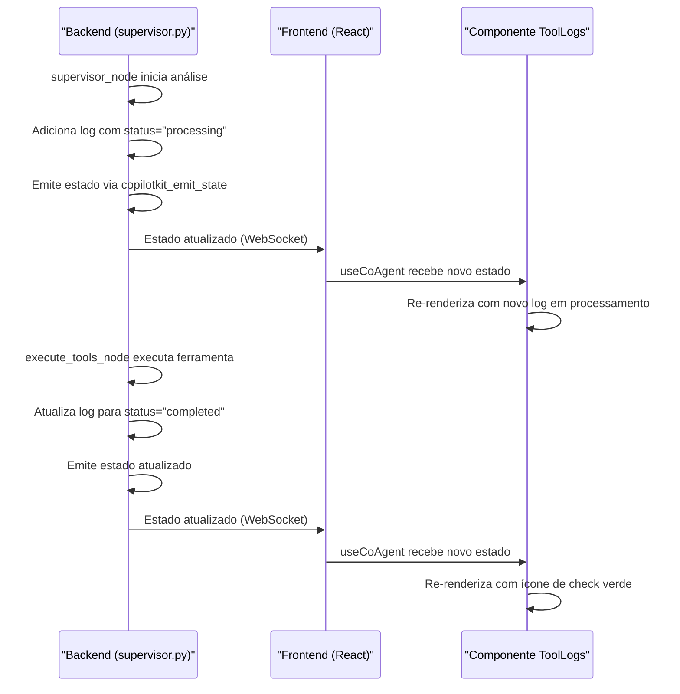

# Componente ToolLogs

<cite>
**Arquivos Referenciados neste Documento**  
- [tool-logs.tsx](file://components/ui/tool-logs.tsx)
- [post-generator/page.tsx](file://app/post-generator/page.tsx)
- [stack-analyzer/page.tsx](file://app/stack-analyzer/page.tsx)
- [supervisor.py](file://agent/supervisor.py)
- [stack-analysis-cards.tsx](file://components/ui/stack-analysis-cards.tsx)
</cite>

## Sumário
1. [Introdução](#introdução)
2. [Estrutura da Interface ToolLogsProps](#estrutura-da-interface-toollogsprops)
3. [Comportamento de Renderização Baseado no Status](#comportamento-de-renderização-baseado-no-status)
4. [Indicação Visual: Animação de Pulsação e Ícone de Check](#indicação-visual-animação-de-pulsação-e-ícone-de-check)
5. [Estilização com Tailwind CSS](#estilização-com-tailwind-css)
6. [Integração com o Fluxo do LangGraph](#integração-com-o-fluxo-do-langgraph)
7. [Uso nos Componentes de Interface](#uso-nos-componentes-de-interface)
8. [Depuração com useEffect](#depuração-com-useeffect)
9. [Contribuição para a Experiência do Usuário](#contribuição-para-a-experiência-do-usuário)
10. [Conclusão](#conclusão)

## Introdução

O componente `ToolLogs` é uma peça fundamental da interface do usuário no projeto Open Gemini Canvas, responsável por fornecer feedback visual em tempo real sobre as ações executadas pelos agentes de IA. Este componente atua como um painel de monitoramento que exibe o progresso das operações, permitindo que os usuários acompanhem o estado atual das tarefas realizadas pelos agentes especializados, como o gerador de posts e o analisador de stack. Através de uma combinação eficaz de indicadores visuais, tipografia e animações, o `ToolLogs` melhora significativamente a experiência do usuário ao tornar transparente o processo de execução dos agentes, transformando operações internas complexas em um fluxo compreensível e visualmente intuitivo.

**Section sources**
- [tool-logs.tsx](file://components/ui/tool-logs.tsx#L1-L54)

## Estrutura da Interface ToolLogsProps

A interface `ToolLogsProps` define a estrutura de dados esperada pelo componente `ToolLogs`, sendo o contrato entre o componente e seus consumidores. Esta interface contém uma única propriedade chamada `logs`, que é um array de objetos do tipo `ToolLog`. Cada objeto `ToolLog` possui três propriedades essenciais: `id`, `message` e `status`. O `id` serve como identificador único para cada entrada de log, garantindo que o React possa rastrear corretamente as atualizações e renderizações. A `message` é uma string que contém o texto descritivo da ação sendo executada, como "Executando execute_post_generator" ou "Analisando repositório GitHub". O `status` é uma união de tipos literais que pode assumir dois valores: `"processing"` ou `"completed"`, determinando o estado visual e comportamental de cada entrada no painel de logs. Esta estrutura simples e bem definida permite que o componente seja facilmente alimentado com dados do estado global da aplicação, especialmente do estado gerenciado pelo `useCoAgent`.

**Section sources**
- [tool-logs.tsx](file://components/ui/tool-logs.tsx#L6-L13)

## Comportamento de Renderização Baseado no Status

O comportamento de renderização do componente `ToolLogs` é dinâmico e está diretamente ligado ao valor da propriedade `status` de cada log. O componente mapeia o array de logs e, para cada entrada, renderiza um elemento visual distinto com base no seu estado. Quando o `status` é `"processing"`, o componente exibe um indicador visual de carregamento, enquanto que quando o `status` é `"completed"`, ele exibe um ícone de conclusão. Este comportamento condicional é implementado através de uma expressão ternária no JSX, que verifica o valor de `log.status` e decide qual conteúdo visual renderizar. Essa lógica de renderização condicional é crucial para comunicar efetivamente o progresso das operações aos usuários, transformando dados de estado abstratos em uma representação visual clara e imediata do que está acontecendo no sistema. A transição entre esses estados é suavizada por transições de cores no Tailwind CSS, criando uma experiência de usuário fluida e informativa.

**Diagram sources**
- [tool-logs.tsx](file://components/ui/tool-logs.tsx#L15-L45)

**Section sources**
- [tool-logs.tsx](file://components/ui/tool-logs.tsx#L15-L45)

## Indicação Visual: Animação de Pulsação e Ícone de Check

A indicação visual do componente `ToolLogs` é projetada para ser altamente intuitiva e informativa, utilizando dois elementos principais: uma animação de pulsação amarela para o estado de processamento e um ícone de check verde para o estado de conclusão. Quando um log está em estado `"processing"`, o componente renderiza um elemento `span` com uma classe CSS `animate-ping`. Esta classe é uma animação do Tailwind CSS que cria um efeito de pulsação, onde um círculo externo transparente se expande gradualmente, simulando uma onda de energia. Este efeito é combinado com um círculo interno sólido amarelo, criando um indicador visual de atividade contínua que chama a atenção do usuário. Quando o log muda para o estado `"completed"`, este indicador de pulsação é substituído por um ícone de check (✔) fornecido pelo pacote `lucide-react`. O ícone é estilizado com a cor verde (`text-green-600`), uma cor universalmente associada à conclusão bem-sucedida e ao sucesso. Essa combinação de cores e símbolos segue convenções de design de interface bem estabelecidas, permitindo que os usuários compreendam instantaneamente o estado de qualquer operação apenas com um olhar.

**Diagram sources**
- [tool-logs.tsx](file://components/ui/tool-logs.tsx#L15-L45)

**Section sources**
- [tool-logs.tsx](file://components/ui/tool-logs.tsx#L15-L45)

## Estilização com Tailwind CSS

A estilização do componente `ToolLogs` é totalmente baseada no framework Tailwind CSS, demonstrando um uso avançado de suas classes utilitárias para criar uma interface visualmente atraente e responsiva. O componente utiliza um sistema de cores baseado em tons de amarelo e verde, que são semanticamente apropriados para indicar estados de processamento e conclusão, respectivamente. Para o estado de processamento, as classes `bg-yellow-50`, `border-yellow-200` e `text-yellow-800` são aplicadas, criando um fundo claro, uma borda média e um texto escuro que garante boa legibilidade. Para o estado de conclusão, um esquema semelhante é usado com tons de verde (`bg-green-50`, `border-green-200`, `text-green-800`). O componente também implementa transições suaves com a classe `transition-colors`, que anima as mudanças de cor quando o status de um log muda de `"processing"` para `"completed"`. Além disso, o componente utiliza tipografia específica, com a fonte `Roobert` para o texto principal e `Plus Jakarta Sans` para a mensagem do log, aplicadas através das classes `font-['Roobert']` e `font-['Plus_Jakarta_Sans']`, demonstrando a capacidade do Tailwind de integrar fontes personalizadas.

**Section sources**
- [tool-logs.tsx](file://components/ui/tool-logs.tsx#L15-L45)

## Integração com o Fluxo do LangGraph

O componente `ToolLogs` está profundamente integrado ao fluxo de execução do LangGraph no backend, servindo como a camada de apresentação para o estado interno do sistema de agentes. No backend, especificamente no arquivo `supervisor.py`, o estado do agente supervisor é definido pela classe `SupervisorState`, que inclui uma propriedade `tool_logs` do tipo `List[Dict[str, Any]]`. Quando o supervisor decide executar uma ferramenta (como `execute_post_generator` ou `execute_stack_analyzer`), ele adiciona uma nova entrada a esta lista `tool_logs` com `status` definido como `"processing"`. Esta atualização de estado é então emitida para o frontend através da função `copilotkit_emit_state`. Quando a execução da ferramenta é concluída com sucesso, o `status` da entrada correspondente é atualizado para `"completed"`, e esta mudança é novamente emitida para o frontend. O estado global do agente, incluindo os `tool_logs`, é então acessível no frontend através do hook `useCoAgent`, permitindo que o componente `ToolLogs` se inscreva nessas mudanças e se atualize automaticamente em tempo real, criando um loop de feedback perfeito entre o backend e a interface do usuário.

**Diagram sources**
- [supervisor.py](file://agent/supervisor.py#L275-L359)
- [tool-logs.tsx](file://components/ui/tool-logs.tsx#L15-L45)

**Section sources**
- [supervisor.py](file://agent/supervisor.py#L275-L359)

## Uso nos Componentes de Interface

O componente `ToolLogs` é utilizado de forma central em duas páginas principais da aplicação: o gerador de posts e o analisador de stack. Em ambas as páginas, ele é integrado através do hook `useCoAgentStateRender`, que permite que um componente React seja renderizado diretamente como parte do estado de um agente CopilotKit. No arquivo `post-generator/page.tsx`, o hook é configurado para o agente `"post_generation_agent"`, e sua função `render` retorna o componente `<ToolLogs logs={state?.state?.tool_logs || []} />`. O mesmo padrão é seguido no arquivo `stack-analyzer/page.tsx` para o agente `"stack_analysis_agent"`. Esta abordagem de renderização baseada em estado garante que o painel de logs seja sempre atualizado em tempo real conforme o estado do agente muda. O componente é renderizado na barra lateral da interface, posicionado logo abaixo do seletor de agentes e acima da área de chat, tornando-o um elemento de interface de primeira linha que os usuários podem monitorar continuamente enquanto interagem com os agentes.

**Section sources**
- [post-generator/page.tsx](file://app/post-generator/page.tsx#L100-L104)
- [stack-analyzer/page.tsx](file://app/stack-analyzer/page.tsx#L100-L104)

## Depuração com useEffect

O componente `ToolLogs` inclui um hook `useEffect` para fins de depuração, demonstrando uma prática comum de desenvolvimento front-end. Este hook é configurado para executar uma única vez após a montagem inicial do componente, graças à dependência vazia `[]` no segundo argumento. Dentro do `useEffect`, a função `console.log` é chamada para imprimir o array `logs` e a string `"logs"` no console do navegador. Este mecanismo de logging é uma ferramenta invaluable durante o desenvolvimento e a depuração, pois permite aos desenvolvedores inspecionar diretamente o estado dos logs em tempo real, verificando se os dados estão sendo recebidos corretamente do estado do agente e se as atualizações de status estão sendo processadas como esperado. Embora este código seja principalmente destinado à depuração e possa ser removido em uma versão de produção, ele ilustra a importância de ter ferramentas de visibilidade no código para garantir a integridade do fluxo de dados entre o backend e o frontend.

**Section sources**
- [tool-logs.tsx](file://components/ui/tool-logs.tsx#L15-L17)

## Contribuição para a Experiência do Usuário

O componente `ToolLogs` desempenha um papel crucial na melhoria da experiência do usuário ao fornecer feedback em tempo real sobre as operações dos agentes de IA. Em sistemas que envolvem processamento assíncrono e operações que podem levar vários segundos para serem concluídas, a ausência de feedback pode levar à frustração e à incerteza do usuário. O `ToolLogs` resolve esse problema ao transformar um processo invisível em um fluxo narrativo visual. Cada entrada no painel de logs atua como um ponto de verificação, informando o usuário exatamente o que o sistema está fazendo no momento. A animação de pulsação amarela cria uma sensação de atividade e progresso, prevenindo a percepção de que o sistema travou. Quando a operação é concluída, o ícone de check verde fornece uma satisfação imediata e um sinal claro de sucesso. Essa transparência não apenas reduz a ansiedade do usuário, mas também aumenta a confiança no sistema, pois os usuários podem ver que suas ações estão sendo processadas de forma ordenada e eficiente.

**Section sources**
- [tool-logs.tsx](file://components/ui/tool-logs.tsx#L15-L45)

## Conclusão

Em resumo, o componente `ToolLogs` é um exemplo exemplar de como uma interface de usuário pode ser projetada para tornar sistemas complexos de IA acessíveis e compreensíveis. Sua simplicidade na estrutura de dados, combinada com uma rica representação visual, cria um canal de comunicação eficaz entre o sistema e o usuário. A integração perfeita com o estado do LangGraph no backend garante que a interface reflita com precisão o estado interno do sistema, enquanto o uso de animações e cores do Tailwind CSS proporciona uma experiência visual agradável e informativa. Seu uso consistente em múltiplas páginas da aplicação demonstra sua importância como um componente central de feedback. O `ToolLogs` não é apenas um painel de logs; é um elemento vital de design que transforma a interação com agentes de IA de uma caixa preta em um processo transparente, confiável e envolvente, elevando significativamente a qualidade geral da experiência do usuário no Open Gemini Canvas.