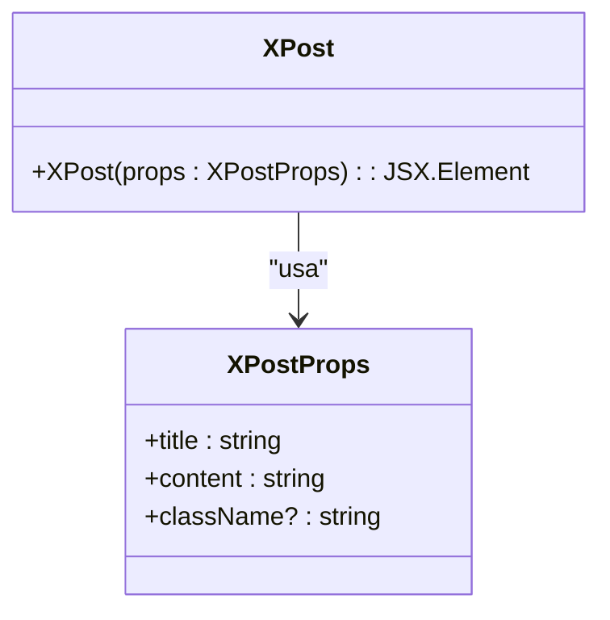
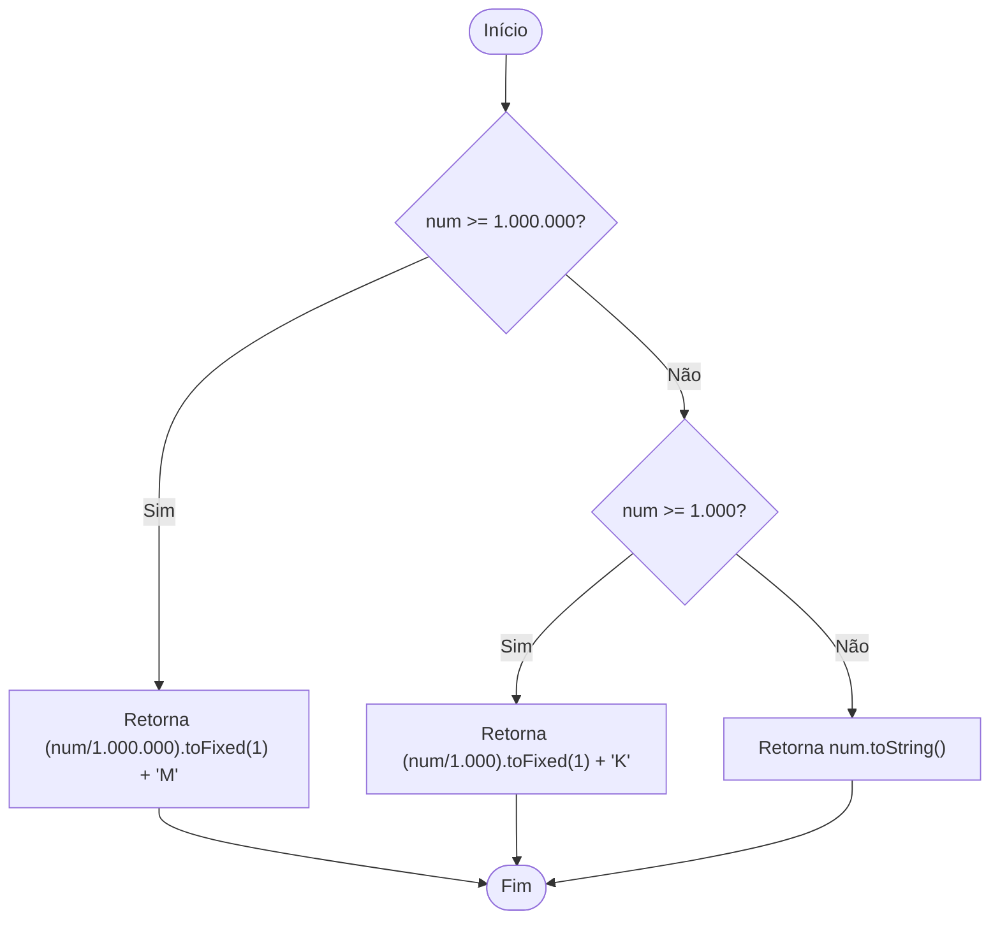
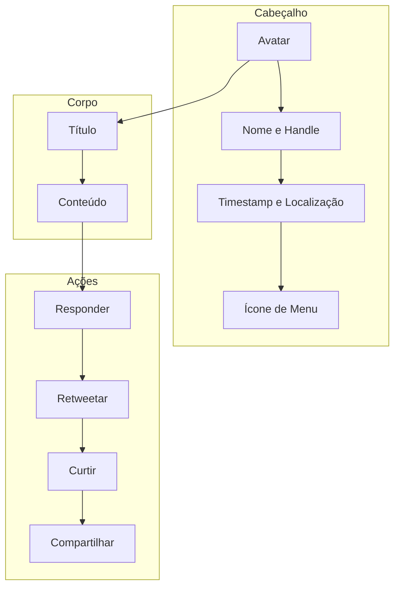
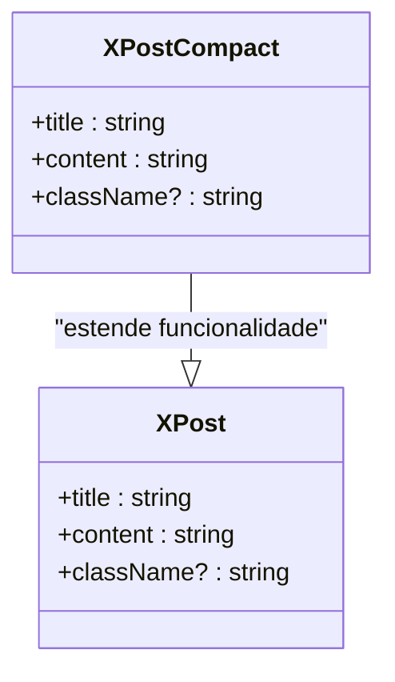
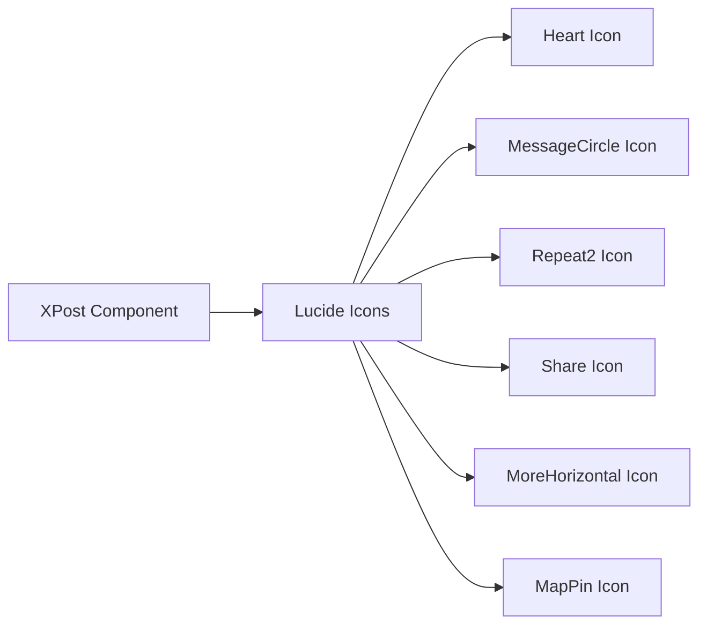
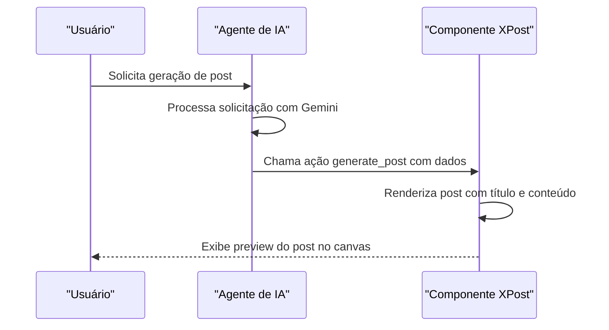

# Componente XPost

<cite>
**Arquivos Referenciados neste Documento**  
- [components/ui/x-post.tsx](file://components/ui/x-post.tsx)
- [app/post-generator/page.tsx](file://app/post-generator/page.tsx)
- [lib/utils.ts](file://lib/utils.ts)
</cite>

## Sumário
1. [Introdução](#introdução)
2. [Estrutura e Props do Componente](#estrutura-e-props-do-componente)
3. [Formatação de Números (K/M)](#formatação-de-números-km)
4. [Elementos de UI e Estilização](#elementos-de-ui-e-estilização)
5. [Versão Compacta (XPostCompact)](#versão-compacta-xpostcompact)
6. [Integração com Lucide Icons](#integração-com-lucide-icons)
7. [Acessibilidade e Responsividade](#acessibilidade-e-responsividade)
8. [Exemplos de Uso](#exemplos-de-uso)
9. [Fusão de Classes com cn()](#fusão-de-classes-com-cn)
10. [Conclusão](#conclusão)

## Introdução

O componente `XPost` é uma implementação de interface de usuário projetada para renderizar visualizações de posts no estilo X (anteriormente conhecido como Twitter). Ele faz parte de um sistema de canvas de geração de conteúdo alimentado por IA, permitindo visualizar posts gerados em tempo real com aparência autêntica. O componente é utilizado principalmente na página de geração de posts, onde exibe previews de conteúdo gerado para redes sociais.

**Section sources**
- [components/ui/x-post.tsx](file://components/ui/x-post.tsx#L25-L154)
- [app/post-generator/page.tsx](file://app/post-generator/page.tsx#L100-L105)

## Estrutura e Props do Componente

O componente `XPost` aceita três props principais que definem seu comportamento e conteúdo:

- **title**: String que representa o título do post, exibido em destaque após o cabeçalho do autor
- **content**: String que contém o corpo principal do post, renderizado com quebras de linha preservadas
- **className**: Prop opcional que permite adicionar classes CSS personalizadas para sobrescrever ou estender o estilo padrão

Essas props são definidas na interface `XPostProps` e permitem que o componente seja flexível e reutilizável em diferentes contextos da aplicação.



**Diagram sources**
- [components/ui/x-post.tsx](file://components/ui/x-post.tsx#L19-L23)

**Section sources**
- [components/ui/x-post.tsx](file://components/ui/x-post.tsx#L19-L23)

## Formatação de Números (K/M)

O componente implementa uma função interna `formatNumber` que converte números grandes em formatos mais legíveis, utilizando os sufixos "K" para milhares e "M" para milhões. Esta função é utilizada para exibir métricas de engajamento como curtidas, retweets, respostas e visualizações.

A lógica de formatação segue estas regras:
- Números maiores ou iguais a 1.000.000 são convertidos para o formato "X.XM"
- Números entre 1.000 e 999.999 são convertidos para o formato "X.XK"
- Números menores que 1.000 são exibidos como estão

Esta função é utilizada consistentemente em ambos os componentes `XPost` e `XPostCompact`, garantindo uniformidade na apresentação de métricas.



**Diagram sources**
- [components/ui/x-post.tsx](file://components/ui/x-post.tsx#L25-L32)

**Section sources**
- [components/ui/x-post.tsx](file://components/ui/x-post.tsx#L25-L32)

## Elementos de UI e Estilização

O componente `XPost` implementa uma estrutura de interface de usuário completa que replica fielmente o design do X, com vários elementos visuais importantes:

### Cabeçalho com Avatar Verificado
O cabeçalho do post inclui:
- Um componente `Avatar` com imagem do autor e fallback com inicial
- Indicador de verificação (badge azul com check) para contas verificadas
- Nome do autor, handle, timestamp e localização
- Ícone de menu de opções (três pontos)

### Ações de Engajamento
A barra de ações inclui quatro botões interativos:
- **Curtir (Heart)**: Exibe número de curtidas
- **Responder (MessageCircle)**: Exibe número de respostas
- **Retweetar (Repeat2)**: Exibe número de retweets
- **Compartilhar (Share)**: Ação de compartilhamento

Todos os botões possuem estados de hover com mudanças de cor e fundo, proporcionando feedback visual ao usuário.

### Estilização com Tailwind CSS
O componente utiliza extensivamente Tailwind CSS para estilização, com classes que definem:
- Cores de texto e fundo (text-gray-900, bg-white)
- Espaçamentos e padding (p-4, gap-3)
- Tipografia (font-semibold, text-sm)
- Bordas e sombras (border, shadow-sm)
- Transições e animações (hover:shadow-md, transition-shadow)



**Diagram sources**
- [components/ui/x-post.tsx](file://components/ui/x-post.tsx#L34-L154)

**Section sources**
- [components/ui/x-post.tsx](file://components/ui/x-post.tsx#L34-L154)

## Versão Compacta (XPostCompact)

O componente `XPostCompact` é uma variação otimizada do `XPost` projetada especificamente para interfaces de chat e visualizações em miniatura. Esta versão apresenta várias adaptações importantes:

- **Tamanho reduzido**: Escalado para 90% do tamanho original com `transform: 'scale(0.9)'`
- **Tipografia menor**: Utiliza `text-xs` e `text-sm` em vez de `text-sm` e `text-base`
- **Espaçamento reduzido**: Padding de `p-3` em vez de `p-4`
- **Altura de botão reduzida**: Botões com `h-6` em vez de `h-8`
- **Truncamento de conteúdo**: O conteúdo é limitado a 3 linhas com `WebkitLineClamp`

A versão compacta mantém a mesma estrutura básica e funcionalidade do componente principal, mas é otimizada para economizar espaço em interfaces densas como janelas de chat, onde múltiplos posts podem ser exibidos simultaneamente.



**Diagram sources**
- [components/ui/x-post.tsx](file://components/ui/x-post.tsx#L194-L325)

**Section sources**
- [components/ui/x-post.tsx](file://components/ui/x-post.tsx#L194-L325)

## Integração com Lucide Icons

O componente `XPost` utiliza ícones do Lucide React, uma biblioteca de ícones de código aberto que oferece consistência visual e excelente desempenho. Os seguintes ícones são utilizados:

- **Heart**: Para a ação de curtir
- **MessageCircle**: Para a ação de responder
- **Repeat2**: Para a ação de retweetar
- **Share**: Para a ação de compartilhar
- **MoreHorizontal**: Para o menu de opções
- **MapPin**: Para indicar localização

Esses ícones são importados diretamente da biblioteca `lucide-react` e utilizados como componentes React, permitindo fácil controle de tamanho, cor e estilização através de props.



**Diagram sources**
- [components/ui/x-post.tsx](file://components/ui/x-post.tsx#L10-L18)

**Section sources**
- [components/ui/x-post.tsx](file://components/ui/x-post.tsx#L10-L18)

## Acessibilidade e Responsividade

O componente `XPost` foi projetado com acessibilidade e responsividade em mente, garantindo uma experiência consistente em diferentes dispositivos e para usuários com necessidades diversas.

### Acessibilidade
- Utiliza elementos semânticos apropriados (h3 para título)
- Inclui atributos `alt` em imagens de avatar
- Mantém contraste de cores adequado entre texto e fundo
- Botões com estados de foco claramente definidos
- Tamanhos de toque adequados para dispositivos móveis

### Responsividade
- Utiliza classes do Tailwind CSS para layout responsivo
- Define largura máxima com `max-w-md` mas permite expansão em telas maiores
- Utiliza `flex` e `grid` para layouts adaptáveis
- Texto com `truncate` para evitar overflow em telas pequenas
- Sistema de escalonamento com `transform: scale()` na versão compacta

### Animações de Hover
O componente implementa animações sutis de hover no card principal:
- Elevação da sombra com `hover:shadow-md`
- Transição suave com `transition-shadow duration-200`
- Mudança de cor de fundo nos botões de ação
- Efeitos de escala nos ícones de ação

Essas animações melhoram a experiência do usuário, fornecendo feedback visual imediato sobre elementos interativos.

**Section sources**
- [components/ui/x-post.tsx](file://components/ui/x-post.tsx#L60-L61)

## Exemplos de Uso

O componente `XPost` é utilizado principalmente no gerador de posts, onde é integrado ao sistema de IA para exibir previews de conteúdo gerado.

### No Componente post-generator/page.tsx

O componente é importado e utilizado em dois contextos principais:

1. **Visualização em Canvas Completo**:
```tsx
<XPostPreview title={posts.tweet.title} content={posts.tweet.content} />
```

2. **Visualização em Chat Compacto**:
```tsx
<XPostCompact title={args.tweet?.title || ""} content={args.tweet?.content || ""} />
```

A integração ocorre através do sistema CopilotKit, onde ações de IA chamam o componente com dados gerados dinamicamente. O estado do post é gerenciado pelo hook `useCoAgent` e atualizado quando novos conteúdos são gerados pela IA.



**Diagram sources**
- [app/post-generator/page.tsx](file://app/post-generator/page.tsx#L100-L105)
- [app/post-generator/page.tsx](file://app/post-generator/page.tsx#L155-L175)

**Section sources**
- [app/post-generator/page.tsx](file://app/post-generator/page.tsx#L100-L105)

## Fusão de Classes com cn()

O componente utiliza a função `cn()` para fusão de classes CSS, que é uma combinação de `clsx` e `tailwind-merge`. Esta função é crucial para garantir que classes CSS sejam aplicadas corretamente, especialmente quando há sobreposição ou conflito entre classes.

A função `cn()` resolve problemas comuns em sistemas de design baseados em utilitários como o Tailwind CSS:
- **Mescla classes de forma inteligente**: Combina múltiplas classes de forma segura
- **Resolve conflitos**: Quando classes conflitantes são aplicadas, a última prevalece
- **Suporta condicionais**: Permite inclusão condicional de classes
- **Mantém consistência**: Garante que o sistema de design Radix UI seja respeitado

No componente `XPost`, a função é utilizada para combinar classes padrão com classes personalizadas passadas pela prop `className`, permitindo extensão do estilo sem sobrescrever o design base.

```mermaid
graph LR
A[Classes Padrão] --> C[cn()]
B[Classes Personalizadas] --> C[cn()]
C --> D[Classes Mescladas]
D --> E[Componente XPost]
```

**Diagram sources**
- [lib/utils.ts](file://lib/utils.ts#L3-L5)
- [components/ui/x-post.tsx](file://components/ui/x-post.tsx#L60-L61)

**Section sources**
- [lib/utils.ts](file://lib/utils.ts#L3-L5)

## Conclusão

O componente `XPost` é uma implementação robusta e bem projetada de uma visualização de post no estilo X, integrada a um sistema mais amplo de geração de conteúdo por IA. Sua arquitetura modular, com a versão compacta `XPostCompact`, permite flexibilidade em diferentes contextos de interface, desde previews em canvas completo até mensagens em janelas de chat.

A combinação de Tailwind CSS para estilização, Lucide Icons para elementos visuais e a função `cn()` para gestão de classes demonstra um uso eficaz de tecnologias modernas de desenvolvimento frontend. O componente equilibra estética, funcionalidade e acessibilidade, tornando-se uma peça fundamental no ecossistema de geração de conteúdo da aplicação.

Sua integração com o sistema CopilotKit permite que seja facilmente alimentado por dados gerados por IA, criando uma experiência de usuário coesa e eficiente para a criação e visualização de conteúdo para redes sociais.