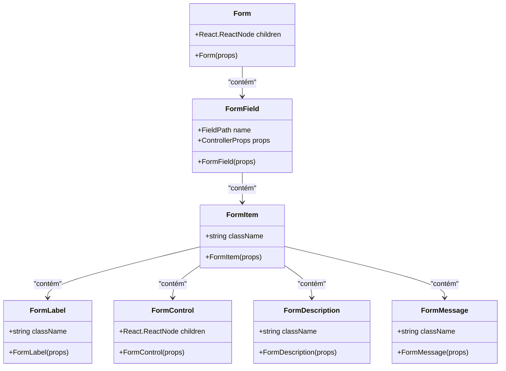

# Componentes UI Reutilizáveis

<cite>
**Arquivos Referenciados neste Documento**  
- [x-post.tsx](file://components/ui/x-post.tsx)
- [linkedin-post.tsx](file://components/ui/linkedin-post.tsx)
- [stack-analysis-cards.tsx](file://components/ui/stack-analysis-cards.tsx)
- [tool-logs.tsx](file://components/ui/tool-logs.tsx)
- [form.tsx](file://components/ui/form.tsx)
- [button.tsx](file://components/ui/button.tsx)
- [page.tsx](file://app/post-generator/page.tsx)
- [page.tsx](file://app/stack-analyzer/page.tsx)
</cite>

## Sumário
1. [Introdução](#introdução)
2. [Componentes de Visualização de Postagens](#componentes-de-visualização-de-postagens)
   - [x-post.tsx](#x-posttsx)
   - [linkedin-post.tsx](#linkedin-posttsx)
3. [Componentes de Análise e Logs](#componentes-de-análise-e-logs)
   - [stack-analysis-cards.tsx](#stack-analysis-cardstsx)
   - [tool-logs.tsx](#tool-logstsx)
4. [Componentes de Formulário e Botão](#componentes-de-formulário-e-botão)
   - [form.tsx](#formtsx)
   - [button.tsx](#buttontsx)
5. [Integração nas Páginas](#integração-nas-páginas)
   - [Página de Gerador de Postagens](#página-de-gerador-de-postagens)
   - [Página de Analisador de Stack](#página-de-analisador-de-stack)
6. [Estilização e Acessibilidade](#estilização-e-acessibilidade)
7. [Conclusão](#conclusão)

## Introdução
Este documento detalha os componentes principais da interface do usuário do projeto Open Gemini Canvas, com foco nos componentes `x-post.tsx`, `linkedin-post.tsx`, `stack-analysis-cards.tsx` e `tool-logs.tsx`. Também aborda os componentes auxiliares `form.tsx` e `button.tsx`, que são fundamentais para a interação do usuário. A análise inclui aparência, comportamento, padrões de interação, props, eventos, estilização com Tailwind CSS e integração com o sistema de design baseado em Radix UI.

**Section sources**
- [x-post.tsx](file://components/ui/x-post.tsx)
- [linkedin-post.tsx](file://components/ui/linkedin-post.tsx)
- [stack-analysis-cards.tsx](file://components/ui/stack-analysis-cards.tsx)
- [tool-logs.tsx](file://components/ui/tool-logs.tsx)

## Componentes de Visualização de Postagens

### x-post.tsx
O componente `XPost` simula uma postagem do X (antigo Twitter), exibindo título, conteúdo, informações do autor e métricas de engajamento. Ele utiliza o sistema de design Radix UI para componentes como Card, Avatar e Button, combinado com estilização Tailwind CSS.

**Aparência e Comportamento**
- Estrutura baseada em Card com sombra e transição suave
- Cabeçalho com avatar, nome, handle, verificação e metadados (tempo, localização)
- Corpo com título e conteúdo formatado com quebras de linha
- Barra de ações com ícones para comentários, retweets, curtidas e compartilhamento
- Efeitos de hover nos botões de ação

**Props Disponíveis**
- `title` (string): Título da postagem
- `content` (string): Conteúdo principal da postagem
- `className` (string, opcional): Classes CSS adicionais

**Padrões de Interação**
- Os botões de ação mudam de cor ao passar o mouse
- O card aumenta a sombra ao passar o mouse
- Métricas numéricas são formatadas automaticamente (K para mil, M para milhão)

**Variantes**
- `XPostPreview`: Versão com logo do X e preview para canvas
- `XPostCompact`: Versão compacta com escala reduzida para chat

**Diagram sources**
- [x-post.tsx](file://components/ui/x-post.tsx#L25-L154)

**Section sources**
- [x-post.tsx](file://components/ui/x-post.tsx#L1-L327)

### linkedin-post.tsx
O componente `LinkedInPost` simula uma postagem do LinkedIn, com design adaptado às características da plataforma, incluindo informações profissionais do autor e métricas específicas.

**Aparência e Comportamento**
- Design mais amplo que o XPost
- Informações adicionais do autor: cargo e empresa
- Ícones de calendário e localização no cabeçalho
- Seção de estatísticas de engajamento com curtidas, comentários e compartilhamentos
- Barra de ações com botões rotulados (Like, Comment, Repost, Send)

**Props Disponíveis**
- `title` (string): Título da postagem
- `content` (string): Conteúdo principal da postagem
- `className` (string, opcional): Classes CSS adicionais

**Padrões de Interação**
- Efeitos visuais semelhantes ao XPost
- Ícones de curtida combinados (pulgar para cima, coração, +)
- Textos descritivos nos botões de ação

**Variantes**
- `LinkedInPostPreview`: Versão com logo do LinkedIn para canvas
- `LinkedInPostCompact`: Versão compacta para interface de chat

**Diagram sources**
- [linkedin-post.tsx](file://components/ui/linkedin-post.tsx#L27-L182)

**Section sources**
- [linkedin-post.tsx](file://components/ui/linkedin-post.tsx#L1-L367)

## Componentes de Análise e Logs

### stack-analysis-cards.tsx
O componente `StackAnalysisCards` exibe dados estruturados de análise de repositórios GitHub em um layout de cartões organizados por categoria.

**Aparência e Comportamento**
- Layout responsivo com grid que ajusta o número de colunas
- Cartões temáticos com ícones coloridos e gradientes
- Seções para frontend, backend, banco de dados, infraestrutura, CI/CD
- Informações adicionais em cartões inferiores (arquivos principais, como executar, riscos)
- Área de rolagem para listas longas
- Mensagem padrão quando não há análise disponível

**Dados Exibidos**
- Propósito do projeto
- Tecnologias do frontend e backend
- Tipo de banco de dados
- Detalhes de infraestrutura e CI/CD
- Arquivos principais com descrições
- Instruções de execução em formato de lista
- Riscos e notas organizadas por área

**Padrões de Interação**
- Layout responsivo que ajusta o número de colunas
- Efeitos de rolagem suave nas áreas com conteúdo longo
- Formatação automática de chaves (sublinhado para espaços, capitalização)

**Diagram sources**
- [stack-analysis-cards.tsx](file://components/ui/stack-analysis-cards.tsx#L118-L256)

**Section sources**
- [stack-analysis-cards.tsx](file://components/ui/stack-analysis-cards.tsx#L1-L259)

### tool-logs.tsx
O componente `ToolLogs` visualiza o progresso das ações do agente em tempo real, mostrando o status de cada etapa.

**Aparência e Comportamento**
- Lista vertical de entradas de log
- Indicador visual de status: animação de pulsação para processamento, ícone de check para concluído
- Cores distintas para cada status (amarelo para processamento, verde para concluído)
- Tipografia com fontes específicas (Roobert, Plus Jakarta Sans)
- Espaçamento consistente entre os logs

**Dados Exibidos**
- Mensagem descritiva da ação
- Status (processing ou completed)
- ID único para cada entrada

**Padrões de Interação**
- Atualização automática quando novos logs são adicionados
- Animação de pulsação nos indicadores de processamento
- Transição suave nas mudanças de cor

**Diagram sources**
- [tool-logs.tsx](file://components/ui/tool-logs.tsx#L15-L45)

**Section sources**
- [tool-logs.tsx](file://components/ui/tool-logs.tsx#L1-L54)

## Componentes de Formulário e Botão

### form.tsx
O componente `form.tsx` implementa um sistema de formulário baseado em react-hook-form e Radix UI, com integração completa para validação e acessibilidade.

**Estrutura e Funcionalidade**
- Sistema de contexto para gerenciamento de campos de formulário
- Componentes compostos: FormItem, FormLabel, FormControl, FormDescription, FormMessage
- Integração com react-hook-form para gerenciamento de estado
- Suporte a validação e mensagens de erro
- Acessibilidade incorporada (labels, descrições, estados inválidos)

**Componentes Principais**
- `Form`: Provedor de contexto do formulário
- `FormField`: Campo de formulário controlado
- `FormItem`: Container para um campo de formulário
- `FormLabel`: Rótulo acessível
- `FormControl`: Controle de entrada
- `FormDescription`: Descrição auxiliar
- `FormMessage`: Mensagem de erro ou status

**Diagram sources**
- [form.tsx](file://components/ui/form.tsx#L18-L18)
- [form.tsx](file://components/ui/form.tsx#L31-L42)
- [form.tsx](file://components/ui/form.tsx#L75-L87)
- [form.tsx](file://components/ui/form.tsx#L106-L122)

**Section sources**
- [form.tsx](file://components/ui/form.tsx#L1-L168)

### button.tsx
O componente `Button` é um botão estilizado com suporte a múltiplas variantes e tamanhos, baseado em Radix UI e class-variance-authority.

**Variantes Disponíveis**
- **default**: Fundo primário com sombra
- **destructive**: Para ações destrutivas (vermelho)
- **outline**: Borda com fundo transparente
- **secondary**: Fundo secundário
- **ghost**: Apenas efeito hover
- **link**: Estilo de link sublinhado

**Tamanhos Disponíveis**
- **default**: Tamanho padrão
- **sm**: Pequeno
- **lg**: Grande
- **icon**: Quadrado para ícones

**Recursos Avançados**
- Suporte a ícones embutidos
- Estados de foco e validação
- Transições suaves
- Responsividade
- Acessibilidade (roles, estados)

**Diagram sources**
- [button.tsx](file://components/ui/button.tsx#L37-L56)

**Section sources**
- [button.tsx](file://components/ui/button.tsx#L1-L60)

## Integração nas Páginas

### Página de Gerador de Postagens
A página `/post-generator` utiliza os componentes de postagem para exibir conteúdo gerado por IA em um layout de canvas.

**Estrutura e Funcionalidade**
- Layout dividido em sidebar e conteúdo principal
- Sidebar com seletor de agentes e interface de chat
- Canvas principal com visualização lado a lado do X e LinkedIn
- Uso de `XPostPreview` e `LinkedInPostPreview` para visualização
- Integração com `ToolLogs` para mostrar progresso do agente
- Botões de ações rápidas para geração de conteúdo

**Fluxo de Interação**
1. Usuário seleciona ou digita um prompt
2. Agente processa a solicitação
3. Logs são exibidos em tempo real com `ToolLogs`
4. Resultado é renderizado com `XPostCompact` e `LinkedInPostCompact`
5. Visualização final é exibida no canvas com os componentes de preview

**Section sources**
- [page.tsx](file://app/post-generator/page.tsx#L1-L411)

### Página de Analisador de Stack
A página `/stack-analyzer` utiliza `StackAnalysisCards` para exibir a análise detalhada de repositórios GitHub.

**Estrutura e Funcionalidade**
- Interface semelhante ao gerador de postagens
- Uso de `StackAnalysisCards` como componente principal de visualização
- Estado do agente controla a exibição dos cartões
- Integração com `ToolLogs` para mostrar progresso da análise
- Botões de ações rápidas para análise de repositórios populares

**Fluxo de Interação**
1. Usuário fornece URL de repositório GitHub
2. Agente coleta e analisa metadados do repositório
3. Progresso é exibido com `ToolLogs`
4. Resultado estruturado é passado para `StackAnalysisCards`
5. Análise é exibida em cartões organizados por categoria

**Section sources**
- [page.tsx](file://app/stack-analyzer/page.tsx#L1-L348)

## Estilização e Acessibilidade

### Estilização com Tailwind CSS
Os componentes utilizam Tailwind CSS extensivamente para estilização, combinado com o sistema de design Radix UI.

**Padrões de Estilização**
- Cores baseadas em variáveis CSS do tema
- Sombras sutis para profundidade (shadow-sm)
- Bordas arredondadas (rounded-md, rounded-lg)
- Transições suaves para interações (transition-all, duration-200)
- Layouts flexíveis e responsivos (flex, grid)
- Espaçamento consistente (gap, p, m)

**Gradientes e Cores**
- Gradientes personalizados para elementos destacados
- Cores específicas para cada plataforma (azul do X, azul do LinkedIn)
- Paleta de cores acessível com contraste adequado

### Sistema de Design Radix UI
O projeto utiliza Radix UI como base para componentes acessíveis e customizáveis.

**Componentes Utilizados**
- Card, Avatar, Badge, Button, ScrollArea, Label
- Sistema de formulário completo
- Componentes acessíveis por padrão
- Estilização via classes CSS

### Acessibilidade
Os componentes seguem práticas de acessibilidade web.

**Recursos de Acessibilidade**
- Labels apropriados para formulários
- Estados de erro comunicados visualmente e semanticamente
- Navegação por teclado suportada
- Contraste de cores adequado
- Elementos interativos com tamanhos adequados
- Informações contextuais para leitores de tela

### Responsividade
Os componentes são projetados para funcionar em diferentes tamanhos de tela.

**Estratégias de Responsividade**
- Layouts flexíveis com flex e grid
- Classes responsivas do Tailwind (md:, lg:, xl:)
- Ajuste automático do número de colunas
- Versões compactas para espaços limitados
- Textos com quebra de linha apropriada

### Animações
As animações são usadas com moderação para melhorar a experiência do usuário.

**Tipos de Animações**
- Transições suaves para estados de hover e foco
- Animação de pulsação para indicadores de processamento
- Transformações suaves para mudanças de escala
- Transições de opacidade para entradas e saídas

## Conclusão
Os componentes UI principais do Open Gemini Canvas demonstram uma arquitetura bem estruturada que combina reutilização, acessibilidade e boa experiência do usuário. A integração entre Tailwind CSS e Radix UI permite uma estilização consistente e eficiente, enquanto os componentes especializados como `XPost`, `LinkedInPost`, `StackAnalysisCards` e `ToolLogs` fornecem funcionalidades específicas de forma eficaz. A separação clara de responsabilidades e a composição de componentes menores resultam em uma interface flexível e manutenível.