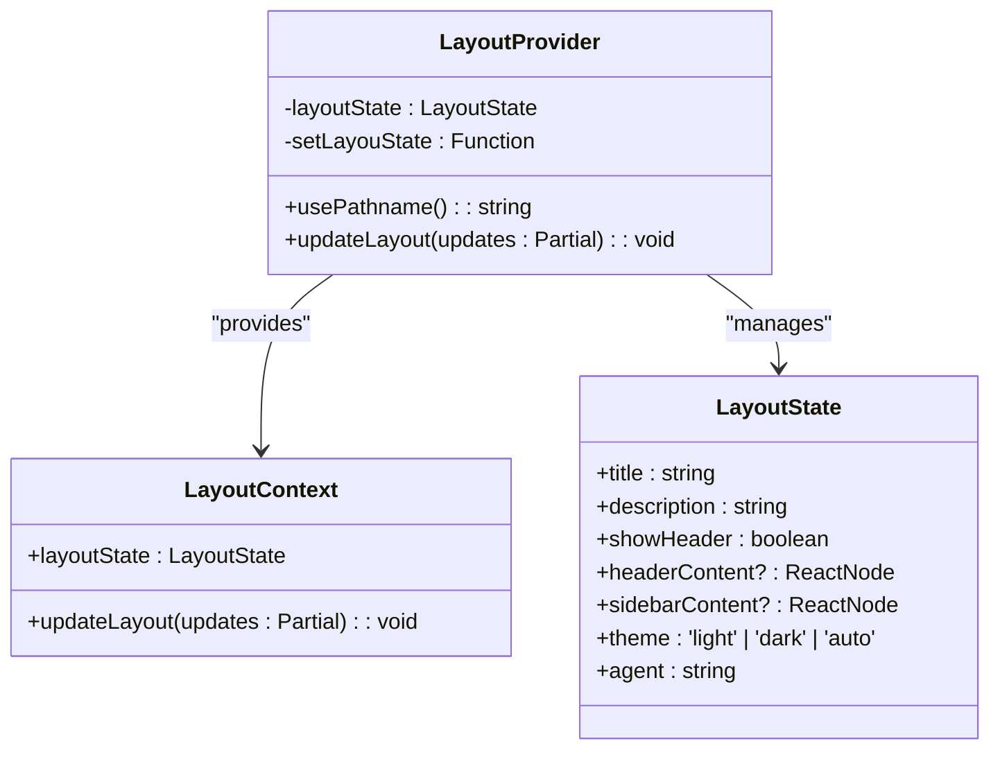
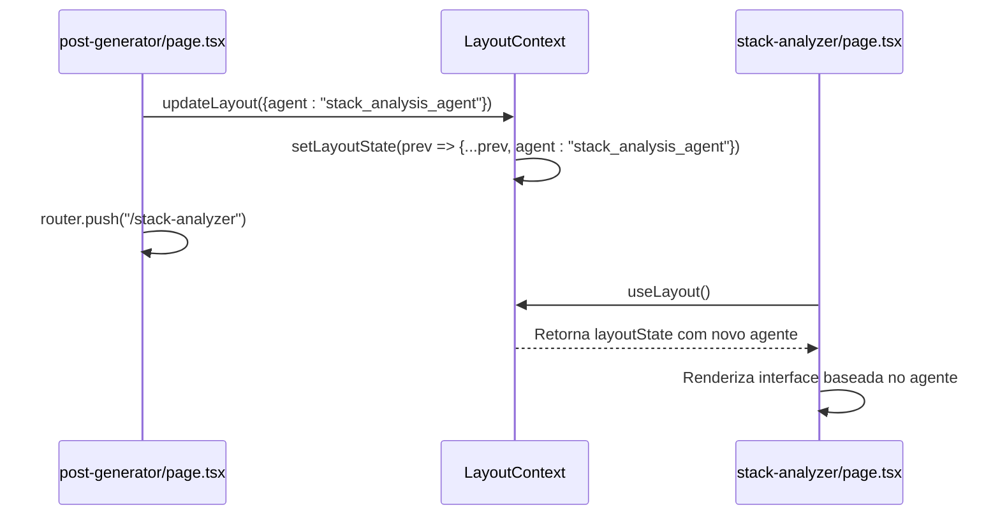

# Contexto e Estado Global

<cite>
**Arquivos Referenciados neste Documento**  
- [app/contexts/LayoutContext.tsx](file://app/contexts/LayoutContext.tsx)
- [app/layout.tsx](file://app/layout.tsx)
- [app/page.tsx](file://app/page.tsx)
- [app/post-generator/page.tsx](file://app/post-generator/page.tsx)
- [app/stack-analyzer/page.tsx](file://app/stack-analyzer/page.tsx)
- [app/wrapper.tsx](file://app/wrapper.tsx)
</cite>

## Sumário
1. [Introdução](#introdução)
2. [Estrutura do Projeto e Localização dos Arquivos](#estrutura-do-projeto-e-localização-dos-arquivos)
3. [Criação do Contexto Global com React Context API](#criação-do-contexto-global-com-react-context-api)
4. [Consumo do Contexto nas Páginas da Aplicação](#consumo-do-contexto-nas-páginas-da-aplicação)
5. [Variáveis de Estado Gerenciadas e Funções de Atualização](#variáveis-de-estado-gerenciadas-e-funções-de-atualização)
6. [Exemplo de Mudança de Estado que Afeta Múltiplas Páginas](#exemplo-de-mudança-de-estado-que-afeta-múltiplas-páginas)
7. [Persistência do Estado durante a Navegação](#persistência-do-estado-durante-a-navegação)
8. [Impacto no Desempenho e Alternativas Consideradas](#impacto-no-desempenho-e-alternativas-consideradas)

## Introdução

O sistema de gerenciamento de estado global implementado no projeto `open-gemini-canvas` utiliza a **React Context API** para fornecer um estado compartilhado entre múltiplos componentes e páginas da aplicação. Esse estado é centralizado no arquivo `LayoutContext.tsx`, localizado no diretório `app/contexts/`, e é consumido por diversas páginas, incluindo `layout.tsx`, `page.tsx`, `post-generator/page.tsx` e `stack-analyzer/page.tsx`. Este documento detalha a arquitetura, funcionamento e implicações do uso do `LayoutContext` como mecanismo de gerenciamento de estado.

## Estrutura do Projeto e Localização dos Arquivos

O contexto de layout é definido no caminho `app/contexts/LayoutContext.tsx`. Ele é então fornecido no nível raiz da aplicação através do `LayoutProvider` no arquivo `app/layout.tsx`. As páginas que consomem esse contexto estão localizadas em:

- `app/page.tsx`: Página inicial que redireciona para o gerador de posts.
- `app/post-generator/page.tsx`: Interface para geração de posts.
- `app/stack-analyzer/page.tsx`: Interface para análise de stacks de projetos.
- `app/wrapper.tsx`: Componente que pode acessar o estado do layout.

Essa estrutura permite que o estado global seja acessível em qualquer nível da árvore de componentes, facilitando a coordenação entre diferentes partes da aplicação.

**Section sources**
- [app/contexts/LayoutContext.tsx](file://app/contexts/LayoutContext.tsx)
- [app/layout.tsx](file://app/layout.tsx)
- [app/page.tsx](file://app/page.tsx)
- [app/post-generator/page.tsx](file://app/post-generator/page.tsx)
- [app/stack-analyzer/page.tsx](file://app/stack-analyzer/page.tsx)

## Criação do Contexto Global com React Context API

O contexto global é criado utilizando a função `createContext` do React. O tipo `LayoutContextType` define a estrutura do valor do contexto, que inclui o estado atual (`layoutState`) e uma função para atualizá-lo (`updateLayout`). O estado inicial é definido em `defaultLayoutState`, com valores como título, descrição, tema e agente ativo.

O `LayoutProvider` é um componente que envolve toda a aplicação e fornece o contexto. Ele utiliza `useState` para gerenciar o estado interno e `usePathname` do Next.js para definir o agente inicial com base na rota atual. O provedor envolve os filhos com `LayoutContext.Provider`, tornando o estado e a função de atualização disponíveis para todos os componentes descendentes.

**Diagram sources**
- [app/contexts/LayoutContext.tsx](file://app/contexts/LayoutContext.tsx#L1-L53)

**Section sources**
- [app/contexts/LayoutContext.tsx](file://app/contexts/LayoutContext.tsx#L1-L53)

## Consumo do Contexto nas Páginas da Aplicação

O consumo do contexto é feito através do hook personalizado `useLayout`, que encapsula `useContext(LayoutContext)` e inclui uma verificação de segurança para garantir que o hook seja usado dentro de um `LayoutProvider`. Este hook é importado e utilizado em várias páginas:

- `app/page.tsx`: Usa `useLayout` para obter `updateLayout` e definir o agente ao carregar a página.
- `app/post-generator/page.tsx`: Usa `useLayout` para alterar o agente ao alternar entre funcionalidades.
- `app/stack-analyzer/page.tsx`: Similar ao gerador de posts, usa `useLayout` para mudar o agente ativo.
- `app/wrapper.tsx`: Acessa `layoutState` para renderizar conteúdo baseado no estado atual.

O hook `useLayout` é o ponto de entrada padrão para qualquer componente que precise acessar ou modificar o estado global de layout.

**Section sources**
- [app/contexts/LayoutContext.tsx](file://app/contexts/LayoutContext.tsx#L47-L53)
- [app/page.tsx](file://app/page.tsx#L8)
- [app/post-generator/page.tsx](file://app/post-generator/page.tsx#L76)
- [app/stack-analyzer/page.tsx](file://app/stack-analyzer/page.tsx#L80)
- [app/wrapper.tsx](file://app/wrapper.tsx#L5)

## Variáveis de Estado Gerenciadas e Funções de Atualização

O estado gerenciado pelo `LayoutContext` inclui as seguintes variáveis:

| Variável | Tipo | Descrição |
|--------|------|-----------|
| `title` | string | Título da página atual |
| `description` | string | Descrição da aplicação |
| `showHeader` | boolean | Define se o cabeçalho deve ser exibido |
| `headerContent` | ReactNode | Conteúdo opcional para o cabeçalho |
| `sidebarContent` | ReactNode | Conteúdo opcional para a barra lateral |
| `theme` | 'light' \| 'dark' \| 'auto' | Modo de tema da interface |
| `agent` | string | Identificador do agente de IA ativo (ex: "post_generation_agent") |

A função `updateLayout` permite atualizar parcialmente o estado, aceitando um objeto com qualquer combinação das propriedades acima. Internamente, utiliza `setLayouState` com uma função de atualização baseada no estado anterior, garantindo imutabilidade e consistência.

**Section sources**
- [app/contexts/LayoutContext.tsx](file://app/contexts/LayoutContext.tsx#L10-L26)

## Exemplo de Mudança de Estado que Afeta Múltiplas Páginas

Um exemplo claro de mudança de estado ocorre quando o usuário alterna entre o "Post Generator" e o "Stack Analyst". No componente `post-generator/page.tsx`, ao clicar no botão do agente "Stack Analyst", a função `updateLayout` é chamada com `{ agent: "stack_analysis_agent" }`, seguida por um redirecionamento com `router.push('/stack-analyzer')`.

Essa mudança de estado é imediatamente refletida em toda a aplicação. Quando a página `stack-analyzer/page.tsx` é carregada, ela pode acessar o valor atualizado de `layoutState.agent` para configurar seu comportamento. Além disso, o `LayoutProvider` pode usar esse valor para ajustar o conteúdo exibido, demonstrando como uma única ação de atualização pode coordenar o comportamento de múltiplas páginas independentes.

**Diagram sources**
- [app/post-generator/page.tsx](file://app/post-generator/page.tsx#L138-L144)
- [app/stack-analyzer/page.tsx](file://app/stack-analyzer/page.tsx#L142-L148)
- [app/contexts/LayoutContext.tsx](file://app/contexts/LayoutContext.tsx#L39-L42)

**Section sources**
- [app/post-generator/page.tsx](file://app/post-generator/page.tsx#L138-L144)
- [app/stack-analyzer/page.tsx](file://app/stack-analyzer/page.tsx#L142-L148)

## Persistência do Estado durante a Navegação

O estado do `LayoutContext` é persistido durante a navegação entre páginas graças à sua posição na árvore de componentes. Como o `LayoutProvider` envolve todo o conteúdo da aplicação em `app/layout.tsx`, o estado sobrevive às mudanças de rota do Next.js. Isso significa que, ao alternar entre `/post-generator` e `/stack-analyzer`, o valor de `agent` e outras propriedades de `layoutState` são mantidos, permitindo uma experiência de usuário contínua.

No entanto, o estado não é persistido entre sessões (por exemplo, após um recarregamento da página). O valor inicial do agente é determinado pela rota atual no momento da montagem do `LayoutProvider`, mas qualquer alteração feita pelo usuário durante a sessão é mantida enquanto a aplicação estiver em execução.

**Section sources**
- [app/layout.tsx](file://app/layout.tsx#L15-L20)
- [app/contexts/LayoutContext.tsx](file://app/contexts/LayoutContext.tsx#L32-L34)

## Impacto no Desempenho e Alternativas Consideradas

O uso da React Context API para gerenciamento de estado global é adequado para este cenário, pois o estado é consumido por múltiplos componentes em diferentes níveis da árvore. No entanto, uma atualização no contexto pode causar re-renderizações em todos os componentes que o consomem, mesmo que não usem as propriedades alteradas.

Para mitigar isso, a aplicação poderia considerar:

1. **Dividir o contexto**: Criar contextos separados para diferentes domínios (ex: `ThemeContext`, `AgentContext`) para evitar re-renderizações desnecessárias.
2. **Usar Zustand ou Redux**: Bibliotecas de gerenciamento de estado que oferecem melhor controle sobre subscrições e atualizações.
3. **Memoização**: Utilizar `React.memo` em componentes que consomem o contexto para evitar re-renderizações se as props relevantes não mudarem.

Apesar dessas alternativas, a simplicidade da Context API e a baixa complexidade do estado atual tornam a solução atual eficaz e de fácil manutenção.

**Section sources**
- [app/contexts/LayoutContext.tsx](file://app/contexts/LayoutContext.tsx)