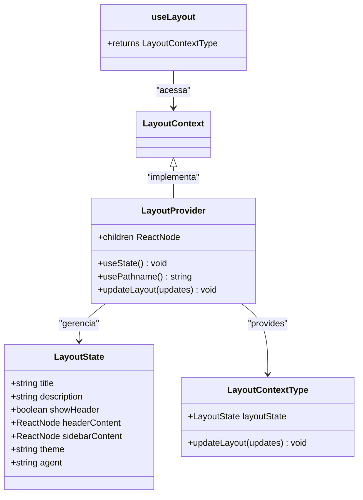
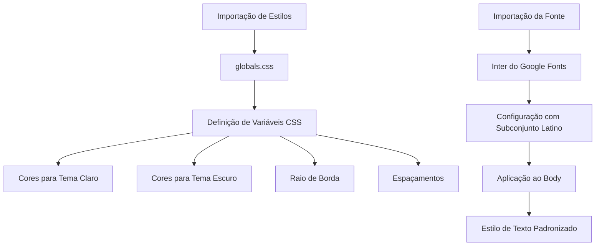
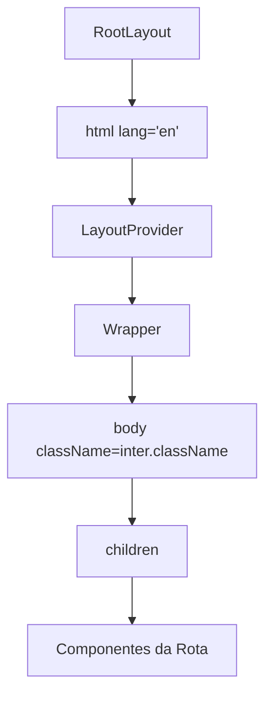
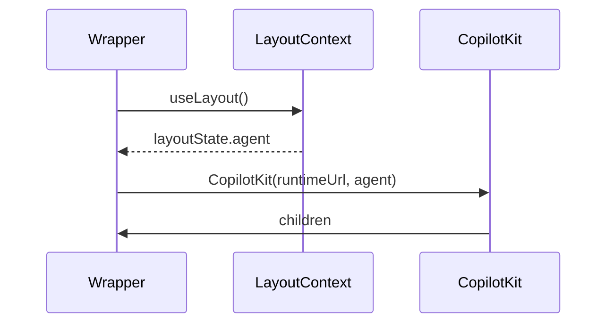
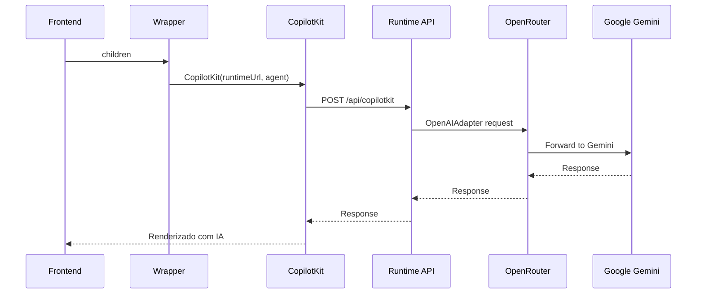

# Layout da Aplicação

<cite>
**Arquivos Referenciados neste Documento**   
- [app/layout.tsx](file://app/layout.tsx)
- [app/wrapper.tsx](file://app/wrapper.tsx)
- [app/contexts/LayoutContext.tsx](file://app/contexts/LayoutContext.tsx)
- [styles/globals.css](file://styles/globals.css)
- [app/api/copilotkit/route.ts](file://app/api/copilotkit/route.ts)
- [app/page.tsx](file://app/page.tsx)
</cite>

## Sumário
1. [Introdução](#introdução)
2. [Estrutura do Layout Raiz](#estrutura-do-layout-raiz)
3. [Provedores Globais e Contexto](#provedores-globais-e-contexto)
4. [Estilos e Tipografia](#estilos-e-tipografia)
5. [Metadados e SEO](#metadados-e-seo)
6. [Fluxo de Renderização](#fluxo-de-renderização)
7. [Diagrama de Arquitetura](#diagrama-de-arquitetura)
8. [Análise de Componentes](#análise-de-componentes)
9. [Integração com CopilotKit](#integração-com-copilotkit)
10. [Conclusão](#conclusão)

## Introdução

O arquivo `app/layout.tsx` serve como o layout raiz da aplicação, funcionando como um componente wrapper que envolve todos os outros componentes da interface. Este documento detalha sua estrutura, funcionalidade e papel central na arquitetura da aplicação, explicando como ele coordena provedores globais, estilos, metadados e integração com IA através do CopilotKit.

**Section sources**
- [app/layout.tsx](file://app/layout.tsx#L1-L34)

## Estrutura do Layout Raiz

O layout raiz é implementado como um componente React que define a estrutura HTML básica da aplicação, incluindo as tags `html` e `body`. Ele serve como ponto de entrada para todos os componentes da aplicação, garantindo que todos os elementos filhos sejam renderizados dentro de um contexto consistente e padronizado.

A estrutura hierárquica do layout estabelece uma ordem de renderização clara: o componente `html` envolve todo o conteúdo, seguido pelo `LayoutProvider` que gerencia o estado global, pelo componente `Wrapper` que envolve o conteúdo principal, e finalmente pelo `body` que contém os componentes filhos específicos da rota atual.

**Section sources**
- [app/layout.tsx](file://app/layout.tsx#L15-L34)

## Provedores Globais e Contexto

O layout raiz incorpora dois provedores essenciais que disponibilizam funcionalidades globais para toda a aplicação: o `LayoutProvider` e o `CopilotKit`. O `LayoutProvider`, definido em `LayoutContext.tsx`, cria um contexto React que permite o gerenciamento de estado global acessível em qualquer componente da aplicação.

Este estado global inclui informações como o título atual, descrição, conteúdo do cabeçalho, conteúdo da barra lateral, tema (claro/escuro) e o agente de IA ativo. O estado é dinamicamente ajustado com base na rota atual, permitindo que diferentes seções da aplicação tenham configurações contextuais específicas.



**Diagram sources**
- [app/contexts/LayoutContext.tsx](file://app/contexts/LayoutContext.tsx#L5-L53)

**Section sources**
- [app/contexts/LayoutContext.tsx](file://app/contexts/LayoutContext.tsx#L1-L53)
- [app/layout.tsx](file://app/layout.tsx#L8-L9)

## Estilos e Tipografia

O layout raiz importa e aplica estilos globais através do arquivo `globals.css`, que define variáveis CSS para cores, espaçamentos e outros estilos consistentes em toda a aplicação. A tipografia é padronizada utilizando a fonte `Inter` do Google Fonts, que é pré-carregada e aplicada ao corpo da página.

A fonte `Inter` é configurada com o subconjunto latino e aplicada como classe CSS ao elemento `body`, garantindo que todos os textos na aplicação usem esta fonte padronizada. Os estilos globais também incluem definições para temas claro e escuro, permitindo a alternância entre modos com base nas preferências do usuário.



**Diagram sources**
- [styles/globals.css](file://styles/globals.css#L1-L123)
- [app/layout.tsx](file://app/layout.tsx#L2-L3)

**Section sources**
- [styles/globals.css](file://styles/globals.css#L1-L123)
- [app/layout.tsx](file://app/layout.tsx#L2-L3)

## Metadados e SEO

O layout raiz define metadados globais para a aplicação utilizando o objeto `metadata` do Next.js. Estes metadados incluem informações essenciais para SEO (Search Engine Optimization) como o título da aplicação, descrição e gerador.

O título "Open Gemini Canvas" e a descrição "Powered by Google's most advanced AI models for generating LinkedIn and X posts" são definidos no nível raiz, garantindo que estas informações estejam disponíveis para motores de busca e ao compartilhar links nas redes sociais. O metadado de gerador identifica a ferramenta utilizada para criar a aplicação.

**Section sources**
- [app/layout.tsx](file://app/layout.tsx#L10-L14)

## Fluxo de Renderização

O fluxo de renderização começa com o componente raiz que envolve toda a aplicação em um elemento `html` com o atributo `lang="en"`. Em seguida, o `LayoutProvider` é aplicado para disponibilizar o contexto de layout, seguido pelo componente `Wrapper` que envolve o conteúdo principal.

O componente `Wrapper` é crucial na arquitetura, pois envolve os filhos com o `CopilotKit`, passando o URL do runtime e o agente de IA ativo como propriedades. Finalmente, o elemento `body` é renderizado com a classe da fonte `Inter`, contendo os componentes filhos específicos da rota atual.



**Diagram sources**
- [app/layout.tsx](file://app/layout.tsx#L15-L34)

**Section sources**
- [app/layout.tsx](file://app/layout.tsx#L15-L34)

## Diagrama de Arquitetura

O diagrama a seguir ilustra a arquitetura geral da aplicação, mostrando como o layout raiz coordena os diferentes componentes e provedores globais.

```mermaid
graph TB
subgraph "Frontend"
L[layout.tsx]
C[contexts/LayoutContext.tsx]
W[wrapper.tsx]
G[globals.css]
P[page.tsx]
end
subgraph "Backend"
A[api/copilotkit/route.ts]
end
L --> C : "usa"
L --> W : "envolve"
L --> G : "importa"
W --> A : "comunica"
P --> L : "é envolvido por"
C --> P : "fornece estado"
style L fill:#4CAF50,stroke:#388E3C
style C fill:#2196F3,stroke:#1976D2
style W fill:#FF9800,stroke:#F57C00
style G fill:#9C27B0,stroke:#7B1FA2
style A fill:#F44336,stroke:#D32F2F
```

**Diagram sources**
- [app/layout.tsx](file://app/layout.tsx#L1-L34)
- [app/contexts/LayoutContext.tsx](file://app/contexts/LayoutContext.tsx#L1-L53)
- [app/wrapper.tsx](file://app/wrapper.tsx#L1-L11)
- [styles/globals.css](file://styles/globals.css#L1-L123)
- [app/api/copilotkit/route.ts](file://app/api/copilotkit/route.ts#L1-L30)

## Análise de Componentes

### Componente Wrapper

O componente `Wrapper` é um componente cliente que envolve seus filhos com o `CopilotKit`, passando o URL do runtime e o agente de IA ativo como propriedades. Ele utiliza o hook `useLayout` para acessar o estado atual do agente, permitindo que a integração com IA seja dinâmica e baseada na rota atual.



**Diagram sources**
- [app/wrapper.tsx](file://app/wrapper.tsx#L1-L11)

**Section sources**
- [app/wrapper.tsx](file://app/wrapper.tsx#L1-L11)

## Integração com CopilotKit

A integração com o CopilotKit é fundamental para as funcionalidades de IA da aplicação. O `CopilotKit` é configurado no componente `Wrapper` com o URL do runtime `/api/copilotkit` e o agente de IA ativo, que é determinado dinamicamente com base na rota atual.

O endpoint do runtime, definido em `api/copilotkit/route.ts`, configura o adaptador OpenAI para se comunicar com o OpenRouter, que por sua vez acessa modelos de IA avançados como o Google Gemini. Esta arquitetura permite que a aplicação utilize modelos de IA poderosos para gerar conteúdo, analisar stacks tecnológicos e fornecer assistência inteligente.



**Diagram sources**
- [app/wrapper.tsx](file://app/wrapper.tsx#L1-L11)
- [app/api/copilotkit/route.ts](file://app/api/copilotkit/route.ts#L1-L30)

**Section sources**
- [app/wrapper.tsx](file://app/wrapper.tsx#L1-L11)
- [app/api/copilotkit/route.ts](file://app/api/copilotkit/route.ts#L1-L30)

## Conclusão

O arquivo `app/layout.tsx` desempenha um papel fundamental como o componente estrutural central da aplicação, coordenando a renderização, o estado global, os estilos e a integração com IA. Sua arquitetura bem projetada permite que diferentes partes da aplicação compartilhem estado, estilos e funcionalidades de IA de maneira consistente e eficiente.

Ao combinar o `LayoutProvider` para gerenciamento de estado, o `Wrapper` para integração com IA, estilos globais padronizados e metadados para SEO, este layout raiz estabelece uma base sólida para uma aplicação web moderna e funcional. A separação clara de responsabilidades entre os componentes contribui para uma arquitetura modular, escalável e fácil de manter.