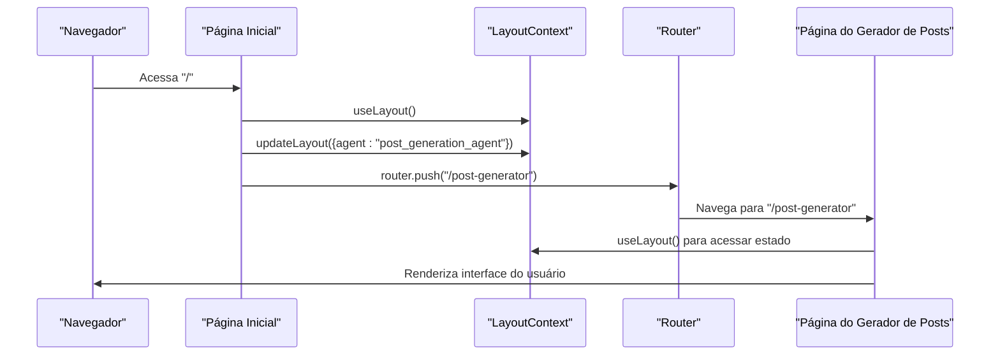
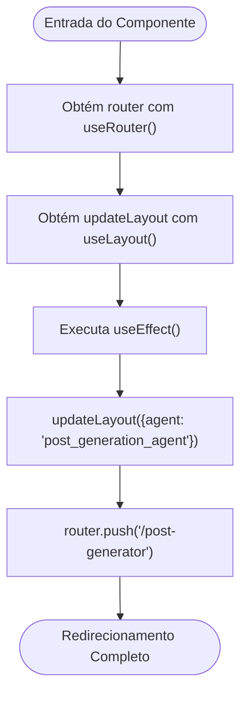
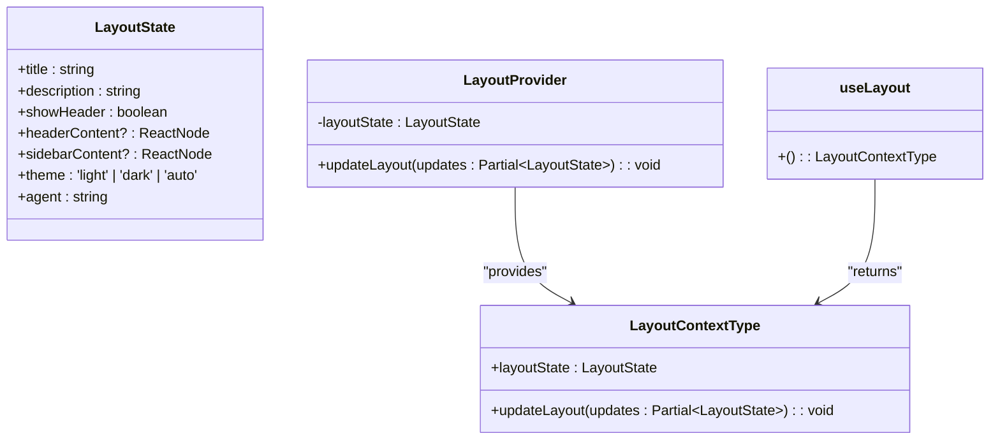
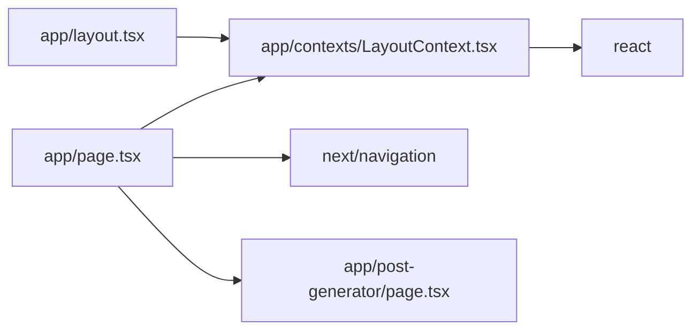

# Página Inicial

<cite>
**Arquivos Referenciados neste Documento**   
- [app/page.tsx](file://app/page.tsx)
- [app/contexts/LayoutContext.tsx](file://app/contexts/LayoutContext.tsx)
- [app/post-generator/page.tsx](file://app/post-generator/page.tsx)
- [app/layout.tsx](file://app/layout.tsx)
</cite>

## Sumário
1. [Introdução](#introdução)
2. [Estrutura do Projeto](#estrutura-do-projeto)
3. [Componentes Principais](#componentes-principais)
4. [Visão Geral da Arquitetura](#visão-geral-da-arquitetura)
5. [Análise Detalhada dos Componentes](#análise-detalhada-dos-componentes)
6. [Análise de Dependências](#análise-de-dependências)
7. [Considerações de Desempenho](#considerações-de-desempenho)
8. [Guia de Solução de Problemas](#guia-de-solução-de-problemas)
9. [Conclusão](#conclusão)

## Introdução

A página inicial localizada em `app/page.tsx` desempenha um papel fundamental como ponto de entrada programático na aplicação Open Gemini Canvas. Diferentemente de páginas tradicionais com interfaces visuais, esta página opera como um redirecionador automático que configura o estado inicial da aplicação e imediatamente navega para a interface principal do gerador de posts. Este documento detalha o funcionamento interno dessa página, seu papel no fluxo geral da aplicação e os padrões de design utilizados para garantir uma experiência de usuário fluida e uma configuração de contexto apropriada desde o início.

## Estrutura do Projeto

A aplicação segue uma estrutura baseada em Next.js com organização por funcionalidades. A página inicial reside no diretório raiz `app/` e serve como o ponto de entrada padrão da aplicação. O projeto organiza seus componentes principais em diretórios como `post-generator`, `stack-analyzer` e `contexts`, refletindo uma separação clara de responsabilidades. O contexto de layout, essencial para o funcionamento da página inicial, é definido em `app/contexts/LayoutContext.tsx` e é fornecido globalmente através do `app/layout.tsx`.

```mermaid
graph TB
subgraph "App Root"
Page[app/page.tsx]
Layout[app/layout.tsx]
end
subgraph "Contexts"
LayoutContext[app/contexts/LayoutContext.tsx]
end
subgraph "Features"
PostGenerator[app/post-generator/page.tsx]
StackAnalyzer[app/stack-analyzer/page.tsx]
end
Page --> LayoutContext : "usa useLayout"
Page --> PostGenerator : "redireciona para"
Layout --> LayoutContext : "envolve com LayoutProvider"
```

**Diagram sources**
- [app/page.tsx](file://app/page.tsx)
- [app/layout.tsx](file://app/layout.tsx)
- [app/contexts/LayoutContext.tsx](file://app/contexts/LayoutContext.tsx)
- [app/post-generator/page.tsx](file://app/post-generator/page.tsx)

**Section sources**
- [app/page.tsx](file://app/page.tsx)
- [app/layout.tsx](file://app/layout.tsx)

## Componentes Principais

O componente principal analisado é a página inicial `GoogleDeepMindChatUI` definida em `app/page.tsx`, que atua como um redirecionador programático sem interface do usuário. Este componente depende criticamente do `useLayout` hook fornecido pelo `LayoutContext` para configurar o estado inicial da aplicação e do `useRouter` do Next.js para executar a navegação. O `LayoutContext` gerencia o estado global da aplicação, incluindo qual agente está ativo, enquanto o `post-generator/page.tsx` representa o destino do redirecionamento, onde a interface principal do gerador de posts é renderizada.

**Section sources**
- [app/page.tsx](file://app/page.tsx#L1-L18)
- [app/contexts/LayoutContext.tsx](file://app/contexts/LayoutContext.tsx#L1-L53)
- [app/post-generator/page.tsx](file://app/post-generator/page.tsx#L1-L410)

## Visão Geral da Arquitetura

A arquitetura da aplicação é baseada em um padrão de provedor de contexto combinado com navegação programática. O `LayoutProvider` envolve toda a aplicação no `layout.tsx`, tornando o estado de layout disponível globalmente. Quando a aplicação é acessada pela raiz, a página inicial imediatamente configura o contexto para o agente de geração de posts e redireciona para a rota apropriada. Este padrão permite que a aplicação mantenha um estado consistente entre navegações e forneça uma experiência de usuário contínua.



**Diagram sources**
- [app/page.tsx](file://app/page.tsx#L1-L18)
- [app/contexts/LayoutContext.tsx](file://app/contexts/LayoutContext.tsx#L1-L53)
- [app/post-generator/page.tsx](file://app/post-generator/page.tsx#L1-L410)

## Análise Detalhada dos Componentes

### Análise da Página Inicial

A página inicial implementa um padrão de redirecionamento programático que é executado apenas no lado do cliente, garantindo que a navegação ocorra após a montagem inicial do componente. Este padrão é essencial para aplicações que precisam configurar estado global antes de renderizar a interface principal.

#### Padrão de Redirecionamento com useEffect



**Diagram sources**
- [app/page.tsx](file://app/page.tsx#L1-L18)

**Section sources**
- [app/page.tsx](file://app/page.tsx#L1-L18)

### Análise do Contexto de Layout

O `LayoutContext` fornece um mecanismo centralizado para gerenciar o estado da interface da aplicação, incluindo qual agente está ativo. Este contexto é essencial para a funcionalidade da página inicial, pois permite que ela configure o estado antes do redirecionamento.

#### Estrutura do LayoutContext



**Diagram sources**
- [app/contexts/LayoutContext.tsx](file://app/contexts/LayoutContext.tsx#L1-L53)

**Section sources**
- [app/contexts/LayoutContext.tsx](file://app/contexts/LayoutContext.tsx#L1-L53)

## Análise de Dependências

A página inicial depende de vários componentes críticos para seu funcionamento. A dependência mais importante é do `LayoutContext`, que fornece o hook `useLayout` necessário para atualizar o estado global da aplicação. Além disso, a página depende do sistema de roteamento do Next.js através do `useRouter` para executar a navegação programática. O `layout.tsx` fornece o `LayoutProvider` que torna o contexto disponível, criando uma cadeia de dependências essencial para o funcionamento correto da aplicação.



**Diagram sources**
- [app/page.tsx](file://app/page.tsx)
- [app/contexts/LayoutContext.tsx](file://app/contexts/LayoutContext.tsx)
- [app/layout.tsx](file://app/layout.tsx)
- [app/post-generator/page.tsx](file://app/post-generator/page.tsx)

**Section sources**
- [app/page.tsx](file://app/page.tsx)
- [app/contexts/LayoutContext.tsx](file://app/contexts/LayoutContext.tsx)
- [app/layout.tsx](file://app/layout.tsx)

## Considerações de Desempenho

O padrão implementado na página inicial é altamente eficiente em termos de desempenho, pois evita renderizações desnecessárias de interfaces do usuário. Ao redirecionar imediatamente após a configuração do estado, a aplicação minimiza o tempo de espera do usuário e garante que o estado esteja corretamente configurado antes da renderização da interface principal. O uso de `useEffect` garante que a navegação ocorra apenas no cliente, evitando problemas de renderização no servidor que poderiam afetar o desempenho e a experiência do usuário.

## Guia de Solução de Problemas

Problemas comuns relacionados à página inicial geralmente envolvem falhas no redirecionamento ou no estado do layout não sendo corretamente configurado. Para diagnosticar esses problemas, verifique se o `LayoutProvider` está corretamente envolvendo a árvore de componentes no `layout.tsx` e se o `useLayout` está sendo chamado dentro do provedor. Além disso, certifique-se de que o `useRouter` está sendo usado corretamente e que a rota de destino existe e está funcionando corretamente.

**Section sources**
- [app/page.tsx](file://app/page.tsx#L1-L18)
- [app/layout.tsx](file://app/layout.tsx#L1-L33)
- [app/contexts/LayoutContext.tsx](file://app/contexts/LayoutContext.tsx#L1-L53)

## Conclusão

A página inicial em `app/page.tsx` exemplifica um padrão eficaz de redirecionamento programático em aplicações React com Next.js. Ao combinar o gerenciamento de estado global através do contexto com navegação programática, a aplicação consegue fornecer uma experiência de usuário fluida e garantir que o estado esteja corretamente configurado desde o início. Este padrão é particularmente útil em aplicações com múltiplos agentes ou modos, onde a configuração inicial do contexto é essencial para o funcionamento correto da interface do usuário. A ausência de UI nesta página não é uma limitação, mas sim uma característica intencional que reflete seu papel exclusivo como ponto de entrada programático no fluxo da aplicação.