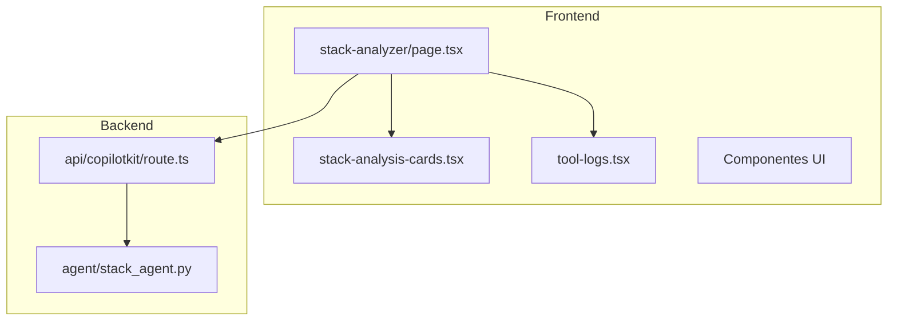
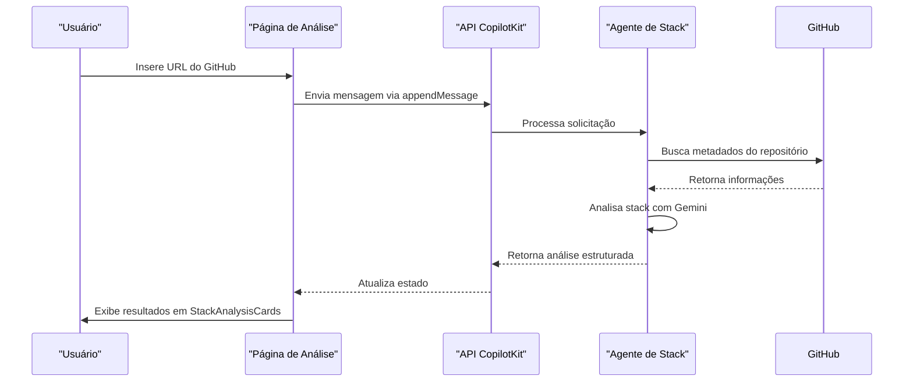
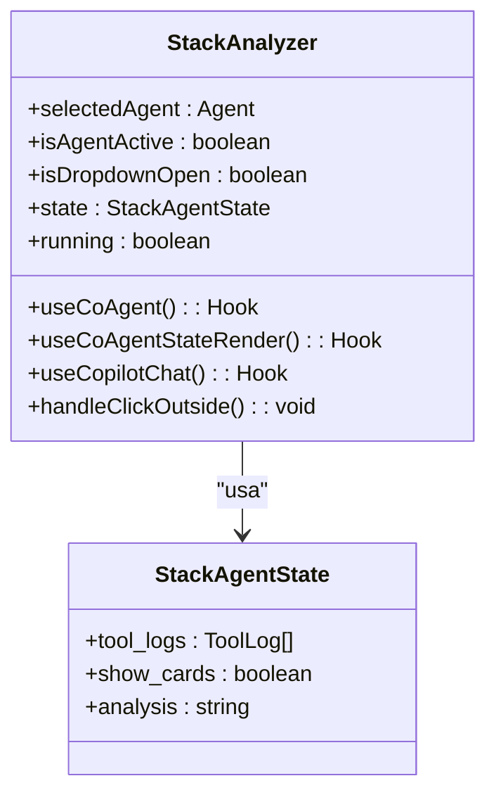
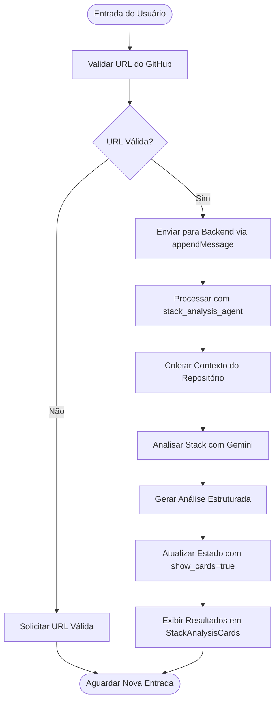
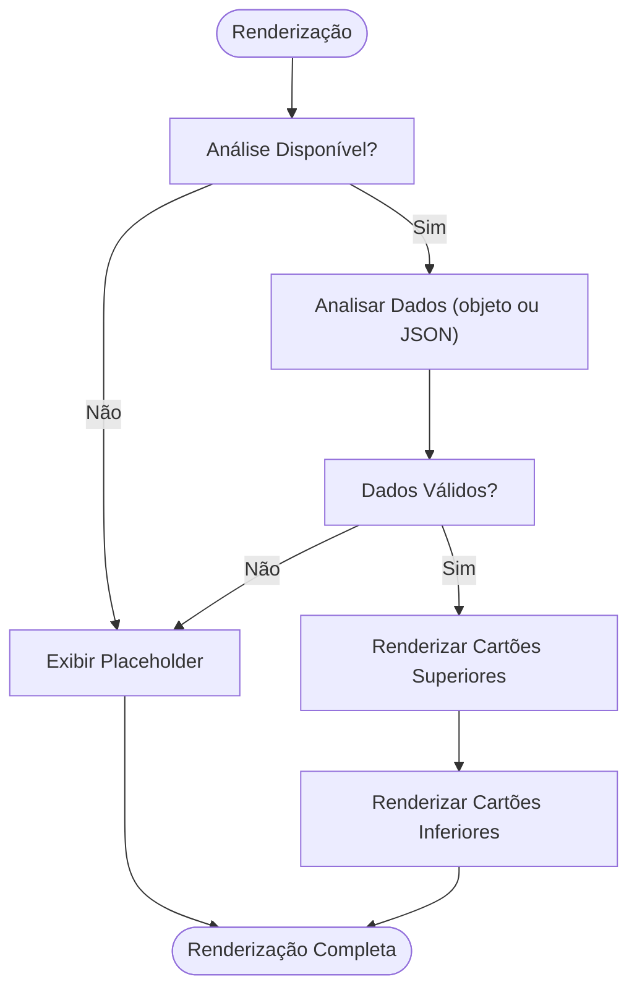
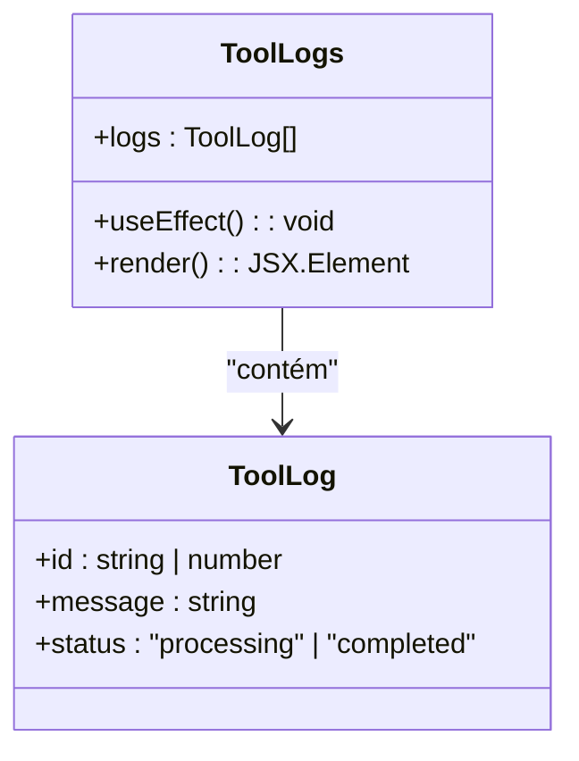
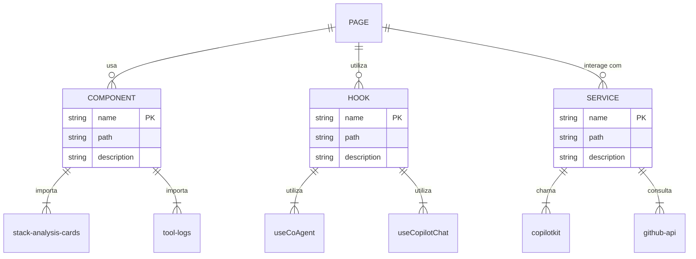

# Página de Análise de Stack

<cite>
**Arquivos Referenciados neste Documento**   
- [app/stack-analyzer/page.tsx](file://app/stack-analyzer/page.tsx)
- [components/ui/stack-analysis-cards.tsx](file://components/ui/stack-analysis-cards.tsx)
- [components/ui/tool-logs.tsx](file://components/ui/tool-logs.tsx)
- [app/api/copilotkit/route.ts](file://app/api/copilotkit/route.ts)
- [agent/stack_agent.py](file://agent/stack_agent.py)
</cite>

## Sumário
1. [Introdução](#introdução)
2. [Estrutura do Projeto](#estrutura-do-projeto)
3. [Componentes Principais](#componentes-principais)
4. [Visão Geral da Arquitetura](#visão-geral-da-arquitetura)
5. [Análise Detalhada dos Componentes](#análise-detalhada-dos-componentes)
6. [Análise de Dependências](#análise-de-dependências)
7. [Considerações de Desempenho](#considerações-de-desempenho)
8. [Guia de Solução de Problemas](#guia-de-solução-de-problemas)
9. [Conclusão](#conclusão)

## Introdução

A página de análise de stack é uma interface web interativa que permite aos usuários analisar repositórios do GitHub e obter insights detalhados sobre suas tecnologias, estrutura e configurações. Implementada como uma aplicação React com Next.js, a página utiliza agentes de IA para processar informações do repositório e apresentar uma análise estruturada ao usuário. O sistema é projetado para ser intuitivo, com funcionalidades como ações rápidas, visualização de logs de ferramentas e navegação entre diferentes agentes.

## Estrutura do Projeto

A página de análise de stack está localizada no caminho `app/stack-analyzer/page.tsx` e faz parte de uma aplicação modular que separa claramente componentes, agentes e rotas de API. A estrutura do projeto segue uma organização baseada em funcionalidades, com diretórios específicos para agentes, componentes de interface, contextos e rotas de API.

**Diagram sources**
- [app/stack-analyzer/page.tsx](file://app/stack-analyzer/page.tsx)
- [app/api/copilotkit/route.ts](file://app/api/copilotkit/route.ts)
- [agent/stack_agent.py](file://agent/stack_agent.py)

**Section sources**
- [app/stack-analyzer/page.tsx](file://app/stack-analyzer/page.tsx)

## Componentes Principais

Os componentes principais da página de análise de stack incluem o componente principal da página, os cartões de análise de stack e o componente de logs de ferramentas. Esses componentes trabalham em conjunto para fornecer uma experiência de usuário completa, desde a entrada de dados até a apresentação dos resultados da análise.

**Section sources**
- [app/stack-analyzer/page.tsx](file://app/stack-analyzer/page.tsx)
- [components/ui/stack-analysis-cards.tsx](file://components/ui/stack-analysis-cards.tsx)
- [components/ui/tool-logs.tsx](file://components/ui/tool-logs.tsx)

## Visão Geral da Arquitetura

A arquitetura da página de análise de stack é baseada em um padrão de agente cooperativo, onde o frontend interage com um backend de IA através de uma API. O fluxo de dados começa com a entrada do usuário, que é processada pelo agente de análise de stack, e termina com a apresentação dos resultados estruturados na interface.

**Diagram sources**
- [app/stack-analyzer/page.tsx](file://app/stack-analyzer/page.tsx)
- [agent/stack_agent.py](file://agent/stack_agent.py)
- [app/api/copilotkit/route.ts](file://app/api/copilotkit/route.ts)

## Análise Detalhada dos Componentes

### Análise da Página Principal

A página principal de análise de stack utiliza o hook `useCoAgent` para gerenciar o estado do agente `stack_analysis_agent`. O estado inicial inclui propriedades como `tool_logs`, `show_cards` e `analysis`, que são atualizadas dinamicamente durante o processo de análise.

#### Gerenciamento de Estado com useCoAgent

**Diagram sources**
- [app/stack-analyzer/page.tsx](file://app/stack-analyzer/page.tsx#L50-L150)

**Section sources**
- [app/stack-analyzer/page.tsx](file://app/stack-analyzer/page.tsx#L50-L200)

#### Fluxo de Entrada do Usuário

O fluxo de entrada do usuário começa quando uma URL do GitHub é enviada através da função `appendMessage`. Esta mensagem é processada pelo backend, que utiliza o agente de análise de stack para extrair e analisar informações do repositório. O resultado é uma análise estruturada que é exibida ao usuário.

**Diagram sources**
- [app/stack-analyzer/page.tsx](file://app/stack-analyzer/page.tsx#L200-L300)
- [agent/stack_agent.py](file://agent/stack_agent.py#L100-L300)

**Section sources**
- [app/stack-analyzer/page.tsx](file://app/stack-analyzer/page.tsx#L200-L300)

### Análise do Componente StackAnalysisCards

O componente `StackAnalysisCards` é responsável por renderizar a análise estruturada do repositório do GitHub. Ele aceita tanto um objeto de análise quanto uma string JSON, permitindo flexibilidade na forma como os dados são fornecidos.

#### Lógica de Renderização

**Diagram sources**
- [components/ui/stack-analysis-cards.tsx](file://components/ui/stack-analysis-cards.tsx#L50-L150)

**Section sources**
- [components/ui/stack-analysis-cards.tsx](file://components/ui/stack-analysis-cards.tsx#L1-L200)

### Integração com ToolLogs

O componente `ToolLogs` é integrado à página principal para exibir o progresso do agente de análise. Ele mostra logs de ferramentas com status de processamento e conclusão, fornecendo feedback visual ao usuário sobre o andamento da análise.

**Diagram sources**
- [components/ui/tool-logs.tsx](file://components/ui/tool-logs.tsx#L10-L30)

**Section sources**
- [components/ui/tool-logs.tsx](file://components/ui/tool-logs.tsx#L1-L50)

## Análise de Dependências

A página de análise de stack depende de vários componentes e serviços externos para funcionar corretamente. Essas dependências incluem bibliotecas de interface do usuário, serviços de IA e APIs externas.

**Diagram sources**
- [app/stack-analyzer/page.tsx](file://app/stack-analyzer/page.tsx)
- [components/ui/stack-analysis-cards.tsx](file://components/ui/stack-analysis-cards.tsx)
- [components/ui/tool-logs.tsx](file://components/ui/tool-logs.tsx)

**Section sources**
- [app/stack-analyzer/page.tsx](file://app/stack-analyzer/page.tsx#L1-L50)

## Considerações de Desempenho

A página de análise de stack foi projetada com considerações de desempenho em mente, especialmente em relação ao processamento de grandes repositórios do GitHub. O sistema utiliza técnicas como truncamento de conteúdo e cache de resultados para garantir tempos de resposta rápidos.

### Estratégias de Otimização

- **Truncamento de Conteúdo**: O conteúdo do README e dos manifestos é truncado para os primeiros 8000 e 2000 caracteres, respectivamente, para evitar sobrecarga de processamento.
- **Cache de Resultados**: Embora não implementado explicitamente no código atual, o sistema poderia se beneficiar da implementação de cache para evitar análises repetidas do mesmo repositório.
- **Processamento Assíncrono**: O uso de funções assíncronas permite que a interface permaneça responsiva durante o processamento da análise.

## Guia de Solução de Problemas

### Problemas Comuns e Soluções

**Section sources**
- [app/stack-analyzer/page.tsx](file://app/stack-analyzer/page.tsx#L100-L150)
- [agent/stack_agent.py](file://agent/stack_agent.py#L200-L250)

#### URL do GitHub Inválida

Se o usuário inserir uma URL do GitHub inválida, o sistema não será capaz de extrair informações do repositório. A solução é garantir que a URL esteja no formato correto (https://github.com/owner/repo).

#### Falha na Análise de Stack

Em casos onde a análise de stack falha, verifique se as chaves de API necessárias estão configuradas corretamente no ambiente. O agente depende de chaves de API para acessar o GitHub e o serviço de IA.

#### Interface Não Atualiza

Se a interface não atualizar após a análise, verifique se o estado `show_cards` está sendo definido corretamente como `true` no backend. Isso pode indicar um problema na comunicação entre o frontend e o backend.

## Conclusão

A página de análise de stack é um exemplo sofisticado de integração entre frontend React e backend de IA, demonstrando como tecnologias modernas podem ser combinadas para criar ferramentas poderosas de análise de código. O uso de agentes cooperativos permite uma arquitetura flexível e escalável, onde diferentes agentes podem ser adicionados ou modificados sem afetar o sistema como um todo. A documentação detalhada dos componentes, fluxos de dados e dependências fornece uma base sólida para futuras melhorias e manutenção do sistema.