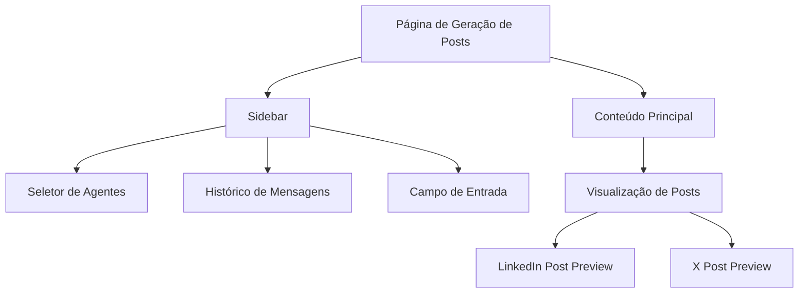
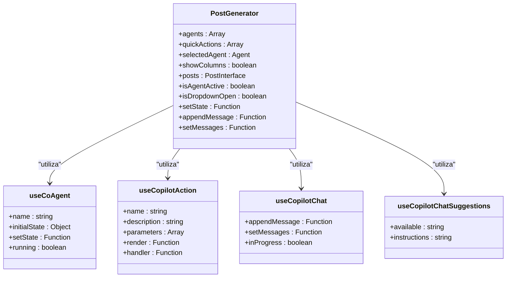
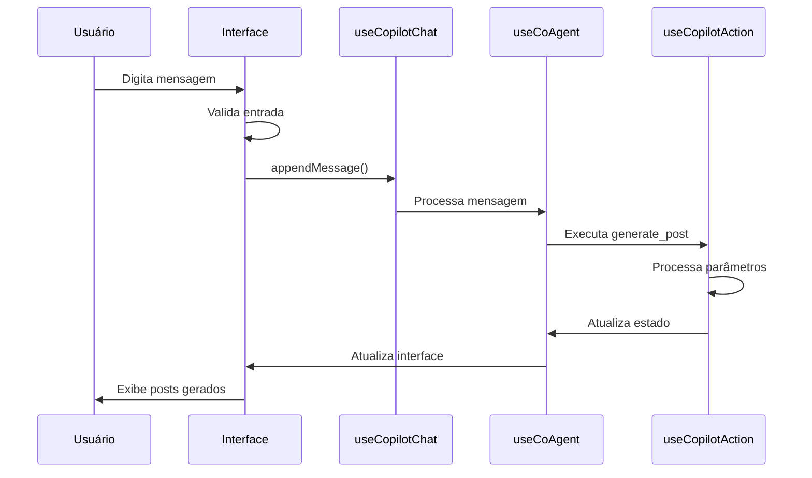
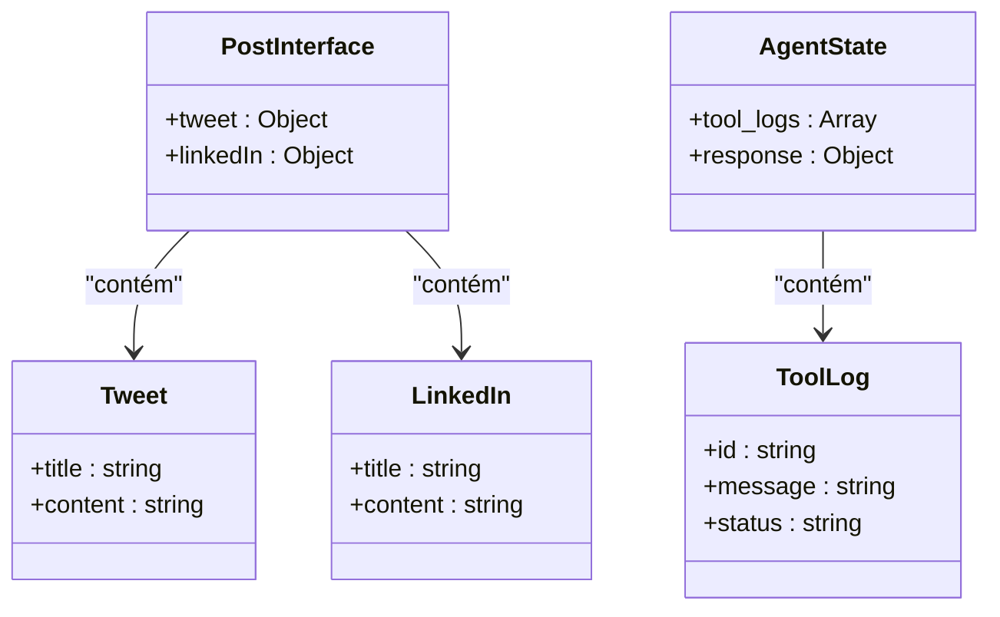
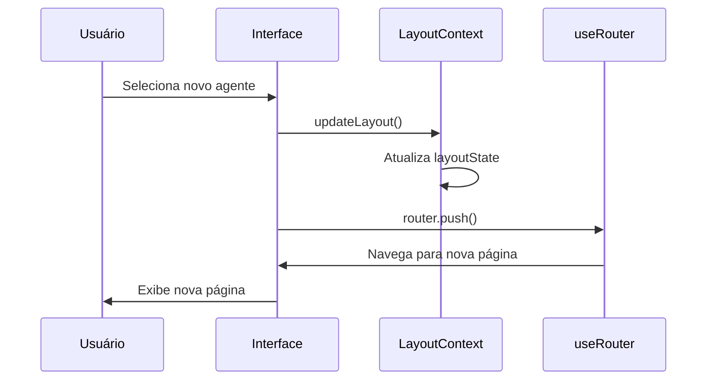

# Página de Geração de Posts

<cite>
**Arquivos Referenciados neste Documento**   
- [post-generator/page.tsx](file://app/post-generator/page.tsx)
- [posts_generator_agent.py](file://agent/posts_generator_agent.py)
- [LayoutContext.tsx](file://app/contexts/LayoutContext.tsx)
- [x-post.tsx](file://components/ui/x-post.tsx)
- [linkedin-post.tsx](file://components/ui/linkedin-post.tsx)
- [prompts.ts](file://app/prompts/prompts.ts)
- [route.ts](file://app/api/copilotkit/route.ts)
- [route.ts](file://app/api/chat/route.ts)
</cite>

## Sumário
1. [Introdução](#introdução)
2. [Estrutura da Página](#estrutura-da-página)
3. [Componentes Principais](#componentes-principais)
4. [Fluxo de Dados e Integração com CopilotKit](#fluxo-de-dados-e-integração-com-copilotkit)
5. [Interface e Estado](#interface-e-estado)
6. [Exibição de Resultados](#exibição-de-resultados)
7. [Navegação entre Agentes](#navegação-entre-agentes)
8. [Conclusão](#conclusão)

## Introdução

A página de geração de posts localizada em `/post-generator/page.tsx` é uma aplicação React Server Component que renderiza um Client Component interativo, permitindo aos usuários gerar conteúdo para LinkedIn e X (Twitter) utilizando inteligência artificial avançada. A página integra-se com o CopilotKit para fornecer funcionalidades de IA, como ações de copiloto, agentes de conversação e sugestões de chat. O sistema combina modelos de linguagem avançados com pesquisa na web para criar posts informativos e engajantes.

**Seção fontes**
- [post-generator/page.tsx](file://app/post-generator/page.tsx)

## Estrutura da Página

A página de geração de posts é estruturada em dois painéis principais: um sidebar à esquerda e um conteúdo principal à direita. O sidebar contém o seletor de agentes, o histórico de mensagens e o campo de entrada, enquanto o painel principal exibe os posts gerados em formato de visualização.

A página utiliza um layout responsivo com gradientes de cores e efeitos de transparência para criar uma experiência visual moderna. O design inclui um cabeçalho com o logotipo do Open Gemini Canvas e um seletor de agentes que permite alternar entre diferentes funcionalidades do sistema.

**Fontes do Diagrama**
- [post-generator/page.tsx](file://app/post-generator/page.tsx)

**Seção fontes**
- [post-generator/page.tsx](file://app/post-generator/page.tsx)

## Componentes Principais

A página de geração de posts utiliza vários componentes principais para fornecer sua funcionalidade:

- **useCoAgent**: Gerencia o estado do agente de geração de posts, incluindo logs de ferramentas
- **useCopilotAction**: Define ações de IA que podem ser executadas pelo agente
- **useCopilotChat**: Gerencia a conversa com o usuário e a interface de chat
- **useCopilotChatSuggestions**: Fornece sugestões de chat para o usuário

A página também utiliza componentes de interface do usuário como `XPostCompact`, `LinkedInPostCompact`, `ToolLogs` e `ScrollArea` para exibir informações e interações.

**Fontes do Diagrama**
- [post-generator/page.tsx](file://app/post-generator/page.tsx)

**Seção fontes**
- [post-generator/page.tsx](file://app/post-generator/page.tsx)

## Fluxo de Dados e Integração com CopilotKit

O fluxo de dados na página de geração de posts começa com a entrada do usuário no campo de texto. Quando o usuário envia uma mensagem, ela é adicionada ao histórico de mensagens através da função `appendMessage` do hook `useCopilotChat`.

O agente de geração de posts, definido pelo hook `useCoAgent`, processa a entrada do usuário e executa a ação `generate_post`. Esta ação é definida pelo hook `useCopilotAction` e é responsável por gerar os posts para LinkedIn e X.

O estado do agente é gerido através do objeto `tool_logs`, que armazena informações sobre as ferramentas utilizadas durante o processo de geração de posts. O estado `running` indica se o agente está atualmente processando uma solicitação.

**Fontes do Diagrama**
- [post-generator/page.tsx](file://app/post-generator/page.tsx)
- [posts_generator_agent.py](file://agent/posts_generator_agent.py)

**Seção fontes**
- [post-generator/page.tsx](file://app/post-generator/page.tsx)
- [posts_generator_agent.py](file://agent/posts_generator_agent.py)

## Interface e Estado

A interface da página de geração de posts é definida pela interface `PostInterface`, que especifica a estrutura dos posts gerados para LinkedIn e X. A interface inclui campos para título e conteúdo de cada tipo de post.

O estado da página é gerido através de vários hooks do React, incluindo `useState` para o estado local e `useCoAgent` para o estado do agente. O estado do agente inclui os logs de ferramentas (`tool_logs`) que são utilizados para exibir o progresso das operações.

**Fontes do Diagrama**
- [post-generator/page.tsx](file://app/post-generator/page.tsx)
- [posts_generator_agent.py](file://agent/posts_generator_agent.py)

**Seção fontes**
- [post-generator/page.tsx](file://app/post-generator/page.tsx)
- [posts_generator_agent.py](file://agent/posts_generator_agent.py)

## Exibição de Resultados

Os resultados da geração de posts são exibidos utilizando os componentes `XPostCompact` e `LinkedInPostCompact`. Esses componentes são renderizados pela função `render` da ação `generate_post` definida pelo hook `useCopilotAction`.

Quando o agente gera um post, a função `handler` da ação `generate_post` é chamada para atualizar o estado da página com os posts gerados. O estado `showColumns` é então definido como verdadeiro, fazendo com que os posts sejam exibidos no painel principal.

As sugestões de chat são configuradas utilizando o hook `useCopilotChatSuggestions`, que fornece instruções para gerar sugestões relevantes para a criação de posts. As sugestões são baseadas no prompt definido em `suggestionPrompt`.

**Seção fontes**
- [post-generator/page.tsx](file://app/post-generator/page.tsx)
- [x-post.tsx](file://components/ui/x-post.tsx)
- [linkedin-post.tsx](file://components/ui/linkedin-post.tsx)
- [prompts.ts](file://app/prompts/prompts.ts)

## Navegação entre Agentes

A página de geração de posts permite a navegação entre diferentes agentes através do seletor de agentes no sidebar. O estado global da aplicação é gerido pelo `LayoutContext`, que permite a comunicação entre diferentes partes da aplicação.

Quando o usuário seleciona um agente diferente, a função `updateLayout` é chamada para atualizar o estado global com o novo agente selecionado. O roteador é então utilizado para navegar para a página correspondente ao agente selecionado.

O `LayoutContext` é fornecido pelo componente `LayoutProvider` e pode ser acessado em qualquer parte da aplicação através do hook `useLayout`. Isso permite que diferentes páginas atualizem o estado global de forma consistente.

**Fontes do Diagrama**
- [post-generator/page.tsx](file://app/post-generator/page.tsx)
- [LayoutContext.tsx](file://app/contexts/LayoutContext.tsx)

**Seção fontes**
- [post-generator/page.tsx](file://app/post-generator/page.tsx)
- [LayoutContext.tsx](file://app/contexts/LayoutContext.tsx)

## Conclusão

A página de geração de posts é um exemplo sofisticado de integração entre React, CopilotKit e inteligência artificial para criar conteúdo social automatizado. A arquitetura modular permite a extensibilidade e a manutenção fácil, enquanto a integração com o CopilotKit fornece uma experiência de usuário rica e interativa.

O sistema combina a geração de conteúdo com pesquisa na web para criar posts informativos e relevantes, demonstrando o potencial da IA na automação de tarefas criativas. A separação clara entre componentes e a gestão eficiente de estado tornam a aplicação robusta e escalável.