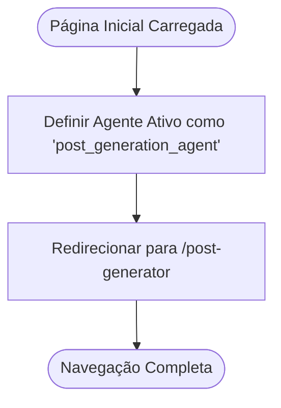
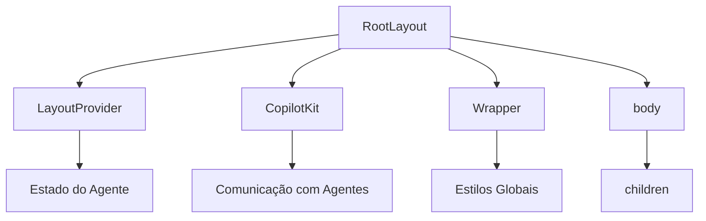
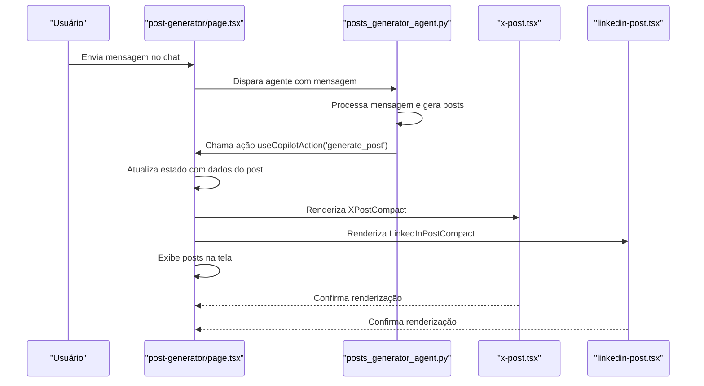
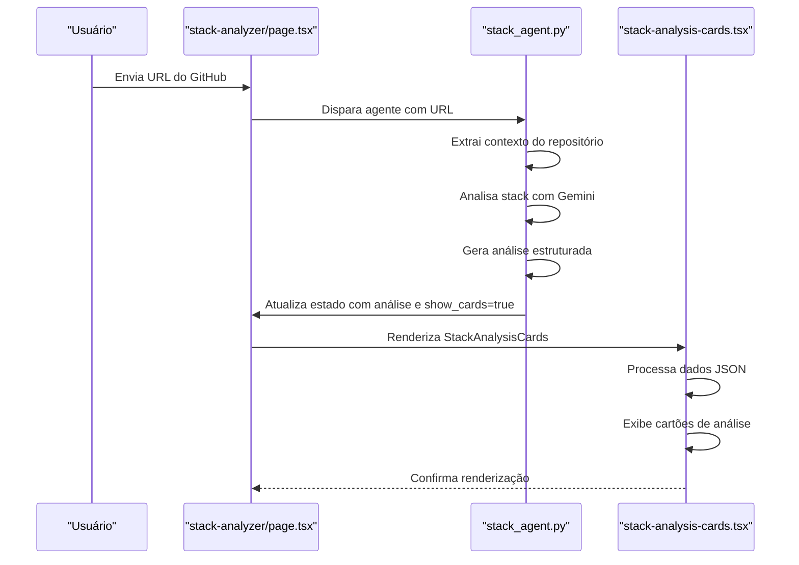
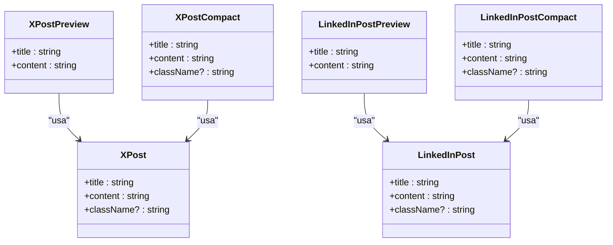
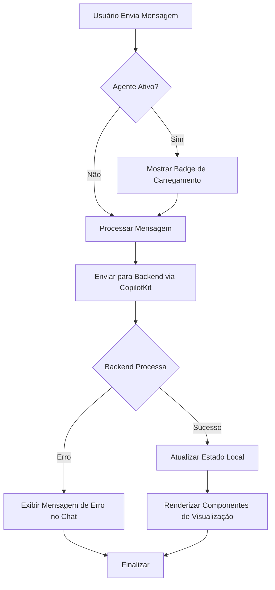

# Páginas Principais do Frontend

<cite>
**Arquivos Referenciados neste Documento**   
- [post-generator/page.tsx](file://app/post-generator/page.tsx)
- [stack-analyzer/page.tsx](file://app/stack-analyzer/page.tsx)
- [page.tsx](file://app/page.tsx)
- [layout.tsx](file://app/layout.tsx)
- [x-post.tsx](file://components/ui/x-post.tsx)
- [linkedin-post.tsx](file://components/ui/linkedin-post.tsx)
- [stack-analysis-cards.tsx](file://components/ui/stack-analysis-cards.tsx)
- [prompts/prompts.ts](file://app/prompts/prompts.ts)
- [agent/posts_generator_agent.py](file://agent/posts_generator_agent.py)
- [agent/stack_agent.py](file://agent/stack_agent.py)
</cite>

## Sumário
1. [Introdução](#introdução)
2. [Estrutura do Projeto](#estrutura-do-projeto)
3. [Página Inicial (`page.tsx`)](#página-inicial-pagetsx)
4. [Layout Compartilhado (`layout.tsx`)](#layout-compartilhado-layouttsx)
5. [Página do Gerador de Posts (`/post-generator`)](#página-do-gerador-de-posts-post-generator)
6. [Página do Analisador de Stack (`/stack-analyzer`)](#página-do-analisador-de-stack-stack-analyzer)
7. [Componentes de Visualização de Posts](#componentes-de-visualização-de-posts)
8. [Fluxo de Dados e Tratamento de Estado](#fluxo-de-dados-e-tratamento-de-estado)
9. [Conclusão](#conclusão)

## Introdução

Este documento fornece uma análise detalhada das páginas principais do frontend do projeto Open Gemini Canvas. O sistema é construído com React Server Components no framework Next.js e utiliza o CopilotKit para integração com agentes de IA baseados em LangGraph. As páginas principais analisadas são `/post-generator`, `/stack-analyzer`, a página inicial (`page.tsx`) e `layout.tsx`. O foco está na estrutura de componentes, lógica de renderização, interação entre Client Components e backend, e o fluxo de dados entre os componentes.

**Seção fontes**
- [post-generator/page.tsx](file://app/post-generator/page.tsx)
- [stack-analyzer/page.tsx](file://app/stack-analyzer/page.tsx)

## Estrutura do Projeto

O projeto segue uma estrutura típica do Next.js App Router, com o diretório `app` contendo as rotas principais. A página `/post-generator` é responsável por gerar posts para LinkedIn e X (Twitter), enquanto `/stack-analyzer` analisa repositórios do GitHub. Ambas as páginas utilizam o CopilotKit para comunicação com agentes de IA. O diretório `components/ui` contém componentes reutilizáveis para exibição de posts e análise de stack. O diretório `agent` contém os agentes de backend em Python que processam as solicitações.

```mermaid
graph TB
subgraph "Frontend"
A[page.tsx] --> B[layout.tsx]
B --> C[/post-generator/page.tsx]
B --> D[/stack-analyzer/page.tsx]
C --> E[x-post.tsx]
C --> F[linkedin-post.tsx]
D --> G[stack-analysis-cards.tsx]
end
subgraph "Backend"
H[posts_generator_agent.py]
I[stack_agent.py]
end
C --> H
D --> I
```

**Fontes do diagrama**
- [app/page.tsx](file://app/page.tsx)
- [app/layout.tsx](file://app/layout.tsx)
- [app/post-generator/page.tsx](file://app/post-generator/page.tsx)
- [app/stack-analyzer/page.tsx](file://app/stack-analyzer/page.tsx)

**Seção fontes**
- [app/page.tsx](file://app/page.tsx)
- [app/layout.tsx](file://app/layout.tsx)

## Página Inicial (`page.tsx`)

A página inicial (`page.tsx`) atua como um redirecionador para a página `/post-generator`. Ela é um Client Component que utiliza o hook `useRouter` do Next.js para navegação programática. Ao carregar, a página define o agente ativo como `post_generation_agent` no contexto de layout e redireciona o usuário para a página do gerador de posts. Este componente não renderiza nenhum conteúdo visual, servindo apenas como um ponto de entrada para o aplicativo.



**Fontes do diagrama**
- [app/page.tsx](file://app/page.tsx)

**Seção fontes**
- [app/page.tsx](file://app/page.tsx)

## Layout Compartilhado (`layout.tsx`)

O arquivo `layout.tsx` define o layout raiz da aplicação, envolvendo todas as rotas com componentes essenciais. Ele fornece o contexto `LayoutProvider` para gerenciar o estado do agente ativo, envolve a aplicação com `CopilotKit` para habilitar a integração com agentes de IA, e inclui o `Wrapper` para estilos globais. O layout inclui a estrutura HTML básica com metadados e aplica a fonte Inter. Este componente é crucial para a funcionalidade global do aplicativo, permitindo que os agentes de IA e o estado de layout sejam acessíveis em todas as páginas.



**Fontes do diagrama**
- [app/layout.tsx](file://app/layout.tsx)

**Seção fontes**
- [app/layout.tsx](file://app/layout.tsx)

## Página do Gerador de Posts (`/post-generator`)

A página `/post-generator` é um Client Component que permite aos usuários gerar posts para LinkedIn e X (Twitter) utilizando IA. Ela utiliza o hook `useCopilotAction` para definir uma ação `generate_post` que é disparada pelo agente de backend. Quando o agente chama esta ação, os dados do post são recebidos e armazenados no estado local. A página então exibe os posts gerados em `x-post.tsx` e `linkedin-post.tsx`. O componente utiliza `useCoAgent` para gerenciar o estado do agente e `CopilotChat` para a interface de chat. A integração com o backend ocorre através do agente `post_generation_agent` definido em `posts_generator_agent.py`.



**Fontes do diagrama**
- [app/post-generator/page.tsx](file://app/post-generator/page.tsx)
- [components/ui/x-post.tsx](file://components/ui/x-post.tsx)
- [components/ui/linkedin-post.tsx](file://components/ui/linkedin-post.tsx)
- [agent/posts_generator_agent.py](file://agent/posts_generator_agent.py)

**Seção fontes**
- [app/post-generator/page.tsx](file://app/post-generator/page.tsx)
- [agent/posts_generator_agent.py](file://agent/posts_generator_agent.py)

## Página do Analisador de Stack (`/stack-analyzer`)

A página `/stack-analyzer` permite aos usuários analisar o stack tecnológico de repositórios do GitHub. Ela envia a URL do repositório para o agente de backend `stack_analysis_agent`, que processa a análise. O resultado da análise é exibido no componente `stack-analysis-cards.tsx`. A página utiliza `useCoAgent` para gerenciar o estado do agente e `useCopilotAction` para receber os resultados. Quando o agente completa a análise, ele atualiza o estado com `show_cards: true` e os dados da análise, fazendo com que `stack-analysis-cards.tsx` seja renderizado. O componente `stack-analysis-cards.tsx` interpreta os dados JSON da análise e os exibe em cartões organizados por categoria.



**Fontes do diagrama**
- [app/stack-analyzer/page.tsx](file://app/stack-analyzer/page.tsx)
- [components/ui/stack-analysis-cards.tsx](file://components/ui/stack-analysis-cards.tsx)
- [agent/stack_agent.py](file://agent/stack_agent.py)

**Seção fontes**
- [app/stack-analyzer/page.tsx](file://app/stack-analyzer/page.tsx)
- [agent/stack_agent.py](file://agent/stack_agent.py)

## Componentes de Visualização de Posts

Os componentes `x-post.tsx` e `linkedin-post.tsx` são responsáveis por renderizar posts para as respectivas plataformas. Ambos os componentes seguem um padrão semelhante com três variações: o componente principal (`XPost`, `LinkedInPost`), uma versão de visualização (`XPostPreview`, `LinkedInPostPreview`) usada na tela principal, e uma versão compacta (`XPostCompact`, `LinkedInPostCompact`) usada na interface de chat. Os componentes utilizam estilos do Tailwind CSS para criar uma aparência realista das plataformas. Eles recebem `title` e `content` como props e os exibem com metadados simulados como autor, data e métricas de engajamento.



**Fontes do diagrama**
- [components/ui/x-post.tsx](file://components/ui/x-post.tsx)
- [components/ui/linkedin-post.tsx](file://components/ui/linkedin-post.tsx)

**Seção fontes**
- [components/ui/x-post.tsx](file://components/ui/x-post.tsx)
- [components/ui/linkedin-post.tsx](file://components/ui/linkedin-post.tsx)

## Fluxo de Dados e Tratamento de Estado

O fluxo de dados no aplicativo é coordenado pelo CopilotKit e pelos agentes de backend. Quando um usuário envia uma mensagem, ela é enviada ao agente apropriado via `useCopilotChat`. O agente processa a solicitação e pode chamar ações no frontend usando `useCopilotAction` ou atualizar o estado do agente com `useCoAgent`. O tratamento de carregamento é feito através do estado `running` do agente e do indicador `isAgentActive`. Quando o agente está ativo, um badge animado é exibido. O tratamento de erros é implícito no fluxo, com mensagens de erro sendo exibidas diretamente na interface de chat pelo agente. O estado é gerenciado localmente nos componentes de página e sincronizado com o backend através do CopilotKit.



**Fontes do diagrama**
- [app/post-generator/page.tsx](file://app/post-generator/page.tsx)
- [app/stack-analyzer/page.tsx](file://app/stack-analyzer/page.tsx)

**Seção fontes**
- [app/post-generator/page.tsx](file://app/post-generator/page.tsx)
- [app/stack-analyzer/page.tsx](file://app/stack-analyzer/page.tsx)

## Conclusão

As páginas principais do frontend do Open Gemini Canvas demonstram uma arquitetura bem estruturada que combina React Server Components com Client Components interativos. A integração com agentes de IA é feita de forma eficiente através do CopilotKit, permitindo uma comunicação bidirecional entre frontend e backend. A separação clara de responsabilidades entre as páginas, o layout compartilhado e os componentes de visualização torna o códigobase modular e fácil de manter. O uso de padrões como `useCopilotAction` para disparar ações no frontend e `useCoAgent` para gerenciar estado do agente demonstra uma implementação sofisticada de aplicações orientadas a agentes. O sistema é robusto, com tratamento adequado de carregamento e erros, proporcionando uma experiência de usuário fluida.