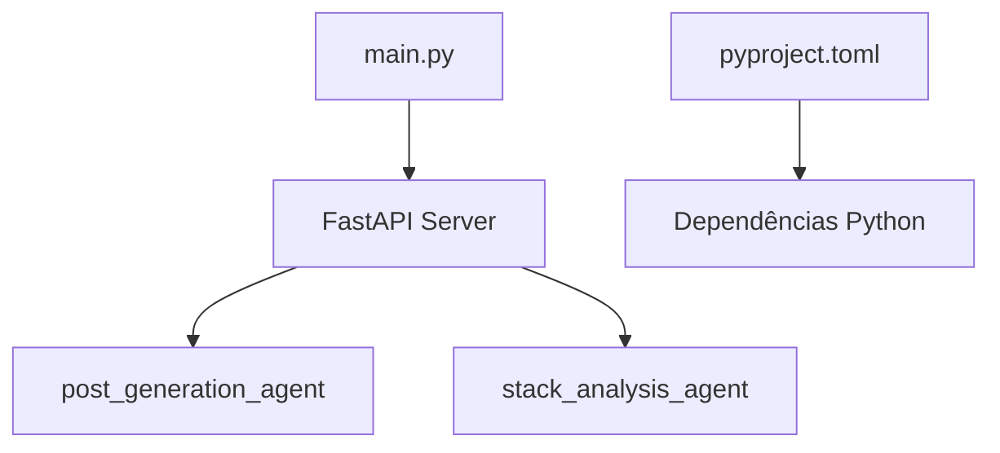
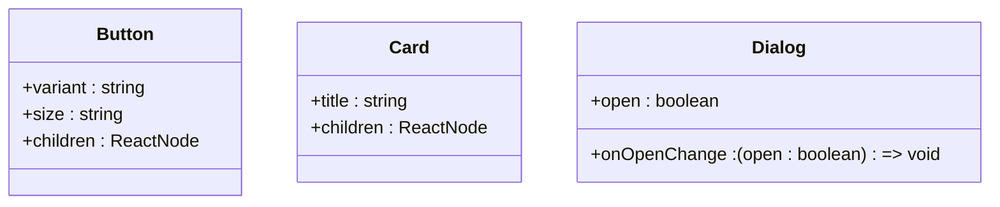
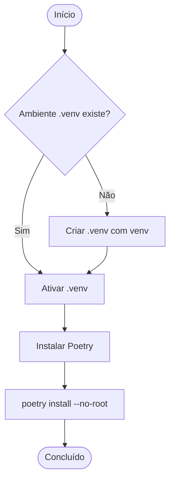
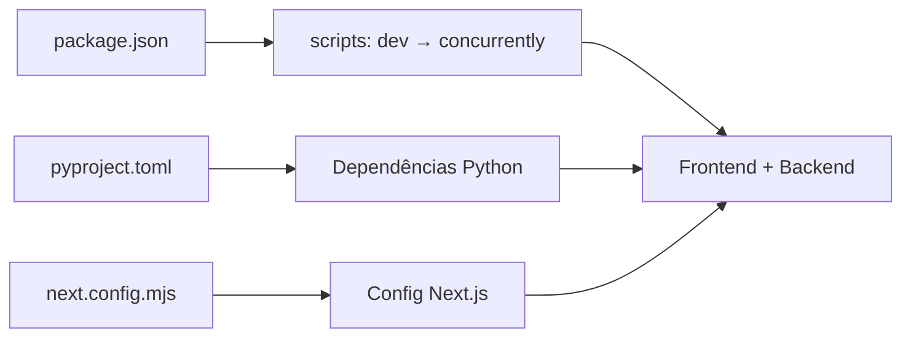

# Estrutura de Diretórios

<cite>
**Arquivos Referenciados neste Documento**  
- [package.json](file://package.json)
- [next.config.mjs](file://next.config.mjs)
- [agent/pyproject.toml](file://agent/pyproject.toml)
- [agent/main.py](file://agent/main.py)
- [app/page.tsx](file://app/page.tsx)
- [components/theme-provider.tsx](file://components/theme-provider.tsx)
- [lib/utils.ts](file://lib/utils.ts)
- [scripts/setup-agent.sh](file://scripts/setup-agent.sh)
- [scripts/setup-agent.bat](file://scripts/setup-agent.bat)
</cite>

## Sumário
1. [Introdução](#introdução)
2. [Estrutura de Diretórios](#estrutura-de-diretórios)
3. [Diretório `agent/`](#diretório-agent)
4. [Diretório `app/`](#diretório-app)
5. [Diretório `components/`](#diretório-components)
6. [Diretório `hooks/`](#diretório-hooks)
7. [Diretório `lib/`](#diretório-lib)
8. [Diretório `scripts/`](#diretório-scripts)
9. [Diretório `styles/`](#diretório-styles)
10. [Arquivos de Configuração](#arquivos-de-configuração)
11. [Diretrizes de Organização de Módulos](#diretrizes-de-organização-de-módulos)
12. [Separação entre Frontend e Backend](#separação-entre-frontend-e-backend)

## Introdução
O projeto **open-gemini-canvas** é uma aplicação full-stack moderna que combina um frontend em Next.js com um backend em Python baseado em agentes inteligentes. Este documento descreve detalhadamente a estrutura de diretórios do projeto, explicando o propósito de cada diretório e arquivo de configuração, além de fornecer orientações sobre como adicionar novos módulos. A clara separação entre frontend e backend permite desenvolvimento paralelo, facilitando a manutenção e escalabilidade.

## Estrutura de Diretórios
A estrutura do projeto é organizada de forma modular, com diretórios bem definidos que separam responsabilidades:

```
.
├── agent/            # Backend em Python com agentes e servidor FastAPI
├── app/              # Frontend Next.js com páginas e rotas de API
├── components/       # Componentes UI reutilizáveis baseados em Radix
├── hooks/            # Hooks personalizados do React
├── lib/              # Utilitários compartilhados
├── scripts/          # Scripts de configuração do ambiente
├── styles/           # Estilos globais
├── package.json      # Configuração do frontend e scripts de execução
├── pyproject.toml    # Configuração do backend Python
├── next.config.mjs   # Configuração do Next.js
└── .env              # Variáveis de ambiente (exemplo não encontrado)
```

**Section sources**
- [project_structure](file://project_structure)

## Diretório `agent`
O diretório `agent/` contém o backend da aplicação, implementado em Python com o framework FastAPI. Ele hospeda agentes baseados em IA que realizam tarefas como geração de posts e análise de stacks tecnológicos.

- `main.py`: Ponto de entrada do servidor FastAPI, que expõe os agentes via endpoint `/copilotkit`.
- `posts_generator_agent.py`: Implementa o agente de geração de posts para LinkedIn e X.
- `stack_agent.py`: Implementa o agente de análise de repositórios GitHub.
- `prompts.py`: Contém os prompts utilizados pelos agentes.
- `pyproject.toml`: Define as dependências do projeto Python e configurações do Poetry.

O servidor é iniciado com `uvicorn` e inclui um endpoint de saúde (`/healthz`) para monitoramento.



**Diagram sources**
- [agent/main.py](file://agent/main.py#L1-L63)
- [agent/pyproject.toml](file://agent/pyproject.toml#L1-L28)

**Section sources**
- [agent/main.py](file://agent/main.py#L1-L63)
- [agent/pyproject.toml](file://agent/pyproject.toml#L1-L28)

## Diretório `app`
O diretório `app/` contém o frontend da aplicação, construído com Next.js 15 e React 19, utilizando o recurso App Router.

- `page.tsx`: Página inicial que redireciona para `/post-generator`.
- `layout.tsx`: Layout principal da aplicação.
- `wrapper.tsx`: Componente wrapper para contextos globais.
- `contexts/LayoutContext.tsx`: Contexto para gerenciar o estado do layout.
- `api/`: Rotas de API do Next.js:
  - `chat/route.ts`: Endpoint para chat.
  - `copilotkit/route.ts`: Integração com o runtime do CopilotKit.
- `post-generator/page.tsx`: Página para geração de posts.
- `stack-analyzer/page.tsx`: Página para análise de stack.

O frontend utiliza o CopilotKit para integração com os agentes de backend.

**Section sources**
- [app/page.tsx](file://app/page.tsx#L1-L19)

## Diretório `components`
O diretório `components/` armazena componentes de interface de usuário reutilizáveis, baseados no Radix UI, garantindo acessibilidade e consistência visual.

- `ui/`: Componentes atômicos como botões, cards, dialogs, etc.
- `theme-provider.tsx`: Provedor de tema usando `next-themes` para suporte a modo claro/escuro.

Esses componentes são utilizados em todo o frontend e seguem padrões do Tailwind CSS.



**Diagram sources**
- [components/theme-provider.tsx](file://components/theme-provider.tsx#L1-L12)
- [components/ui/button.tsx](file://components/ui/button.tsx)
- [components/ui/card.tsx](file://components/ui/card.tsx)

**Section sources**
- [components/theme-provider.tsx](file://components/theme-provider.tsx#L1-L12)

## Diretório `hooks`
O diretório `hooks/` contém hooks personalizados do React para reutilização de lógica entre componentes.

- `use-mobile.ts`: Hook para detectar se o dispositivo é móvel.
- `use-toast.ts`: Hook para gerenciamento de toasts (notificações).

Esses hooks são utilizados em vários componentes para melhorar a experiência do usuário.

**Section sources**
- [hooks/use-mobile.ts](file://hooks/use-mobile.ts)
- [hooks/use-toast.ts](file://hooks/use-toast.ts)

## Diretório `lib`
O diretório `lib/` contém utilitários compartilhados por toda a aplicação frontend.

- `utils.ts`: Exporta a função `cn()` que combina `clsx` e `tailwind-merge` para manipulação segura de classes CSS.

Essa função é amplamente utilizada para compor classes condicionalmente em componentes.

```mermaid
flowchart LR
A[clsx] --> C[cn()]
B[tailwind-merge] --> C
C --> D[Classes CSS Combinadas]
```

**Diagram sources**
- [lib/utils.ts](file://lib/utils.ts#L1-L7)

**Section sources**
- [lib/utils.ts](file://lib/utils.ts#L1-L7)

## Diretório `scripts`
O diretório `scripts/` contém scripts para configuração do ambiente de desenvolvimento.

- `setup-agent.sh`: Script para configurar o ambiente Python no Linux/macOS.
- `setup-agent.bat`: Script equivalente para Windows.

Ambos os scripts criam um ambiente virtual, ativam-no e instalam as dependências usando Poetry.



**Diagram sources**
- [scripts/setup-agent.sh](file://scripts/setup-agent.sh#L1-L14)
- [scripts/setup-agent.bat](file://scripts/setup-agent.bat#L1-L11)

**Section sources**
- [scripts/setup-agent.sh](file://scripts/setup-agent.sh#L1-L14)
- [scripts/setup-agent.bat](file://scripts/setup-agent.bat#L1-L11)

## Diretório `styles`
O diretório `styles/` contém os estilos globais da aplicação.

- `globals.css`: Estilos CSS globais aplicados a toda a aplicação.

Este arquivo é importado em `app/globals.css` e define o reset de estilos e variáveis globais.

**Section sources**
- [styles/globals.css](file://styles/globals.css)
- [app/globals.css](file://app/globals.css)

## Arquivos de Configuração
Os arquivos de configuração coordenam o funcionamento do projeto:

- `package.json`: Define scripts de desenvolvimento que executam frontend e backend simultaneamente com `concurrently`. O script `dev` inicia ambos os ambientes.
- `pyproject.toml`: Define as dependências do backend Python, incluindo FastAPI, LangGraph e Google GenAI.
- `next.config.mjs`: Configuração do Next.js com opções para ESLint, TypeScript e imagens.
- `.env`: Arquivo de variáveis de ambiente (não encontrado, mas esperado).



**Diagram sources**
- [package.json](file://package.json#L1-L86)
- [next.config.mjs](file://next.config.mjs#L1-L15)
- [agent/pyproject.toml](file://agent/pyproject.toml#L1-L28)

**Section sources**
- [package.json](file://package.json#L1-L86)
- [next.config.mjs](file://next.config.mjs#L1-L15)
- [agent/pyproject.toml](file://agent/pyproject.toml#L1-L28)

## Diretrizes de Organização de Módulos
Para adicionar novos módulos:

### Adicionar um Novo Agente
1. Criar um novo arquivo em `agent/` (ex: `new_agent.py`).
2. Definir o grafo do agente usando LangGraph.
3. Importar e registrar no `main.py` dentro do `sdk = CopilotKitSDK(...)`.
4. Atualizar `pyproject.toml` se necessário.

### Adicionar uma Nova Página
1. Criar um novo diretório em `app/` (ex: `app/nova-ferramenta`).
2. Adicionar `page.tsx` com o componente da página.
3. Utilizar `LayoutContext` se necessário.
4. Linkar na navegação.

**Section sources**
- [agent/main.py](file://agent/main.py#L1-L63)
- [app/page.tsx](file://app/page.tsx#L1-L19)

## Separação entre Frontend e Backend
A arquitetura do projeto apresenta uma separação clara:

- **Frontend**: Next.js, React, Tailwind, Radix UI.
- **Backend**: Python, FastAPI, LangGraph, Google GenAI.

Essa separação permite:
- Desenvolvimento paralelo por times diferentes.
- Testes independentes.
- Escalabilidade independente.
- Tecnologias otimizadas para cada camada.

A comunicação ocorre via API REST, facilitando integrações e manutenção.

```mermaid
graph LR
A[Frontend Next.js] < --> B[API /copilotkit]
B < --> C[Backend FastAPI]
C --> D[Agentes de IA]
A --> E[Componentes Radix]
C --> F[Google GenAI]
```

**Diagram sources**
- [app/page.tsx](file://app/page.tsx#L1-L19)
- [agent/main.py](file://agent/main.py#L1-L63)

**Section sources**
- [app/page.tsx](file://app/page.tsx#L1-L19)
- [agent/main.py](file://agent/main.py#L1-L63)