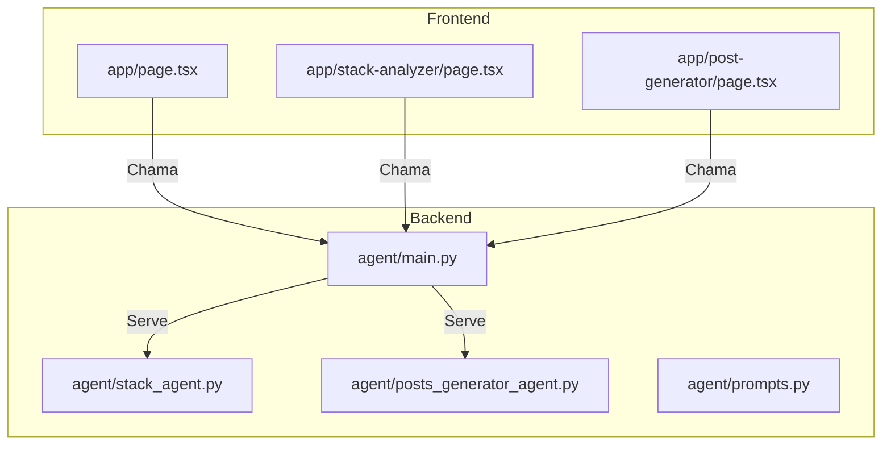
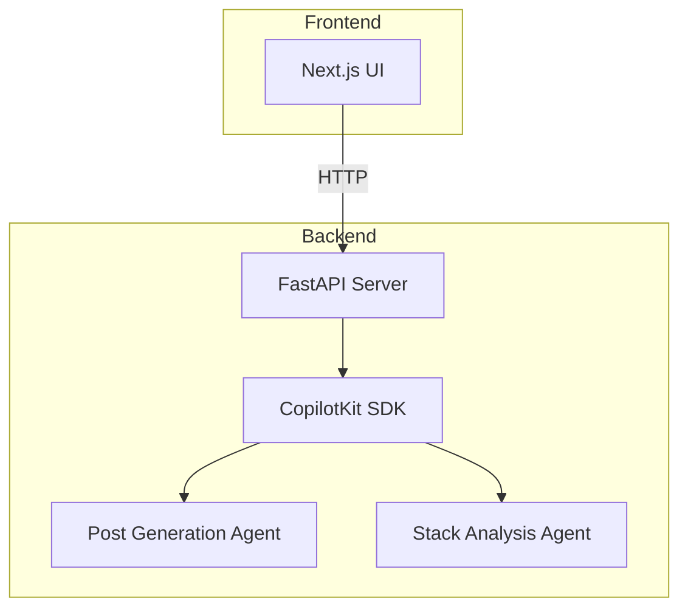
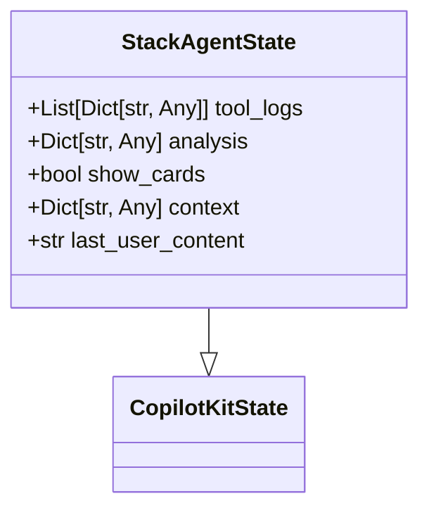
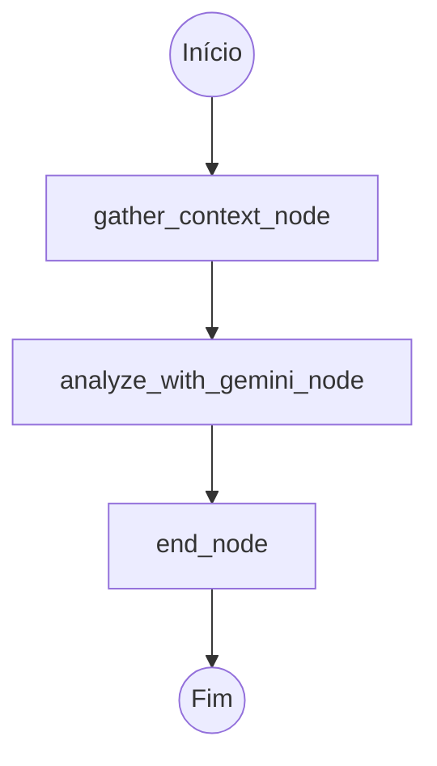
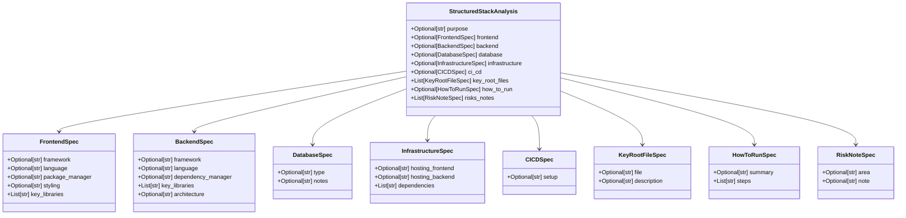
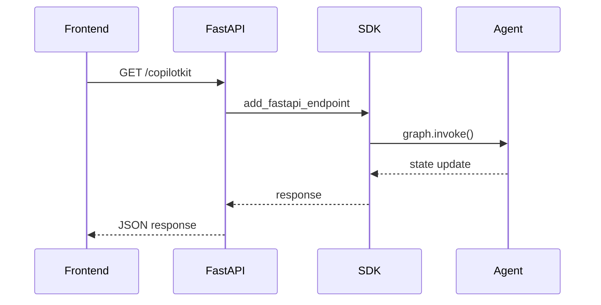
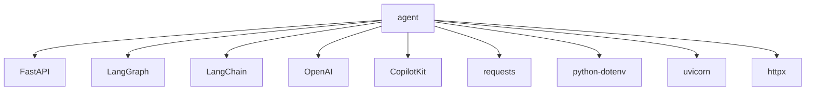

# Adicionar um Novo Agente

<cite>
**Arquivos Referenciados neste Documento**  
- [main.py](file://agent/main.py)
- [stack_agent.py](file://agent/stack_agent.py)
- [posts_generator_agent.py](file://agent/posts_generator_agent.py)
- [prompts.py](file://agent/prompts.py)
</cite>

## Sumário
1. [Introdução](#introdução)
2. [Estrutura do Projeto](#estrutura-do-projeto)
3. [Componentes Principais](#componentes-principais)
4. [Visão Geral da Arquitetura](#visão-geral-da-arquitetura)
5. [Análise Detalhada dos Componentes](#análise-detalhada-dos-componentes)
6. [Análise de Dependências](#análise-de-dependências)
7. [Considerações de Desempenho](#considerações-de-desempenho)
8. [Guia de Solução de Problemas](#guia-de-solução-de-problemas)
9. [Conclusão](#conclusão)

## Introdução
Este documento fornece uma explicação detalhada sobre como criar e registrar um novo agente de IA no projeto utilizando LangGraph e FastAPI. O foco está em definir o estado do agente, construir o grafo de execução com nós assíncronos, definir ferramentas personalizadas com `@tool` e esquemas Pydantic, compilar o grafo com um checkpointer e integrar o novo agente ao servidor FastAPI. Um exemplo prático de um agente de análise de segurança de dependências é fornecido, juntamente com boas práticas para testes e integração com o frontend.

## Estrutura do Projeto
O projeto é organizado em dois diretórios principais: `agent` e `app`. O diretório `agent` contém o backend em FastAPI com os agentes de IA, enquanto o diretório `app` contém o frontend em Next.js. Os agentes são definidos em arquivos Python separados, como `stack_agent.py` e `posts_generator_agent.py`, e são servidos através de um servidor FastAPI em `main.py`.



**Fontes do Diagrama**  
- [main.py](file://agent/main.py#L1-L62)
- [stack_agent.py](file://agent/stack_agent.py#L0-L505)
- [posts_generator_agent.py](file://agent/posts_generator_agent.py#L0-L174)

**Fontes da Seção**  
- [main.py](file://agent/main.py#L1-L62)
- [stack_agent.py](file://agent/stack_agent.py#L0-L505)
- [posts_generator_agent.py](file://agent/posts_generator_agent.py#L0-L174)

## Componentes Principais
Os componentes principais do sistema incluem o servidor FastAPI em `main.py`, os agentes definidos em `stack_agent.py` e `posts_generator_agent.py`, e os prompts definidos em `prompts.py`. Cada agente é um grafo LangGraph compilado com um checkpointer de memória e registrado no SDK do CopilotKit.

**Fontes da Seção**  
- [main.py](file://agent/main.py#L19-L32)
- [stack_agent.py](file://agent/stack_agent.py#L504-L504)
- [posts_generator_agent.py](file://agent/posts_generator_agent.py#L173-L173)

## Visão Geral da Arquitetura
A arquitetura do sistema é baseada em agentes de IA que são servidos através de um servidor FastAPI. Cada agente é um grafo LangGraph que define um fluxo de trabalho assíncrono com nós que representam etapas do processo. O estado do agente é definido como uma extensão da classe `CopilotKitState`, e o grafo é compilado com um checkpointer para manter o estado entre as chamadas.



**Fontes do Diagrama**  
- [main.py](file://agent/main.py#L1-L62)
- [stack_agent.py](file://agent/stack_agent.py#L0-L505)
- [posts_generator_agent.py](file://agent/posts_generator_agent.py#L0-L174)

## Análise Detalhada dos Componentes

### Análise do Agente de Análise de Stack
O agente de análise de stack é definido em `stack_agent.py` e utiliza um grafo LangGraph para analisar um repositório GitHub. O estado do agente é definido pela classe `StackAgentState`, que estende `CopilotKitState` e inclui campos para logs de ferramentas, análise, contexto e conteúdo do usuário.

#### Definição do Estado do Agente
A classe `StackAgentState` define o estado do agente com campos para armazenar logs de ferramentas, análise estruturada, contexto do repositório e conteúdo da última mensagem do usuário.



**Fontes do Diagrama**  
- [stack_agent.py](file://agent/stack_agent.py#L29-L34)

#### Nós Assíncronos do Grafo
O grafo do agente é composto por três nós assíncronos: `gather_context_node`, `analyze_with_gemini_node` e `end_node`. Cada nó representa uma etapa do processo de análise.



**Fontes do Diagrama**  
- [stack_agent.py](file://agent/stack_agent.py#L273-L479)

#### Ferramentas Personalizadas
O agente define uma ferramenta personalizada `return_stack_analysis_tool` decorada com `@tool` e um esquema Pydantic `StructuredStackAnalysis`. Esta ferramenta é usada para retornar a análise estruturada do repositório.



**Fontes do Diagrama**  
- [stack_agent.py](file://agent/stack_agent.py#L45-L106)

#### Compilação do Grafo com Checkpointer
O grafo é compilado com um checkpointer de memória para manter o estado entre as chamadas. Isso permite que o agente mantenha o contexto de uma conversa ao longo de múltiplas interações.

```python
stack_analysis_graph = workflow.compile(checkpointer=MemorySaver())
```

**Fontes da Seção**  
- [stack_agent.py](file://agent/stack_agent.py#L504-L504)

### Integração com o Servidor FastAPI
O novo agente é registrado no servidor FastAPI em `main.py` através do SDK do CopilotKit. O SDK é configurado com uma lista de agentes, cada um representado por um `LangGraphAgent` com nome, descrição e grafo.



**Fontes do Diagrama**  
- [main.py](file://agent/main.py#L1-L62)
- [stack_agent.py](file://agent/stack_agent.py#L504-L504)

**Fontes da Seção**  
- [main.py](file://agent/main.py#L19-L32)

## Análise de Dependências
O projeto depende de várias bibliotecas Python, incluindo FastAPI, LangGraph, LangChain, OpenAI, CopilotKit e requests. Essas dependências são gerenciadas pelo Poetry e listadas no arquivo `pyproject.toml`.



**Fontes do Diagrama**  
- [pyproject.toml](file://agent/pyproject.toml#L1-L26)

**Fontes da Seção**  
- [pyproject.toml](file://agent/pyproject.toml#L1-L26)

## Considerações de Desempenho
O uso de um checkpointer de memória pode afetar o desempenho em ambientes de produção devido ao consumo de memória. Para ambientes de produção, considere usar um checkpointer persistente, como um banco de dados. Além disso, as chamadas à API do GitHub e do OpenRouter devem ser tratadas com timeouts e retry logic para garantir a resiliência.

## Guia de Solução de Problemas
Erros comuns incluem falhas na serialização de estado e conflitos de rota. Para falhas na serialização, certifique-se de que todos os campos no estado do agente sejam serializáveis em JSON. Para conflitos de rota, verifique se as rotas no servidor FastAPI não entram em conflito com rotas do frontend.

**Fontes da Seção**  
- [main.py](file://agent/main.py#L1-L62)
- [stack_agent.py](file://agent/stack_agent.py#L0-L505)

## Conclusão
Este documento forneceu uma visão detalhada de como criar e registrar um novo agente de IA no projeto utilizando LangGraph e FastAPI. O processo envolve definir o estado do agente, construir o grafo de execução, definir ferramentas personalizadas, compilar o grafo com um checkpointer e integrar o agente ao servidor FastAPI. O exemplo do agente de análise de stack ilustra esses conceitos em prática, e as boas práticas para testes e solução de problemas foram discutidas.