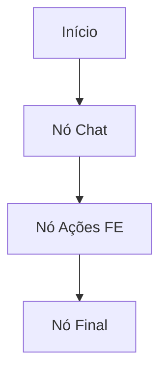
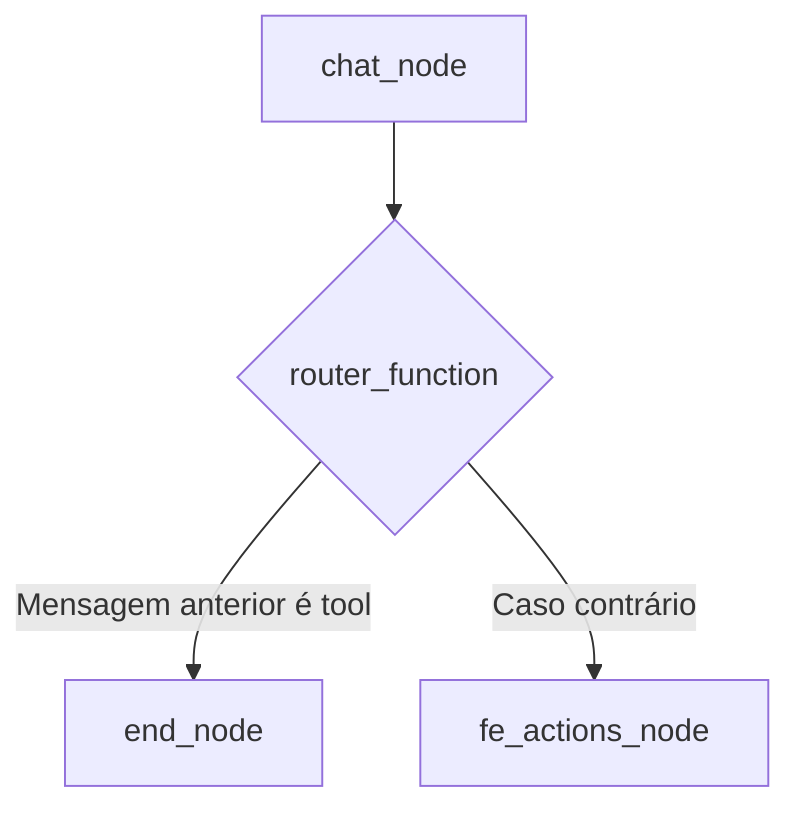
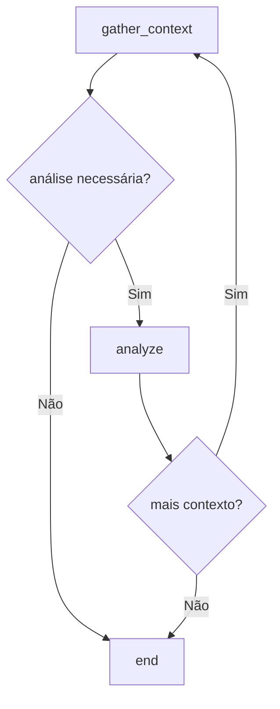

# Conectar Nós com Arestas Condicionais e Diretas

<cite>
**Arquivos Referenciados neste Documento**  
- [agent/posts_generator_agent.py](file://agent/posts_generator_agent.py)
- [agent/stack_agent.py](file://agent/stack_agent.py)
</cite>

## Sumário
1. [Introdução](#introdução)
2. [Conexão de Nós com Arestas Diretas](#conexão-de-nós-com-arestas-diretas)
3. [Roteamento Dinâmico com Arestas Condicionais](#roteamento-dinâmico-com-arestas-condicionais)
4. [Estrutura da Função de Roteamento](#estrutura-da-função-de-roteamento)
5. [Validação de Retorno para Evitar Erros](#validação-de-retorno-para-evitar-erros)
6. [Exemplos de Grafos com Bifurcações e Loops](#exemplos-de-grafos-com-bifurcações-e-loops)
7. [Teste do Fluxo de Controle com Entradas Simuladas](#teste-do-fluxo-de-controle-com-entradas-simuladas)

## Introdução
Em sistemas baseados em grafos de estado, como os implementados com LangGraph, a definição precisa do fluxo entre nós é essencial para o comportamento correto do agente. Este documento explica como conectar nós usando `add_edge` para transições diretas e `add_conditional_edges` para decisões dinâmicas baseadas em funções de roteamento. O foco está na implementação prática com exemplos do repositório, especialmente a função `router_function` no arquivo `posts_generator_agent.py`.

## Conexão de Nós com Arestas Diretas
A função `add_edge` é usada para definir transições fixas entre nós em um grafo de estado. Essas conexões são estáticas e não dependem do estado ou saída do nó anterior.



**Fontes do Diagrama**  
- [agent/posts_generator_agent.py](file://agent/posts_generator_agent.py#L140-L173)

**Seção fontes**  
- [agent/posts_generator_agent.py](file://agent/posts_generator_agent.py#L140-L173)

## Roteamento Dinâmico com Arestas Condicionais
O `add_conditional_edges` permite que o próximo nó seja determinado dinamicamente com base no resultado de uma função de roteamento. Essa função avalia o estado atual e retorna o nome do próximo nó a ser executado.

No exemplo do `posts_generator_agent.py`, a função `router_function` decide se o fluxo deve ir para `end_node` ou `fe_actions_node` com base na presença de mensagens de ferramenta no histórico.



**Fontes do Diagrama**  
- [agent/posts_generator_agent.py](file://agent/posts_generator_agent.py#L153-L157)

**Seção fontes**  
- [agent/posts_generator_agent.py](file://agent/posts_generator_agent.py#L153-L157)

## Estrutura da Função de Roteamento
A função de roteamento deve retornar uma string que corresponda exatamente ao nome de um nó no grafo. Ela recebe o estado atual (`state`) e a configuração (`config`) como parâmetros.

Exemplo de estrutura:
```python
def router_function(state: AgentState, config: RunnableConfig):
    if condition:
        return "nome_do_no"
    else:
        return "outro_no"
```

A função `router_function` no `posts_generator_agent.py` verifica a penúltima mensagem no histórico para decidir o próximo passo.

**Seção fontes**  
- [agent/posts_generator_agent.py](file://agent/posts_generator_agent.py#L153-L157)

## Validação de Retorno para Evitar Erros
Para evitar erros de roteamento, é crucial validar o retorno da função de roteamento. Isso inclui:
- Garantir que as strings retornadas correspondam exatamente aos nomes dos nós.
- Tratar casos em que o estado não contém os dados esperados (ex: uso de `try-except`).
- Definir um nó padrão para casos não previstos.

No exemplo, o tratamento de exceção em `fe_actions_node` evita falhas se o índice `-2` não existir.

**Seção fontes**  
- [agent/posts_generator_agent.py](file://agent/posts_generator_agent.py#L103-L106)

## Exemplos de Grafos com Bifurcações e Loops
Grafos podem incluir bifurcações condicionais e loops para suportar fluxos complexos. Um loop pode ser criado ao direcionar um nó de volta a um nó anterior, mas deve-se garantir uma condição de saída para evitar ciclos infinitos.

Exemplo de grafo com loop condicional:


**Fontes do Diagrama**  
- [agent/stack_agent.py](file://agent/stack_agent.py#L489-L504)

**Seção fontes**  
- [agent/stack_agent.py](file://agent/stack_agent.py#L489-L504)

## Teste do Fluxo de Controle com Entradas Simuladas
Para testar o fluxo de controle, simule entradas que ativem diferentes caminhos no grafo. Por exemplo:
- Entrada que gera uma chamada de ferramenta para testar o caminho para `end_node`.
- Entrada que não gera ferramentas para testar o caminho para `fe_actions_node`.

Isso garante que todas as bifurcações e nós sejam validados funcionalmente.

**Seção fontes**  
- [agent/posts_generator_agent.py](file://agent/posts_generator_agent.py#L36-L74)
- [agent/posts_generator_agent.py](file://agent/posts_generator_agent.py#L103-L143)