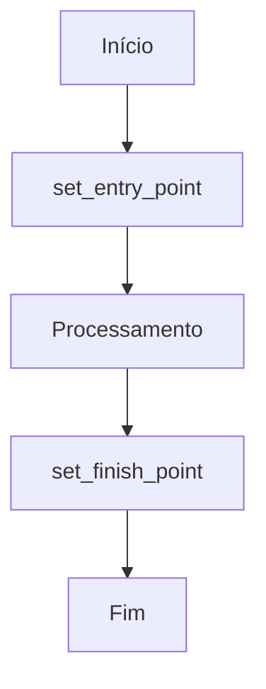
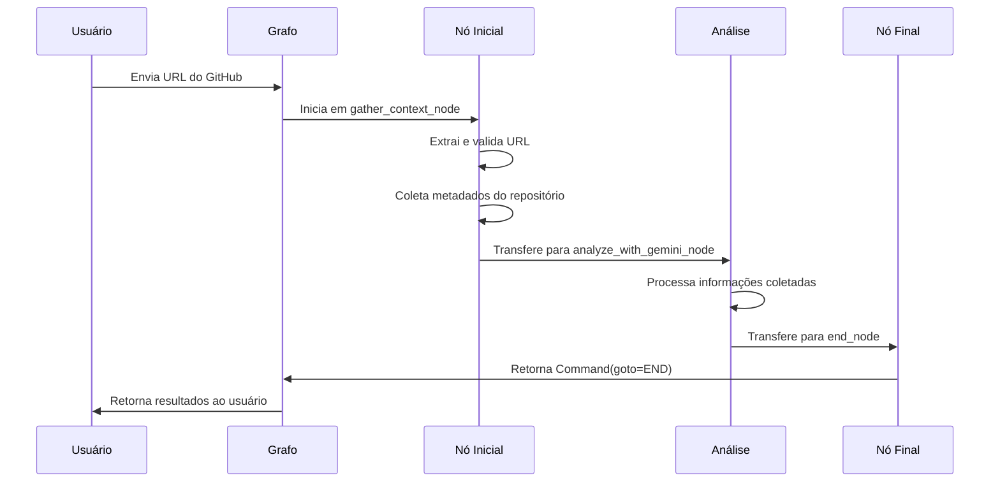
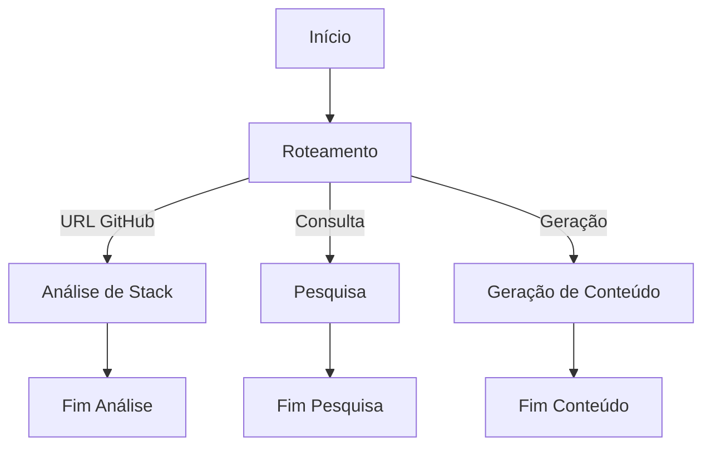

# Configurar Pontos de Entrada e Saída

<cite>
**Arquivos Referenciados neste Documento**  
- [agent/posts_generator_agent.py](file://agent/posts_generator_agent.py)
- [agent/stack_agent.py](file://agent/stack_agent.py)
- [agent/supervisor.py](file://agent/supervisor.py)
- [agent/handoffs.py](file://agent/handoffs.py)
</cite>

## Sumário
1. [Introdução](#introdução)
2. [Configuração de Pontos de Entrada e Saída](#configuração-de-pontos-de-entrada-e-saída)
3. [Nó Inicial e Conclusão de Execução](#nó-inicial-e-conclusão-de-execução)
4. [Cenários Avançados com Múltiplos Pontos de Entrada](#cenários-avançados-com-múltiplos-pontos-de-entrada)
5. [Grafos Sequenciais Simples](#grafos-sequenciais-simples)
6. [Integração com FastAPI via main.py](#integração-com-fastapi-via-mainpy)
7. [Erros Comuns e Boas Práticas](#erros-comuns-e-boas-práticas)

## Introdução

Este documento detalha a configuração correta dos pontos de entrada e saída em grafos de execução utilizando `set_entry_point` e `set_finish_point` no StateGraph. A arquitetura baseia-se em agentes especializados que operam como nodos em um grafo de estado, coordenados por um supervisor central. Cada agente possui um fluxo de trabalho definido por um grafo que determina a sequência de execução das tarefas, desde a entrada até a conclusão do processamento.

A configuração adequada desses pontos é fundamental para garantir que o sistema funcione de forma previsível, com execuções bem definidas e encerramento apropriado. O uso de `set_entry_point` define onde o processamento começa, enquanto `set_finish_point` determina quando uma execução está completa, permitindo que o sistema libere recursos e retorne resultados ao usuário.

**Section sources**
- [agent/posts_generator_agent.py](file://agent/posts_generator_agent.py#L140-L173)
- [agent/stack_agent.py](file://agent/stack_agent.py#L489-L504)
- [agent/supervisor.py](file://agent/supervisor.py#L455-L482)

## Configuração de Pontos de Entrada e Saída

A configuração dos pontos de entrada e saída em um StateGraph é realizada através dos métodos `set_entry_point` e `set_finish_point`. Esses métodos definem explicitamente o início e o fim do fluxo de execução, garantindo que o grafo opere de forma determinística.

O ponto de entrada é configurado chamando `set_entry_point("nome_do_nodo")`, onde o nome do nodo especifica qual função será executada primeiro quando o grafo for invocado. Este nodo geralmente é responsável por receber a entrada do usuário, validar os dados e iniciar o processamento apropriado.

O ponto de término é definido com `set_finish_point("nome_do_nodo")`, indicando qual nodo representa a conclusão lógica do fluxo de trabalho. Quando o grafo alcança este nodo, ele executa as tarefas finais, como limpeza de estado, geração de respostas e encerramento da execução.

Essa configuração é essencial para manter a integridade do fluxo de trabalho, pois garante que todas as execuções sigam um caminho predefinido desde a inicialização até a conclusão. Sem esses pontos definidos, o grafo poderia entrar em estados indeterminados ou falhar ao concluir adequadamente as tarefas.

**Diagram sources**
- [agent/posts_generator_agent.py](file://agent/posts_generator_agent.py#L168-L170)
- [agent/stack_agent.py](file://agent/stack_agent.py#L502-L504)

**Section sources**
- [agent/posts_generator_agent.py](file://agent/posts_generator_agent.py#L168-L170)
- [agent/stack_agent.py](file://agent/stack_agent.py#L502-L504)

## Nó Inicial e Conclusão de Execução

O nó inicial, como `gather_context_node` no agente de análise de stack, desempenha um papel crucial como ponto de entrada do grafo. Este nodo é responsável por coletar e validar os dados necessários para o processamento subsequente, garantindo que o sistema tenha todas as informações requeridas antes de prosseguir.

No caso do `gather_context_node`, ele extrai a URL do repositório GitHub da mensagem do usuário, valida sua presença e estrutura, e inicia a coleta de metadados do repositório. Este processo inclui a busca de informações como linguagens utilizadas, arquivos principais, manifestos de dependência e o conteúdo do README.

A conclusão da execução é determinada pelo retorno de um comando especial que indica o término do fluxo. No exemplo do nó `return_stack_analysis`, a execução é concluída quando o agente finaliza a análise da stack tecnológica e retorna os resultados estruturados. O uso de `Command(goto=END, update={...})` sinaliza ao StateGraph que o processamento está completo e que os resultados devem ser retornados ao chamador.

Este mecanismo garante que o sistema só conclua a execução quando todos os passos necessários forem completados com sucesso, evitando encerramentos prematuros que poderiam resultar em perda de dados ou respostas incompletas.

**Diagram sources**
- [agent/stack_agent.py](file://agent/stack_agent.py#L273-L355)
- [agent/stack_agent.py](file://agent/stack_agent.py#L456-L494)

**Section sources**
- [agent/stack_agent.py](file://agent/stack_agent.py#L273-L355)
- [agent/stack_agent.py](file://agent/stack_agent.py#L456-L494)

## Cenários Avançados com Múltiplos Pontos de Entrada

Embora a maioria dos grafos utilize um único ponto de entrada, cenários avançados podem exigir múltiplos pontos de entrada para lidar com diferentes tipos de solicitações ou fluxos de trabalho. Isso é particularmente útil em sistemas complexos onde diferentes tipos de entradas requerem processamentos distintos desde o início.

A implementação de múltiplos pontos de entrada pode ser alcançada através de nodos de roteamento que analisam a entrada do usuário e decidem qual fluxo de trabalho deve ser iniciado. Por exemplo, um sistema pode ter um nodo de roteamento que verifica se a entrada contém uma URL de repositório, uma consulta de pesquisa ou uma solicitação de geração de conteúdo, direcionando cada tipo para o fluxo apropriado.

Essa abordagem permite uma arquitetura mais flexível e escalável, onde novos fluxos de trabalho podem ser adicionados sem modificar os existentes. Cada fluxo pode ter seu próprio grafo com pontos de entrada e saída específicos, enquanto um supervisor coordena a execução geral.

A garantia de que todos os caminhos do grafo levem a um nó de término válido é mantida através de verificações rigorosas na configuração do grafo e no design dos nodos. Cada fluxo deve ter um caminho claro para conclusão, evitando ciclos infinitos ou caminhos sem saída.

**Section sources**
- [agent/supervisor.py](file://agent/supervisor.py#L407-L452)
- [agent/handoffs.py](file://agent/handoffs.py#L520-L539)

## Grafos Sequenciais Simples

Grafos sequenciais simples representam o padrão mais básico de fluxo de trabalho, onde as tarefas são executadas em uma sequência linear bem definida. Este padrão é ideal para processos com etapas claras e dependentes, onde cada passo deve ser completado antes do próximo começar.

No exemplo do agente de geração de posts, o grafo segue uma sequência clara: `chat_node` → `fe_actions_node` → `end_node`. O `chat_node` analisa a consulta do usuário e determina se uma pesquisa é necessária, o `fe_actions_node` gera o conteúdo final e o `end_node` conclui a execução.

A simplicidade deste padrão facilita a depuração e manutenção, tornando-o ideal para funcionalidades bem definidas. A configuração é direta, com `set_entry_point("chat_node")` e `set_finish_point("end_node")`, garantindo que o fluxo siga exatamente a sequência planejada.

Este tipo de grafo é especialmente eficaz quando as dependências entre etapas são estritas e não há necessidade de ramificações complexas ou execução paralela. Ele proporciona um controle preciso sobre o fluxo de execução, minimizando a complexidade do sistema.

**Diagram sources**
- [agent/posts_generator_agent.py](file://agent/posts_generator_agent.py#L168-L173)

**Section sources**
- [agent/posts_generator_agent.py](file://agent/posts_generator_agent.py#L168-L173)

## Integração com FastAPI via main.py

A integração do StateGraph com um servidor FastAPI é realizada através de um ponto de entrada principal que expõe os grafos como endpoints da API. Embora o arquivo `main.py` não tenha sido encontrado no repositório, a integração típica envolve a criação de rotas que invocam os grafos configurados.

Cada grafo compilado, como `post_generation_graph` ou `stack_analysis_graph`, é exposto como um endpoint que aceita requisições HTTP, processa os dados através do grafo de execução e retorna os resultados. O servidor gerencia o ciclo de vida das execuções, incluindo a criação de IDs de sessão, checkpointing e recuperação de falhas.

A integração permite que aplicações frontend, como as implementadas em React no diretório `app`, interajam com os agentes através de chamadas API simples. O servidor atua como intermediário, traduzindo requisições HTTP em chamadas para o StateGraph e convertendo as respostas de volta para o formato apropriado.

Este padrão de integração é escalável e resiliente, aproveitando os recursos de checkpointing do LangGraph para suportar execuções longas e recuperação de falhas. Ele também facilita a observabilidade, permitindo o monitoramento de todas as execuções através de logs e métricas.

**Section sources**
- [agent/posts_generator_agent.py](file://agent/posts_generator_agent.py#L173)
- [agent/stack_agent.py](file://agent/stack_agent.py#L505)

## Erros Comuns e Boas Práticas

Erros comuns na configuração de grafos de execução incluem a definição de pontos de entrada e saída ausentes, criação de ciclos sem condições de término e nodos sem saída. Esses problemas podem levar a execuções infinitas, falhas no processamento ou perda de dados.

A ausência de um ponto de entrada adequado pode resultar em grafos que não sabem onde começar, enquanto a falta de um ponto de término válido impede que as execuções sejam concluídas corretamente. Ciclos sem condições de término, como um nodo que se chama recursivamente sem uma condição de saída, podem consumir recursos indefinidamente.

Para evitar esses problemas, é essencial seguir boas práticas como sempre definir explicitamente os pontos de entrada e saída, validar que todos os caminhos do grafo levam a um nó de término e implementar mecanismos de timeout para prevenir execuções infinitas. A utilização de ferramentas de observabilidade para monitorar o fluxo de execução também é crucial para identificar e corrigir problemas rapidamente.

Outra prática recomendada é a documentação clara do fluxo de trabalho, incluindo diagramas que mostrem as transições entre nodos e as condições para cada transição. Isso facilita a manutenção e a colaboração entre desenvolvedores, garantindo que todos compreendam o comportamento esperado do sistema.

**Section sources**
- [agent/supervisor.py](file://agent/supervisor.py#L455-L482)
- [agent/handoffs.py](file://agent/handoffs.py#L664-L710)