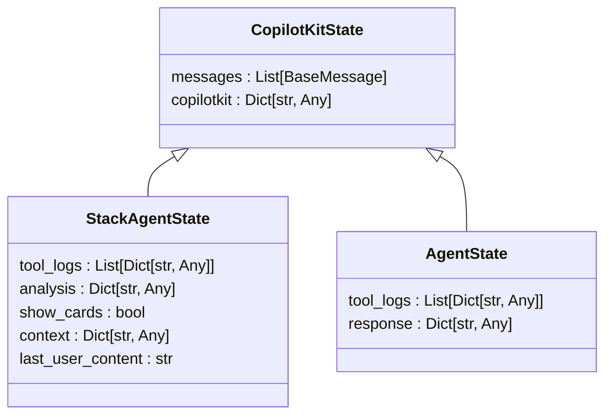
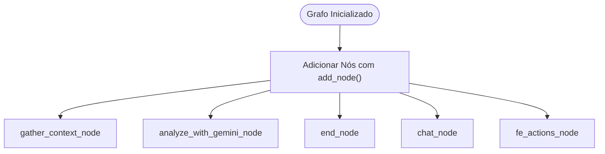
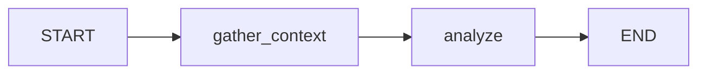
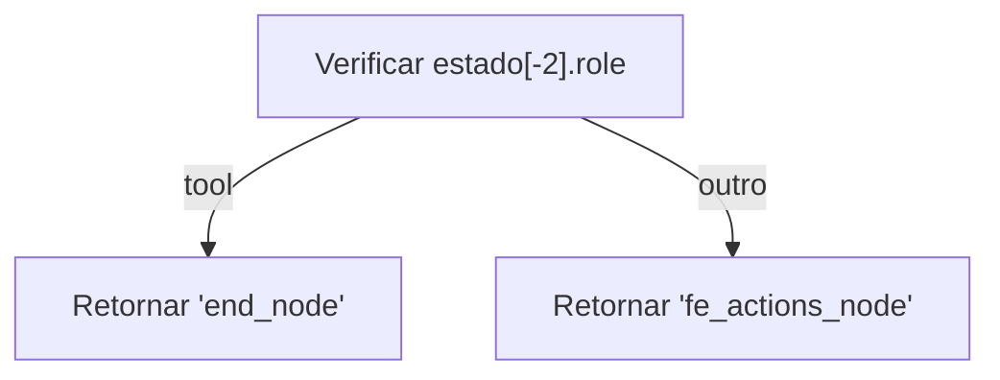
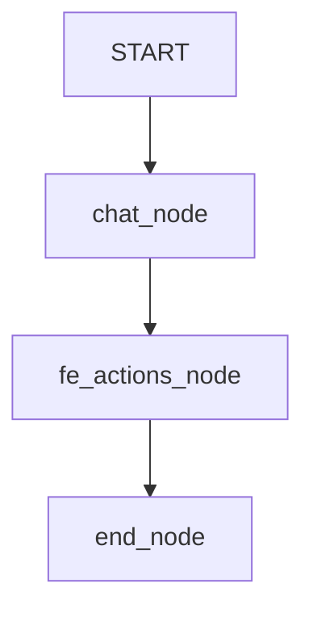

# Construir o Grafo de Execução

<cite>
**Arquivos Referenciados neste Documento**   
- [stack_agent.py](file://agent/stack_agent.py)
- [posts_generator_agent.py](file://agent/posts_generator_agent.py)
- [main.py](file://agent/main.py)
- [prompts.py](file://agent/prompts.py)
</cite>

## Sumário
1. [Introdução](#introdução)
2. [Criação do Estado Personalizado](#criação-do-estado-personalizado)
3. [Definição do Grafo com StateGraph](#definição-do-grafo-com-stateggraph)
4. [Adição de Nós Assíncronos](#adição-de-nós-assíncronos)
5. [Configuração de Pontos de Entrada e Saída](#configuração-de-pontos-de-entrada-e-saída)
6. [Conexão de Nós com Arestas](#conexão-de-nós-com-arestas)
7. [Implementação de Rotas Condicionais](#implementação-de-rotas-condicionais)
8. [Exemplos de Grafos Existentes](#exemplos-de-grafos-existentes)
9. [Erros Comuns e Soluções](#erros-comuns-e-soluções)
10. [Teste Local do Grafo](#teste-local-do-grafo)

## Introdução

Este documento fornece uma explicação detalhada sobre como construir um grafo de execução usando LangGraph para um novo agente. O grafo de execução é a estrutura central que define o fluxo de trabalho de um agente, coordenando a execução de diferentes tarefas e a transição entre estados. Os exemplos são baseados em agentes existentes no projeto, como o agente de análise de stack e o agente gerador de posts, demonstrando práticas reais de implementação.

## Criação do Estado Personalizado

O estado personalizado define a estrutura de dados que será mantida e modificada durante a execução do grafo. Ele herda de `CopilotKitState` e inclui campos específicos para o agente.



**Diagram sources**
- [stack_agent.py](file://agent/stack_agent.py#L29-L34)
- [posts_generator_agent.py](file://agent/posts_generator_agent.py#L33-L35)

**Section sources**
- [stack_agent.py](file://agent/stack_agent.py#L29-L34)
- [posts_generator_agent.py](file://agent/posts_generator_agent.py#L33-L35)

## Definição do Grafo com StateGraph

A criação do grafo começa com a instanciação de `StateGraph`, passando a classe de estado personalizada como parâmetro. Esta é a estrutura principal que orquestra todo o fluxo de execução.

```python
workflow = StateGraph(StackAgentState)
```

O objeto `workflow` serve como o construtor do grafo, permitindo adicionar nós, definir conexões e configurar pontos de entrada e saída. O estado personalizado garante que todas as operações no grafo tenham acesso aos dados necessários de forma tipada e consistente.

**Section sources**
- [stack_agent.py](file://agent/stack_agent.py#L494-L495)

## Adição de Nós Assíncronos

Nós assíncronos representam funções que realizam tarefas específicas no grafo. Eles são adicionados ao grafo usando o método `add_node`.



**Diagram sources**
- [stack_agent.py](file://agent/stack_agent.py#L496-L498)
- [posts_generator_agent.py](file://agent/posts_generator_agent.py#L159-L161)

**Section sources**
- [stack_agent.py](file://agent/stack_agent.py#L496-L498)
- [posts_generator_agent.py](file://agent/posts_generator_agent.py#L159-L161)

Os nós são funções assíncronas que recebem o estado atual e a configuração de execução como parâmetros. Exemplos incluem `gather_context_node`, `analyze_with_gemini_node` e `chat_node`, cada um responsável por uma etapa específica do processo.

## Configuração de Pontos de Entrada e Saída

Os pontos de entrada e saída definem onde o grafo começa e termina. Eles são configurados usando os métodos `set_entry_point` e `set_finish_point`.



**Diagram sources**
- [stack_agent.py](file://agent/stack_agent.py#L501-L502)

**Section sources**
- [stack_agent.py](file://agent/stack_agent.py#L501-L502)

O ponto de entrada é o primeiro nó executado quando o grafo é invocado, enquanto o ponto de término indica quando o grafo deve finalizar sua execução. No exemplo do agente de análise de stack, o ponto de entrada é `gather_context` e o ponto de término é `end_node`.

## Conexão de Nós com Arestas

As arestas conectam os nós do grafo, definindo o fluxo de execução. Elas são adicionadas usando `add_edge` para conexões diretas e `add_conditional_edges` para rotas condicionais.

```mermaid
graph TD
START --> gather_context
gather_context --> analyze
analyze --> end
```

**Diagram sources**
- [stack_agent.py](file://agent/stack_agent.py#L503-L505)

**Section sources**
- [stack_agent.py](file://agent/stack_agent.py#L503-L505)

As arestas diretas são usadas quando a transição entre nós é determinística, enquanto as arestas condicionais permitem decisões dinâmicas baseadas no estado atual ou na saída de um nó.

## Implementação de Rotas Condicionais

Funções de roteamento permitem decisões dinâmicas no fluxo de execução, direcionando o grafo para diferentes nós com base em condições específicas.



**Diagram sources**
- [posts_generator_agent.py](file://agent/posts_generator_agent.py#L153-L157)

**Section sources**
- [posts_generator_agent.py](file://agent/posts_generator_agent.py#L153-L157)

A função `router_function` no agente gerador de posts verifica se a penúltima mensagem é do tipo "tool" e decide se deve ir diretamente para o nó final ou passar pelo nó de ações da interface. Isso permite um fluxo adaptativo baseado no contexto da conversação.

## Exemplos de Grafos Existentes

### Grafo de Análise de Stack

O grafo de análise de stack segue um fluxo sequencial simples:

```mermaid
graph TD
START --> gather_context
gather_context --> analyze
analyze --> end
```

Este grafo coleta contexto de um repositório GitHub, analisa a stack tecnológica e finaliza a execução.

### Grafo Gerador de Posts

O grafo gerador de posts tem um fluxo mais complexo com decisões condicionais:



Este grafo processa a consulta do usuário, gera conteúdo e decide dinamicamente se deve finalizar ou continuar com ações na interface.

**Diagram sources**
- [stack_agent.py](file://agent/stack_agent.py#L494-L505)
- [posts_generator_agent.py](file://agent/posts_generator_agent.py#L158-L166)

**Section sources**
- [stack_agent.py](file://agent/stack_agent.py#L494-L505)
- [posts_generator_agent.py](file://agent/posts_generator_agent.py#L158-L166)

## Erros Comuns e Soluções

### Ciclos Infinitos

Ciclos infinitos ocorrem quando o grafo entra em um loop sem condição de término. Para evitar:

- Sempre definir um ponto de término claro com `set_finish_point`
- Validar as condições de roteamento para garantir progresso
- Usar limites de recursão na configuração

### Nós Desconectados

Nós desconectados não são alcançáveis durante a execução. Para prevenir:

- Verificar todas as conexões após a construção do grafo
- Garantir que todos os nós tenham caminhos desde o ponto de entrada
- Testar o fluxo completo antes da integração

### Erros de Estado

Erros de estado ocorrem quando o estado não é atualizado corretamente. Soluções incluem:

- Sempre retornar um objeto `Command` com as atualizações necessárias
- Validar as atualizações de estado antes de retornar
- Usar tipos fortes para o estado personalizado

**Section sources**
- [stack_agent.py](file://agent/stack_agent.py)
- [posts_generator_agent.py](file://agent/posts_generator_agent.py)

## Teste Local do Grafo

Antes da integração, o grafo deve ser testado localmente para garantir seu funcionamento correto. Isso inclui:

- Executar o grafo com entradas de teste
- Verificar as transições de estado esperadas
- Validar a saída em diferentes cenários
- Testar condições de erro e recuperação

O método `compile` com um checkpointer de memória permite testar o grafo localmente antes da implantação em produção.

```python
stack_analysis_graph = workflow.compile(checkpointer=MemorySaver())
```

**Section sources**
- [stack_agent.py](file://agent/stack_agent.py#L507-L508)