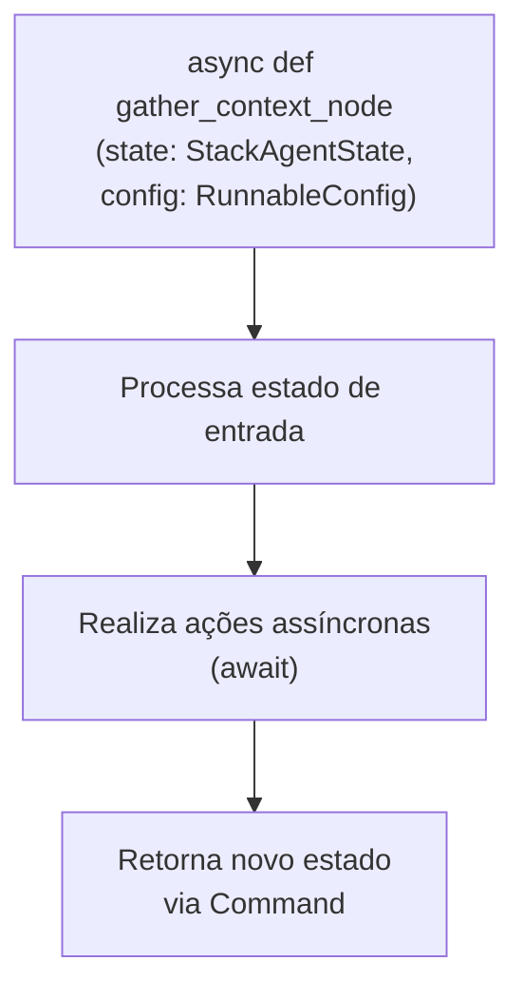
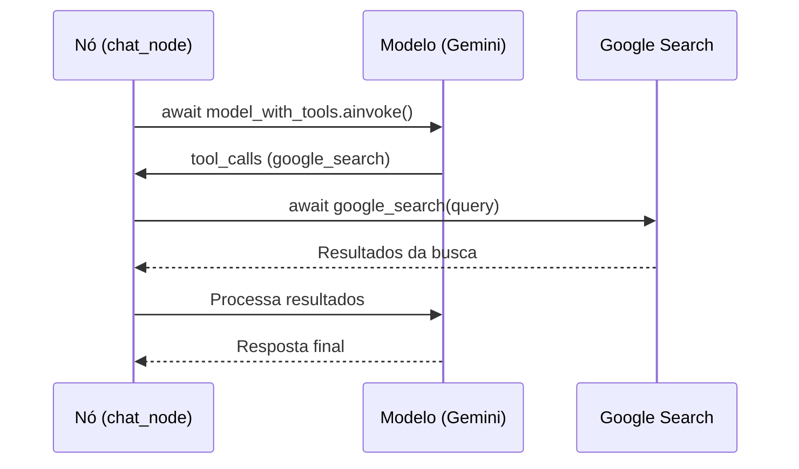

# Criar Nós de Execução Assíncronos

<cite>
**Arquivos Referenciados neste Documento**   
- [stack_agent.py](file://agent/stack_agent.py)
- [posts_generator_agent.py](file://agent/posts_generator_agent.py)
- [main.py](file://agent/main.py)
- [prompts.py](file://agent/prompts.py)
</cite>

## Sumário
1. [Introdução](#introdução)
2. [Estrutura do Projeto e Componentes Principais](#estrutura-do-projeto-e-componentes-principais)
3. [Definição de Nós Assíncronos](#definição-de-nós-assíncronos)
4. [Gerenciamento de Estado e Fluxo de Execução](#gerenciamento-de-estado-e-fluxo-de-execução)
5. [Interação com APIs Externas de Forma Não Bloqueante](#interação-com-apis-externas-de-forma-não-bloqueante)
6. [Gestão de Erros em Nós Assíncronos](#gestão-de-erros-em-nós-assíncronos)
7. [Dicas de Desempenho: Timeout e Retry](#dicas-de-desempenho-timeout-e-retry)
8. [Estruturação para Testes Unitários](#estruturação-para-testes-unitários)
9. [Conclusão](#conclusão)

## Introdução

Este documento fornece uma explicação detalhada sobre como implementar nós assíncronos no grafo de execução utilizando o framework LangGraph. O foco está em demonstrar práticas eficazes para criar funções assíncronas que atuam como nós dentro de um grafo de estado, como `gather_context_node`, `chat_node` e `analyze_repository_node`. Serão abordados conceitos fundamentais como o uso de `async/await`, gerenciamento de erros com blocos try-catch, interação não bloqueante com APIs externas (como Gemini, GitHub e Google Search), além de boas práticas para desempenho e testabilidade. A análise é baseada em exemplos reais do código da aplicação, destacando como os nós processam o estado de entrada, realizam ações e retornam um novo estado.

## Estrutura do Projeto e Componentes Principais

O projeto é organizado em uma estrutura modular, com agentes especializados localizados no diretório `agent/`. Os principais componentes analisados são:

- **`stack_agent.py`**: Contém a lógica para análise de repositórios GitHub, com nós como `gather_context_node` e `analyze_with_gemini_node`.
- **`posts_generator_agent.py`**: Implementa um agente para geração de posts, com nós como `chat_node` e `fe_actions_node`.
- **`main.py`**: Configura o servidor FastAPI e integra os diferentes agentes.
- **`prompts.py`**: Define os prompts do sistema utilizados pelos agentes.

Esses arquivos demonstram um padrão consistente de uso de LangGraph para orquestrar fluxos de trabalho complexos de forma assíncrona.

**Section sources**
- [stack_agent.py](file://agent/stack_agent.py)
- [posts_generator_agent.py](file://agent/posts_generator_agent.py)
- [main.py](file://agent/main.py)
- [prompts.py](file://agent/prompts.py)

## Definição de Nós Assíncronos

Nós no LangGraph são definidos como funções assíncronas que recebem o estado atual do grafo e a configuração de execução. Essas funções são decoradas com `async` e utilizam `await` para operações que podem levar tempo, como chamadas de API.

### Funções Assíncronas como Nós

A função `gather_context_node` no arquivo `stack_agent.py` é um exemplo claro de um nó assíncrono. Ela é definida com `async def` e recebe dois parâmetros: `state` (do tipo `StackAgentState`) e `config` (do tipo `RunnableConfig`).



**Diagram sources**
- [stack_agent.py](file://agent/stack_agent.py#L273-L355)

### Adição de Nós ao Grafo

Os nós são adicionados ao grafo de estado usando o método `add_node` da classe `StateGraph`. No `stack_agent.py`, o nó `gather_context_node` é adicionado ao grafo `workflow` com uma chave identificadora.

```python
workflow.add_node("gather_context", gather_context_node)
```

Este padrão é consistente em todo o projeto, permitindo que o LangGraph invoque a função assíncrona no momento apropriado durante a execução do fluxo.

**Section sources**
- [stack_agent.py](file://agent/stack_agent.py#L493-L495)

## Gerenciamento de Estado e Fluxo de Execução

O LangGraph utiliza um estado compartilhado entre os nós, que é passado como um dicionário. Os nós podem ler e modificar esse estado, devolvendo um novo estado ou atualizações parciais.

### Processamento do Estado de Entrada

O nó `gather_context_node` processa o estado de entrada para extrair a última mensagem do usuário, procurando por uma URL do GitHub. Ele utiliza `state["messages"][-1].content` para acessar o conteúdo da mensagem.

```python
last_user_content = state["messages"][-1].content if state["messages"] else ""
```

Se uma URL válida for encontrada, o nó prossegue para coletar informações do repositório. Caso contrário, ele retorna um comando para ir diretamente para o nó de análise com um contexto vazio.

### Retorno de Novo Estado

Os nós não modificam o estado diretamente. Em vez disso, eles retornam um objeto `Command` que instrui o grafo sobre a próxima ação. O `Command` pode especificar o próximo nó a ser executado (`goto`) e as atualizações a serem aplicadas ao estado (`update`).

No `gather_context_node`, após coletar todas as informações do repositório, o nó retorna:

```python
return Command(
    goto="analyze",
    update={
        "analysis": state["analysis"],
        "context": context,
        "tool_logs": state["tool_logs"],
        "show_cards": False,
        "last_user_content": last_user_content
    }
)
```

Isso demonstra como o nó encapsula as mudanças de estado e direciona o fluxo para o próximo nó, `analyze`.

**Section sources**
- [stack_agent.py](file://agent/stack_agent.py#L273-L355)

## Interação com APIs Externas de Forma Não Bloqueante

Uma das principais vantagens do uso de nós assíncronos é a capacidade de realizar chamadas a APIs externas sem bloquear a execução do programa.

### Chamadas Assíncronas a APIs

No nó `analyze_with_gemini_node`, o agente interage com o modelo de linguagem Gemini através da API do OpenRouter. A chamada é feita de forma não bloqueante usando `await`:

```python
tool_msg = await bound.ainvoke(messages, config)
```

O método `ainvoke` é a versão assíncrona do `invoke`, permitindo que outras operações ocorram enquanto a resposta da API está sendo processada.

### Uso de Ferramentas Assíncronas

O nó `chat_node` no `posts_generator_agent.py` utiliza uma ferramenta de busca do Google definida como uma função assíncrona com `@tool`:

```python
@tool
async def google_search(query: str) -> str:
    ...
```

Quando o modelo decide chamar esta ferramenta, o LangGraph executa a função assíncrona e aguarda sua conclusão com `await`, mantendo o fluxo não bloqueante.



**Diagram sources**
- [posts_generator_agent.py](file://agent/posts_generator_agent.py#L38-L110)
- [stack_agent.py](file://agent/stack_agent.py#L358-L476)

## Gestão de Erros em Nós Assíncronos

O tratamento de erros é crucial em operações assíncronas, especialmente quando se interage com serviços externos que podem falhar.

### Blocos Try-Catch

O nó `analyze_with_gemini_node` implementa um tratamento robusto de erros. Ele envolve a tentativa de invocação da ferramenta em um bloco `try-except`:

```python
try:
    bound = model.bind_tools([return_stack_analysis_tool])
    tool_msg = await bound.ainvoke(messages, config)
    # ... processamento da resposta
except Exception:
    pass  # Falha silenciosa, tenta fallback
```

Se a chamada com ferramentas falhar, o nó não interrompe a execução. Em vez disso, ele passa silenciosamente para um mecanismo de fallback que utiliza `with_structured_output`.

### Mecanismos de Fallback

O nó demonstra uma estratégia de resiliência ao ter dois mecanismos para obter uma análise estruturada:

1.  **Chamada de Ferramenta**: Tenta forçar o modelo a chamar a ferramenta `return_stack_analysis`.
2.  **Saída Estruturada**: Se a chamada de ferramenta falhar, usa `with_structured_output` como um fallback.

Ambos os mecanismos estão envolvidos em blocos `try-except`, garantindo que uma falha em um não comprometa todo o fluxo.

**Section sources**
- [stack_agent.py](file://agent/stack_agent.py#L358-L476)

## Dicas de Desempenho: Timeout e Retry

O código demonstra práticas importantes para garantir o desempenho e a confiabilidade das chamadas externas.

### Configuração de Timeout

As chamadas HTTP para a API do GitHub são feitas com um timeout explícito de 30 segundos:

```python
resp = requests.get(url, headers=_github_headers(), timeout=30)
```

Isso impede que o nó fique esperando indefinidamente por uma resposta.

### Retentativas Automáticas

O cliente `ChatOpenAI` é configurado com um número máximo de retentativas (`max_retries=2`):

```python
model = ChatOpenAI(
    ...
    max_retries=2,
)
```

Esta configuração permite que o cliente tente novamente a chamada à API em caso de falhas transitórias, aumentando a robustez do sistema.

### Emissão de Estado para Feedback

O uso de `await copilotkit_emit_state(config, state)` após cada etapa importante (como iniciar uma busca ou concluir uma tarefa) fornece feedback em tempo real à interface do usuário. Isso melhora a experiência do usuário, mesmo durante operações demoradas.

**Section sources**
- [stack_agent.py](file://agent/stack_agent.py#L178-L185)
- [stack_agent.py](file://agent/stack_agent.py#L285-L287)

## Estruturação para Testes Unitários

A estrutura dos nós facilita a realização de testes unitários, pois cada nó é uma função pura que opera sobre um estado definido.

### Dependências Injetadas

Embora o código não demonstre explicitamente injeção de dependências para testes, a separação clara de responsabilidades (por exemplo, funções como `_fetch_repo_info` e `_fetch_languages`) permite que essas funções sejam facilmente mockadas em um ambiente de teste.

### Estados Bem Definidos

A definição de classes de estado como `StackAgentState` e `AgentState` usando Pydantic fornece uma estrutura clara e validada para o estado do grafo. Isso permite que os testes criem instâncias de estado com dados específicos para simular diferentes cenários.

```python
class StackAgentState(CopilotKitState):
    tool_logs: List[Dict[str, Any]]
    analysis: Dict[str, Any]
    show_cards: bool
    context : Dict[str, Any]
    last_user_content : str
```

Um teste pode criar um `StackAgentState` com um `context` vazio para testar o caminho de falha do `gather_context_node`, ou com um `context` completo para testar o caminho de sucesso.

**Section sources**
- [stack_agent.py](file://agent/stack_agent.py#L29-L34)
- [posts_generator_agent.py](file://agent/posts_generator_agent.py#L33-L35)

## Conclusão

A implementação de nós assíncronos no LangGraph, conforme demonstrado no código analisado, segue um padrão robusto e escalável. A utilização de `async/await` permite interações não bloqueantes com APIs externas, mantendo a eficiência do sistema. O gerenciamento de estado é feito de forma imutável através do retorno de objetos `Command`, garantindo um fluxo de execução previsível. O tratamento de erros com blocos `try-except` e mecanismos de fallback aumenta a resiliência do sistema. Configurações como timeout e retry são essenciais para um desempenho confiável. Por fim, a estrutura modular e a definição clara de estados e funções facilitam a testabilidade, permitindo a criação de testes unitários abrangentes para garantir a qualidade do código.