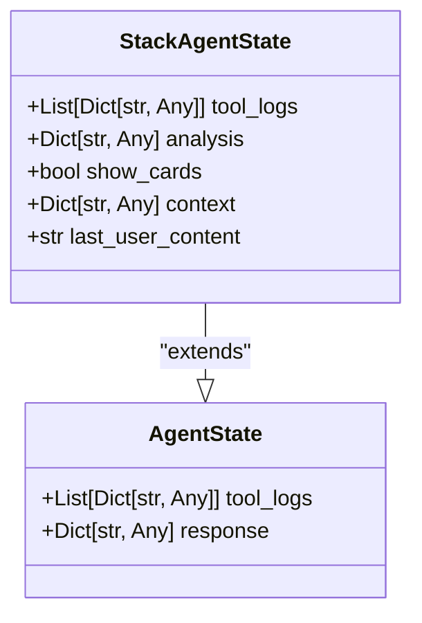
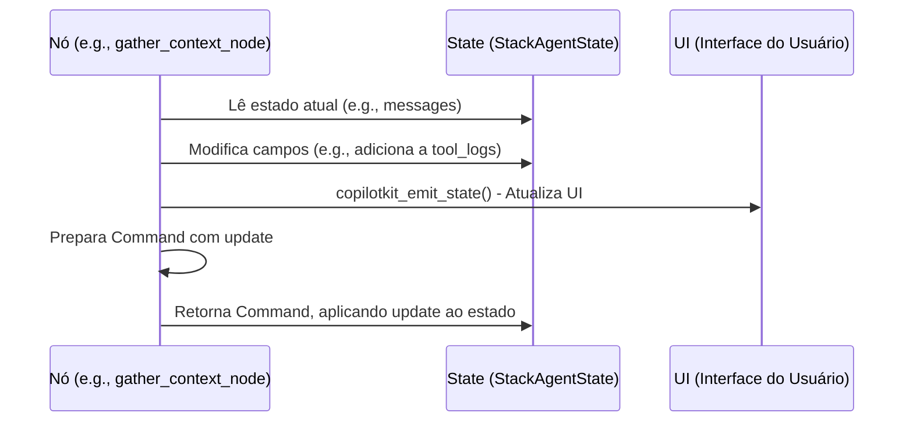

# Definir o Estado do Agente

<cite>
**Arquivos Referenciados neste Documento**   
- [posts_generator_agent.py](file://agent/posts_generator_agent.py)
- [stack_agent.py](file://agent/stack_agent.py)
- [main.py](file://agent/main.py)
</cite>

## Sumário
1. [Introdução](#introdução)
2. [Estrutura do Estado do Agente](#estrutura-do-estado-do-agente)
3. [Definição de Classes de Estado com Pydantic](#definição-de-classes-de-estado-com-pydantic)
4. [Fluxo de Atualização do Estado](#fluxo-de-atualização-do-estado)
5. [Boas Práticas na Modelagem do Estado](#boas-práticas-na-modelagem-do-estado)
6. [Problemas Comuns e Soluções](#problemas-comuns-e-soluções)
7. [Conclusão](#conclusão)

## Introdução

No contexto do LangGraph, o estado do agente é um componente fundamental que armazena dados persistentes durante a execução do grafo. Este documento detalha como definir um estado personalizado utilizando Pydantic, com foco em classes que herdam de `CopilotKitState` (baseado em `TypedDict`). O estado permite que os nós do grafo compartilhem informações, como mensagens, logs de ferramentas e resultados de análise, garantindo um fluxo de dados coerente e estruturado.

**Seção fontes**
- [posts_generator_agent.py](file://agent/posts_generator_agent.py#L33-L35)
- [stack_agent.py](file://agent/stack_agent.py#L29-L34)

## Estrutura do Estado do Agente

O estado do agente é definido como uma classe Python que herda de `CopilotKitState`, servindo como um esquema tipado para os dados do grafo. Cada campo do estado representa uma parte específica do contexto da execução.

### AgentState
Na classe `AgentState`, utilizada pelo agente de geração de posts, os campos principais são:
- **`tool_logs`**: Uma lista de dicionários que registra as operações de ferramentas (como buscas) com status de processamento.
- **`response`**: Um dicionário que armazena a resposta gerada pelo modelo de linguagem.

### StackAgentState
A classe `StackAgentState`, usada para análise de repositórios GitHub, expande o estado com campos adicionais:
- **`analysis`**: Armazena o resultado estruturado da análise do stack tecnológico.
- **`context`**: Contém dados coletados do repositório, como metadados, linguagens e arquivos manifest.
- **`last_user_content`**: Guarda o conteúdo da última mensagem do usuário para referência.
- **`show_cards`**: Um booleano que controla a exibição de componentes de interface.

Esses campos são essenciais para coordenar a lógica entre os nós do grafo, permitindo que cada etapa acesse e modifique o estado de forma previsível.



**Fontes do Diagrama**
- [posts_generator_agent.py](file://agent/posts_generator_agent.py#L33-L35)
- [stack_agent.py](file://agent/stack_agent.py#L29-L34)

**Seção fontes**
- [posts_generator_agent.py](file://agent/posts_generator_agent.py#L33-L35)
- [stack_agent.py](file://agent/stack_agent.py#L29-L34)

## Definição de Classes de Estado com Pydantic

Embora as classes de estado (`AgentState`, `StackAgentState`) herdem de `CopilotKitState` (que é baseado em `TypedDict`), o projeto utiliza extensivamente Pydantic para validação de dados em outros contextos, como `StructuredStackAnalysis`. Isso demonstra um padrão de uso onde Pydantic garante tipagem rigorosa e validação de esquemas complexos.

A definição de uma classe de estado envolve:
1. **Herança**: A classe herda de `CopilotKitState` para integrar-se ao sistema de estado do CopilotKit.
2. **Declaração de Campos**: Cada campo é declarado com seu tipo Python (e.g., `List[Dict[str, Any]]`, `bool`).
3. **Tipagem Estrita**: A estrutura é validada em tempo de execução, garantindo que apenas dados do tipo correto sejam armazenados.

Este modelo de dados é crucial para a integridade do fluxo de trabalho, pois previne erros de tipo que poderiam corromper o estado.

**Seção fontes**
- [posts_generator_agent.py](file://agent/posts_generator_agent.py#L33-L35)
- [stack_agent.py](file://agent/stack_agent.py#L29-L34)

## Fluxo de Atualização do Estado

O estado é atualizado em cada nó do grafo através do objeto `Command`, que especifica as alterações a serem aplicadas. O processo envolve a emissão de atualizações para a interface do usuário e a modificação seletiva dos campos do estado.

### Exemplo de Atualização no Nó `gather_context_node`
1. **Adição de Log**: Um novo log é adicionado à lista `tool_logs` para indicar que o contexto está sendo coletado.
2. **Emissão de Estado**: `copilotkit_emit_state(config, state)` notifica a interface do progresso.
3. **Atualização Final**: Após coletar dados do GitHub, um `Command` é retornado com `update` contendo o novo `context` e `last_user_content`.

```python
return Command(
    goto="analyze",
    update={
        "analysis": state["analysis"],
        "context": context,
        "tool_logs": state["tool_logs"],
        "show_cards": False,
        "last_user_content": last_user_content
    }
)
```

Este padrão garante que o estado seja imutável entre nós, pois cada nó retorna um novo estado em vez de modificá-lo diretamente, promovendo previsibilidade e facilitando a depuração.



**Fontes do Diagrama**
- [stack_agent.py](file://agent/stack_agent.py#L273-L355)
- [posts_generator_agent.py](file://agent/posts_generator_agent.py#L38-L110)

**Seção fontes**
- [stack_agent.py](file://agent/stack_agent.py#L273-L355)
- [posts_generator_agent.py](file://agent/posts_generator_agent.py#L38-L110)

## Boas Práticas na Modelagem do Estado

Para garantir um sistema robusto e manutenível, siga estas práticas ao modelar o estado do agente.

### Imutabilidade
O estado deve ser tratado como imutável. Em vez de modificar o estado in-place, os nós devem retornar um novo estado através do campo `update` do `Command`. Isso evita efeitos colaterais inesperados e torna o fluxo de dados mais previsível.

### Tipagem Rigorosa
Utilize anotações de tipo Python para todos os campos. Isso não apenas documenta a intenção, mas também permite que ferramentas de análise estática detectem erros antes da execução.

### Serialização para Depuração
Campos como `tool_logs` são estruturados como listas de dicionários, facilitando a serialização para JSON. Isso é vital para depuração, pois permite que o estado seja facilmente inspecionado e registrado.

### Separação de Concerns
Organize os campos por responsabilidade:
- `tool_logs` para rastreamento de operações.
- `context` para dados externos coletados.
- `analysis` para resultados processados.
Essa separação torna o estado mais legível e modular.

**Seção fontes**
- [stack_agent.py](file://agent/stack_agent.py#L29-L34)
- [posts_generator_agent.py](file://agent/posts_generator_agent.py#L33-L35)

## Problemas Comuns e Soluções

### Estados Não Sincronizados
**Problema**: A UI pode não refletir o estado mais recente se `copilotkit_emit_state` não for chamado após modificações.
**Solução**: Sempre chame `copilotkit_emit_state(config, state)` imediatamente após modificar o estado, antes de qualquer operação assíncrona.

### Perda de Dados entre Nós
**Problema**: Um nó pode sobrescrever campos do estado que não foram explicitamente incluídos no `update`.
**Solução**: Ao retornar um `Command`, inclua explicitamente todos os campos que devem persistir, mesmo que não tenham sido alterados. Por exemplo, sempre inclua `tool_logs` e `analysis` no `update`, mesmo que apenas `context` tenha mudado.

### Inicialização Incompleta
**Problema**: Acessar campos não inicializados (e.g., `state.get("context", {})`) pode levar a erros.
**Solução**: Defina valores padrão nos campos da classe de estado sempre que possível, ou use métodos seguros como `.get()` com valores padrão ao acessar dicionários.

**Seção fontes**
- [stack_agent.py](file://agent/stack_agent.py#L273-L355)
- [stack_agent.py](file://agent/stack_agent.py#L358-L476)

## Conclusão

Definir um estado personalizado para um agente no LangGraph envolve a criação de uma classe que herda de `CopilotKitState`, com campos tipados que representam o contexto da execução. O uso de Pydantic para validação de esquemas internos, como `StructuredStackAnalysis`, complementa essa abordagem, garantindo dados consistentes. A atualização do estado deve ser feita de forma imutável através de `Command`, com emissão de atualizações para a UI. Seguir boas práticas de tipagem, separação de concerns e tratamento de erros é essencial para construir agentes robustos e fáceis de depurar.