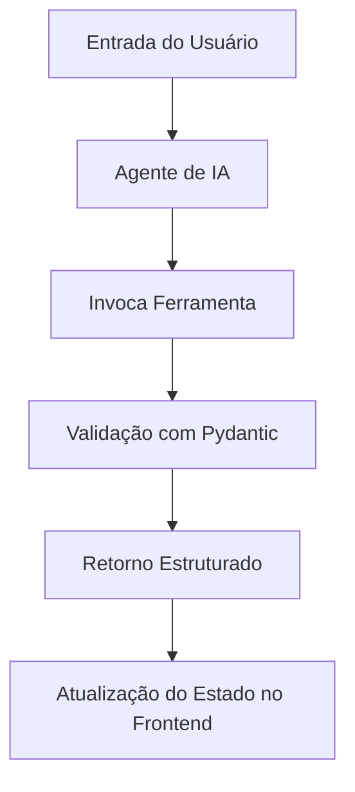
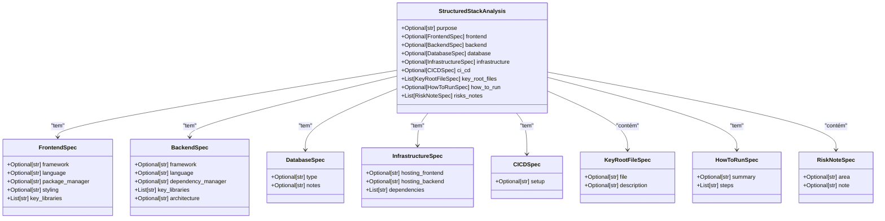
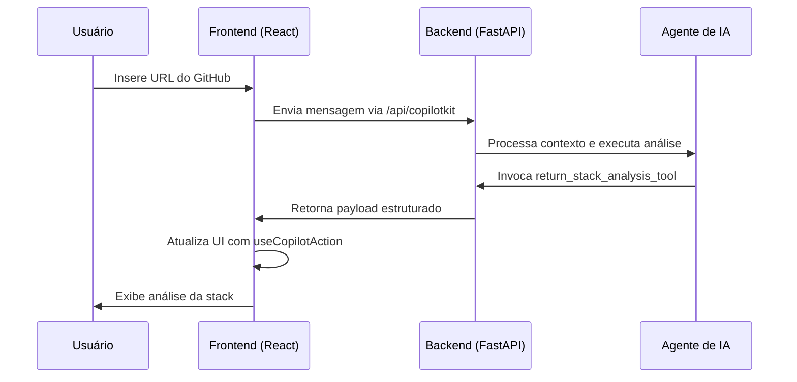

# Definir Ferramentas Personalizadas

<cite>
**Arquivos Referenciados neste Documento**  
- [stack_agent.py](file://agent/stack_agent.py)
- [main.py](file://agent/main.py)
- [route.ts](file://app/api/copilotkit/route.ts)
- [wrapper.tsx](file://app/wrapper.tsx)
</cite>

## Sumário
1. [Introdução](#introdução)
2. [Estrutura de Ferramentas com `@tool` e Pydantic](#estrutura-de-ferramentas-com-tool-e-pydantic)
3. [Exemplo: `return_stack_analysis_tool`](#exemplo-return_stack_analysis_tool)
4. [Validação com Esquemas Pydantic](#validação-com-esquemas-pydantic)
5. [Uso no Modelo de IA e Controle de Saída](#uso-no-modelo-de-ia-e-controle-de-saída)
6. [Chamada no Frontend com `useCopilotAction`](#chamada-no-frontend-com-usecopilotaction)
7. [Boas Práticas no Desenvolvimento de Ferramentas](#boas-práticas-no-desenvolvimento-de-ferramentas)
8. [Teste Isolado de Ferramentas](#teste-isolado-de-ferramentas)
9. [Conclusão](#conclusão)

## Introdução
O desenvolvimento de ferramentas personalizadas para agentes de IA permite controlar com precisão o formato e o conteúdo das respostas geradas. No ecossistema CopilotKit e LangGraph, isso é feito utilizando o decorador `@tool` e esquemas de validação baseados em Pydantic. Essas ferramentas são essenciais para garantir que o modelo de IA produza saídas estruturadas, previsíveis e utilizáveis tanto no backend quanto no frontend. Este documento explica como criar, validar e integrar essas ferramentas, usando o exemplo `return_stack_analysis_tool`.

**Section sources**
- [stack_agent.py](file://agent/stack_agent.py#L100-L106)

## Estrutura de Ferramentas com `@tool` e Pydantic
Ferramentas personalizadas são definidas com o decorador `@tool`, que as registra como ações invocáveis por agentes de IA. O parâmetro `args_schema` permite associar um modelo Pydantic ao conjunto de argumentos esperados pela ferramenta, garantindo que os dados recebidos estejam estruturados e validados antes do processamento.

Essa abordagem combina a flexibilidade do LangChain com a robustez da validação de dados do Pydantic, permitindo que o modelo de IA gere saídas em formato JSON estrito, alinhadas com contratos de dados definidos previamente.

**Diagram sources**
- [stack_agent.py](file://agent/stack_agent.py#L85-L94)
- [stack_agent.py](file://agent/stack_agent.py#L100-L106)

## Exemplo: `return_stack_analysis_tool`
A ferramenta `return_stack_analysis_tool` é usada para retornar uma análise estruturada de um repositório GitHub, incluindo pilha tecnológica, propósito, arquivos-chave e riscos. Ela é decorada com `@tool` e especifica `StructuredStackAnalysis` como seu `args_schema`.

Essa ferramenta é chamada pelo modelo de IA após a análise de contexto do repositório. O uso do esquema garante que todos os campos retornados sigam uma estrutura predefinida, facilitando o consumo no frontend.

**Section sources**
- [stack_agent.py](file://agent/stack_agent.py#L100-L106)

## Validação com Esquemas Pydantic
O modelo `StructuredStackAnalysis` é um `BaseModel` do Pydantic que define todos os campos da análise. Ele inclui campos opcionais como `purpose`, `frontend`, `backend`, `database`, entre outros, além de listas estruturadas como `key_root_files` e `risks_notes`.

Durante a execução, a ferramenta tenta instanciar o modelo com os argumentos fornecidos. Se a validação falhar, os dados brutos são retornados como fallback, garantindo resiliência sem comprometer a integridade do fluxo.

**Diagram sources**
- [stack_agent.py](file://agent/stack_agent.py#L85-L94)

## Uso no Modelo de IA e Controle de Saída
O modelo de IA é instruído a sempre chamar a ferramenta `return_stack_analysis` em vez de gerar texto livre. Isso é feito configurando o modelo com `bind_tools([return_stack_analysis_tool])`, forçando-o a produzir uma chamada de ferramenta com argumentos válidos.

Se o modelo falhar em gerar uma chamada estruturada, um fallback com `with_structured_output` é usado para garantir que a saída ainda siga o esquema esperado. Isso assegura que o frontend receba sempre um payload JSON coerente.

**Section sources**
- [stack_agent.py](file://agent/stack_agent.py#L200-L250)

## Chamada no Frontend com `useCopilotAction`
No frontend, a ferramenta é automaticamente detectada e chamada via `useCopilotAction`, um hook do CopilotKit. Quando o agente invoca `return_stack_analysis`, o frontend recebe o payload estruturado e pode atualizar a interface com base nos dados validados.

O componente `wrapper.tsx` envolve a aplicação com `CopilotKit`, fornecendo o `runtimeUrl` e o agente ativo, permitindo a sincronização de estado em tempo real.

**Diagram sources**
- [route.ts](file://app/api/copilotkit/route.ts#L1-L30)
- [wrapper.tsx](file://app/wrapper.tsx#L1-L11)

## Boas Práticas no Desenvolvimento de Ferramentas
- **Nomes descritivos**: Use nomes claros como `return_stack_analysis` para facilitar a interpretação pelo modelo.
- **Esquemas bem documentados**: Inclua docstrings e anotações nos modelos Pydantic para orientar o modelo de IA.
- **Campos opcionais**: Use `Optional[]` e valores padrão para aumentar a flexibilidade.
- **Tratamento de erros**: Sempre envolva a validação em blocos `try-except` para evitar falhas no fluxo.
- **Exclusão de nulos**: Use `model_dump(exclude_none=True)` para manter o JSON limpo.

**Section sources**
- [stack_agent.py](file://agent/stack_agent.py#L85-L94)
- [stack_agent.py](file://agent/stack_agent.py#L100-L106)

## Teste Isolado de Ferramentas
Ferramentas podem ser testadas isoladamente fora do grafo LangGraph. Por exemplo, é possível chamar `return_stack_analysis_tool(**kwargs)` diretamente com um dicionário de teste para verificar se a validação funciona corretamente e se o payload de saída está no formato esperado.

Isso permite validar o comportamento da ferramenta independentemente do agente, facilitando depuração e integração contínua.

**Section sources**
- [stack_agent.py](file://agent/stack_agent.py#L100-L106)

## Conclusão
A criação de ferramentas personalizadas com `@tool` e esquemas Pydantic é fundamental para construir agentes de IA previsíveis e robustos. O exemplo `return_stack_analysis_tool` demonstra como estruturar, validar e integrar saídas de IA de forma controlada, beneficiando tanto o backend quanto o frontend. Com boas práticas e testes adequados, essas ferramentas se tornam blocos de construção confiáveis em aplicações de IA complexas.