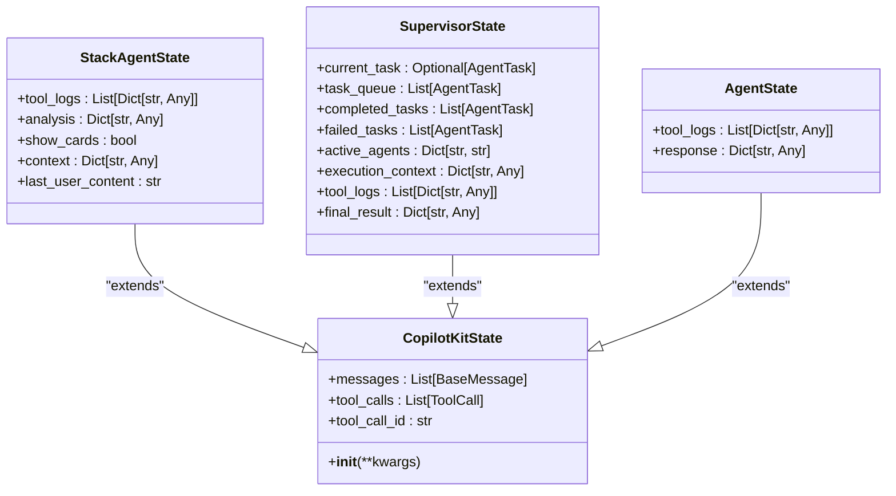
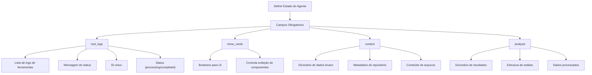
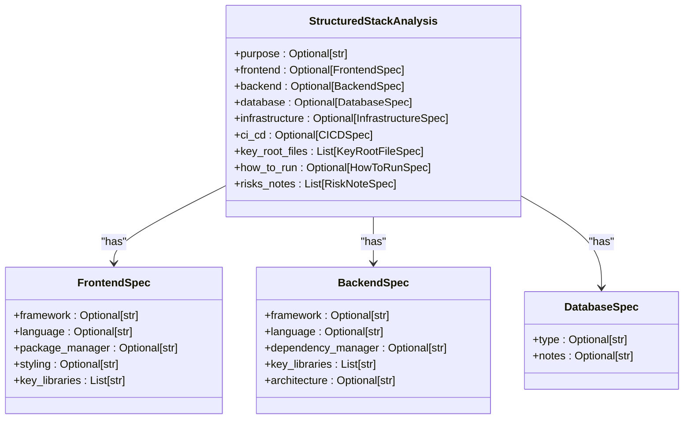

# Definir o Estado do Agente

<cite>
**Arquivos Referenciados neste Documento**  
- [stack_agent.py](file://agent/stack_agent.py)
- [supervisor.py](file://agent/supervisor.py)
- [posts_generator_agent.py](file://agent/posts_generator_agent.py)
- [main.py](file://agent/main.py)
- [page.tsx](file://app/stack-analyzer/page.tsx)
</cite>

## Sumário
1. [Introdução](#introdução)
2. [Estrutura Básica da Classe de Estado](#estrutura-básica-da-classe-de-estado)
3. [Campos Obrigatórios do Estado](#campos-obrigatórios-do-estado)
4. [Uso do Estado na Execução do Grafo](#uso-do-estado-na-execução-do-grafo)
5. [Campos Personalizados e Tipos Pydantic](#campos-personalizados-e-tipos-pydantic)
6. [Persistência com Checkpointer](#persistência-com-checkpointer)
7. [Emissão do Estado para a Interface](#emissão-do-estado-para-a-interface)
8. [Boas Práticas](#boas-práticas)
9. [Conclusão](#conclusão)

## Introdução

Definir o estado do agente é uma etapa fundamental na construção de agentes de IA com o framework CopilotKit. O estado atua como o "cérebro" do agente, armazenando informações críticas durante a execução, permitindo persistência entre chamadas e facilitando a comunicação com a interface do usuário. Este documento explica como estender a classe `CopilotKitState` para criar estados personalizados, utilizando exemplos do projeto `open-gemini-canvas`. Ele cobre a estrutura básica, os campos obrigatórios, o uso de tipos Pydantic para validação e as práticas recomendadas para segurança e eficiência.

**Section sources**
- [stack_agent.py](file://agent/stack_agent.py#L29-L34)
- [supervisor.py](file://agent/supervisor.py#L80-L121)

## Estrutura Básica da Classe de Estado

A estrutura básica de um estado de agente envolve a criação de uma nova classe Python que herda de `CopilotKitState`. Essa classe define os campos que serão utilizados para armazenar dados durante a execução do agente. O projeto demonstra dois exemplos principais: `StackAgentState` para análise de repositórios e `SupervisorState` para coordenação de múltiplos agentes.

A herança de `CopilotKitState` é o mecanismo central que permite ao framework gerenciar o estado, fornecendo funcionalidades como serialização, persistência e emissão para a interface do usuário. A definição da classe é feita usando a sintaxe de classes do Python, onde cada campo é declarado como um atributo com seu tipo anotado.

**Diagram sources**
- [stack_agent.py](file://agent/stack_agent.py#L29-L34)
- [supervisor.py](file://agent/supervisor.py#L80-L121)
- [posts_generator_agent.py](file://agent/posts_generator_agent.py#L25-L28)

**Section sources**
- [stack_agent.py](file://agent/stack_agent.py#L29-L34)
- [supervisor.py](file://agent/supervisor.py#L80-L121)
- [posts_generator_agent.py](file://agent/posts_generator_agent.py#L25-L28)

## Campos Obrigatórios do Estado

Embora não haja uma lista rígida de campos "obrigatórios" imposta pelo `CopilotKitState` base, certos campos se tornam essenciais com base no padrão de design do projeto. O campo `tool_logs` é um exemplo universal, usado em todos os agentes do projeto para rastrear o progresso e o status das operações em andamento. Ele é uma lista de dicionários que registra mensagens, status (como "processing" ou "completed") e metadados de cada etapa da execução.

Outros campos, como `analysis`, `context` e `show_cards`, são específicos para o domínio do agente. Por exemplo, `StackAgentState` usa `analysis` para armazenar os resultados estruturados da análise de um repositório GitHub e `context` para manter os dados brutos coletados (como metadados do repositório e arquivos de manifesto). O campo `show_cards` é um booleano que atua como um sinalizador para a interface do usuário, indicando quando os dados de análise estão prontos para serem exibidos.

**Diagram sources**
- [stack_agent.py](file://agent/stack_agent.py#L29-L34)
- [page.tsx](file://app/stack-analyzer/page.tsx#L172-L192)

**Section sources**
- [stack_agent.py](file://agent/stack_agent.py#L29-L34)
- [page.tsx](file://app/stack-analyzer/page.tsx#L172-L192)

## Uso do Estado na Execução do Grafo

O estado é o principal meio de comunicação entre os nós (nodes) de um grafo LangGraph. Durante a execução, cada nó recebe o estado atual como um parâmetro e retorna um objeto `Command` que especifica a próxima ação e as atualizações para o estado. O nó `gather_context_node` no `stack_agent.py` demonstra esse padrão: ele extrai uma URL do GitHub da última mensagem do usuário, faz chamadas à API do GitHub para coletar dados e, em seguida, atualiza o campo `context` do estado com essas informações.

O campo `tool_logs` é usado ativamente para fornecer feedback em tempo real. Quando uma nova etapa começa, um novo log é adicionado à lista com status "processing". Após a conclusão da etapa, o status é atualizado para "completed". Esse mecanismo permite que a interface do usuário mostre uma barra de progresso ou uma lista de etapas em andamento.

**Section sources**
- [stack_agent.py](file://agent/stack_agent.py#L129-L222)
- [supervisor.py](file://agent/supervisor.py#L325-L391)

## Campos Personalizados e Tipos Pydantic

Para armazenar dados específicos do domínio de forma estruturada e validada, o projeto utiliza modelos Pydantic. No `stack_agent.py`, a classe `StructuredStackAnalysis` define um esquema rigoroso para os resultados da análise, com campos aninhados para `frontend`, `backend`, `database`, etc. Isso garante que os dados gerados pelo modelo de IA estejam em um formato consistente e previsível.

A criação de campos personalizados na classe de estado é direta. Por exemplo, `SupervisorState` define campos como `current_task` (do tipo `AgentTask`) e `task_queue` (uma lista de `AgentTask`) para gerenciar uma fila de tarefas. O uso de `Field(default_factory=list)` é uma prática recomendada para inicializar campos mutáveis como listas e dicionários, evitando problemas com valores padrão compartilhados entre instâncias.

**Diagram sources**
- [stack_agent.py](file://agent/stack_agent.py#L45-L120)

**Section sources**
- [stack_agent.py](file://agent/stack_agent.py#L45-L120)

## Persistência com Checkpointer

A persistência do estado entre execuções é habilitada pela configuração do grafo com um `checkpointer`. No projeto, o `MemorySaver` é usado em todos os grafos (`stack_analysis_graph`, `supervisor_graph`, `post_generation_graph`). O `checkpointer` serializa o estado completo após cada nó ser executado e o armazena em um backend (no caso do `MemorySaver`, na memória do servidor).

Isso significa que se uma conversa com o agente for interrompida e retomada mais tarde, o estado será restaurado a partir do último ponto de verificação. Isso é crucial para manter a continuidade da conversa e para permitir que o agente "lembre" do contexto anterior. A linha `workflow.compile(checkpointer=MemorySaver())` é onde essa funcionalidade é ativada.

**Section sources**
- [stack_agent.py](file://agent/stack_agent.py#L504-L505)
- [posts_generator_agent.py](file://agent/posts_generator_agent.py#L173-L174)
- [main.py](file://agent/main.py#L25-L28)

## Emissão do Estado para a Interface

A função `copilotkit_emit_state` é a ponte entre o backend e a interface do usuário. Sempre que o estado é atualizado (por exemplo, ao adicionar um novo log ou atualizar o campo `analysis`), `copilotkit_emit_state(config, state)` é chamado. Isso emite um evento em tempo real que é capturado pelo SDK do CopilotKit no frontend.

No frontend, o hook `useCoAgent` é usado para se inscrever nesses eventos. O componente `page.tsx` demonstra isso ao definir um `initialState` e ao usar `setState` para atualizar o estado local com base nas emissões do backend. O campo `show_cards` é um exemplo direto de como o estado controla a UI: quando ele é definido como `True`, o componente `StackAnalysisCards` é renderizado.

**Section sources**
- [stack_agent.py](file://agent/stack_agent.py#L157-L159)
- [supervisor.py](file://agent/supervisor.py#L325-L359)
- [page.tsx](file://app/stack-analyzer/page.tsx#L100-L108)

## Boas Práticas

Ao definir o estado do agente, algumas boas práticas devem ser seguidas. Primeiro, evite armazenar dados sensíveis diretamente no estado, pois ele pode ser serializado e armazenado. Segundo, utilize modelos Pydantic para validar dados complexos, garantindo integridade e consistência. Terceiro, use `default_factory` para campos mutáveis. Por fim, mantenha o estado focado; campos como `tool_logs` são úteis para depuração e feedback, mas não devem ser usados para armazenar grandes volumes de dados que não são essenciais para a lógica do agente.

**Section sources**
- [stack_agent.py](file://agent/stack_agent.py#L29-L34)
- [supervisor.py](file://agent/supervisor.py#L80-L121)

## Conclusão

Definir o estado do agente é um processo de modelagem de dados que combina herança de classe, tipagem rigorosa e um entendimento profundo do fluxo de trabalho do agente. Ao estender `CopilotKitState`, os desenvolvedores criam um contêiner estruturado que suporta a execução, a persistência e a interação com o usuário. O uso de `tool_logs` para feedback, modelos Pydantic para validação e o `checkpointer` para persistência são padrões que garantem a construção de agentes robustos, transparentes e contínuos.