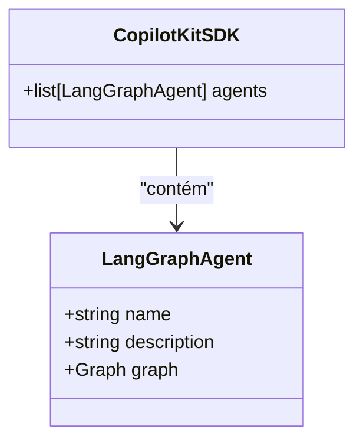
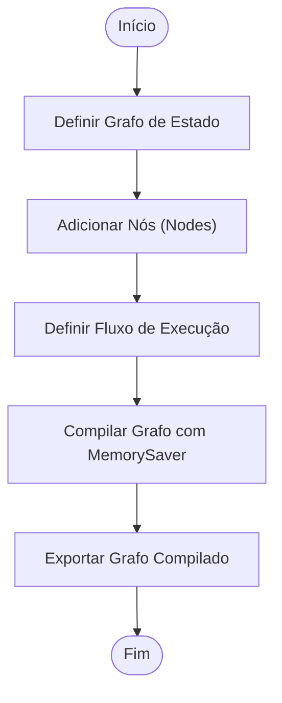

# Integrar o Agente ao FastAPI

<cite>
**Arquivos Referenciados neste Documento**   
- [main.py](file://agent/main.py)
- [posts_generator_agent.py](file://agent/posts_generator_agent.py)
- [stack_agent.py](file://agent/stack_agent.py)
</cite>

## Sumário
1. [Introdução](#introdução)
2. [Estrutura do Projeto](#estrutura-do-projeto)
3. [Papel do main.py como Ponto de Entrada](#papel-do-mainpy-como-ponto-de-entrada)
4. [Criação do SDK do CopilotKit](#criação-do-sdk-do-copilotkit)
5. [Registro do Agente com LangGraphAgent](#registro-do-agente-com-langgraphagent)
6. [Adição do Endpoint FastAPI](#adição-do-endpoint-fastapi)
7. [Requisitos do Grafo Compilado](#requisitos-do-grafo-compilado)
8. [Testes de Integração](#testes-de-integração)
9. [Modo de Desenvolvimento e Recarga Automática](#modo-de-desenvolvimento-e-recarga-automática)
10. [Variáveis de Ambiente Críticas](#variáveis-de-ambiente-críticas)

## Introdução

Este documento fornece um guia prático para registrar um novo agente no servidor FastAPI do projeto Open Gemini Canvas. Ele explica o processo completo de integração, desde a definição do agente até a exposição via endpoints HTTP, cobrindo aspectos críticos como configuração de ambiente, compilação de grafos e práticas recomendadas para evitar conflitos. O foco está na arquitetura baseada em LangGraph e CopilotKit, que permite a criação de agentes inteligentes com estado persistente.

## Estrutura do Projeto

O projeto é organizado em módulos bem definidos, com o diretório `agent/` contendo toda a lógica do backend. Este diretório inclui o arquivo principal `main.py`, que serve como ponto de entrada, e arquivos específicos para cada agente, como `posts_generator_agent.py` e `stack_agent.py`. A separação clara entre a lógica do agente e a configuração do servidor facilita a manutenção e a expansão do sistema com novos agentes.

**Diagram sources**
- [main.py](file://agent/main.py#L1-L62)
- [posts_generator_agent.py](file://agent/posts_generator_agent.py#L1-L175)
- [stack_agent.py](file://agent/stack_agent.py#L1-L506)

## Papel do main.py como Ponto de Entrada

O arquivo `main.py` é o coração do backend, responsável por inicializar o servidor FastAPI e configurar todos os agentes disponíveis. Ele importa as dependências necessárias, carrega as variáveis de ambiente, cria a instância do aplicativo FastAPI e define os endpoints principais. Sua função principal é orquestrar a integração entre o framework FastAPI e o SDK do CopilotKit, garantindo que os agentes sejam corretamente expostos para consumo pela interface frontend.

**Section sources**
- [main.py](file://agent/main.py#L1-L62)

## Criação do SDK do CopilotKit

O SDK do CopilotKit é instanciado como um objeto central que gerencia todos os agentes do sistema. Ele é criado usando a classe `CopilotKitSDK` e recebe uma lista de agentes através do parâmetro `agents`. Este SDK atua como uma camada de abstração entre os agentes baseados em LangGraph e o servidor FastAPI, permitindo uma integração simplificada e padronizada. A criação do SDK é um passo crucial, pois define quais agentes estarão disponíveis para interação.

**Section sources**
- [main.py](file://agent/main.py#L20-L38)

## Registro do Agente com LangGraphAgent

Para registrar um novo agente, é necessário criar uma instância da classe `LangGraphAgent` e adicioná-la à lista de agentes no SDK. Cada instância requer três parâmetros essenciais: um `nome` único, uma `descrição` clara do propósito do agente e uma referência ao `grafo` compilado do LangGraph. O nome do agente é particularmente importante, pois é usado para roteamento de mensagens e deve ser único para evitar conflitos.

**Diagram sources**
- [main.py](file://agent/main.py#L22-L36)

**Section sources**
- [main.py](file://agent/main.py#L22-L36)

## Adição do Endpoint FastAPI

A integração final com o servidor FastAPI é realizada pela função `add_fastapi_endpoint`. Esta função do pacote `copilotkit.integrations.fastapi` conecta o SDK do CopilotKit à instância do FastAPI, expondo os agentes através de um endpoint HTTP específico. No projeto, este endpoint é configurado para `/copilotkit`, tornando os agentes acessíveis via requisições POST para `http://localhost:8000/copilotkit`. Este passo é o que efetivamente torna os agentes disponíveis para a aplicação frontend.

**Section sources**
- [main.py](file://agent/main.py#L40-L41)

## Requisitos do Grafo Compilado

É fundamental que o grafo do LangGraph fornecido ao `LangGraphAgent` esteja previamente compilado com um `checkpointer`. No projeto, isso é feito usando a classe `MemorySaver` do módulo `langgraph.checkpoint.memory`. O `checkpointer` é responsável por persistir o estado do grafo entre as chamadas, permitindo que o agente mantenha contexto e execute fluxos de trabalho longos. A ausência de um `checkpointer` resultará em erros de execução, pois o sistema não poderá gerenciar o estado das conversas.

**Diagram sources**
- [posts_generator_agent.py](file://agent/posts_generator_agent.py#L170-L175)
- [stack_agent.py](file://agent/stack_agent.py#L501-L506)

**Section sources**
- [posts_generator_agent.py](file://agent/posts_generator_agent.py#L170-L175)
- [stack_agent.py](file://agent/stack_agent.py#L501-L506)

## Testes de Integração

O servidor inclui dois endpoints de teste para verificar seu estado de funcionamento. O endpoint raiz `/` retorna uma mensagem de boas-vindas simples, útil para confirmar que o servidor está respondendo. O endpoint `/healthz` serve como uma verificação de saúde, retornando um status 200 com `{"status": "ok"}` quando o servidor está operacional. Esses endpoints são essenciais para depuração e integração com sistemas de monitoramento.

**Section sources**
- [main.py](file://agent/main.py#L43-L50)

## Modo de Desenvolvimento e Recarga Automática

Para facilitar o desenvolvimento, o servidor é configurado para rodar em modo de recarga automática (`reload=True`). Isso significa que qualquer alteração nos arquivos do código-fonte é detectada automaticamente, e o servidor é reiniciado para aplicar as mudanças. Esse recurso acelera significativamente o ciclo de desenvolvimento, pois elimina a necessidade de reiniciar manualmente o servidor após cada modificação. O servidor é iniciado pela função `main()`, que é chamada quando o script é executado diretamente.

**Section sources**
- [main.py](file://agent/main.py#L52-L62)

## Variáveis de Ambiente Críticas

A configuração do servidor depende de variáveis de ambiente definidas no arquivo `.env`. A variável mais crítica é `PORT`, que determina em qual porta o servidor FastAPI escutará as requisições. Se não for definida, o valor padrão é 8000. Outras variáveis importantes, como `OPENROUTER_API_KEY`, `OPENROUTER_MODEL` e `OPENROUTER_BASE_URL`, são necessárias para a comunicação com o modelo de linguagem, mas são carregadas pelos agentes específicos e não diretamente pelo `main.py`.

**Section sources**
- [main.py](file://agent/main.py#L55-L57)