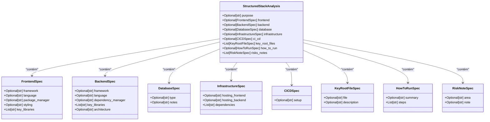

# Criar e Registrar Novas Ferramentas (Tools)

<cite>
**Arquivos Referenciados neste Documento**   
- [stack_agent.py](file://agent/stack_agent.py)
- [posts_generator_agent.py](file://agent/posts_generator_agent.py)
- [main.py](file://agent/main.py)
- [route.ts](file://app/api/copilotkit/route.ts)
</cite>

## Sumário
1. [Introdução](#introdução)
2. [Definição de Ferramentas com o Decorador @tool](#definição-de-ferramentas-com-o-decorador-tool)
3. [Estruturação de Saídas com Pydantic](#estruturação-de-saídas-com-pydantic)
4. [Registro de Ferramentas no Modelo com bind_tools](#registro-de-ferramentas-no-modelo-com-bind_tools)
5. [Orquestração do Fluxo com LangGraph](#orquestração-do-fluxo-com-langgraph)
6. [Tratamento de Erros e Timeouts](#tratamento-de-erros-e-timeouts)
7. [Limitações do Gemini com Ferramentas](#limitações-do-gemini-com-ferramentas)
8. [Exemplo Completo: Ferramenta de Análise de Vulnerabilidades](#exemplo-completo-ferramenta-de-análise-de-vulnerabilidades)

## Introdução

Este documento detalha o processo de criação e registro de ferramentas (tools) para agentes de IA utilizando o framework LangGraph e o modelo Google Gemini. O sistema demonstrado permite a orquestração de fluxos de trabalho complexos onde modelos de linguagem interagem com ferramentas externas para realizar tarefas específicas, como análise de repositórios GitHub ou geração de conteúdo. A arquitetura combina agentes definidos com LangGraph, integração com CopilotKit e execução através de um servidor FastAPI, permitindo a criação de aplicações de IA avançadas com interações estruturadas e saídas previsíveis.

**Section sources**
- [main.py](file://agent/main.py#L1-L63)
- [stack_agent.py](file://agent/stack_agent.py#L1-L506)

## Definição de Ferramentas com o Decorador @tool

A criação de ferramentas no ecossistema LangChain e LangGraph é realizada através do decorador `@tool`, que transforma funções Python em interfaces invocáveis por modelos de linguagem. Este mecanismo permite que o modelo de IA entenda a finalidade da função, seus parâmetros esperados e o formato de saída desejado. No exemplo do agente de análise de stack, a função `return_stack_analysis_tool` é definida como uma ferramenta que retorna a análise estruturada de um repositório GitHub. O decorador `@tool` aceita um parâmetro `args_schema` que especifica o esquema Pydantic para validação dos argumentos de entrada, garantindo que os dados fornecidos pelo modelo estejam em conformidade com a estrutura esperada.

**Section sources**
- [stack_agent.py](file://agent/stack_agent.py#L100-L106)
- [posts_generator_agent.py](file://agent/posts_generator_agent.py#L22-L29)

## Estruturação de Saídas com Pydantic

A utilização de modelos Pydantic é fundamental para garantir saídas estruturadas e validadas das ferramentas. No código analisado, a classe `StructuredStackAnalysis` define um esquema hierárquico completo para representar a análise de um repositório GitHub, incluindo especificações para frontend, backend, banco de dados, infraestrutura e outros componentes. Esta abordagem permite que o modelo de IA gere respostas em formato JSON rigorosamente definido, eliminando a necessidade de parsing de texto livre e aumentando a confiabilidade dos dados extraídos. A validação é realizada dentro da própria função da ferramenta, onde os argumentos recebidos são instanciados como um objeto Pydantic, e qualquer falha na validação resulta no retorno dos dados crus como fallback.



**Diagram sources**
- [stack_agent.py](file://agent/stack_agent.py#L85-L94)

## Registro de Ferramentas no Modelo com bind_tools

O registro de ferramentas no modelo de IA é realizado através do método `bind_tools`, que associa uma lista de ferramentas ao modelo, permitindo que ele as invoque durante a geração de respostas. No exemplo do nó `analyze_with_gemini_node`, o modelo ChatOpenAI é configurado com a ferramenta `return_stack_analysis_tool` usando `model.bind_tools([return_stack_analysis_tool])`. Este processo informa ao modelo quais ferramentas estão disponíveis, suas descrições e esquemas de argumentos, permitindo que ele decida quando e como chamá-las. O sistema implementa uma estratégia de fallback, onde, se a chamada da ferramenta falhar, o modelo tenta gerar uma saída estruturada diretamente usando `with_structured_output`, garantindo robustez no processo de geração.

**Section sources**
- [stack_agent.py](file://agent/stack_agent.py#L358-L476)

## Orquestração do Fluxo com LangGraph

A orquestração do fluxo de trabalho é gerenciada pelo LangGraph, que define um grafo de estados onde cada nó representa uma etapa do processo. No agente de análise de stack, o grafo é composto por três nós principais: `gather_context`, `analyze` e `end`. O nó `gather_context` é responsável por extrair a URL do GitHub da mensagem do usuário e coletar metadados do repositório, enquanto o nó `analyze` utiliza o modelo de IA para processar esses dados e gerar a análise. O uso de `Command` permite o controle avançado do fluxo, como redirecionamentos condicionais e atualizações de estado, enquanto a integração com `copilotkit_emit_state` permite a atualização em tempo real da interface do usuário com o progresso da execução.

```mermaid
graph TD
START((Início)) --> gather_context["gather_context_node"]
gather_context --> analyze["analyze_with_gemini_node"]
analyze --> end["end_node"]
end --> END((Fim))
subgraph "Nó: gather_context"
direction TB
A["Extrair URL do GitHub"] --> B["Buscar metadados do repositório"]
B --> C["Buscar linguagens e README"]
C --> D["Listar arquivos raiz"]
D --> E["Buscar conteúdos de manifestos"]
E --> F["Montar contexto para análise"]
end
subgraph "Nó: analyze"
direction TB
G["Construir prompt de análise"] --> H["Invocar modelo com ferramentas"]
H --> I{"Chamada de ferramenta bem-sucedida?"}
I --> |Sim| J["Processar payload estruturado"]
I --> |Não| K["Usar fallback com structured_output"]
J --> L["Gerar resumo para usuário"]
K --> L
end
subgraph "Nó: end"
direction TB
M["Limpar logs de ferramentas"]
M --> N["Emitir estado final"]
end
```

**Diagram sources**
- [stack_agent.py](file://agent/stack_agent.py#L273-L491)

## Tratamento de Erros e Timeouts

O sistema implementa múltiplos níveis de tratamento de erros e timeouts para garantir robustez. As chamadas HTTP para a API do GitHub são feitas com um timeout de 30 segundos, prevenindo bloqueios prolongados em caso de falha de rede. As funções de ferramenta envolvem a validação dos dados em blocos `try-except`, retornando os dados crus em caso de falha de validação do esquema Pydantic. O modelo de IA é configurado com `max_retries=2`, permitindo tentativas adicionais em caso de falhas transitórias na API. Além disso, o sistema implementa um mecanismo de fallback completo, onde, se a chamada da ferramenta falhar, o sistema tenta gerar uma saída estruturada diretamente, garantindo que o fluxo de trabalho prossiga mesmo em condições adversas.

**Section sources**
- [stack_agent.py](file://agent/stack_agent.py#L100-L106)
- [stack_agent.py](file://agent/stack_agent.py#L358-L476)

## Limitações do Gemini com Ferramentas

Embora o Google Gemini seja um modelo poderoso, existem limitações conhecidas ao usá-lo com ferramentas no ecossistema LangChain. Uma limitação significativa é a inconsistência na invocação de ferramentas, onde o modelo pode optar por gerar texto livre em vez de chamar a ferramenta apropriada, mesmo quando instruído explicitamente. Para contornar isso, o sistema implementa uma instrução de sistema rigorosa que ordena ao modelo para "sempre chamar a ferramenta `return_stack_analysis`" e combina isso com um fallback usando `with_structured_output`. Outra limitação é o desempenho em tarefas que requerem raciocínio multi-etapa complexo, onde o modelo pode perder o contexto entre chamadas. Essas limitações são mitigadas pela arquitetura de grafo, que divide o problema em etapas menores e gerencia explicitamente o estado entre elas.

**Section sources**
- [stack_agent.py](file://agent/stack_agent.py#L358-L476)
- [route.ts](file://app/api/copilotkit/route.ts#L1-L30)

## Exemplo Completo: Ferramenta de Análise de Vulnerabilidades

Para ilustrar a criação de uma nova ferramenta, considere o exemplo de uma função `analyze_security_vulnerabilities` que consulta uma API de segurança como Snyk ou GitHub Dependabot. A ferramenta seria definida com o decorador `@tool` e um esquema Pydantic específico para representar vulnerabilidades. A função interna realizaria uma chamada HTTP autenticada para a API de segurança, processaria a resposta e retornaria um objeto estruturado. Esta ferramenta seria então registrada no modelo com `bind_tools` e integrada ao grafo de execução, permitindo que o agente de IA invoque-a quando o usuário solicitar uma análise de segurança. O tratamento de erros incluiria timeouts de rede, falhas de autenticação e respostas inesperadas da API, garantindo que o sistema permaneça estável mesmo quando a ferramenta externa falha.

**Section sources**
- [stack_agent.py](file://agent/stack_agent.py#L100-L106)
- [stack_agent.py](file://agent/stack_agent.py#L358-L476)