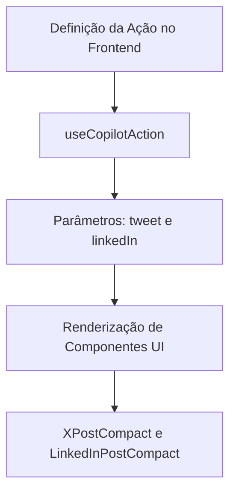
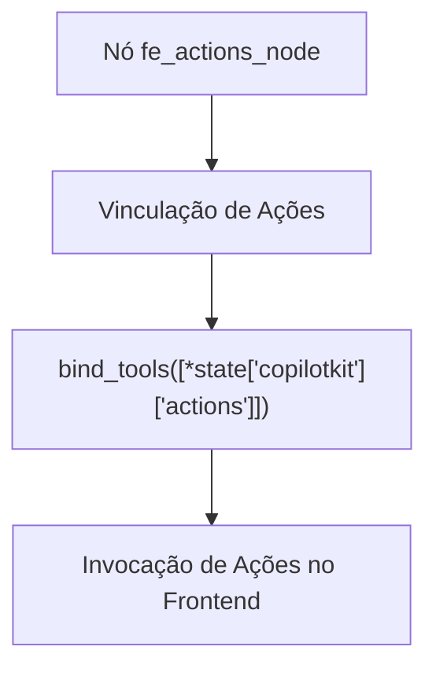
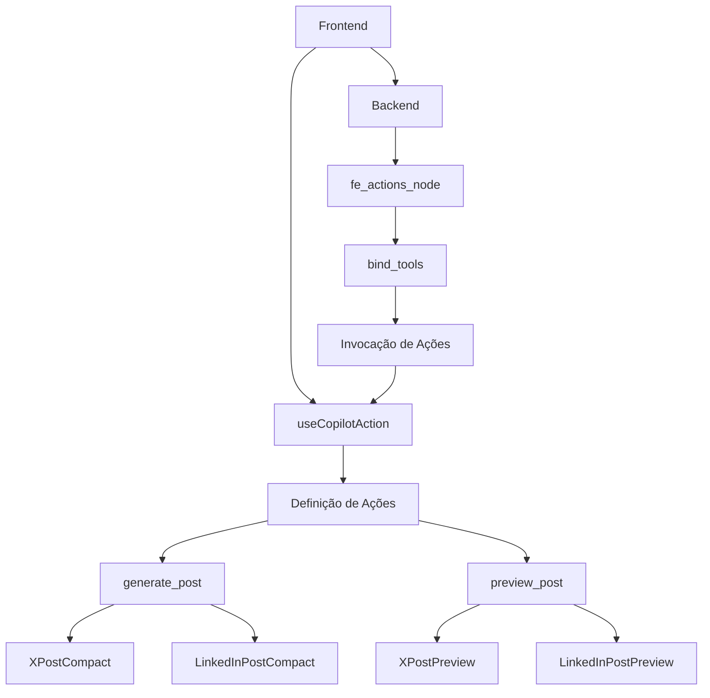

# Ferramentas Acionadas por Ações no Frontend

<cite>
**Arquivos Referenciados neste Documento**   
- [posts_generator_agent.py](file://agent/posts_generator_agent.py)
- [prompts.py](file://agent/prompts.py)
- [prompts.ts](file://app/prompts/prompts.ts)
- [post-generator/page.tsx](file://app/post-generator/page.tsx)
- [linkedin-post.tsx](file://components/ui/linkedin-post.tsx)
- [x-post.tsx](file://components/ui/x-post.tsx)
- [route.ts](file://app/api/copilotkit/route.ts)
</cite>

## Sumário
1. [Introdução](#introdução)
2. [Fluxo de Ações entre Frontend e Backend](#fluxo-de-ações-entre-frontend-e-backend)
3. [Definição de Ações no Frontend](#definição-de-ações-no-frontend)
4. [Vinculação de Ações no Backend](#vinculação-de-ações-no-backend)
5. [Componentes de Interface do Usuário](#componentes-de-interface-do-usuário)
6. [Exemplo: Criação da Ação 'preview_post'](#exemplo-criação-da-ação-preview_post)
7. [Diagrama de Arquitetura](#diagrama-de-arquitetura)
8. [Conclusão](#conclusão)

## Introdução

Este documento detalha como as ferramentas podem ser acionadas diretamente a partir de ações no frontend usando `useCopilotAction` do CopilotKit. O sistema permite uma arquitetura altamente interativa onde o modelo de IA pode invocar componentes UI personalizados, como a geração de posts formatados para LinkedIn ou X (Twitter). A integração entre frontend e backend é realizada através do nó `fe_actions_node` no arquivo `posts_generator_agent.py`, onde o modelo é vinculado às ações do frontend com `bind_tools([*state['copilotkit']['actions']])`.

## Fluxo de Ações entre Frontend e Backend

O fluxo de ações entre o frontend e o backend é coordenado pelo CopilotKit, permitindo que o modelo de IA invoque funções definidas no frontend. Quando o usuário interage com a interface, o backend processa a solicitação e, se necessário, invoca ações no frontend para renderizar componentes UI personalizados.

**Section sources**
- [posts_generator_agent.py](file://agent/posts_generator_agent.py#L100-L174)
- [post-generator/page.tsx](file://app/post-generator/page.tsx#L100-L410)

## Definição de Ações no Frontend

As ações são definidas no frontend no arquivo `post-generator/page.tsx` utilizando o hook `useCopilotAction`. A ação `generate_post` é definida com parâmetros específicos para posts do LinkedIn e X (Twitter), incluindo título e conteúdo.



**Diagram sources**
- [post-generator/page.tsx](file://app/post-generator/page.tsx#L150-L200)

**Section sources**
- [post-generator/page.tsx](file://app/post-generator/page.tsx#L150-L200)

## Vinculação de Ações no Backend

No backend, no arquivo `posts_generator_agent.py`, o nó `fe_actions_node` vincula as ações do frontend ao modelo de IA usando `bind_tools([*state['copilotkit']['actions']])`. Isso permite que o modelo invoque diretamente as ações definidas no frontend.



**Diagram sources**
- [posts_generator_agent.py](file://agent/posts_generator_agent.py#L100-L130)

**Section sources**
- [posts_generator_agent.py](file://agent/posts_generator_agent.py#L100-L130)

## Componentes de Interface do Usuário

Os componentes de interface do usuário para LinkedIn e X (Twitter) são definidos nos arquivos `linkedin-post.tsx` e `x-post.tsx`. Esses componentes incluem versões compactas para exibição no chat e versões de prévia para o canvas principal.

**Section sources**
- [linkedin-post.tsx](file://components/ui/linkedin-post.tsx)
- [x-post.tsx](file://components/ui/x-post.tsx)

## Exemplo: Criação da Ação 'preview_post'

Para criar uma nova ação `preview_post` que renderiza uma prévia antes da geração final, siga os passos abaixo:

1. **Defina a ação no frontend** no arquivo `post-generator/page.tsx`:

```typescript
useCopilotAction({
  name: "preview_post",
  description: "Render a preview of the post",
  parameters: [
    {
      name: "title",
      type: "string",
      description: "The title of the post"
    },
    {
      name: "content",
      type: "string",
      description: "The content of the post"
    },
    {
      name: "platform",
      type: "string",
      description: "The platform for the post (linkedin or x)"
    }
  ],
  render: ({ args }) => {
    return <>
      {args.platform === 'linkedin' && <LinkedInPostPreview title={args.title} content={args.content} />}
      {args.platform === 'x' && <XPostPreview title={args.title} content={args.content} />}
    </>
  },
  handler: (args) => {
    console.log("Previewing post:", args)
  }
})
```

2. **Atualize o prompt no backend** no arquivo `prompts.py` para incluir a nova ação:

```python
system_prompt_3 = """
You are an amazing assistant. You are familiar with the LinkedIn and X (Twitter) algorithms. So, you will use generate_post tool to generate the post.

RULES :
- Use proper formatting for the post. 
   - For example, LinkedIn post should be very fancy with emojis
   - For X (Twitter) post, you can use hashtags and emojis. The tone should be little bit casual and crptic.
- If user explicitly asks to generate LinkedIn post, then you should generate only LinkedIn post leaving the X (Twitter) as empty string.
- If user explicitly asks to generate X (Twitter) post, then you should generate only X (Twitter) post leaving the LinkedIn as empty string.
- If user does not specify the platform, then you should generate both the posts.
- Always use the generate_post tool to generate the post.
- Use the preview_post tool to show a preview before final generation.
- While generating the post, you should use the below context to generate the post.

{context}
"""
```

3. **Modifique o nó `fe_actions_node`** no arquivo `posts_generator_agent.py` para incluir a nova ação:

```python
async def fe_actions_node(state: AgentState, config: RunnableConfig):
    try:
        if state["messages"][-2].type == "tool":
            return Command(goto="end_node", update=state)
    except Exception as e:
        print("Moved")
        
    state["tool_logs"].append(
        {
            "id": str(uuid.uuid4()),
            "message": "Generating post",
            "status": "processing",
        }
    )
    await copilotkit_emit_state(config, state)
    
    # Initialize the model with OpenRouter
    model = ChatOpenAI(
        model=os.getenv("OPENROUTER_MODEL", "google/gemini-2.5-pro"),
        api_key=os.getenv("OPENROUTER_API_KEY"),
        base_url=os.getenv("OPENROUTER_BASE_URL", "https://openrouter.ai/api/v1"),
        temperature=1.0,
        max_retries=2,
    )
    
    await copilotkit_emit_state(config, state)
    response = await model.bind_tools([*state["copilotkit"]["actions"]]).ainvoke(
        [system_prompt_3.replace("{context}", state["response"]), *state["messages"]],
        config,
    )
    state["tool_logs"] = []
    await copilotkit_emit_state(config, state)
    # Return the response to the frontend as a message which will invoke the correct calling of the Frontend useCopilotAction necessary.
    return Command(goto="end_node", update={"messages": response})
```

**Section sources**
- [post-generator/page.tsx](file://app/post-generator/page.tsx#L150-L200)
- [prompts.py](file://agent/prompts.py#L30-L50)
- [posts_generator_agent.py](file://agent/posts_generator_agent.py#L100-L130)

## Diagrama de Arquitetura



**Diagram sources**
- [post-generator/page.tsx](file://app/post-generator/page.tsx)
- [posts_generator_agent.py](file://agent/posts_generator_agent.py)

## Conclusão

A integração entre frontend e backend usando `useCopilotAction` do CopilotKit permite uma arquitetura altamente interativa onde o modelo de IA pode invocar diretamente componentes UI personalizados. Esta abordagem facilita a criação de interfaces dinâmicas e responsivas, onde o modelo pode gerar conteúdo e o frontend pode renderizá-lo imediatamente. A criação de novas ações, como `preview_post`, é simples e envolve a definição da ação no frontend, a atualização dos prompts no backend e a modificação do nó `fe_actions_node` para incluir a nova ação.