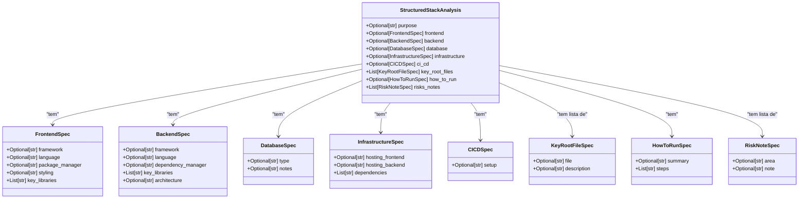

# Ferramentas com Saída Estruturada (Pydantic)

<cite>
**Arquivos Referenciados neste Documento**  
- [stack_agent.py](file://agent/stack_agent.py)
- [stack-analysis-cards.tsx](file://components/ui/stack-analysis-cards.tsx)
- [main.py](file://agent/main.py)
</cite>

## Sumário
1. [Introdução](#introdução)
2. [Estrutura do Modelo Pydantic](#estrutura-do-modelo-pydantic)
3. [Definição da Ferramenta com @tool](#definição-da-ferramenta-com-tool)
4. [Validação e Limpeza da Saída](#validação-e-limpeza-da-saída)
5. [Integração com o Frontend](#integração-com-o-frontend)
6. [Boas Práticas para Modelos Aninhados](#boas-práticas-para-modelos-aninhados)
7. [Tratamento de Erros de Validação](#tratamento-de-erros-de-validação)
8. [Conclusão](#conclusão)

## Introdução

Este documento explica como criar ferramentas que retornam saídas estruturadas usando Pydantic em conjunto com o decorador `@tool`, garantindo que os dados gerados por modelos de IA sejam consistentes, validados e prontos para consumo por interfaces frontend. O exemplo central é a função `return_stack_analysis_tool` definida no arquivo `stack_agent.py`, que utiliza o esquema `StructuredStackAnalysis` para estruturar a análise de repositórios GitHub. Essa abordagem permite uma integração confiável entre o modelo Gemini e o frontend, especialmente na exibição dos cartões de análise no componente `stack-analysis-cards.tsx`.

**Section sources**
- [stack_agent.py](file://agent/stack_agent.py#L1-L505)
- [stack-analysis-cards.tsx](file://components/ui/stack-analysis-cards.tsx#L1-L259)

## Estrutura do Modelo Pydantic

O modelo `StructuredStackAnalysis` é um esquema Pydantic aninhado que define a estrutura exata dos dados retornados pela ferramenta. Ele é composto por vários submodelos que representam diferentes aspectos da análise de um stack tecnológico.

Os campos são tipados rigorosamente, utilizando `Optional` para indicar que um campo pode ser nulo ou ausente. Isso permite flexibilidade sem comprometer a estrutura. Por exemplo, o campo `purpose` é uma string opcional, enquanto `key_root_files` é uma lista de objetos do tipo `KeyRootFileSpec`.

Para campos que são listas, o padrão `Field(default_factory=list)` é utilizado. Isso garante que, mesmo que a lista esteja vazia, ela será inicializada como uma lista vazia em vez de `None`, evitando erros de atributo no frontend. Isso é crucial para campos como `risks_notes` e `key_root_files`, que podem conter zero ou mais itens.



**Diagram sources**
- [stack_agent.py](file://agent/stack_agent.py#L85-L94)
- [stack_agent.py](file://agent/stack_agent.py#L60-L83)

**Section sources**
- [stack_agent.py](file://agent/stack_agent.py#L60-L94)

## Definição da Ferramenta com @tool

A função `return_stack_analysis_tool` é decorada com `@tool`, tornando-a uma ferramenta invocável por um agente de IA. O parâmetro `args_schema` é definido como `StructuredStackAnalysis`, o que obriga o modelo de IA (Gemini) a formatar sua saída de acordo com esse esquema.

Quando o agente decide chamar esta ferramenta, ele gera um JSON que tenta preencher todos os campos do esquema. O decorador `@tool` valida automaticamente os argumentos recebidos contra o `args_schema`. Se o modelo retornar dados malformados, o Pydantic lançará uma exceção, que é capturada pela função.


**Diagram sources**
- [stack_agent.py](file://agent/stack_agent.py#L100-L106)

**Section sources**
- [stack_agent.py](file://agent/stack_agent.py#L100-L106)

## Validação e Limpeza da Saída

A função `return_stack_analysis_tool` implementa um mecanismo robusto de validação e limpeza. Dentro de um bloco `try`, ela tenta instanciar o modelo `StructuredStackAnalysis` com os argumentos fornecidos (`kwargs`). Se a validação for bem-sucedida, o método `model_dump(exclude_none=True)` é chamado.

O parâmetro `exclude_none=True` é fundamental. Ele remove todos os campos do JSON de saída que têm valor `None`. Isso resulta em uma saída mais limpa e leve, pois campos opcionais que não foram preenchidos não aparecem no JSON final. Isso simplifica o processamento no frontend, que não precisa lidar com valores nulos.

Se a validação falhar (por exemplo, se um tipo estiver incorreto), a exceção é capturada e a função retorna os `kwargs` originais como um fallback. Isso garante que mesmo em caso de erro, algum dado seja retornado, mantendo a robustez do sistema.

**Section sources**
- [stack_agent.py](file://agent/stack_agent.py#L100-L106)

## Integração com o Frontend

A saída estruturada da ferramenta é consumida diretamente pelo componente React `StackAnalysisCards` no frontend. Esse componente espera um objeto (ou string JSON) que corresponda à interface `StackAnalysis`, que é uma versão TypeScript do esquema Pydantic.

A coerência de tipos entre o backend (Pydantic) e o frontend (TypeScript) é o que permite essa integração confiável. Quando o agente conclui a análise, o estado `analysis` é atualizado com o JSON validado, e o componente `StackAnalysisCards` o renderiza em cartões organizados por categoria (Frontend, Backend, Banco de Dados, etc.).

A estrutura aninhada do modelo permite que o frontend itere de forma segura sobre listas como `key_root_files` e `risks_notes`, sabendo exatamente quais campos esperar. O uso de `default_factory=list)` garante que o frontend nunca encontre `undefined` ao tentar iterar sobre uma lista, pois ela sempre será uma lista (mesmo que vazia).

```mermaid
flowchart TD
A[Gemini] --> |Chama Ferramenta| B(return_stack_analysis_tool)
B --> C{Validação Pydantic}
C --> |Sucesso| D[model_dump(exclude_none=True)]
C --> |Falha| E[Retorna kwargs]
D --> F[JSON Estruturado]
E --> F
F --> G[Estado do Agente]
G --> H[Frontend React]
H --> I[Componente StackAnalysisCards]
I --> J[Cartões de Análise Renderizados]
```

**Diagram sources**
- [stack_agent.py](file://agent/stack_agent.py#L100-L106)
- [stack-analysis-cards.tsx](file://components/ui/stack-analysis-cards.tsx#L1-L259)

**Section sources**
- [stack_agent.py](file://agent/stack_agent.py#L100-L106)
- [stack-analysis-cards.tsx](file://components/ui/stack-analysis-cards.tsx#L1-L259)

## Boas Práticas para Modelos Aninhados

A definição de modelos aninhados, como `StructuredStackAnalysis`, segue boas práticas essenciais para sistemas robustos:

1.  **Composição sobre Herança**: Em vez de criar um modelo gigante, ele é dividido em submodelos menores (`FrontendSpec`, `BackendSpec`, etc.). Isso melhora a legibilidade, reutilização e manutenção.
2.  **Tipagem Explícita**: Todos os campos têm tipos explícitos (`str`, `List[str]`, `Optional[...]`), o que elimina ambiguidades.
3.  **Valores Padrão Seguros**: O uso de `Field(default_factory=list)` para listas evita o perigoso "mutable default argument" e garante que cada instância tenha sua própria lista.
4.  **Documentação de Campo**: Os campos são nomeados de forma clara e descritiva, e a estrutura reflete a lógica do domínio (análise de stack).
5.  **Consistência com o Frontend**: A estrutura do modelo Pydantic é espelhada pela interface TypeScript `StackAnalysis`, garantindo que ambos os lados do sistema falem a mesma linguagem de dados.

**Section sources**
- [stack_agent.py](file://agent/stack_agent.py#L60-L94)

## Tratamento de Erros de Validação

O tratamento de erros é implementado de forma pragmática. Em vez de fazer o agente falhar completamente se o modelo de IA gerar um JSON inválido, a função `return_stack_analysis_tool` fornece um mecanismo de fallback.

Se a criação do objeto `StructuredStackAnalysis` falhar, a função simplesmente retorna os `kwargs` brutos recebidos. Isso significa que, mesmo que a validação estrita falhe, os dados ainda são passados adiante. O frontend pode então tentar processar esse JSON bruto, possivelmente exibindo uma mensagem de erro mais amigável ou um formato de fallback.

Essa abordagem prioriza a resiliência do sistema. Em um ambiente de produção, é melhor ter dados parcialmente válidos do que nenhum dado. A validação estrita é o ideal, mas o fallback garante que a experiência do usuário não seja completamente interrompida por um erro de formatação.

**Section sources**
- [stack_agent.py](file://agent/stack_agent.py#L100-L106)

## Conclusão

A utilização de Pydantic com o decorador `@tool` é uma técnica poderosa para garantir saídas estruturadas e confiáveis de modelos de IA. O exemplo de `return_stack_analysis_tool` demonstra como definir esquemas complexos com campos opcionais e listas, validar rigorosamente a entrada e limpar a saída para consumo fácil. A integração com o frontend é simplificada pela coerência de tipos, permitindo que componentes como `StackAnalysisCards` renderizem dados complexos de forma confiável. As boas práticas de modelagem e o tratamento de erros resiliente tornam essa abordagem ideal para sistemas de IA robustos e escaláveis.