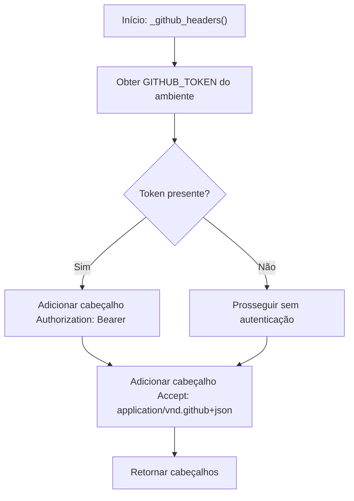
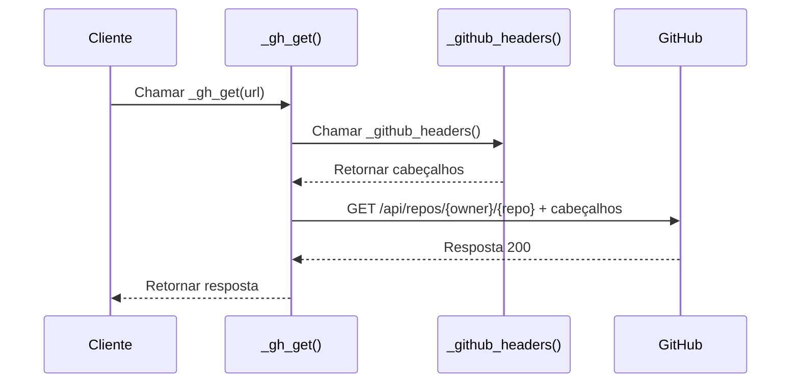

# Autenticação com GitHub API

<cite>
**Arquivos Referenciados neste Documento**  
- [stack_agent.py](file://agent/stack_agent.py)
- [main.py](file://agent/main.py)
</cite>

## Sumário
1. [Introdução](#introdução)
2. [Implementação da Autenticação](#implementação-da-autenticação)
3. [Função _github_headers()](#função-_github_headers)
4. [Uso em Chamadas HTTP](#uso-em-chamadas-http)
5. [Configuração de Ambiente](#configuração-de-ambiente)
6. [Boas Práticas de Segurança](#boas-práticas-de-segurança)
7. [Comportamento de Fallback](#comportamento-de-fallback)
8. [Cabeçalho Accept e Compatibilidade](#cabeçalho-accept-e-compatibilidade)

## Introdução

O sistema implementado no repositório `open-gemini-canvas` realiza análises de repositórios do GitHub, o que exige acesso à API do GitHub. Para garantir acesso a repositórios privados e aumentar os limites de taxa de requisição, o sistema utiliza autenticação via token. Este documento detalha como a autenticação é implementada, com foco na função `_github_headers()`, que constrói os cabeçalhos HTTP necessários para as chamadas à API do GitHub.

**Seções de origem**  
- [stack_agent.py](file://agent/stack_agent.py#L122-L127)

## Implementação da Autenticação

A autenticação com a API do GitHub é implementada de forma centralizada no arquivo `stack_agent.py`. O sistema utiliza o padrão de autenticação Bearer, onde um token de acesso pessoal (PAT) é incluído no cabeçalho `Authorization` das requisições HTTP. O token é obtido a partir da variável de ambiente `GITHUB_TOKEN`, garantindo que credenciais sensíveis não sejam expostas no código-fonte.

A implementação é modular, com funções específicas para construção de cabeçalhos e execução de requisições, promovendo reutilização e consistência em todas as chamadas à API.

**Seções de origem**  
- [stack_agent.py](file://agent/stack_agent.py#L122-L138)

## Função _github_headers()

A função `_github_headers()` é responsável por construir os cabeçalhos HTTP utilizados em todas as requisições à API do GitHub. Sua implementação é simples e eficaz:

1. A função verifica a presença da variável de ambiente `GITHUB_TOKEN` usando `os.getenv()`.
2. Um cabeçalho básico com `Accept: application/vnd.github+json` é sempre incluído.
3. Quando um token é encontrado, o cabeçalho `Authorization` é adicionado com o valor `Bearer <token>`.

Essa abordagem permite que o sistema funcione tanto com autenticação quanto sem ela, dependendo da disponibilidade do token.

**Fontes do Diagrama**  
- [stack_agent.py](file://agent/stack_agent.py#L122-L127)

**Seções de origem**  
- [stack_agent.py](file://agent/stack_agent.py#L122-L127)

## Uso em Chamadas HTTP

A função `_github_headers()` é utilizada indiretamente por meio da função auxiliar `_gh_get()`, que encapsula a lógica de requisição HTTP. Sempre que uma chamada à API do GitHub é necessária — como ao buscar metadados de repositório, linguagens utilizadas ou conteúdo do README — a função `_gh_get()` é invocada com a URL desejada.

Internamente, `_gh_get()` utiliza os cabeçalhos retornados por `_github_headers()` na requisição `requests.get()`, garantindo que a autenticação seja aplicada consistentemente em todas as interações com a API.

**Fontes do Diagrama**  
- [stack_agent.py](file://agent/stack_agent.py#L131-L138)

**Seções de origem**  
- [stack_agent.py](file://agent/stack_agent.py#L131-L138)

## Configuração de Ambiente

Para que a autenticação funcione corretamente, o token do GitHub deve ser configurado como uma variável de ambiente chamada `GITHUB_TOKEN`. Isso é feito fora do código, geralmente em arquivos `.env` ou diretamente no ambiente de execução (como variáveis de ambiente do sistema ou em plataformas de nuvem).

O sistema carrega variáveis de ambiente usando `load_dotenv()` no início da execução, permitindo que o token seja lido de um arquivo `.env` local durante o desenvolvimento.

**Seções de origem**  
- [stack_agent.py](file://agent/stack_agent.py#L123)
- [main.py](file://agent/main.py#L5)

## Boas Práticas de Segurança

O sistema segue boas práticas essenciais para o gerenciamento seguro de tokens:

- **Tokens não são armazenados no código**: O token é obtido exclusivamente do ambiente, evitando vazamento em repositórios.
- **Uso de variáveis de ambiente**: Facilita a rotação de tokens e o uso de diferentes tokens em ambientes distintos (desenvolvimento, produção).
- **Token opcional**: O sistema não falha se o token não estiver presente, permitindo uso básico mesmo sem autenticação.

Recomenda-se que o token do GitHub tenha apenas as permissões mínimas necessárias (por exemplo, `repo` para acesso a repositórios privados) e seja armazenado com segurança em sistemas de gerenciamento de segredos em produção.

**Seções de origem**  
- [stack_agent.py](file://agent/stack_agent.py#L123)

## Comportamento de Fallback

Quando a variável de ambiente `GITHUB_TOKEN` não está definida, o sistema continua funcionando, mas com limitações:

- As requisições são feitas sem autenticação.
- O limite de taxa da API do GitHub é reduzido (60 requisições por hora por IP).
- Acesso a repositórios privados é negado.

Esse comportamento de fallback permite que o sistema seja utilizado em ambientes onde a autenticação não é necessária ou não está configurada, mantendo a funcionalidade para repositórios públicos.

**Seções de origem**  
- [stack_agent.py](file://agent/stack_agent.py#L124-L126)

## Cabeçalho Accept e Compatibilidade

O cabeçalho `Accept: application/vnd.github+json` é incluído em todas as requisições, independentemente da presença do token. Esse cabeçalho é crucial porque:

- Ativa a versão mais recente da API do GitHub (v3 com media types modernos).
- Garante acesso a funcionalidades e formatos de resposta atualizados.
- É uma prática recomendada pela própria GitHub para garantir compatibilidade e estabilidade.

Sem esse cabeçalho, a API pode retornar respostas legadas ou com comportamento inconsistente, o que poderia afetar a análise correta dos repositórios.

**Seções de origem**  
- [stack_agent.py](file://agent/stack_agent.py#L125)