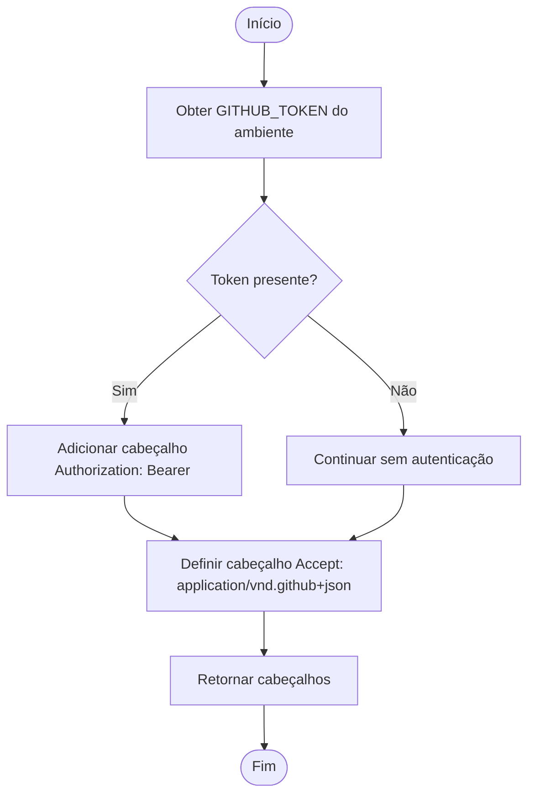
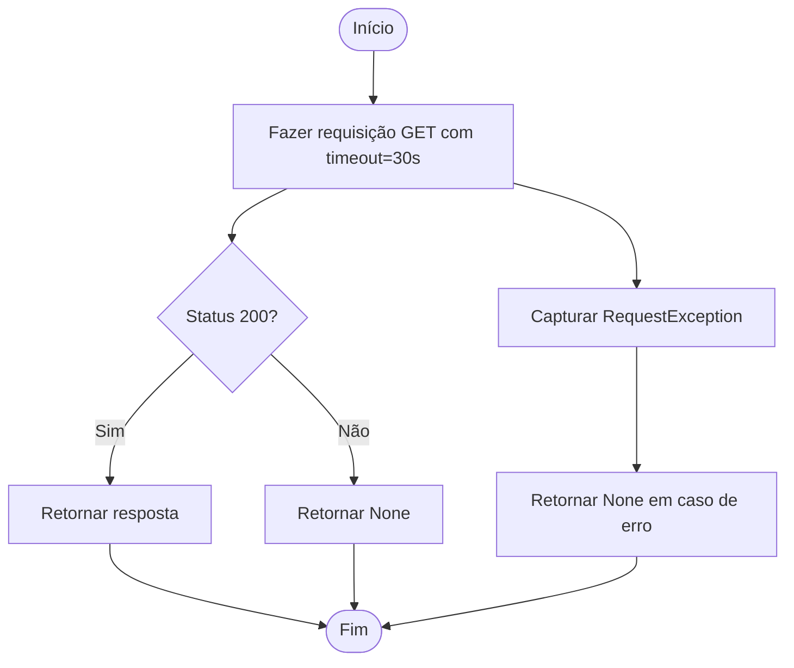

# Integração com APIs Externas

<cite>
**Arquivos Referenciados neste Documento**  
- [stack_agent.py](file://agent/stack_agent.py)
- [main.py](file://agent/main.py)
</cite>

## Sumário
1. [Introdução](#introdução)
2. [Padrões de Integração com a GitHub API](#padrões-de-integração-com-a-github-api)
3. [Autenticação e Cabeçalhos](#autenticação-e-cabeçalhos)
4. [Tratamento de Erros e Timeouts](#tratamento-de-erros-e-timeouts)
5. [Funções de Encapsulamento de Operações](#funções-de-encapsulamento-de-operações)
6. [Exemplo Prático: Nova Ferramenta `fetch_security_advisories`](#exemplo-prático-nova-ferramenta-fetch_security_advisories)
7. [Padrões de Resiliência](#padrões-de-resiliência)
8. [Conclusão](#conclusão)

## Introdução

Este guia detalha a implementação de ferramentas que se integram à GitHub API no agente de análise de stack. O foco está em práticas robustas de chamadas HTTP, autenticação segura, tratamento de erros e encapsulamento de operações. O código analisado demonstra como o agente coleta informações de repositórios públicos do GitHub para inferir a finalidade e a pilha tecnológica de um projeto.

## Padrões de Integração com a GitHub API

O agente utiliza a biblioteca `requests` para realizar chamadas HTTP à API do GitHub. A integração é estruturada em torno de funções auxiliares que encapsulam operações específicas, como buscar metadados do repositório, linguagens utilizadas e conteúdo do README. Essas funções são chamadas sequencialmente no nó `gather_context_node` do grafo de estado, coletando dados que são agregados no contexto do estado do agente (`StackAgentState`) para análise posterior.

**Section sources**
- [stack_agent.py](file://agent/stack_agent.py#L255-L305)

## Autenticação e Cabeçalhos

A autenticação com a GitHub API é gerenciada pela função `_github_headers()`. Esta função obtém o token de acesso do ambiente (`GITHUB_TOKEN`) e o inclui no cabeçalho `Authorization` da requisição. O uso do token permite aumentar o limite de taxa de requisições da API, essencial para a coleta eficiente de dados.



**Diagram sources**
- [stack_agent.py](file://agent/stack_agent.py#L122-L127)

**Section sources**
- [stack_agent.py](file://agent/stack_agent.py#L122-L127)

## Tratamento de Erros e Timeouts

O tratamento robusto de erros e timeouts é implementado na função `_gh_get()`. Todas as chamadas à API do GitHub são envolvidas em um bloco `try/except` para capturar exceções de `requests.RequestException`, que cobrem uma ampla gama de problemas de rede, como falhas de conexão, timeouts e erros de DNS. Além disso, um timeout de 30 segundos é definido para cada requisição, prevenindo que o agente fique bloqueado indefinidamente em uma chamada lenta.



**Diagram sources**
- [stack_agent.py](file://agent/stack_agent.py#L130-L137)

**Section sources**
- [stack_agent.py](file://agent/stack_agent.py#L130-L137)

## Funções de Encapsulamento de Operações

O código utiliza funções bem definidas para encapsular operações específicas de API:

- `_fetch_repo_info()`: Busca metadados gerais do repositório.
- `_fetch_languages()`: Recupera o uso de linguagens em bytes.
- `_fetch_readme()`: Obtém o conteúdo do README, com fallback para arquivos alternativos no diretório raiz.

Essas funções retornam estruturas de dados simples (dicionários ou strings) ou `None` em caso de falha, permitindo que o nó `gather_context_node` agregue os resultados de forma segura, mesmo que algumas chamadas falhem.

**Section sources**
- [stack_agent.py](file://agent/stack_agent.py#L142-L175)

## Exemplo Prático: Nova Ferramenta `fetch_security_advisories`

Para ilustrar a criação de uma nova ferramenta, considere a implementação de `fetch_security_advisories`, que consulta alertas de segurança para um repositório:

```python
def _fetch_security_advisories(owner: str, repo: str) -> List[Dict[str, Any]]:
    """Busca alertas de segurança para um repositório do GitHub."""
    advisories = []
    # A API de dependabot alerts requer escopo de permissão específico
    url = f"https://api.github.com/repos/{owner}/{repo}/dependabot/alerts"
    try:
        resp = requests.get(url, headers=_github_headers(), timeout=30)
        if resp.status_code == 200:
            advisories = resp.json()
        elif resp.status_code == 403:
            # O usuário pode não ter permissão para ver os alertas
            advisories = [{"error": "Permissão negada para acessar alertas de segurança"}]
        elif resp.status_code == 404:
            # Dependabot não está habilitado ou não há alertas
            advisories = []
    except requests.RequestException as e:
        advisories = [{"error": f"Falha na requisição: {str(e)}"}]
    return advisories
```

Esta função segue os mesmos padrões de resiliência: usa `_github_headers()` para autenticação, define um `timeout=30`, e trata erros de rede e de API (como 403 e 404) com respostas apropriadas.

**Section sources**
- [stack_agent.py](file://agent/stack_agent.py#L130-L137)

## Padrões de Resiliência

O agente demonstra vários padrões de resiliência:

1.  **Fallbacks**: A função `_fetch_readme()` tenta primeiro o endpoint `/readme` da API e, em caso de falha, lista o conteúdo do diretório raiz para encontrar arquivos `README` manualmente.
2.  **Validação de Resposta**: Antes de decodificar o conteúdo base64 do README, o código verifica se o campo `content` existe na resposta JSON.
3.  **Tratamento de Erros Silencioso**: Exceções durante a decodificação do base64 são capturadas silenciosamente, permitindo que o fluxo continue.
4.  **Gestão de Estado**: O estado do agente (`StackAgentState`) é atualizado com logs de progresso (`tool_logs`), fornecendo feedback ao usuário mesmo durante falhas parciais.

Esses padrões garantem que o agente possa fornecer uma análise parcial mesmo quando algumas fontes de dados estão indisponíveis.

**Section sources**
- [stack_agent.py](file://agent/stack_agent.py#L157-L175)

## Conclusão

A integração com a GitHub API no agente de análise de stack é um exemplo claro de como implementar chamadas HTTP resilientes e seguras. O uso de `requests` com `timeout`, tratamento de erros abrangente com `try/except`, autenticação via `GITHUB_TOKEN` e encapsulamento de operações em funções específicas são práticas fundamentais. A adição de novas ferramentas, como `fetch_security_advisories`, pode ser feita seguindo esses mesmos padrões, garantindo consistência e robustez no código.