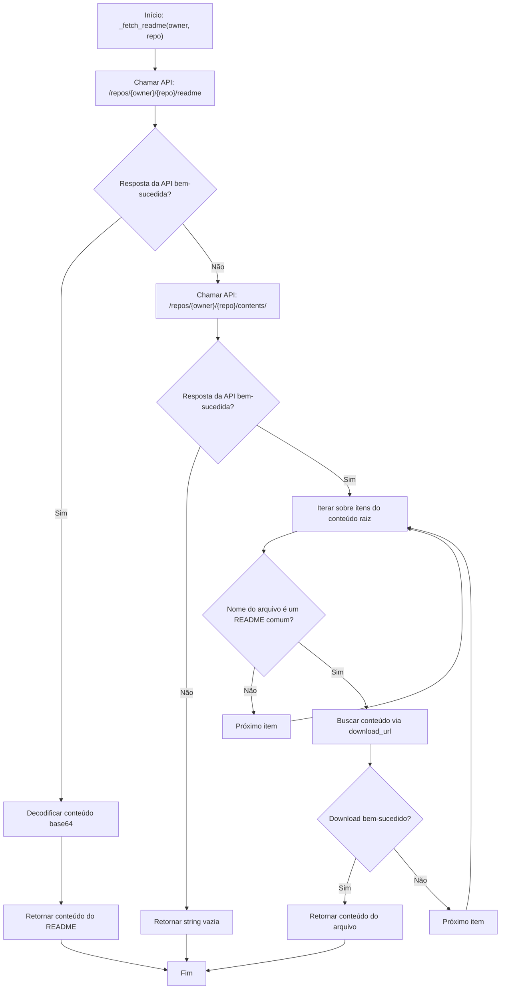
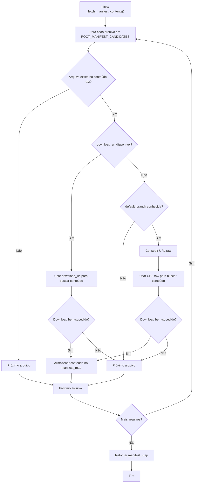

# Padrões de Resiliência e Fallbacks

<cite>
**Arquivos Referenciados neste Documento**  
- [agent/stack_agent.py](file://agent/stack_agent.py)
</cite>

## Sumário
1. [Introdução](#introdução)
2. [Análise de Padrões de Resiliência](#análise-de-padrões-de-resiliência)
3. [Estratégias de Fallback no Agente de Análise de Stack](#estratégias-de-fallback-no-agente-de-análise-de-stack)
   - [_fetch_readme(): Resiliência na Recuperação de Documentação](#_fetch_readme-resiliência-na-recuperação-de-documentação)
   - [_fetch_manifest_contents(): Redundância no Download de Arquivos de Configuração](#_fetch_manifest_contents-redundância-no-download-de-arquivos-de-configuração)
4. [Valor das Camadas de Redundância](#valor-das-camadas-de-redundância)
5. [Exemplo Prático: Implementação de Fallback para Nova Ferramenta de Integração](#exemplo-prático-implementação-de-fallback-para-nova-ferramenta-de-integração)
6. [Conclusão](#conclusão)

## Introdução

O agente de análise de stack implementado no projeto `open-gemini-canvas` demonstra um design robusto e resiliente, especialmente no que diz respeito à coleta de dados de repositórios GitHub. Em ambientes reais, APIs podem estar instáveis, endpoints podem falhar, e repositórios podem ter estruturas atípicas. Para garantir a disponibilidade contínua de dados mesmo nessas condições adversas, o agente emprega estratégias sofisticadas de fallback. Este documento analisa essas estratégias, destacando como funções como `_fetch_readme()` e `_fetch_manifest_contents()` utilizam múltiplas abordagens para maximizar a probabilidade de sucesso na recuperação de informações críticas.

## Análise de Padrões de Resiliência

O agente de análise de stack é projetado para operar de forma confiável em face de falhas parciais. A resiliência é alcançada através da implementação de camadas de redundância, onde uma operação crítica é tentada por múltiplos caminhos alternativos. Se o caminho primário falhar, o sistema automaticamente recorre a um caminho secundário, e assim por diante, até que os dados sejam obtidos ou todas as opções se esgotem. Esse padrão é fundamental para aplicações que dependem de serviços externos, como a API do GitHub, cuja disponibilidade não pode ser garantida 100% do tempo.

**Section sources**
- [agent/stack_agent.py](file://agent/stack_agent.py#L157-L245)

## Estratégias de Fallback no Agente de Análise de Stack

### _fetch_readme(): Resiliência na Recuperação de Documentação

A função `_fetch_readme()` é um excelente exemplo de design resiliente. Seu objetivo é obter o conteúdo do arquivo README de um repositório GitHub, uma fonte primária de informação sobre o projeto. Ela implementa uma estratégia de fallback em duas etapas:

1.  **Tentativa Primária via API GitHub:** A função primeiro tenta acessar o endpoint `/repos/{owner}/{repo}/readme` da API REST do GitHub. Este é o método recomendado e mais eficiente, pois a API já fornece o conteúdo do README decodificado e em um formato estruturado (JSON). O conteúdo é codificado em base64, portanto, a função o decodifica para UTF-8.
2.  **Fallback para Busca Direta no Conteúdo Raiz:** Se a chamada à API falhar (por exemplo, devido a um erro de rede, limite de taxa ou o endpoint não estar disponível), a função não desiste. Em vez disso, ela faz uma segunda chamada à API para listar todos os arquivos e diretórios no conteúdo raiz do repositório (`/repos/{owner}/{repo}/contents/`). Em seguida, itera sobre essa lista, procurando arquivos com nomes comuns de README (como `readme.md`, `README`, `readme.txt`, etc.). Quando encontra um, utiliza a URL de download direto fornecida pela API para buscar o conteúdo bruto do arquivo.

Essa abordagem em camadas garante que o agente possa recuperar a documentação principal mesmo se o endpoint otimizado de README estiver inacessível, aumentando significativamente sua robustez.



**Diagram sources**
- [agent/stack_agent.py](file://agent/stack_agent.py#L157-L175)

**Section sources**
- [agent/stack_agent.py](file://agent/stack_agent.py#L157-L175)

### _fetch_manifest_contents(): Redundância no Download de Arquivos de Configuração

A função `_fetch_manifest_contents()` demonstra um padrão de fallback semelhante, mas aplicado à recuperação de arquivos de manifesto e configuração (como `package.json`, `requirements.txt`, `go.mod`, etc.). Esses arquivos são cruciais para inferir a stack tecnológica do projeto. A função utiliza uma combinação de URLs de download direto e URLs raw do GitHub:

1.  **Tentativa Primária via URL de Download Direto:** A função recebe uma lista de itens do conteúdo raiz do repositório. Para cada arquivo manifesto candidato (definido na lista `ROOT_MANIFEST_CANDIDATES`), ela verifica se o item possui um campo `download_url`. Se sim, utiliza esse URL para fazer uma requisição direta ao conteúdo do arquivo.
2.  **Fallback para URL Raw com Branch Padrão:** Se o campo `download_url` não estiver presente (o que pode acontecer em certas circunstâncias), a função constrói uma URL raw manualmente no formato `https://raw.githubusercontent.com/{owner}/{repo}/{default_branch}/{filename}`. Para isso, ela depende do parâmetro `default_branch`, que é obtido anteriormente dos metadados do repositório. A função então tenta baixar o arquivo usando essa URL raw.

Essa estratégia combina a conveniência de URLs fornecidas pela API com a confiabilidade de URLs raw, que são um ponto de acesso direto ao conteúdo dos arquivos no GitHub. O uso da branch padrão garante que o agente esteja sempre acessando a versão principal do código.



**Diagram sources**
- [agent/stack_agent.py](file://agent/stack_agent.py#L219-L245)

**Section sources**
- [agent/stack_agent.py](file://agent/stack_agent.py#L219-L245)

## Valor das Camadas de Redundância

O valor dessas camadas de redundância é inestimável para a confiabilidade do agente. Elas proporcionam:

*   **Alta Disponibilidade de Dados:** Mesmo com falhas intermitentes na API do GitHub ou com repositórios que têm estruturas incomuns (por exemplo, um README em um diretório diferente do raiz, embora a função atualmente só procure no raiz), o agente tem uma chance muito maior de coletar os dados necessários.
*   **Tolerância a Falhas:** O sistema não entra em colapso total por causa de uma única falha. Ele é capaz de se recuperar e continuar sua operação com os dados que conseguiu coletar.
*   **Melhor Experiência do Usuário:** Os usuários do agente recebem análises mais completas e consistentes, pois o sistema faz o máximo possível para obter as informações, em vez de falhar silenciosamente ou retornar um erro logo no início.

Essas estratégias transformam o agente de uma ferramenta frágil, dependente de condições perfeitas, em uma solução robusta e adequada para uso em produção.

## Exemplo Prático: Implementação de Fallback para Nova Ferramenta de Integração

Imagine que estamos integrando uma nova ferramenta de CI/CD chamada "BuildFlow" ao agente. Queremos buscar o arquivo de configuração `buildflow.yaml` do repositório. Podemos implementar uma função de fallback inspirada nos padrões existentes:

```python
def _fetch_buildflow_config(owner: str, repo: str, default_branch: str) -> Optional[str]:
    """
    Busca o arquivo buildflow.yaml com estratégias de fallback.
    """
    # 1. Tentativa primária: Usar o endpoint específico da API para arquivos
    # Este é o método mais robusto, pois não depende do nome exato do arquivo.
    r = _gh_get(f"https://api.github.com/repos/{owner}/{repo}/contents/buildflow.yaml")
    if r:
        data = r.json()
        content = data.get("content")
        if content:
            try:
                return base64.b64decode(content).decode("utf-8")
            except Exception:
                pass # Falha na decodificação, tentar próximo método

    # 2. Fallback 1: Listar conteúdo raiz e procurar por variações de nome
    contents = _gh_get(f"https://api.github.com/repos/{owner}/{repo}/contents/")
    if contents:
        for item in contents.json():
            name = item.get("name", "").lower()
            if name in {"buildflow.yaml", "buildflow.yml", ".buildflow.yaml"}:
                file_resp = _gh_get(item.get("download_url", ""))
                if file_resp:
                    return file_resp.text

    # 3. Fallback 2: Usar URL raw com branch padrão
    for filename in ["buildflow.yaml", "buildflow.yml"]:
        raw_url = f"https://raw.githubusercontent.com/{owner}/{repo}/{default_branch}/{filename}"
        r = _gh_get(raw_url)
        if r:
            return r.text

    # Todos os métodos falharam
    return None
```

**Explicação do Exemplo:**
1.  **Camada 1 (API Específica):** Primeiro, tenta o endpoint `/contents/{path}`, que é o mais confiável.
2.  **Camada 2 (Busca no Conteúdo Raiz):** Se o endpoint falhar, lista o conteúdo raiz e procura por variações comuns do nome do arquivo.
3.  **Camada 3 (URL Raw):** Como último recurso, tenta construir a URL raw diretamente.
Esse padrão de três camadas maximiza as chances de sucesso, alinhando-se perfeitamente com a filosofia de resiliência do agente.

**Section sources**
- [agent/stack_agent.py](file://agent/stack_agent.py#L157-L245)

## Conclusão

As estratégias de fallback implementadas no agente de análise de stack são um exemplo de excelência em engenharia de software para sistemas distribuídos. Ao não confiar em um único ponto de acesso, o agente demonstra uma arquitetura resiliente que prioriza a continuidade do serviço. As funções `_fetch_readme()` e `_fetch_manifest_contents()` são modelos de como lidar com a incerteza das APIs externas, utilizando múltiplas abordagens para garantir a disponibilidade de dados. A adoção de padrões semelhantes em novas integrações é altamente recomendada para manter a robustez e a confiabilidade do sistema como um todo.