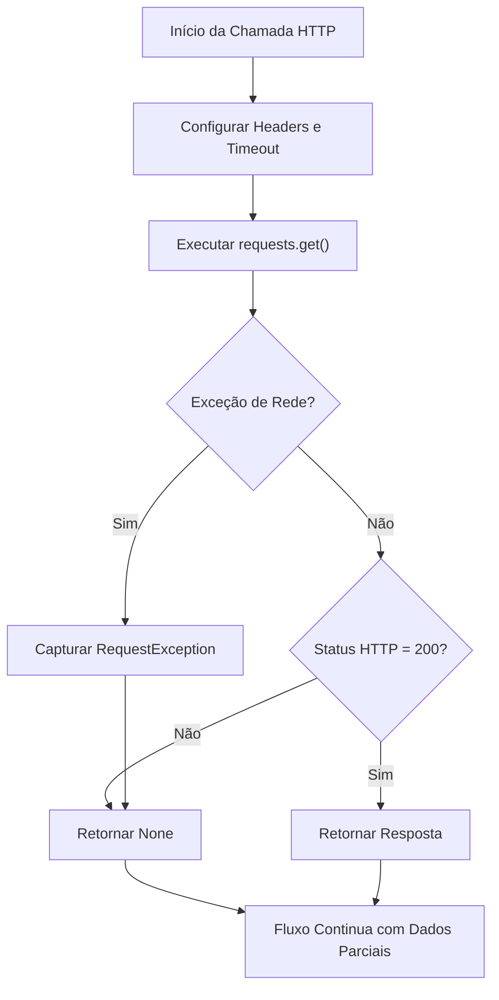
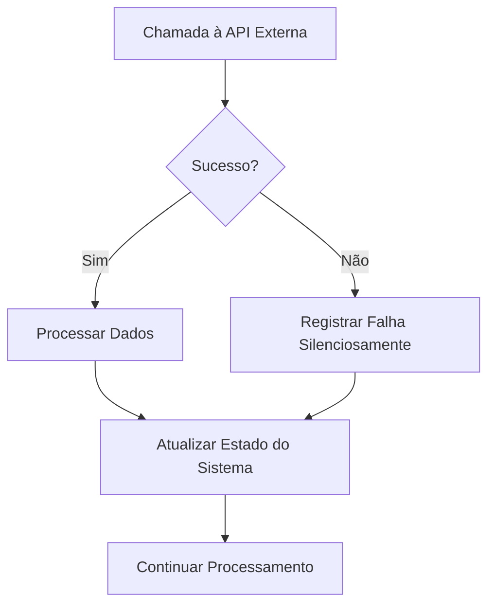

# Tratamento de Erros e Timeouts em Chamadas HTTP

<cite>
**Arquivos Referenciados neste Documento**   
- [stack_agent.py](file://agent/stack_agent.py)
</cite>

## Sumário
1. [Introdução](#introdução)
2. [Análise da Função _gh_get()](#análise-da-função-_gh_get)
3. [Tratamento de Exceções de Rede](#tratamento-de-exceções-de-rede)
4. [Configuração de Timeout](#configuração-de-timeout)
5. [Verificação de Status HTTP](#verificação-de-status-http)
6. [Comportamento em Casos de Falha](#comportamento-em-casos-de-falha)
7. [Cenários Comuns de Falha](#cenários-comuns-de-falha)
8. [Recomendações para Monitoramento e Logging](#recomendações-para-monitoramento-e-logging)

## Introdução
Este documento detalha o tratamento robusto de falhas em chamadas à API externa implementado na função `_gh_get()` do sistema. O foco está na resiliência do sistema ao interagir com a API do GitHub, garantindo que falhas temporárias ou problemas de rede não interrompam o fluxo principal do agente. A abordagem adotada combina timeouts, tratamento de exceções e validação de status HTTP para criar um sistema tolerante a falhas.

## Análise da Função _gh_get()
A função `_gh_get()` é responsável por realizar chamadas seguras à API do GitHub, encapsulando toda a lógica de tratamento de erros e validação de resposta. Ela é utilizada como uma camada de abstração entre o sistema e a API externa, garantindo que todas as chamadas sigam um padrão consistente de resiliência.



**Fontes do Diagrama**
- [stack_agent.py](file://agent/stack_agent.py#L131-L138)

**Fontes da Seção**
- [stack_agent.py](file://agent/stack_agent.py#L131-L138)

## Tratamento de Exceções de Rede
A função utiliza um bloco `try/except` para capturar exceções de rede que podem ocorrer durante a chamada HTTP. O tratamento é feito de forma abrangente, capturando qualquer exceção derivada de `requests.RequestException`, que inclui uma variedade de erros comuns:

- **Conexão recusada**: Quando o servidor de destino não aceita a conexão
- **Timeout de conexão**: Quando não é possível estabelecer a conexão dentro do tempo limite
- **Erro de DNS**: Quando o nome do host não pode ser resolvido
- **Erro de SSL**: Quando há problemas com o certificado SSL/TLS
- **Erro de rede intermitente**: Quando há falhas na camada de transporte

O tratamento silencioso dessas exceções (retornando `None`) permite que o sistema continue seu processamento mesmo quando a API externa está temporariamente indisponível.

**Fontes da Seção**
- [stack_agent.py](file://agent/stack_agent.py#L136-L138)

## Configuração de Timeout
A função configura um timeout de 30 segundos para todas as chamadas à API do GitHub, evitando que o sistema fique bloqueado indefinidamente em caso de lentidão ou indisponibilidade do serviço externo.

```python
resp = requests.get(url, headers=_github_headers(), timeout=30)
```

Este timeout é crucial para:
- **Prevenir congelamentos**: Garante que a chamada não bloqueie o agente por tempo indeterminado
- **Manter a responsividade**: Permite que o sistema responda rapidamente mesmo quando serviços externos estão lentos
- **Controlar recursos**: Evita o consumo excessivo de recursos do sistema com conexões pendentes
- **Melhorar a experiência do usuário**: Impede que a interface fique travada esperando por respostas

O valor de 30 segundos representa um equilíbrio entre dar tempo suficiente para respostas completas e não bloquear o sistema por muito tempo.

**Fontes da Seção**
- [stack_agent.py](file://agent/stack_agent.py#L133)

## Verificação de Status HTTP
Após uma chamada bem-sucedida (sem exceções de rede), a função realiza uma verificação explícita do código de status HTTP da resposta:

```python
if resp.status_code == 200:
    return resp
return None
```

Esta verificação garante que:
- **Apenas respostas bem-sucedidas sejam processadas**: Somente respostas com status 200 (OK) são consideradas válidas
- **Erros de aplicação sejam tratados**: Códigos como 404 (Não Encontrado), 403 (Proibido) ou 500 (Erro Interno do Servidor) resultam em retorno de `None`
- **Consistência na interface**: A função sempre retorna um objeto `Response` válido ou `None`, nunca uma resposta com erro

Esta abordagem é mais rigorosa do que simplesmente verificar se a chamada foi bem-sucedida, pois diferencia entre falhas de transporte (rede) e falhas de aplicação (HTTP).

**Fontes da Seção**
- [stack_agent.py](file://agent/stack_agent.py#L134-L135)

## Comportamento em Casos de Falha
O sistema adota uma estratégia de falha silenciosa, retornando `None` em caso de qualquer problema com a chamada à API. Este comportamento intencional permite que:

- **O fluxo do agente continue**: A ausência de dados de uma chamada falha não interrompe o processamento geral
- **Dados parciais sejam utilizados**: O sistema pode prosseguir com as informações que conseguiu coletar
- **A robustez seja maximizada**: Problemas temporários com a API externa não afetam a funcionalidade principal

Esta abordagem é especialmente adequada para cenários onde:
- A informação da API externa é útil mas não crítica
- O sistema pode funcionar com dados incompletos
- A disponibilidade contínua é mais importante que a completude dos dados



**Fontes do Diagrama**
- [stack_agent.py](file://agent/stack_agent.py#L131-L138)

**Fontes da Seção**
- [stack_agent.py](file://agent/stack_agent.py#L131-L138)

## Cenários Comuns de Falha
### Timeout de Rede
Quando a API do GitHub está sobrecarregada ou há problemas de rede, a chamada pode exceder o limite de 30 segundos:

- **Comportamento**: A exceção `RequestException` é capturada e `None` é retornado
- **Impacto**: O sistema continua sem os dados da API, mas mantém funcionalidade básica
- **Recuperação**: Em chamadas subsequentes, o sistema tentará novamente

### Rate Limiting
Quando o limite de requisições é atingido, a API retorna status 403:

- **Comportamento**: A resposta é recebida com sucesso, mas o status não é 200, resultando em retorno de `None`
- **Impacto**: Similar ao timeout, o sistema continua com dados parciais
- **Mitigação**: O uso de token de autenticação melhora os limites (via header Authorization)

### Recurso Não Encontrado (404)
Quando um repositório ou recurso específico não existe:

- **Comportamento**: A API retorna 404, que é validado e resulta em retorno de `None`
- **Impacto**: O sistema trata como se o recurso não existisse, continuando o processamento
- **Recuperação**: Não há tentativa automática de recuperação, pois é um erro permanente

## Recomendações para Monitoramento e Logging
Embora o sistema trate falhas silenciosamente, é crucial implementar monitoramento adequado em produção:

### Implementar Logging Estruturado
Adicionar logs informativos sobre falhas, mesmo que o sistema continue:

```python
except requests.RequestException as e:
    logger.warning(f"Falha na chamada à API GitHub: {url}, Erro: {str(e)}")
    return None
```

### Monitorar Métricas de Saúde
- **Taxa de falhas**: Monitorar a porcentagem de chamadas que falham
- **Tempo de resposta**: Acompanhar o tempo médio das chamadas bem-sucedidas
- **Distribuição de status**: Analisar a frequência de diferentes códigos de status

### Implementar Alertas
Configurar alertas para:
- **Aumento súbito na taxa de falhas**
- **Padrões de rate limiting persistentes**
- **Timeouts consistentes em endpoints específicos**

### Adicionar Tracing
Integrar com sistemas de tracing para correlacionar falhas de API com o fluxo de execução do agente, facilitando a depuração de problemas complexos.

**Fontes da Seção**
- [stack_agent.py](file://agent/stack_agent.py#L131-L138)