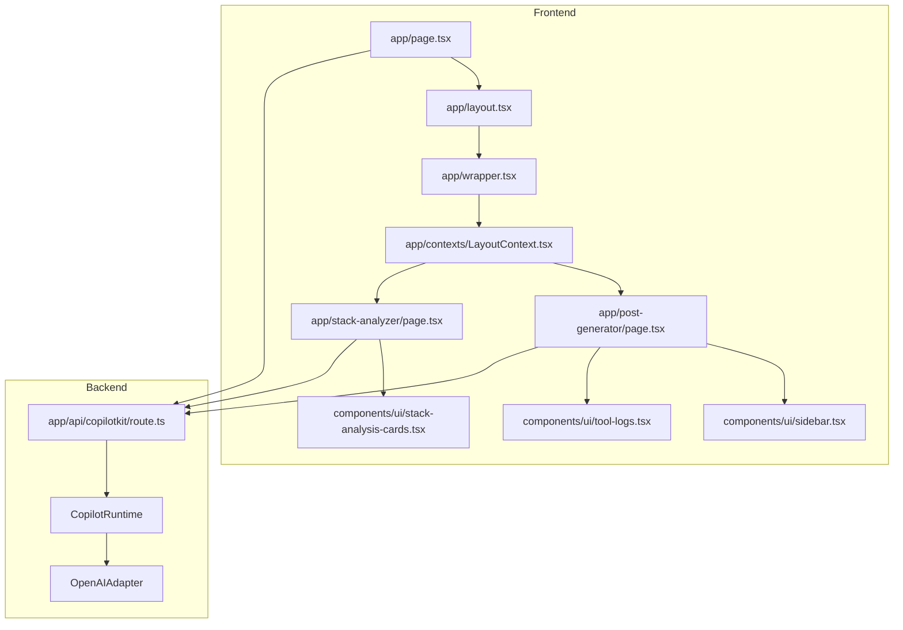
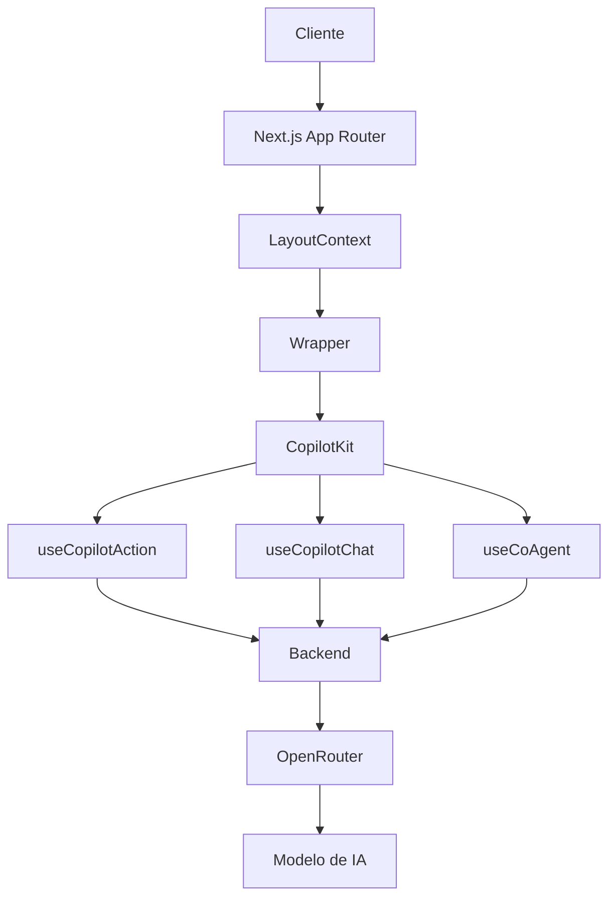
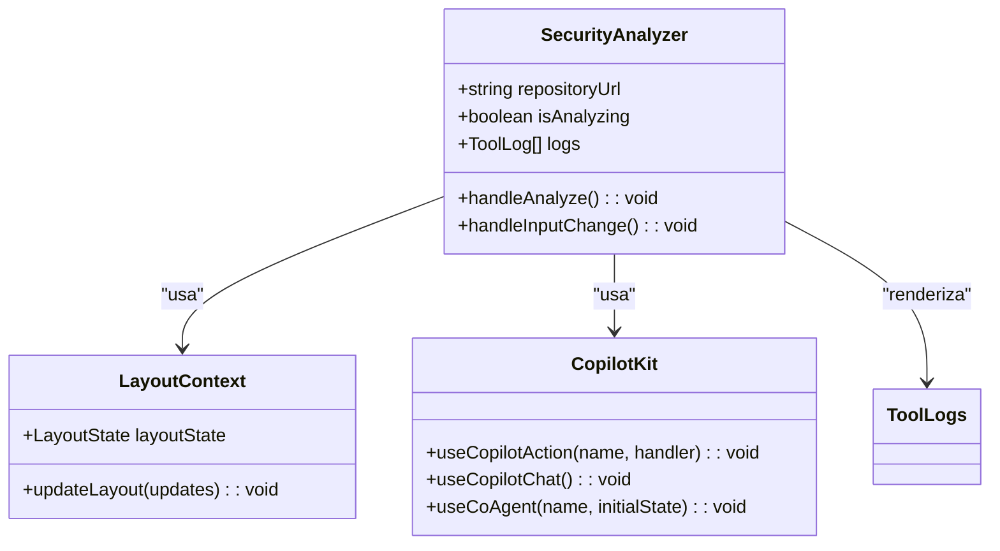
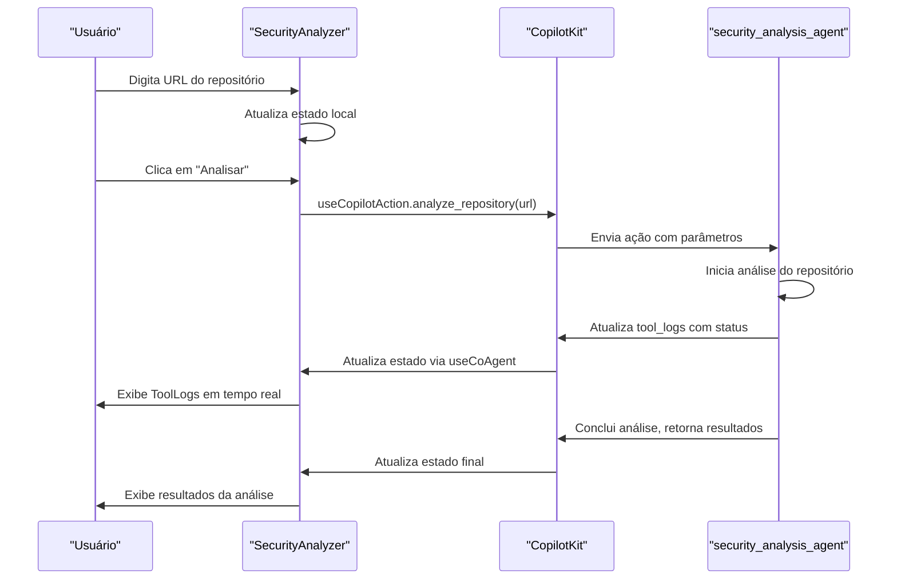
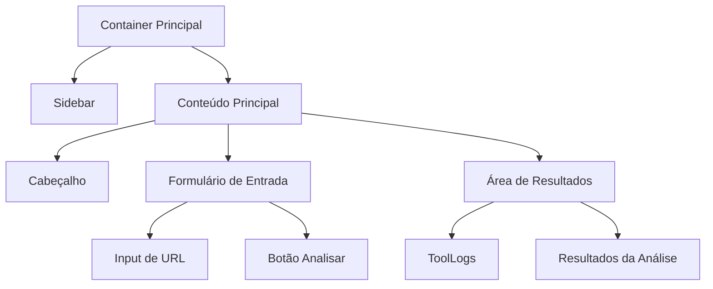

# Estender o Frontend com Novas Páginas

<cite>
**Arquivos Referenciados neste Documento**   
- [app/page.tsx](file://app/page.tsx)
- [app/layout.tsx](file://app/layout.tsx)
- [app/wrapper.tsx](file://app/wrapper.tsx)
- [app/contexts/LayoutContext.tsx](file://app/contexts/LayoutContext.tsx)
- [app/post-generator/page.tsx](file://app/post-generator/page.tsx)
- [app/stack-analyzer/page.tsx](file://app/stack-analyzer/page.tsx)
- [components/ui/sidebar.tsx](file://components/ui/sidebar.tsx)
- [components/ui/tool-logs.tsx](file://components/ui/tool-logs.tsx)
- [components/ui/stack-analysis-cards.tsx](file://components/ui/stack-analysis-cards.tsx)
- [app/api/copilotkit/route.ts](file://app/api/copilotkit/route.ts)
</cite>

## Sumário
1. [Introdução](#introdução)
2. [Estrutura do Projeto](#estrutura-do-projeto)
3. [Componentes Principais](#componentes-principais)
4. [Visão Geral da Arquitetura](#visão-geral-da-arquitetura)
5. [Análise Detalhada dos Componentes](#análise-detalhada-dos-componentes)
6. [Análise de Dependências](#análise-de-dependências)
7. [Considerações de Desempenho](#considerações-de-desempenho)
8. [Guia de Solução de Problemas](#guia-de-solução-de-problemas)
9. [Conclusão](#conclusão)

## Introdução
Este documento fornece um guia passo a passo para adicionar uma nova página no frontend Next.js que se integre a um novo agente de IA. O foco será na criação de uma página `/security-analyzer` que permite ao usuário enviar um repositório para análise de vulnerabilidades. O guia abrange a criação de diretórios, definição de componentes `page.tsx`, uso de `useCopilotAction` e `useCopilotChat`, estruturação de layout com componentes UI existentes como `Sidebar` e `ToolLogs`, e passagem de parâmetros para o agente via ações de IA. Também são abordados exemplos de código, gerenciamento de estado com React, tratamento de respostas assíncronas, atualizações em tempo real, acessibilidade e responsividade.

## Estrutura do Projeto
O projeto utiliza uma estrutura baseada em Next.js com um diretório `app` que segue o App Router. O frontend é construído com React, TypeScript e Tailwind CSS, integrado ao framework CopilotKit para comunicação com agentes de IA. O diretório `app` contém páginas como `post-generator` e `stack-analyzer`, que servem como modelos para a criação de novas páginas. O diretório `components/ui` contém componentes reutilizáveis como `Sidebar`, `ToolLogs` e `StackAnalysisCards`.



**Fontes do Diagrama**
- [app/page.tsx](file://app/page.tsx#L1-L19)
- [app/layout.tsx](file://app/layout.tsx#L1-L34)
- [app/wrapper.tsx](file://app/wrapper.tsx#L1-L12)
- [app/contexts/LayoutContext.tsx](file://app/contexts/LayoutContext.tsx#L1-L54)
- [app/post-generator/page.tsx](file://app/post-generator/page.tsx#L1-L411)
- [app/stack-analyzer/page.tsx](file://app/stack-analyzer/page.tsx#L1-L348)
- [components/ui/sidebar.tsx](file://components/ui/sidebar.tsx#L1-L727)
- [components/ui/tool-logs.tsx](file://components/ui/tool-logs.tsx#L1-L54)
- [components/ui/stack-analysis-cards.tsx](file://components/ui/stack-analysis-cards.tsx#L1-L259)
- [app/api/copilotkit/route.ts](file://app/api/copilotkit/route.ts#L1-L30)

**Fontes da Seção**
- [app/page.tsx](file://app/page.tsx#L1-L19)
- [app/layout.tsx](file://app/layout.tsx#L1-L34)

## Componentes Principais
Os componentes principais incluem o `LayoutContext` para gerenciamento de estado global, o `Wrapper` para envolver o `CopilotKit`, e as páginas `post-generator` e `stack-analyzer` como exemplos de implementação. O `Sidebar` fornece navegação, enquanto `ToolLogs` exibe o status das operações do agente. O `StackAnalysisCards` é um componente especializado para exibir resultados de análise de stack.

**Fontes da Seção**
- [app/contexts/LayoutContext.tsx](file://app/contexts/LayoutContext.tsx#L1-L54)
- [app/wrapper.tsx](file://app/wrapper.tsx#L1-L12)
- [components/ui/sidebar.tsx](file://components/ui/sidebar.tsx#L1-L727)
- [components/ui/tool-logs.tsx](file://components/ui/tool-logs.tsx#L1-L54)
- [components/ui/stack-analysis-cards.tsx](file://components/ui/stack-analysis-cards.tsx#L1-L259)

## Visão Geral da Arquitetura
A arquitetura do frontend é baseada em Next.js App Router com um provedor de contexto global (`LayoutContext`) que gerencia o estado do agente ativo. O `CopilotKit` é usado para comunicação com o backend, que utiliza o `OpenAIAdapter` para se conectar ao OpenRouter. As páginas são componentes cliente que usam hooks como `useCopilotAction` e `useCopilotChat` para interagir com o agente de IA.



**Fontes do Diagrama**
- [app/layout.tsx](file://app/layout.tsx#L1-L34)
- [app/wrapper.tsx](file://app/wrapper.tsx#L1-L12)
- [app/contexts/LayoutContext.tsx](file://app/contexts/LayoutContext.tsx#L1-L54)
- [app/api/copilotkit/route.ts](file://app/api/copilotkit/route.ts#L1-L30)

## Análise Detalhada dos Componentes

### Criação da Página Security Analyzer
Para criar a página `/security-analyzer`, siga os passos abaixo:

1. Crie um novo diretório `security-analyzer` dentro de `app`.
2. Crie um arquivo `page.tsx` dentro desse diretório.
3. Importe os componentes necessários: `Sidebar`, `ToolLogs`, e `useCopilotAction`.
4. Use `useLayout` para definir o agente ativo como `security_analysis_agent`.
5. Implemente `useCopilotAction` para definir a ação `analyze_repository` que receberá a URL do repositório.
6. Crie um formulário para entrada da URL do repositório.
7. Use `useCopilotChat` para enviar a mensagem ao agente.
8. Exiba os logs de progresso com `ToolLogs`.
9. Atualize o estado com os resultados da análise.

#### Exemplo de Estrutura de Página


**Fontes do Diagrama**
- [app/security-analyzer/page.tsx](file://app/security-analyzer/page.tsx)
- [app/contexts/LayoutContext.tsx](file://app/contexts/LayoutContext.tsx#L1-L54)
- [components/ui/tool-logs.tsx](file://components/ui/tool-logs.tsx#L1-L54)

**Fontes da Seção**
- [app/post-generator/page.tsx](file://app/post-generator/page.tsx#L1-L411)
- [app/stack-analyzer/page.tsx](file://app/stack-analyzer/page.tsx#L1-L348)

### Gerenciamento de Estado e Interação com IA
O gerenciamento de estado é feito através do `useCoAgent` para manter o estado do agente, `useState` para o estado local da página, e `useLayout` para o estado global. A interação com o agente de IA é feita via `useCopilotAction` para definir ações específicas e `useCopilotChat` para mensagens de chat.

#### Fluxo de Interação com o Agente


**Fontes do Diagrama**
- [app/security-analyzer/page.tsx](file://app/security-analyzer/page.tsx)
- [app/api/copilotkit/route.ts](file://app/api/copilotkit/route.ts#L1-L30)

**Fontes da Seção**
- [app/post-generator/page.tsx](file://app/post-generator/page.tsx#L1-L411)
- [app/stack-analyzer/page.tsx](file://app/stack-analyzer/page.tsx#L1-L348)

### Estruturação do Layout
O layout deve seguir o padrão existente, com uma barra lateral à esquerda e conteúdo principal à direita. Use o componente `Sidebar` para navegação e `ToolLogs` para exibir o progresso da análise. O conteúdo principal deve incluir um formulário de entrada e um espaço para exibir os resultados.

#### Diagrama de Layout


**Fontes do Diagrama**
- [app/security-analyzer/page.tsx](file://app/security-analyzer/page.tsx)
- [components/ui/sidebar.tsx](file://components/ui/sidebar.tsx#L1-L727)
- [components/ui/tool-logs.tsx](file://components/ui/tool-logs.tsx#L1-L54)

**Fontes da Seção**
- [app/post-generator/page.tsx](file://app/post-generator/page.tsx#L1-L411)
- [app/stack-analyzer/page.tsx](file://app/stack-analyzer/page.tsx#L1-L348)

## Análise de Dependências
As dependências principais incluem o CopilotKit para integração com IA, Next.js para o framework frontend, e Tailwind CSS para estilização. O projeto também depende de bibliotecas como Lucide para ícones e Class Variance Authority para variações de classes.

```mermaid
graph TD
A[CopilotKit] --> B[@copilotkit/react-core]
A --> C[@copilotkit/react-ui]
D[Next.js] --> E[React]
D --> F[TypeScript]
G[Tailwind CSS] --> H[Class Variance Authority]
I[Lucide] --> J[Ícones]
B --> K[Backend]
C --> K
```

**Fontes do Diagrama**
- [package.json](file://package.json)
- [app/api/copilotkit/route.ts](file://app/api/copilotkit/route.ts#L1-L30)

**Fontes da Seção**
- [package.json](file://package.json)
- [app/api/copilotkit/route.ts](file://app/api/copilotkit/route.ts#L1-L30)

## Considerações de Desempenho
Para garantir bom desempenho, utilize memoização com `useMemo` e `useCallback` para evitar renderizações desnecessárias. Carregue componentes pesados de forma assíncrona e use `Suspense` para carregamento. Minimize atualizações de estado e use `useEffect` com dependências específicas.

## Guia de Solução de Problemas
Problemas comuns incluem falhas na comunicação com o agente de IA, que podem ser resolvidas verificando a chave API no `.env`, garantindo que o backend esteja em execução e verificando a conexão com o OpenRouter. Problemas de renderização podem ser resolvidos verificando as dependências no `useEffect` e garantindo que os estados sejam atualizados corretamente.

**Fontes da Seção**
- [app/api/copilotkit/route.ts](file://app/api/copilotkit/route.ts#L1-L30)
- [app/contexts/LayoutContext.tsx](file://app/contexts/LayoutContext.tsx#L1-L54)

## Conclusão
A adição de uma nova página no frontend Next.js que se integre a um agente de IA envolve a criação de um diretório em `app/`, definição de um componente `page.tsx` com uso de `useCopilotAction` e `useCopilotChat`, estruturação do layout com componentes UI existentes e passagem de parâmetros para o agente. O exemplo da página `/security-analyzer` demonstra como enviar um repositório para análise de vulnerabilidades, com gerenciamento de estado, tratamento de respostas assíncronas e atualizações em tempo real. A acessibilidade e responsividade são garantidas pelo uso de componentes bem projetados e práticas recomendadas do React e Tailwind CSS.