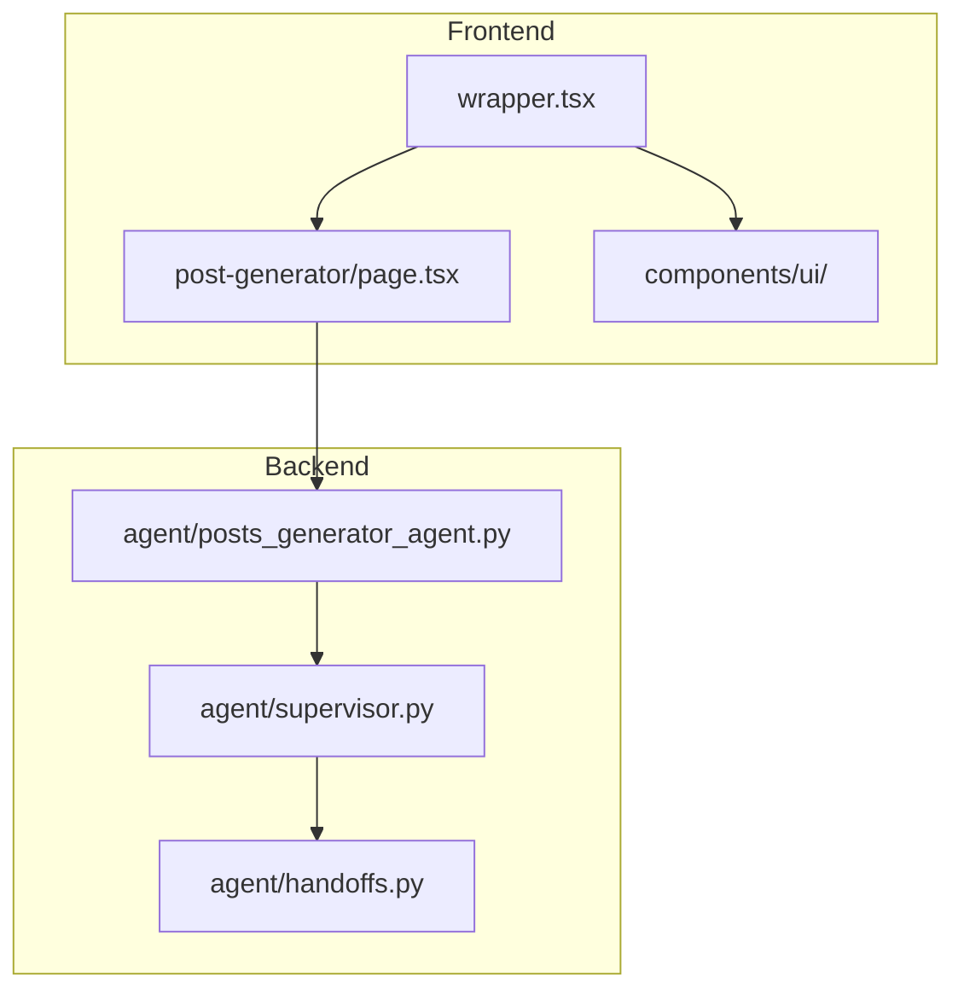
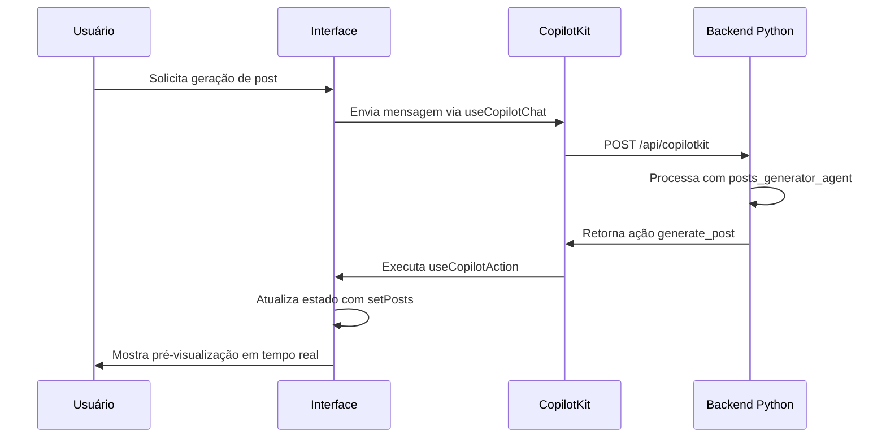
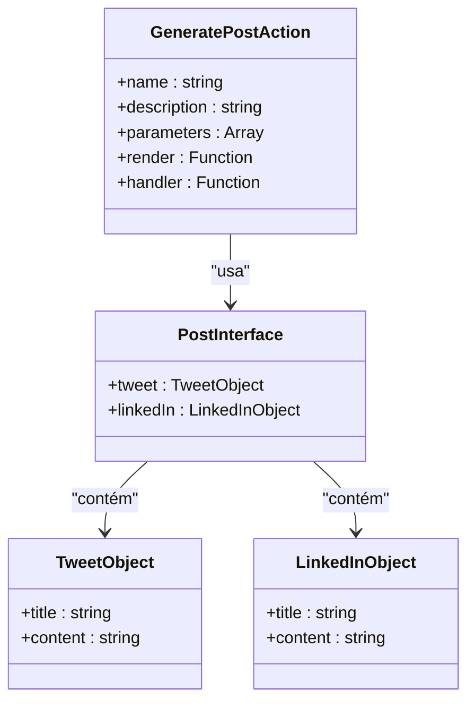
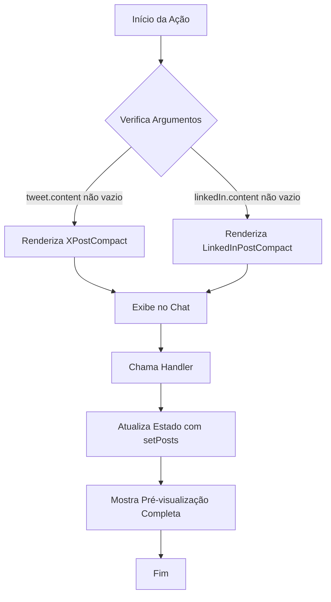
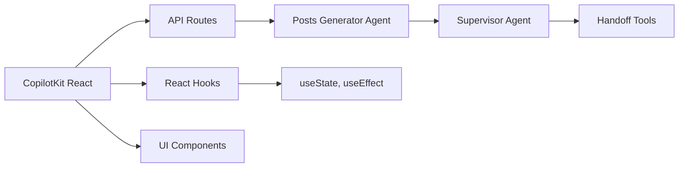

# Definição e Uso de Ações de IA

<cite>
**Arquivos Referenciados neste Documento**  
- [app/post-generator/page.tsx](file://app/post-generator/page.tsx)
- [components/ui/linkedin-post.tsx](file://components/ui/linkedin-post.tsx)
- [components/ui/x-post.tsx](file://components/ui/x-post.tsx)
- [app/wrapper.tsx](file://app/wrapper.tsx)
</cite>

## Sumário
1. [Introdução](#introdução)
2. [Estrutura do Projeto](#estrutura-do-projeto)
3. [Componentes Principais](#componentes-principais)
4. [Visão Geral da Arquitetura](#visão-geral-da-arquitetura)
5. [Análise Detalhada dos Componentes](#análise-detalhada-dos-componentes)
6. [Análise de Dependências](#análise-de-dependências)
7. [Considerações de Desempenho](#considerações-de-desempenho)
8. [Guia de Solução de Problemas](#guia-de-solução-de-problemas)
9. [Conclusão](#conclusão)

## Introdução
Este documento detalha a implementação e utilização de ações de IA no frontend usando o CopilotKit, com foco na função `useCopilotAction`. O sistema permite gerar conteúdos para redes sociais como LinkedIn e X (antigo Twitter), integrando modelos de IA avançados com interfaces reativas. A arquitetura combina agentes especializados com renderização em tempo real, permitindo pré-visualizações dinâmicas e atualização de estado baseada em respostas de IA.

## Estrutura do Projeto
O projeto é organizado em uma estrutura baseada em camadas, com separação clara entre frontend (Next.js) e backend (Python com FastAPI). O frontend contém páginas específicas para geração de posts e análise de stack, enquanto o backend implementa agentes especializados em Python. A integração entre frontend e backend é feita através de rotas API definidas em `/api/copilotkit/route.ts`.

**Fontes do Diagrama**  
- [app/post-generator/page.tsx](file://app/post-generator/page.tsx)
- [agent/posts_generator_agent.py](file://agent/posts_generator_agent.py)
- [agent/supervisor.py](file://agent/supervisor.py)
- [agent/handoffs.py](file://agent/handoffs.py)

**Fontes da Seção**  
- [app/post-generator/page.tsx](file://app/post-generator/page.tsx)
- [agent/posts_generator_agent.py](file://agent/posts_generator_agent.py)

## Componentes Principais
Os componentes principais incluem a página de geração de posts, os componentes de UI para pré-visualização de posts no LinkedIn e X, e o wrapper que envolve toda a aplicação com o contexto do CopilotKit. O estado da aplicação é gerido através de hooks do React como `useState` e `useEffect`, com integração direta ao CopilotKit para ações de IA.

**Fontes da Seção**  
- [app/post-generator/page.tsx](file://app/post-generator/page.tsx)
- [components/ui/linkedin-post.tsx](file://components/ui/linkedin-post.tsx)
- [components/ui/x-post.tsx](file://components/ui/x-post.tsx)

## Visão Geral da Arquitetura
A arquitetura do sistema é baseada em um fluxo de mensagens entre frontend e backend, onde ações de IA são disparadas a partir de interações do usuário. O CopilotKit atua como camada de integração, permitindo definir ações que podem ser invocadas pela IA e renderizadas em tempo real na interface.

**Fontes do Diagrama**  
- [app/post-generator/page.tsx](file://app/post-generator/page.tsx)
- [app/wrapper.tsx](file://app/wrapper.tsx)
- [agent/posts_generator_agent.py](file://agent/posts_generator_agent.py)

## Análise Detalhada dos Componentes

### Análise do Componente de Geração de Posts
O componente principal `PostGenerator` utiliza o hook `useCopilotAction` para definir a ação `generate_post`, que recebe objetos aninhados para `tweet` e `linkedIn`. Cada objeto contém propriedades `title` e `content`, permitindo tipagem estruturada dos dados gerados pela IA.

#### Definição da Ação de IA

**Fontes do Diagrama**  
- [app/post-generator/page.tsx](file://app/post-generator/page.tsx)

#### Fluxo de Renderização e Manipulação

**Fontes do Diagrama**  
- [app/post-generator/page.tsx](file://app/post-generator/page.tsx)
- [components/ui/x-post.tsx](file://components/ui/x-post.tsx)
- [components/ui/linkedin-post.tsx](file://components/ui/linkedin-post.tsx)

**Fontes da Seção**  
- [app/post-generator/page.tsx](file://app/post-generator/page.tsx)

## Análise de Dependências
O sistema depende fortemente do CopilotKit para integração de IA, com comunicação entre frontend e backend através de rotas API bem definidas. As dependências são geridas via pnpm no frontend e poetry no backend, com variáveis de ambiente compartilhadas entre os dois lados.

**Fontes do Diagrama**  
- [app/wrapper.tsx](file://app/wrapper.tsx)
- [app/api/copilotkit/route.ts](file://app/api/copilotkit/route.ts)
- [agent/posts_generator_agent.py](file://agent/posts_generator_agent.py)
- [agent/supervisor.py](file://agent/supervisor.py)
- [agent/handoffs.py](file://agent/handoffs.py)

**Fontes da Seção**  
- [app/wrapper.tsx](file://app/wrapper.tsx)
- [agent/posts_generator_agent.py](file://agent/posts_generator_agent.py)

## Considerações de Desempenho
O sistema implementa renderização condicional para otimizar o desempenho, mostrando pré-visualizações apenas quando há conteúdo gerado. O uso de `useEffect` com dependência nos argumentos da ação garante que a renderização ocorra apenas quando necessário. A escala de 0.9 nos componentes compactos melhora a densidade visual sem impacto significativo no desempenho.

## Guia de Solução de Problemas
Problemas comuns incluem falhas na comunicação entre frontend e backend, geralmente relacionadas à configuração da chave API do OpenRouter. É essencial verificar se as variáveis de ambiente estão corretamente definidas em ambos `.env` e `agent/.env`. Problemas de renderização podem ocorrer se os argumentos da ação `generate_post` não seguirem a estrutura esperada com objetos `tweet` e `linkedIn`.

**Fontes da Seção**  
- [README.md](file://README.md)
- [app/post-generator/page.tsx](file://app/post-generator/page.tsx)

## Conclusão
A implementação de ações de IA com CopilotKit demonstra uma integração eficaz entre modelos de IA e interfaces de usuário reativas. A definição tipada de parâmetros aninhados permite uma comunicação clara entre backend e frontend, enquanto o bloco `render` e o `handler` possibilitam pré-visualizações em tempo real e atualização de estado consistente. Boas práticas como tipagem rigorosa, tratamento de valores nulos e sincronização cuidadosa com componentes UI são essenciais para uma experiência de usuário fluida.