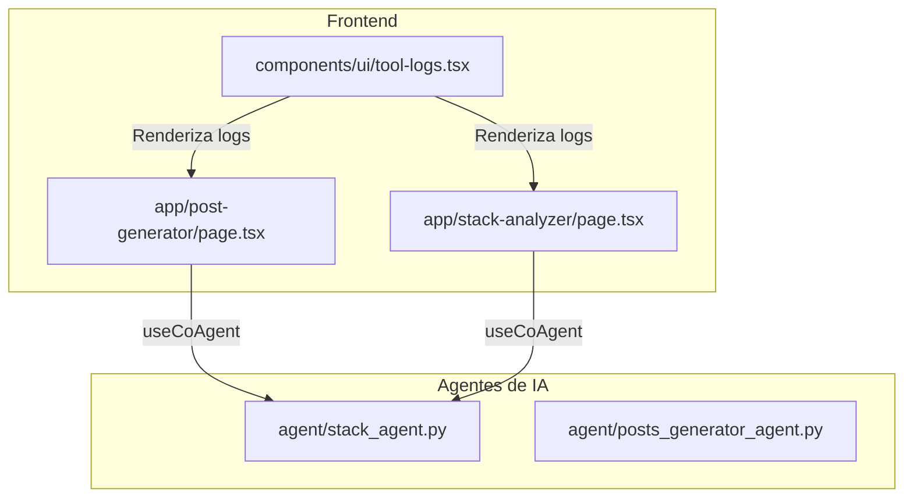
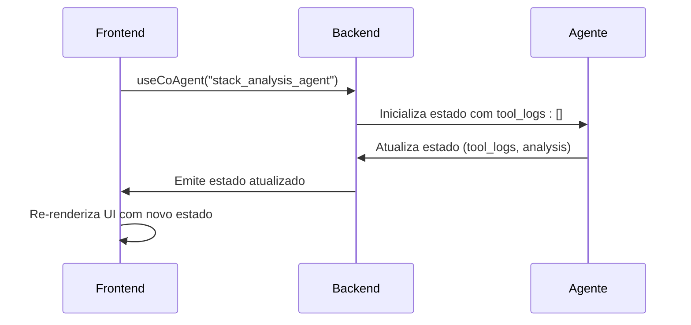
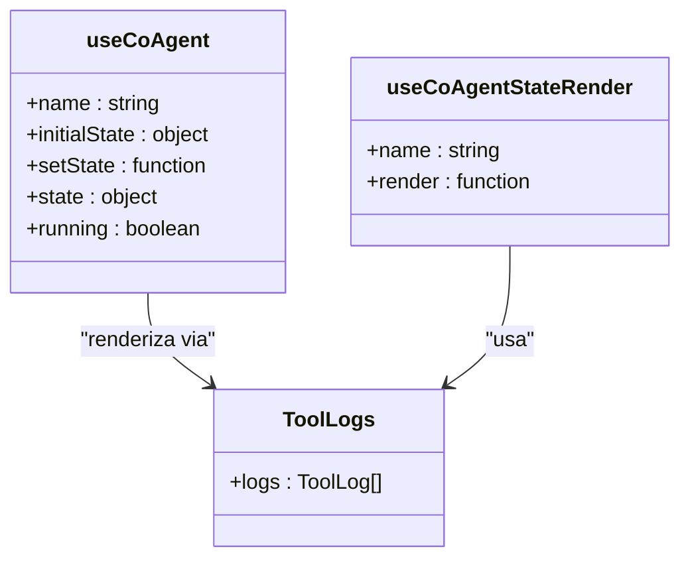
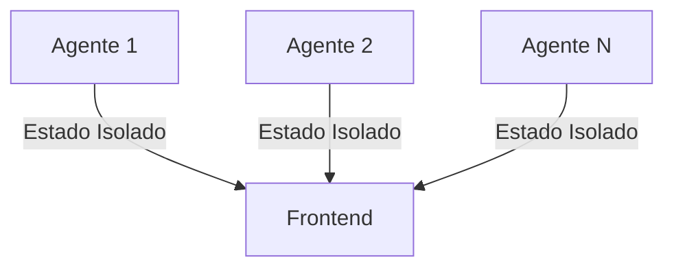

# Gerenciamento de Estado Compartilhado com Agentes

<cite>
**Arquivos Referenciados neste Documento**  
- [app/post-generator/page.tsx](file://app/post-generator/page.tsx)
- [app/stack-analyzer/page.tsx](file://app/stack-analyzer/page.tsx)
- [components/ui/tool-logs.tsx](file://components/ui/tool-logs.tsx)
- [agent/stack_agent.py](file://agent/stack_agent.py)
</cite>

## Sumário
1. [Introdução](#introdução)
2. [Estrutura do Projeto](#estrutura-do-projeto)
3. [Componentes Principais](#componentes-principais)
4. [Visão Geral da Arquitetura](#visão-geral-da-arquitetura)
5. [Análise Detalhada dos Componentes](#análise-detalhada-dos-componentes)
6. [Análise de Dependências](#análise-de-dependências)
7. [Considerações de Desempenho](#considerações-de-desempenho)
8. [Guia de Solução de Problemas](#guia-de-solução-de-problemas)
9. [Conclusão](#conclusão)

## Introdução
Este documento fornece uma análise detalhada do sistema de gerenciamento de estado compartilhado entre o frontend e os agentes de IA no projeto Open Gemini Canvas. O foco está nos hooks `useCoAgent` e `useCoAgentStateRender`, que permitem a sincronização reativa do estado entre interfaces React e agentes de IA executados no backend. O documento explora como o estado inicial é definido, como é atualizado assincronamente durante a execução do agente, e como é mantido isolado por agente, com ênfase em depuração e monitoramento.

## Estrutura do Projeto
O projeto é organizado em uma estrutura modular com separação clara entre frontend (Next.js), componentes de interface, agentes de IA (Python) e utilitários. Os agentes de IA são responsáveis por tarefas especializadas, enquanto o frontend consome seus estados através de mecanismos de sincronização fornecidos pelo CopilotKit.



**Fontes do Diagrama**  
- [app/post-generator/page.tsx](file://app/post-generator/page.tsx)
- [app/stack-analyzer/page.tsx](file://app/stack-analyzer/page.tsx)
- [agent/stack_agent.py](file://agent/stack_agent.py)

**Fontes da Seção**  
- [app/post-generator/page.tsx](file://app/post-generator/page.tsx)
- [app/stack-analyzer/page.tsx](file://app/stack-analyzer/page.tsx)

## Componentes Principais
Os componentes principais envolvidos no gerenciamento de estado são os hooks `useCoAgent` e `useCoAgentStateRender`, que permitem ao frontend se inscrever no estado de um agente específico. O estado é inicializado com propriedades como `tool_logs`, `show_cards` e `analysis`, e atualizado dinamicamente durante a execução do agente.

**Fontes da Seção**  
- [app/post-generator/page.tsx](file://app/post-generator/page.tsx#L82-L88)
- [app/stack-analyzer/page.tsx](file://app/stack-analyzer/page.tsx#L81-L89)

## Visão Geral da Arquitetura
A arquitetura utiliza um modelo de estado compartilhado onde cada agente mantém seu próprio estado isolado. O frontend se conecta a um agente específico via `useCoAgent`, recebendo atualizações em tempo real. O estado é atualizado no backend através de `copilotkit_emit_state`, garantindo consistência entre frontend e backend.



**Fontes do Diagrama**  
- [app/stack-analyzer/page.tsx](file://app/stack-analyzer/page.tsx#L81-L89)
- [agent/stack_agent.py](file://agent/stack_agent.py#L266-L379)

## Análise Detalhada dos Componentes

### Análise do Componente de Gerenciamento de Estado

#### Para Componentes Baseados em Estado:


**Fontes do Diagrama**  
- [app/post-generator/page.tsx](file://app/post-generator/page.tsx#L82-L111)
- [components/ui/tool-logs.tsx](file://components/ui/tool-logs.tsx#L0-L40)

#### Para Fluxo de Atualização de Estado:
```mermaid
flowchart TD
A[Início da Execução do Agente] --> B[Atualiza tool_logs para "processing"]
B --> C[Chama copilotkit_emit_state]
C --> D[Frontend recebe atualização]
D --> E[Re-renderiza ToolLogs]
E --> F[Agente conclui tarefa]
F --> G[Atualiza status para "completed"]
G --> H[Emite estado final]
H --> I[Frontend atualiza UI]
```

**Fontes do Diagrama**  
- [agent/stack_agent.py](file://agent/stack_agent.py#L266-L379)
- [app/stack-analyzer/page.tsx](file://app/stack-analyzer/page.tsx#L116-L120)

**Fontes da Seção**  
- [app/post-generator/page.tsx](file://app/post-generator/page.tsx)
- [app/stack-analyzer/page.tsx](file://app/stack-analyzer/page.tsx)
- [agent/stack_agent.py](file://agent/stack_agent.py)

### Visão Conceitual
O sistema permite que múltiplos agentes operem simultaneamente com estados isolados, evitando conflitos. O frontend pode alternar entre agentes mantendo o estado específico de cada um.



## Análise de Dependências
O sistema depende do CopilotKit para sincronização de estado entre frontend e backend. Os agentes Python utilizam `copilotkit_emit_state` para atualizar o estado, enquanto o frontend utiliza hooks React para consumi-lo.

```mermaid
graph LR
A[CopilotKit React] --> B[useCoAgent]
C[CopilotKit Python] --> D[copilotkit_emit_state]
B < --> E[Estado Compartilhado]
D < --> E
```

**Fontes do Diagrama**  
- [app/post-generator/page.tsx](file://app/post-generator/page.tsx#L24)
- [agent/stack_agent.py](file://agent/stack_agent.py#L266)

**Fontes da Seção**  
- [app/post-generator/page.tsx](file://app/post-generator/page.tsx)
- [agent/stack_agent.py](file://agent/stack_agent.py)

## Considerações de Desempenho
O sistema utiliza atualização de estado em tempo real, o que pode gerar muitas re-renderizações se não gerenciado corretamente. Recomenda-se usar `useMemo` ou `React.memo` em componentes que consomem o estado para otimizar o desempenho.

## Guia de Solução de Problemas
Para depurar problemas de estado, verifique:
- Se o nome do agente em `useCoAgent` corresponde ao nome do agente no backend
- Se `copilotkit_emit_state` está sendo chamado corretamente no backend
- Se o estado inicial está definido corretamente com todas as propriedades necessárias

**Fontes da Seção**  
- [app/stack-analyzer/page.tsx](file://app/stack-analyzer/page.tsx#L81-L89)
- [agent/stack_agent.py](file://agent/stack_agent.py#L266-L379)

## Conclusão
O sistema de gerenciamento de estado compartilhado com `useCoAgent` e `useCoAgentStateRender` oferece uma solução robusta para sincronizar estado entre frontend React e agentes de IA. A isolação por agente, atualização assíncrona e reatividade com React tornam o sistema adequado para aplicações complexas com múltiplos agentes operando simultaneamente.