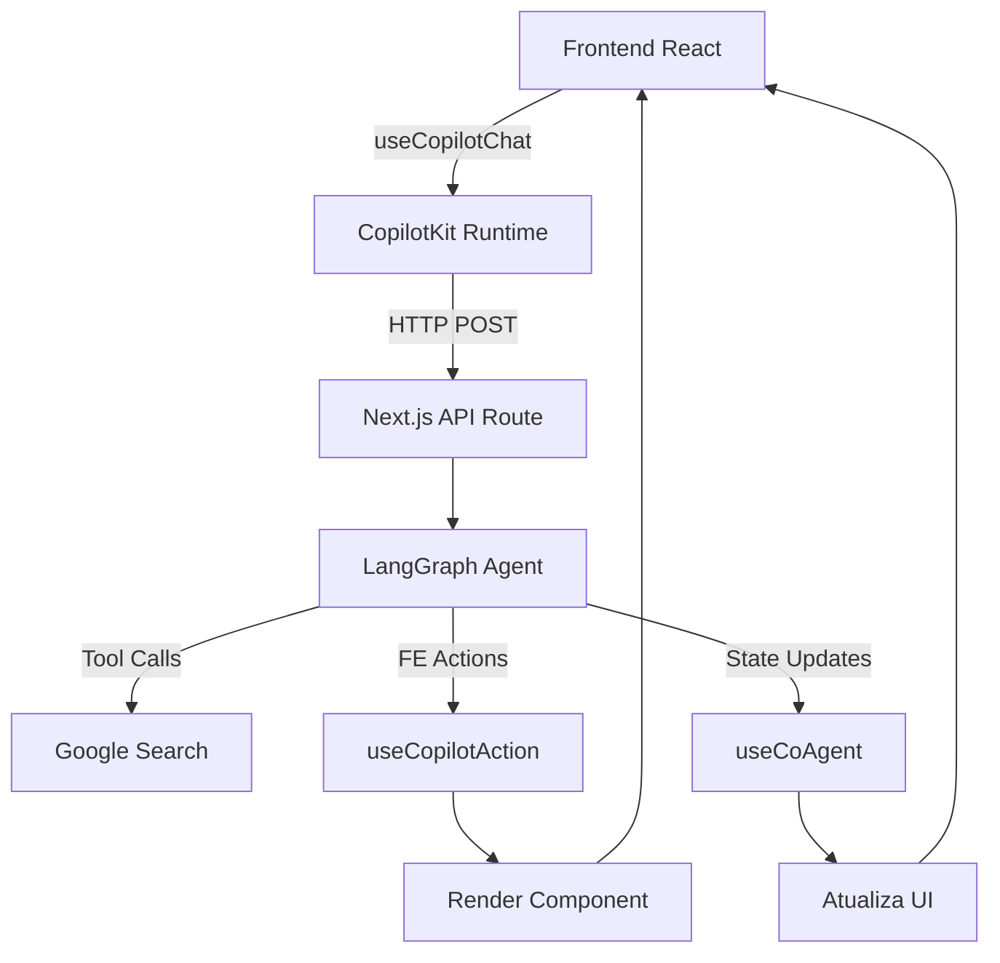
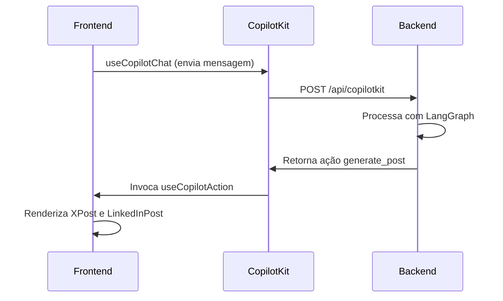
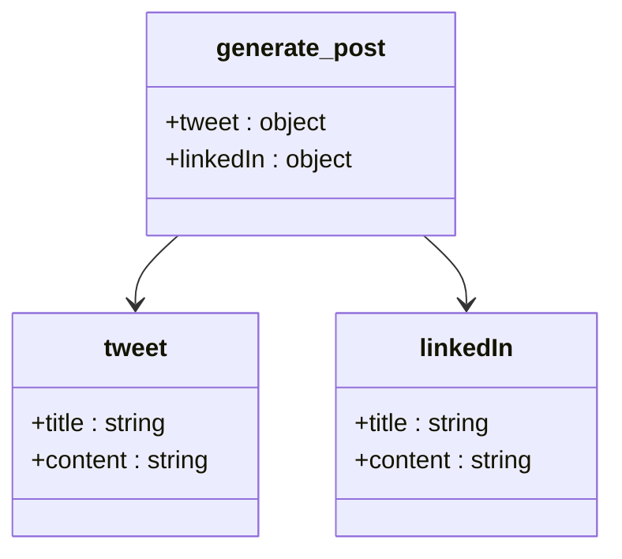
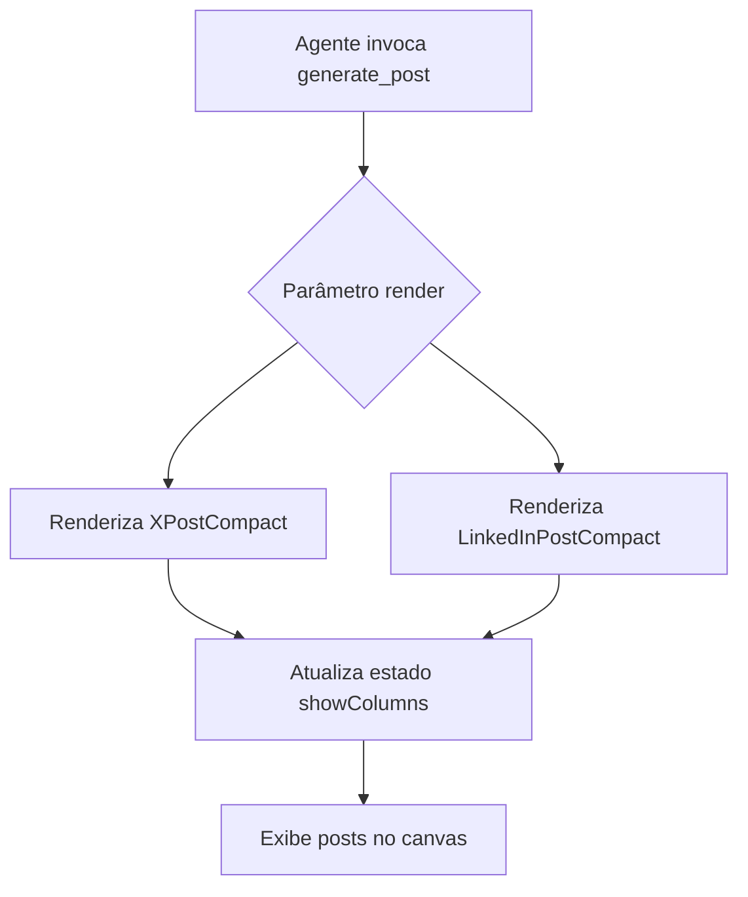
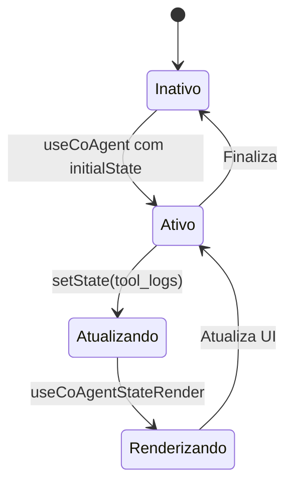
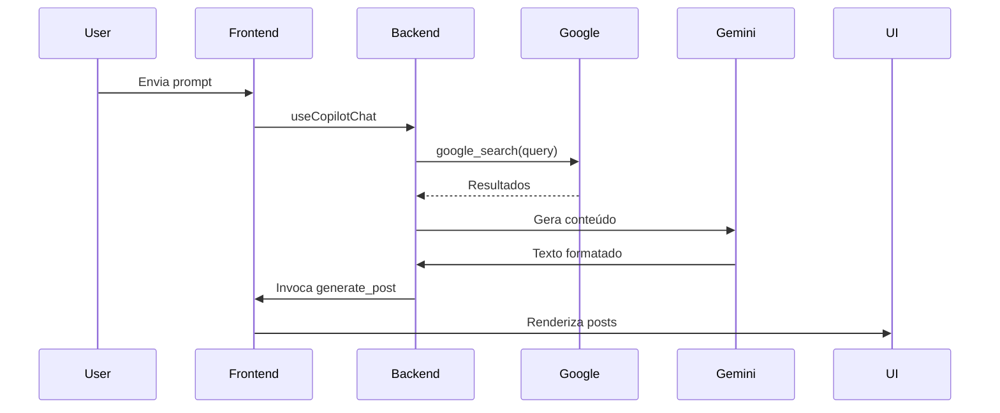

# Integração com Agentes de IA via CopilotKit

<cite>
**Arquivos Referenciados neste Documento**   
- [post-generator\page.tsx](file://app/post-generator/page.tsx)
- [api\copilotkit\route.ts](file://app/api/copilotkit/route.ts)
- [components\ui\x-post.tsx](file://components/ui/x-post.tsx)
- [components\ui\linkedin-post.tsx](file://components/ui/linkedin-post.tsx)
- [prompts\prompts.ts](file://app/prompts/prompts.ts)
- [posts_generator_agent.py](file://agent/posts_generator_agent.py)
- [prompts.py](file://agent/prompts.py)
</cite>

## Sumário
1. [Introdução](#introdução)
2. [Arquitetura da Integração Frontend-Backend](#arquitetura-da-integração-frontend-backend)
3. [Uso de Hooks do CopilotKit](#uso-de-hooks-do-copilotkit)
4. [Definição de Ações de IA com Parâmetros Tipados](#definição-de-ações-de-ia-com-parâmetros-tipados)
5. [Renderização de Componentes Dinâmicos](#renderização-de-componentes-dinâmicos)
6. [Gerenciamento de Estado Compartilhado](#gerenciamento-de-estado-compartilhado)
7. [Fluxo Completo de Dados: Exemplo com generate_post](#fluxo-completo-de-dados-exemplo-com-generate_post)
8. [Conclusão](#conclusão)

## Introdução

O CopilotKit é uma biblioteca que permite integrar agentes de IA ao frontend de aplicações React, facilitando a comunicação entre interfaces de usuário e modelos de linguagem. Este documento detalha como integrar páginas frontend com agentes de IA usando o CopilotKit, com foco nos hooks `useCopilotAction`, `useCoAgent` e `useCopilotChat`. A integração permite definir ações de IA com parâmetros tipados, renderizar componentes dinâmicos com base nas respostas do agente e gerenciar estado compartilhado entre frontend e backend.

O projeto analisado combina React com Next.js no frontend, e Python com LangGraph no backend, utilizando o Google Gemini como modelo de linguagem. A arquitetura permite a geração de posts para LinkedIn e X (Twitter) com base em pesquisas web e prompts do usuário.

**Seção fontes**
- [post-generator\page.tsx](file://app/post-generator/page.tsx)

## Arquitetura da Integração Frontend-Backend

A arquitetura do sistema é baseada em uma comunicação bidirecional entre frontend e backend, mediada pelo CopilotKit. O frontend envia mensagens ao backend via `useCopilotChat`, que as processa usando um agente LangGraph. O backend responde com ações que o frontend pode renderizar dinamicamente.

**Fontes do diagrama**
- [post-generator\page.tsx](file://app/post-generator/page.tsx)
- [api\copilotkit\route.ts](file://app/api/copilotkit/route.ts)
- [posts_generator_agent.py](file://agent/posts_generator_agent.py)

**Seção fontes**
- [post-generator\page.tsx](file://app/post-generator/page.tsx)
- [api\copilotkit\route.ts](file://app/api/copilotkit/route.ts)
- [posts_generator_agent.py](file://agent/posts_generator_agent.py)

## Uso de Hooks do CopilotKit

O CopilotKit fornece hooks essenciais para integrar agentes de IA ao frontend. Os principais hooks utilizados são `useCopilotAction`, `useCoAgent` e `useCopilotChat`.

### useCopilotChat

Este hook permite ao frontend enviar mensagens ao agente de IA e receber respostas. Ele gerencia a conversa entre usuário e agente, mantendo o histórico de mensagens.

### useCoAgent

Usado para gerenciar o estado compartilhado entre frontend e backend. Permite que o frontend acesse e atualize o estado do agente, como logs de ferramentas.

### useCopilotAction

Permite definir ações que o agente pode invocar no frontend. Quando o agente decide executar uma ação, o frontend renderiza o componente correspondente.

**Fontes do diagrama**
- [post-generator\page.tsx](file://app/post-generator/page.tsx)
- [api\copilotkit\route.ts](file://app/api/copilotkit/route.ts)

**Seção fontes**
- [post-generator\page.tsx](file://app/post-generator/page.tsx)

## Definição de Ações de IA com Parâmetros Tipados

As ações de IA são definidas no frontend com parâmetros tipados, permitindo que o backend invoque funções específicas com dados estruturados. A ação `generate_post` é um exemplo central.

A ação `generate_post` aceita dois objetos tipados: `tweet` e `linkedIn`, cada um com propriedades `title` e `content`. Esses parâmetros são definidos com tipos explícitos no hook `useCopilotAction`.

**Fontes do diagrama**
- [post-generator\page.tsx](file://app/post-generator/page.tsx)

**Seção fontes**
- [post-generator\page.tsx](file://app/post-generator/page.tsx)

## Renderização de Componentes Dinâmicos

A renderização dinâmica é realizada através do parâmetro `render` em `useCopilotAction`. Quando o agente invoca a ação `generate_post`, o frontend renderiza os componentes `XPostCompact` e `LinkedInPostCompact` com base nos dados recebidos.

O estado `showColumns` é atualizado para exibir os posts gerados no canvas principal. Os componentes são renderizados condicionalmente com base no conteúdo dos posts.

**Fontes do diagrama**
- [post-generator\page.tsx](file://app/post-generator/page.tsx)
- [components\ui\x-post.tsx](file://components/ui/x-post.tsx)
- [components\ui\linkedin-post.tsx](file://components/ui/linkedin-post.tsx)

**Seção fontes**
- [post-generator\page.tsx](file://app/post-generator/page.tsx)
- [components\ui\x-post.tsx](file://components/ui/x-post.tsx)
- [components\ui\linkedin-post.tsx](file://components/ui/linkedin-post.tsx)

## Gerenciamento de Estado Compartilhado

O estado compartilhado é gerenciado através de `useCoAgent` e `setState`. O estado do agente inclui logs de ferramentas (`tool_logs`) que são atualizados durante a execução.

O hook `useCoAgentStateRender` permite renderizar o estado do agente em tempo real, mostrando os logs de ferramentas enquanto o agente realiza pesquisas web.

**Fontes do diagrama**
- [post-generator\page.tsx](file://app/post-generator/page.tsx)

**Seção fontes**
- [post-generator\page.tsx](file://app/post-generator/page.tsx)

## Fluxo Completo de Dados: Exemplo com generate_post

O fluxo completo começa quando o usuário envia uma mensagem. O backend processa com o agente LangGraph, realiza uma pesquisa web, e gera um post usando a ação `generate_post`.

1. O usuário envia um prompt (ex: "Generate a post about recent research on String Theory").
2. O agente realiza uma pesquisa web com `google_search`.
3. O modelo Gemini gera conteúdo com base nos resultados.
4. O agente invoca a ação `generate_post` com os dados estruturados.
5. O frontend renderiza os componentes `XPost` e `LinkedInPost` no canvas.

**Fontes do diagrama**
- [post-generator\page.tsx](file://app/post-generator/page.tsx)
- [posts_generator_agent.py](file://agent/posts_generator_agent.py)
- [prompts.py](file://agent/prompts.py)

**Seção fontes**
- [post-generator\page.tsx](file://app/post-generator/page.tsx)
- [posts_generator_agent.py](file://agent/posts_generator_agent.py)
- [prompts.py](file://agent/prompts.py)

## Conclusão

A integração com agentes de IA via CopilotKit permite criar interfaces dinâmicas e inteligentes que respondem a ações de modelos de linguagem. O uso de hooks como `useCopilotAction`, `useCoAgent` e `useCopilotChat` facilita a comunicação bidirecional, a definição de ações tipadas e o gerenciamento de estado compartilhado. O exemplo da função `generate_post` demonstra um fluxo completo de dados entre frontend e backend, mostrando como componentes dinâmicos podem ser renderizados com base em respostas de IA.