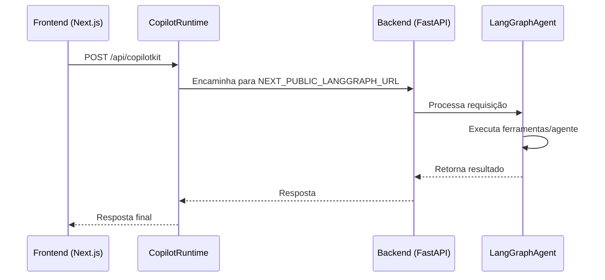
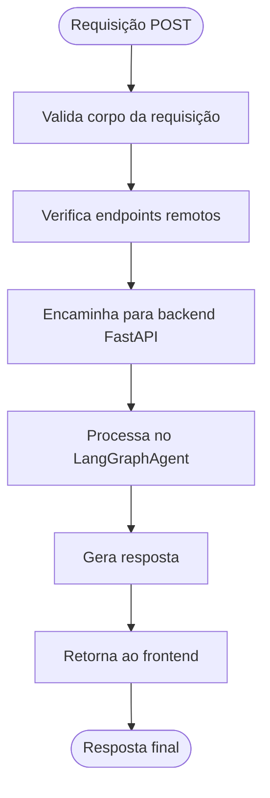
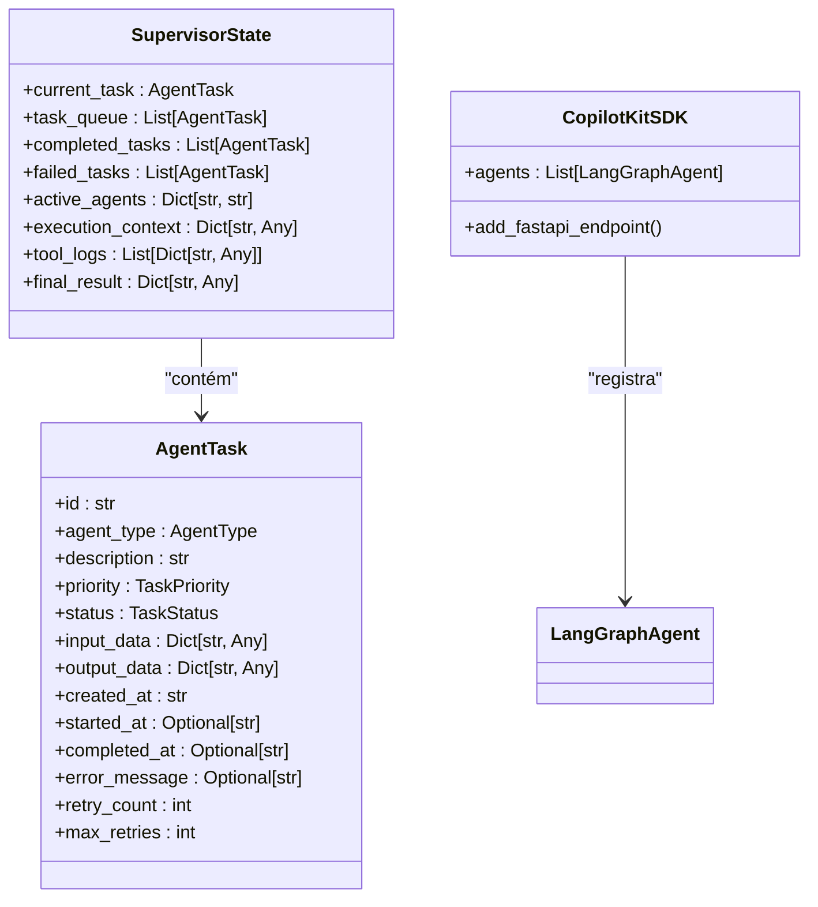
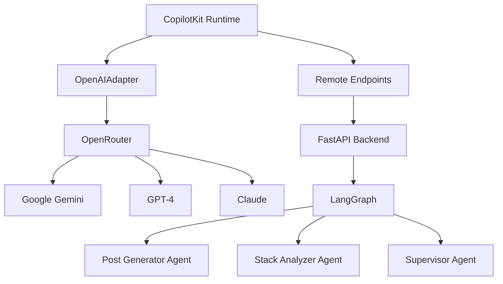

# Integração da API Frontend com Backend via CopilotKit

<cite>
**Arquivos Referenciados neste Documento**  
- [app/api/copilotkit/route.ts](file://app/api/copilotkit/route.ts)
- [agent/main.py](file://agent/main.py)
- [app/wrapper.tsx](file://app/wrapper.tsx)
- [agent/supervisor.py](file://agent/supervisor.py)
- [agent/posts_generator_agent.py](file://agent/posts_generator_agent.py)
- [agent/stack_agent.py](file://agent/stack_agent.py)
- [.env.example](file://.env.example)
- [agent/.env.example](file://agent/.env.example)
</cite>

## Sumário
1. [Introdução](#introdução)
2. [Estrutura do Projeto](#estrutura-do-projeto)
3. [Componentes Principais](#componentes-principais)
4. [Visão Geral da Arquitetura](#visão-geral-da-arquitetura)
5. [Análise Detalhada dos Componentes](#análise-detalhada-dos-componentes)
6. [Análise de Dependências](#análise-de-dependências)
7. [Considerações de Desempenho](#considerações-de-desempenho)
8. [Guia de Solução de Problemas](#guia-de-solução-de-problemas)
9. [Conclusão](#conclusão)

## Introdução

Este documento fornece uma análise técnica detalhada da integração entre o frontend e o backend no projeto Open Gemini Canvas, com foco na rota API `/api/copilotkit/route.ts`. O sistema implementa uma arquitetura de agentes de IA utilizando CopilotKit, LangGraph e OpenRouter para acessar modelos como o Google Gemini. A integração permite que o frontend Next.js comunique-se com um backend FastAPI que orquestra múltiplos agentes especializados para tarefas como geração de conteúdo e análise de tecnologias.

## Estrutura do Projeto

O projeto segue uma arquitetura de microsserviços com separação clara entre frontend e backend. O frontend é implementado com Next.js 15 e TypeScript, enquanto o backend utiliza FastAPI com Python 3.12+. A comunicação entre os dois é facilitada pelo CopilotKit, que atua como middleware para orquestrar fluxos de agentes.

```mermaid
graph TB
subgraph "Frontend"
UI[Interface Next.js]
Wrapper[Wrapper.tsx]
CopilotKit[Runtime CopilotKit]
end
subgraph "Backend"
FastAPI[FastAPI]
LangGraph[Orquestrador LangGraph]
Agents[Agentes Especializados]
end
Wrapper --> CopilotKit --> API[/api/copilotkit]
API --> FastAPI --> LangGraph --> Agents
```

**Fontes do Diagrama**  
- [app/api/copilotkit/route.ts](file://app/api/copilotkit/route.ts)
- [agent/main.py](file://agent/main.py)

**Fontes da Seção**  
- [app/api/copilotkit/route.ts](file://app/api/copilotkit/route.ts)
- [agent/main.py](file://agent/main.py)

## Componentes Principais

A integração do CopilotKit envolve vários componentes principais que trabalham em conjunto para facilitar a comunicação entre frontend e backend. O `CopilotRuntime` gerencia o estado da conversa e roteia mensagens, enquanto o `GoogleGenerativeAIAdapter` (implementado como `OpenAIAdapter`) configura o modelo de linguagem através do OpenRouter. O `LangGraphAgent` representa os agentes especializados no backend que realizam tarefas específicas.

A variável de ambiente `NEXT_PUBLIC_LANGGRAPH_URL` é crucial para a configuração, pois define o endpoint remoto para o qual as requisições são encaminhadas. O endpoint `/api/copilotkit` no frontend atua como um proxy, recebendo requisições POST e encaminhando-as para o backend FastAPI em `/copilotkit`.

**Fontes da Seção**  
- [app/api/copilotkit/route.ts](file://app/api/copilotkit/route.ts)
- [agent/main.py](file://agent/main.py)

## Visão Geral da Arquitetura

A arquitetura implementa um padrão de comunicação cliente-servidor com orquestração de agentes. Quando o frontend faz uma requisição POST para `/api/copilotkit`, o `copilotRuntimeNextJSAppRouterEndpoint` processa a requisição, utilizando o `CopilotRuntime` configurado com endpoints remotos. O runtime então encaminha a mensagem para o backend FastAPI no endpoint especificado por `NEXT_PUBLIC_LANGGRAPH_URL`.

No backend, o FastAPI recebe as requisições no endpoint `/copilotkit` e as direciona para o `CopilotKitSDK`, que orquestra os agentes LangGraph registrados. Cada agente é responsável por um domínio específico, como geração de posts ou análise de stack, e pode chamar ferramentas externas ou transferir tarefas para outros agentes especializados.



**Fontes do Diagrama**  
- [app/api/copilotkit/route.ts](file://app/api/copilotkit/route.ts)
- [agent/main.py](file://agent/main.py)

## Análise Detalhada dos Componentes

### Análise do Endpoint CopilotKit

O endpoint `/api/copilotkit/route.ts` é o ponto de entrada principal para a integração entre frontend e backend. Ele configura o `CopilotRuntime` com um array de `remoteEndpoints`, onde a URL é determinada pela variável de ambiente `NEXT_PUBLIC_LANGGRAPH_URL`. Esta configuração permite que o frontend se comunique com o backend FastAPI, mesmo quando estão em diferentes origens.

O `copilotRuntimeNextJSAppRouterEndpoint` é uma função de utilidade que cria um manipulador de requisições para rotas Next.js App Router. Ele recebe o `runtime`, `serviceAdapter` e o `endpoint` como parâmetros e retorna um objeto com uma função `handleRequest`. Esta função processa a requisição recebida, valida os dados e encaminha a mensagem para o backend apropriado.



**Fontes do Diagrama**  
- [app/api/copilotkit/route.ts](file://app/api/copilotkit/route.ts)

**Fontes da Seção**  
- [app/api/copilotkit/route.ts](file://app/api/copilotkit/route.ts)

### Análise dos Agentes de Backend

O backend implementa múltiplos agentes especializados usando LangGraph, cada um com responsabilidades específicas. O `supervisor_graph` atua como um agente supervisor que coordena outros agentes, decidindo qual agente deve processar cada requisição com base no conteúdo da mensagem. Os agentes especializados incluem o `post_generator` para criação de conteúdo e o `stack_analyzer` para análise de tecnologias.

Cada agente é implementado como um grafo LangGraph com múltiplos nós que representam diferentes etapas do processamento. Por exemplo, o agente de geração de posts primeiro realiza uma pesquisa na web, depois gera o conteúdo e finalmente formata a resposta para a plataforma apropriada (LinkedIn ou Twitter). O estado do agente é gerenciado pelo `CopilotKitState`, que permite que o frontend acompanhe o progresso do processamento.



**Fontes do Diagrama**  
- [agent/supervisor.py](file://agent/supervisor.py)
- [agent/main.py](file://agent/main.py)

**Fontes da Seção**  
- [agent/supervisor.py](file://agent/supervisor.py)
- [agent/posts_generator_agent.py](file://agent/posts_generator_agent.py)
- [agent/stack_agent.py](file://agent/stack_agent.py)

## Análise de Dependências

A integração depende de várias bibliotecas e serviços externos que devem estar corretamente configurados para o funcionamento adequado. As dependências principais incluem o CopilotKit para integração frontend-backend, o LangGraph para orquestração de agentes, e o OpenRouter como provedor de modelos de IA.

A configuração de variáveis de ambiente é crítica para a integração. As variáveis `OPENROUTER_API_KEY`, `OPENROUTER_MODEL` e `OPENROUTER_BASE_URL` devem ser definidas tanto no frontend quanto no backend para garantir acesso ao modelo de linguagem. A variável `NEXT_PUBLIC_LANGGRAPH_URL` é especialmente importante, pois define o endpoint remoto para comunicação entre frontend e backend.



**Fontes do Diagrama**  
- [app/api/copilotkit/route.ts](file://app/api/copilotkit/route.ts)
- [agent/main.py](file://agent/main.py)

**Fontes da Seção**  
- [.env.example](file://.env.example)
- [agent/.env.example](file://agent/.env.example)

## Considerações de Desempenho

A arquitetura implementada oferece vários pontos de otimização de desempenho. O uso de OpenRouter permite fallback automático entre modelos, aumentando a confiabilidade e reduzindo tempos de resposta. A orquestração de agentes através do LangGraph permite execução paralela de tarefas independentes, melhorando a eficiência do processamento.

Para grandes volumes de requisições, recomenda-se implementar cache no frontend para evitar chamadas redundantes ao backend. Além disso, o backend pode ser escalonado horizontalmente, com múltiplas instâncias do FastAPI balanceadas por um load balancer. O monitoramento do uso de API através do dashboard do OpenRouter permite identificar gargalos e otimizar o uso de recursos.

## Guia de Solução de Problemas

Problemas comuns na integração geralmente envolvem configuração incorreta de variáveis de ambiente ou problemas de conectividade entre frontend e backend. Erros de autenticação geralmente indicam que a `OPENROUTER_API_KEY` não está configurada corretamente ou é inválida. Problemas de comunicação entre frontend e backend podem ocorrer se o `NEXT_PUBLIC_LANGGRAPH_URL` estiver incorreto ou se o backend não estiver em execução.

Para depurar problemas, verifique primeiro se o backend está rodando acessando `http://localhost:8000/healthz`. Em seguida, confirme que todas as variáveis de ambiente estão corretamente definidas em ambos os arquivos `.env`. O uso dos scripts de setup fornecidos pode ajudar a garantir uma configuração correta das dependências.

**Fontes da Seção**  
- [README.md](file://README.md)
- [agent/main.py](file://agent/main.py)

## Conclusão

A integração da API frontend com o backend via CopilotKit implementa uma arquitetura robusta e escalável para agentes de IA. O uso do CopilotRuntime como middleware permite uma comunicação eficiente entre o frontend Next.js e o backend FastAPI, enquanto o LangGraph orquestra múltiplos agentes especializados para tarefas complexas. A configuração com OpenRouter proporciona flexibilidade na escolha de modelos de IA e confiabilidade através de fallback automático. Esta arquitetura demonstra como combinar diferentes tecnologias para criar aplicações de IA práticas e eficientes.