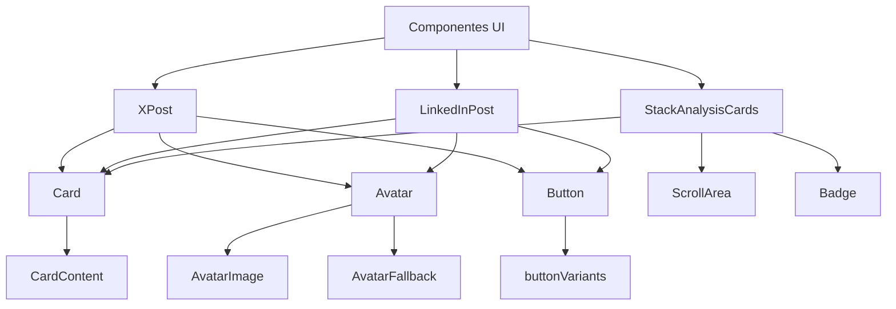
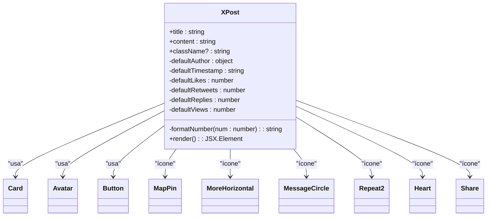
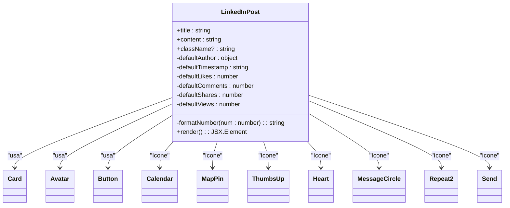
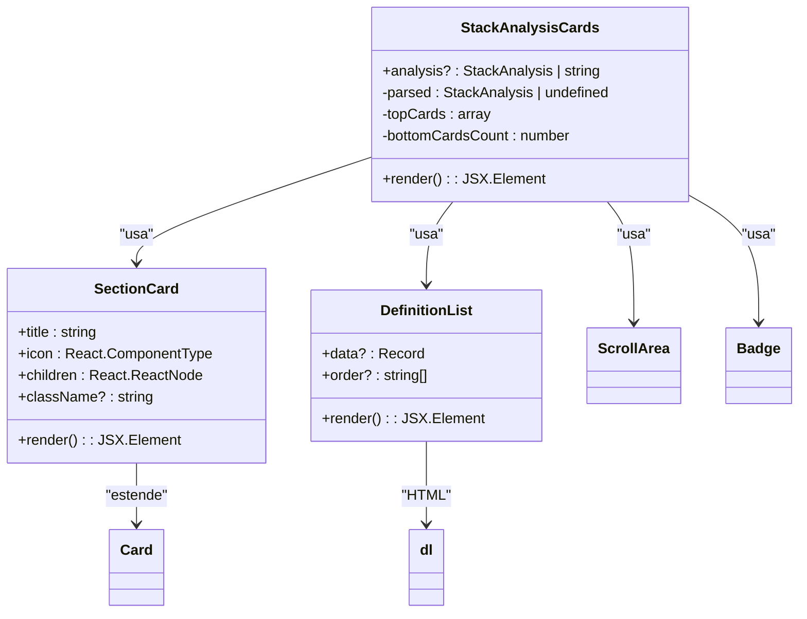
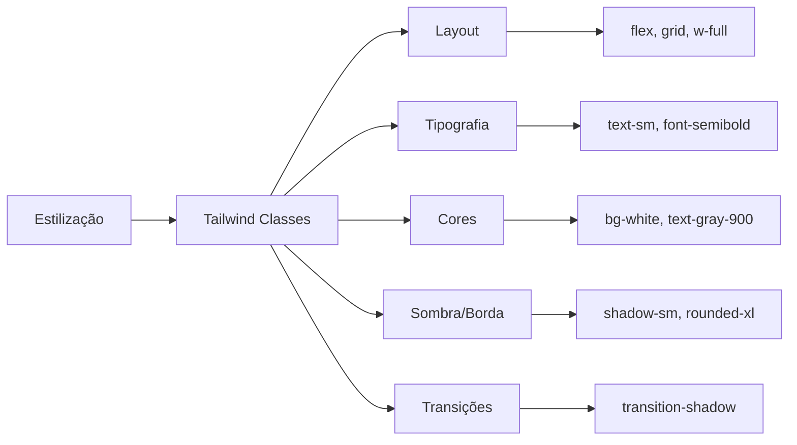

# Utilização e Extensão de Componentes UI

<cite>
**Arquivos Referenciados neste Documento**  
- [x-post.tsx](file://components/ui/x-post.tsx)
- [linkedin-post.tsx](file://components/ui/linkedin-post.tsx)
- [stack-analysis-cards.tsx](file://components/ui/stack-analysis-cards.tsx)
- [card.tsx](file://components/ui/card.tsx)
- [avatar.tsx](file://components/ui/avatar.tsx)
- [button.tsx](file://components/ui/button.tsx)
- [page.tsx](file://app/post-generator/page.tsx)
- [page.tsx](file://app/stack-analyzer/page.tsx)
- [prompts.ts](file://app/prompts/prompts.ts)
- [utils.ts](file://lib/utils.ts)
</cite>

## Sumário
1. [Introdução](#introdução)
2. [Estrutura dos Componentes UI](#estrutura-dos-componentes-ui)
3. [Componente XPost](#componente-xpost)
4. [Componente LinkedInPost](#componente-linkedinpost)
5. [Componente StackAnalysisCards](#componente-stackanalysiscards)
6. [Padrões de Composição e Reutilização](#padrões-de-composição-e-reutilização)
7. [Diretrizes de Acessibilidade](#diretrizes-de-acessibilidade)
8. [Responsividade e Estilização com Tailwind CSS](#responsividade-e-estilização-com-tailwind-css)
9. [Extensão para Novos Agentes](#extensão-para-novos-agentes)
10. [Boas Práticas e Recomendações](#boas-práticas-e-recomendações)

## Introdução

Este documento tem como objetivo detalhar a utilização e extensão dos componentes de interface do usuário (UI) existentes no projeto **Open Gemini Canvas**, com foco nos componentes `XPost`, `LinkedInPost` e `StackAnalysisCards`. O projeto utiliza React com Next.js, Tailwind CSS e um design system baseado em componentes reutilizáveis. Os componentes são projetados para exibir conteúdo dinâmico gerado por agentes de IA, mantendo consistência visual, acessibilidade e responsividade.

A documentação aborda a estrutura dos componentes, seus props, padrões de composição, diretrizes de estilização com Tailwind CSS e como adaptá-los para novos agentes, garantindo que novas funcionalidades se integrem harmoniosamente ao design system existente.

**Seções fontes**
- [x-post.tsx](file://components/ui/x-post.tsx#L1-L327)
- [linkedin-post.tsx](file://components/ui/linkedin-post.tsx#L1-L367)
- [stack-analysis-cards.tsx](file://components/ui/stack-analysis-cards.tsx#L1-L259)

## Estrutura dos Componentes UI

Os componentes principais estão localizados no diretório `components/ui/` e seguem uma arquitetura baseada em composição, onde componentes menores como `Card`, `Avatar`, `Button` e `Badge` são utilizados para construir componentes mais complexos. Essa abordagem promove reutilização, consistência e facilidade de manutenção.

A estrutura geral dos componentes inclui:
- **Props tipados com TypeScript**: Garantem segurança de tipo e documentação clara.
- **Composição com Tailwind CSS**: Estilos aplicados diretamente via classes utilitárias.
- **Suporte a variantes e temas**: Através do uso de `cn` (class merge) e `data-slot`.
- **Acessibilidade integrada**: Uso de elementos semânticos, atributos ARIA e suporte a teclado.



**Fontes do diagrama**
- [x-post.tsx](file://components/ui/x-post.tsx#L1-L327)
- [linkedin-post.tsx](file://components/ui/linkedin-post.tsx#L1-L367)
- [stack-analysis-cards.tsx](file://components/ui/stack-analysis-cards.tsx#L1-L259)
- [card.tsx](file://components/ui/card.tsx#L1-L93)
- [avatar.tsx](file://components/ui/avatar.tsx#L1-L54)
- [button.tsx](file://components/ui/button.tsx#L1-L60)

**Fontes da seção**
- [components/ui](file://components/ui)
- [x-post.tsx](file://components/ui/x-post.tsx#L1-L327)
- [linkedin-post.tsx](file://components/ui/linkedin-post.tsx#L1-L367)
- [stack-analysis-cards.tsx](file://components/ui/stack-analysis-cards.tsx#L1-L259)

## Componente XPost

O componente `XPost` representa uma postagem simulada da plataforma X (antigo Twitter). Ele exibe informações como autor, conteúdo, título, métricas de engajamento (curtidas, retweets, respostas, visualizações) e ações interativas.

### Props
- `title` (string): Título da postagem.
- `content` (string): Corpo do texto da postagem.
- `className` (string, opcional): Classes CSS adicionais para personalização.

### Estrutura Interna
- **Header**: Contém o avatar do autor, nome, handle, verificação e metadados (localização, horário).
- **Título e Conteúdo**: Exibidos em destaque com formatação clara.
- **Barra de Ações**: Botões para resposta, retweet, curtida e compartilhamento, com contadores formatados (K/M).

O componente utiliza `Card` como container principal, `Avatar` para a imagem do autor e `Button` para as ações. A função `formatNumber` converte números grandes em formatos legíveis (ex: 1.2K).



**Fontes do diagrama**
- [x-post.tsx](file://components/ui/x-post.tsx#L25-L154)

**Fontes da seção**
- [x-post.tsx](file://components/ui/x-post.tsx#L1-L327)

## Componente LinkedInPost

O componente `LinkedInPost` simula uma postagem da plataforma LinkedIn, com um design mais profissional e informações adicionais como cargo e empresa do autor.

### Props
- `title` (string): Título da postagem.
- `content` (string): Corpo do texto da postagem.
- `className` (string, opcional): Classes CSS adicionais.

### Estrutura Interna
- **Header**: Inclui avatar, nome, cargo, empresa, verificação e metadados (horário, localização).
- **Título e Conteúdo**: Semelhante ao XPost, mas com espaçamento e tipografia ajustados.
- **Estatísticas de Engajamento**: Exibe curtidas, comentários e compartilhamentos com ícones de reações.
- **Barra de Ações**: Botões para curtir, comentar, repostar e enviar, com rótulos de texto.

O componente compartilha muitos elementos com `XPost`, mas possui um layout mais denso e focado em conteúdo profissional. Utiliza `ThumbsUp`, `Heart` e `Send` para ícones de ação.



**Fontes do diagrama**
- [linkedin-post.tsx](file://components/ui/linkedin-post.tsx#L27-L182)

**Fontes da seção**
- [linkedin-post.tsx](file://components/ui/linkedin-post.tsx#L1-L367)

## Componente StackAnalysisCards

O componente `StackAnalysisCards` é responsável por exibir uma análise detalhada da stack tecnológica de um repositório GitHub. Ele é altamente dinâmico e pode renderizar diferentes seções com base nos dados fornecidos.

### Props
- `analysis` (StackAnalysis | string, opcional): Dados da análise, podendo ser um objeto ou uma string JSON.

### Estrutura Interna
- **Validação e Parsing**: Converte entrada JSON em objeto e valida sua presença.
- **Seções Condicionais**: Renderiza cartões apenas para seções com dados (frontend, backend, etc.).
- **Grid Responsivo**: Usa `gridColsClass` para ajustar o layout com base no número de cartões.
- **Componentes Internos**:
  - `SectionCard`: Cartão com título, ícone e conteúdo.
  - `DefinitionList`: Lista de definições com chave e valor.
  - `ScrollArea`: Área rolável para listas longas.
  - `Badge`: Exibe dependências e bibliotecas.

O componente utiliza `useEffect` para depuração e `isNonEmptyArray` para verificar arrays. Suporta dados aninhados e exibe mensagens de fallback quando não há análise disponível.



**Fontes do diagrama**
- [stack-analysis-cards.tsx](file://components/ui/stack-analysis-cards.tsx#L118-L256)

**Fontes da seção**
- [stack-analysis-cards.tsx](file://components/ui/stack-analysis-cards.tsx#L1-L259)

## Padrões de Composição e Reutilização

Os componentes seguem padrões de composição que facilitam a extensão e manutenção:

### Composição Baseada em Componentes Pequenos
Componentes como `Card`, `Avatar` e `Button` são utilizados como blocos de construção. Isso permite:
- Consistência visual em toda a aplicação.
- Fácil atualização de estilos em um único local.
- Reutilização em múltiplos contextos.

### Funções de Utilidade
- `cn` (de `lib/utils.ts`): Combina classes CSS, resolvendo conflitos e permitindo sobreposição.
- `humanize`: Converte nomes de propriedades em formato legível (ex: `package_manager` → `Package Manager`).
- `gridColsClass`: Define classes de grid responsivas com base no número de itens.

### Variantes e Temas
O uso de `data-slot` e classes utilitárias do Tailwind permite a criação de variantes sem duplicação de código. Por exemplo, `Button` suporta variantes como `ghost`, `outline`, `secondary`, etc.

```mermaid
flowchart TD
A[Novo Componente] --> B{Reutiliza Componentes Existentes?}
B --> |Sim| C[Usar Card, Avatar, Button, etc.]
B --> |Não| D[Criar Novo Componente Simples]
C --> E[Aplicar Tailwind Classes]
D --> E
E --> F[Usar cn() para Mesclar Classes]
F --> G[Adicionar data-slot para Estilização]
G --> H[Exportar como Padrão ou Nomeado]
```

**Fontes da seção**
- [utils.ts](file://lib/utils.ts#L1-L7)
- [card.tsx](file://components/ui/card.tsx#L1-L93)
- [button.tsx](file://components/ui/button.tsx#L1-L60)

## Diretrizes de Acessibilidade

A acessibilidade é uma prioridade no design dos componentes:

### Elementos Semânticos
- Uso de `<button>` para ações interativas.
- `<h3>` para títulos de postagens.
- `<dl>`, `<dt>`, `<dd>` para listas de definição em `StackAnalysisCards`.

### Atributos ARIA
- `aria-invalid` nos botões para indicar estados de erro.
- `aria-label` implícito em ícones de ação (embora possa ser melhorado com rótulos visíveis).

### Navegação por Teclado
- Todos os botões são focáveis e ativáveis com Enter/Space.
- `Card` e `Avatar` são estruturados para leitores de tela.

### Contraste e Tamanho
- Cores com bom contraste (ex: texto cinza escuro em fundo branco).
- Tamanhos de fonte adequados para leitura (text-sm, text-base).
- Ícones com tamanho suficiente para toque em dispositivos móveis.

**Recomendações de Melhoria**:
- Adicionar `aria-label` explícito aos botões de ação.
- Usar `role="article"` em postagens para melhor semântica.
- Implementar suporte a modo de alto contraste.

**Fontes da seção**
- [x-post.tsx](file://components/ui/x-post.tsx#L1-L327)
- [linkedin-post.tsx](file://components/ui/linkedin-post.tsx#L1-L367)
- [stack-analysis-cards.tsx](file://components/ui/stack-analysis-cards.tsx#L1-L259)

## Responsividade e Estilização com Tailwind CSS

O projeto utiliza Tailwind CSS para estilização, garantindo responsividade e consistência.

### Classes Utilizadas
- **Layout**: `flex`, `grid`, `w-full`, `max-w-md`, `p-4`, `gap-3`.
- **Tipografia**: `text-sm`, `text-base`, `font-semibold`, `leading-relaxed`.
- **Cores**: `bg-white`, `text-gray-900`, `text-gray-500`, `border-gray-200/50`.
- **Sombra e Borda**: `shadow-sm`, `hover:shadow-md`, `rounded-xl`, `border`.
- **Transições**: `transition-shadow`, `duration-200`, `hover:bg-blue-50`.

### Responsividade
- `max-w-md` limita a largura do `XPost`.
- `truncate` e `whitespace-pre-wrap` controlam o overflow de texto.
- `grid` com `md:grid-cols-2` e `xl:grid-cols-3` ajusta o layout em telas maiores.
- `scroll-area` permite rolagem em conteúdos longos.

### Design System
- **Cores Gradientes**: Usadas em avatares e ícones para identidade visual.
- **Espaçamento Consistente**: `gap-3`, `mb-3`, `p-4` seguem uma escala definida.
- **Hover States**: Efeitos sutis de hover em cartões e botões.



**Fontes da seção**
- [x-post.tsx](file://components/ui/x-post.tsx#L1-L327)
- [linkedin-post.tsx](file://components/ui/linkedin-post.tsx#L1-L367)
- [stack-analysis-cards.tsx](file://components/ui/stack-analysis-cards.tsx#L1-L259)
- [card.tsx](file://components/ui/card.tsx#L1-L93)

## Extensão para Novos Agentes

Para adaptar os componentes a novos agentes, siga estas etapas:

### 1. Definir a Estrutura de Dados
Crie uma interface TypeScript que descreva os dados do novo agente, similar a `StackAnalysis`.

### 2. Criar um Novo Componente de Visualização
- Reutilize `Card`, `SectionCard`, `DefinitionList` se a estrutura for semelhante.
- Crie um novo componente se necessário, seguindo os mesmos padrões de estilização.

### 3. Integrar com a Página do Agente
Atualize a página do agente (ex: `page.tsx`) para renderizar o novo componente com base no estado do agente.

### 4. Atualizar o Contexto de Layout
Use `useLayout` para gerenciar o estado do agente ativo e navegar entre páginas.

### Exemplo de Integração
```tsx
// Em uma nova página de agente
{state.show_analysis && <NewAgentAnalysis data={state.analysis} />}
```

**Fontes da seção**
- [page.tsx](file://app/post-generator/page.tsx#L1-L411)
- [page.tsx](file://app/stack-analyzer/page.tsx#L1-L348)
- [LayoutContext.tsx](file://app/contexts/LayoutContext.tsx)

## Boas Práticas e Recomendações

### Reutilização de Componentes
- Sempre que possível, use componentes existentes em vez de criar novos.
- Evite duplicação de lógica de estilização.

### Tipagem e Segurança
- Use TypeScript para definir props e interfaces.
- Valide entradas (ex: parsing de JSON em `StackAnalysisCards`).

### Desempenho
- Use `React.memo` para componentes pesados se necessário.
- Evite re-renderizações desnecessárias com `useCallback` e `useMemo`.

### Manutenibilidade
- Mantenha comentários claros para lógica complexa.
- Organize os componentes em subdiretórios por funcionalidade.

### Testes
- Adicione testes unitários para componentes com lógica complexa.
- Teste a acessibilidade com ferramentas como axe.

**Fontes da seção**
- [x-post.tsx](file://components/ui/x-post.tsx#L1-L327)
- [linkedin-post.tsx](file://components/ui/linkedin-post.tsx#L1-L367)
- [stack-analysis-cards.tsx](file://components/ui/stack-analysis-cards.tsx#L1-L259)
- [page.tsx](file://app/post-generator/page.tsx#L1-L411)
- [page.tsx](file://app/stack-analyzer/page.tsx#L1-L348)