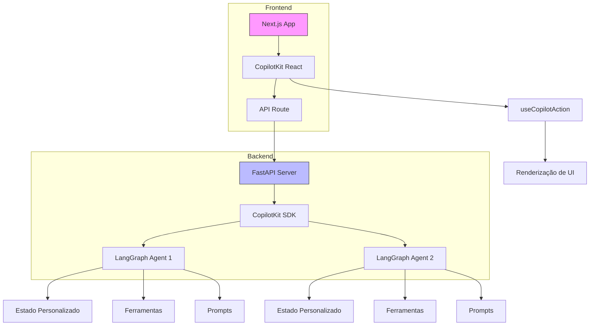
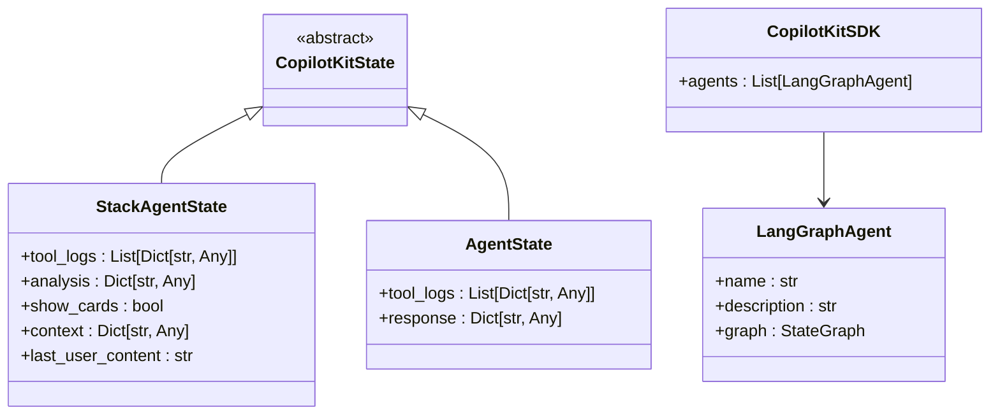
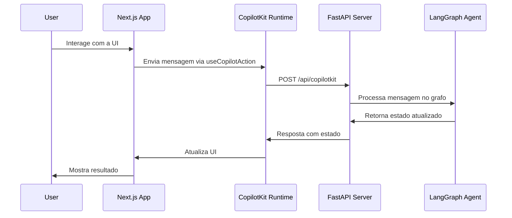

# Extensões e Personalizações

<cite>
**Arquivos Referenciados neste Documento**  
- [main.py](file://agent/main.py)
- [posts_generator_agent.py](file://agent/posts_generator_agent.py)
- [stack_agent.py](file://agent/stack_agent.py)
- [prompts.py](file://agent/prompts.py)
- [route.ts](file://app/api/copilotkit/route.ts)
- [page.tsx](file://app/post-generator/page.tsx)
- [stack-analyzer/page.tsx](file://app/stack-analyzer/page.tsx)
- [stack-analysis-cards.tsx](file://components/ui/stack-analysis-cards.tsx)
- [wrapper.tsx](file://app/wrapper.tsx)
- [prompts.ts](file://app/prompts/prompts.ts)
</cite>

## Sumário
1. [Introdução](#introdução)
2. [Arquitetura de Extensibilidade](#arquitetura-de-extensibilidade)
3. [Criando um Novo Agente com LangGraph](#criando-um-novo-agente-com-langgraph)
4. [Integração com o Frontend via CopilotKit](#integração-com-o-frontend-via-copilotkit)
5. [Exemplos Práticos de Extensão](#exemplos-práticos-de-extensão)
6. [Pontos de Integração](#pontos-de-integração)
7. [Boas Práticas para Arquitetura Limpa](#boas-práticas-para-arquitetura-limpa)
8. [Considerações de Compatibilidade e Testes](#considerações-de-compatibilidade-e-testes)

## Introdução
Este documento fornece um guia abrangente para estender o projeto Open Gemini Canvas com novos agentes, funcionalidades e integrações. O sistema é construído com uma arquitetura modular que combina CopilotKit, LangGraph e Google Gemini, permitindo a adição de novos agentes com comportamentos personalizados. A documentação detalha os pontos de integração, padrões de implementação e boas práticas para garantir que novas extensões mantenham a integridade, testabilidade e compatibilidade do sistema.

## Arquitetura de Extensibilidade

**Fontes do Diagrama**  
- [main.py](file://agent/main.py#L1-L61)
- [route.ts](file://app/api/copilotkit/route.ts#L1-L25)
- [wrapper.tsx](file://app/wrapper.tsx#L1-L11)

**Fontes da Seção**  
- [main.py](file://agent/main.py#L1-L61)
- [route.ts](file://app/api/copilotkit/route.ts#L1-L25)

## Criando um Novo Agente com LangGraph

Para criar um novo agente com LangGraph, siga os passos abaixo:

1. **Defina o Estado do Agente**: Crie uma classe que herde de `CopilotKitState` com os campos necessários para o contexto do agente.
2. **Implemente os Nós do Grafo**: Crie funções assíncronas que representem os passos do fluxo do agente.
3. **Defina o Grafo de Estado**: Use `StateGraph` para conectar os nós e definir a lógica de transição.
4. **Compile o Grafo**: Compile o grafo com um checkpointer para manter o estado entre execuções.
5. **Registre no Servidor FastAPI**: Adicione o novo agente à lista de agentes no `sdk` em `main.py`.

O estado do agente é crucial para manter o contexto entre as interações. Por exemplo, o `StackAgentState` inclui campos como `tool_logs`, `analysis`, e `show_cards` para controlar o fluxo de análise de repositórios.

**Fontes do Diagrama**  
- [stack_agent.py](file://agent/stack_agent.py#L29-L34)
- [posts_generator_agent.py](file://agent/posts_generator_agent.py#L19-L21)
- [main.py](file://agent/main.py#L15-L25)

**Fontes da Seção**  
- [stack_agent.py](file://agent/stack_agent.py#L29-L34)
- [posts_generator_agent.py](file://agent/posts_generator_agent.py#L19-L21)
- [main.py](file://agent/main.py#L15-L25)

## Integração com o Frontend via CopilotKit

O frontend é estendido criando novas páginas e conectando-as ao novo agente através do CopilotKit. O componente `wrapper.tsx` envolve o aplicativo com `CopilotKit`, fornecendo a URL do runtime e o agente ativo. Cada página (como `post-generator/page.tsx`) usa hooks como `useCopilotAction` para renderizar componentes baseados nas ações do agente.

Para adicionar uma nova página:
1. Crie um novo arquivo `page.tsx` em um diretório sob `app/`.
2. Use `useCoAgent` para conectar-se ao agente específico.
3. Use `useCopilotAction` para definir como as ações do agente são renderizadas na UI.
4. Atualize o contexto de layout para alternar entre agentes.

A comunicação entre frontend e backend ocorre através do endpoint `/api/copilotkit`, que roteia as solicitações para os agentes remotos definidos em `NEXT_PUBLIC_LANGGRAPH_URL`.

**Fontes do Diagrama**  
- [wrapper.tsx](file://app/wrapper.tsx#L1-L11)
- [page.tsx](file://app/post-generator/page.tsx#L1-L410)
- [route.ts](file://app/api/copilotkit/route.ts#L1-L25)

**Fontes da Seção**  
- [wrapper.tsx](file://app/wrapper.tsx#L1-L11)
- [page.tsx](file://app/post-generator/page.tsx#L1-L410)
- [route.ts](file://app/api/copilotkit/route.ts#L1-L25)

## Exemplos Práticos de Extensão

### Adicionar Suporte a GitLab
Para estender o `stack_agent.py` para suportar repositórios GitLab:
1. Modifique a função `_parse_github_url` para reconhecer URLs do GitLab.
2. Adapte `_github_headers` e `_gh_get` para usar a API do GitLab.
3. Atualize os prompts para incluir referências ao GitLab.

### Gerar Documentação Automática
Crie um novo agente que:
1. Use o estado para armazenar o código-fonte fornecido.
2. Implemente uma ferramenta que analise a estrutura do código.
3. Use prompts para gerar documentação em formato Markdown.
4. Retorne a documentação como uma ação para renderização no frontend.

### Analisar Segurança de Dependências
Estenda o `stack_agent.py` para:
1. Adicionar um nó que analise arquivos de dependência (ex: `package.json`).
2. Use uma ferramenta que consulte bancos de dados de vulnerabilidades.
3. Inclua os resultados na análise estruturada com riscos e notas.

## Pontos de Integração

### Rotas API
- **`/api/copilotkit`**: Endpoint principal que conecta o frontend ao backend via CopilotKit Runtime.
- **`/copilotkit`**: Rota no FastAPI que expõe os agentes LangGraph.
- **`/healthz`**: Verificação de saúde do servidor.

### Hooks de Frontend
- **`useCoAgent`**: Conecta um componente ao estado de um agente específico.
- **`useCopilotAction`**: Define como as ações do agente são executadas e renderizadas.
- **`useCoAgentStateRender`**: Renderiza o estado do agente em tempo real (ex: logs de ferramentas).

### Scripts de Inicialização
- **`setup-agent.sh`**: Configura o ambiente Python e instala dependências.
- **`next.config.mjs`**: Configuração do Next.js, incluindo desativação de verificação de build.

**Fontes da Seção**  
- [main.py](file://agent/main.py#L50-L61)
- [route.ts](file://app/api/copilotkit/route.ts#L1-L25)
- [post-generator/page.tsx](file://app/post-generator/page.tsx#L1-L410)
- [setup-agent.sh](file://scripts/setup-agent.sh#L1-L13)

## Boas Práticas para Arquitetura Limpa

1. **Separação de Concerns**: Mantenha a lógica do agente no diretório `agent/` e a UI em `app/`.
2. **Estado Imutável**: Sempre retorne um novo estado em nós do LangGraph, nunca modifique o estado in-place.
3. **Prompts Modularizados**: Armazene prompts em arquivos separados (ex: `prompts.py`) para fácil manutenção.
4. **Tipagem Forte**: Use Pydantic para esquemas de saída estruturada (ex: `StructuredStackAnalysis`).
5. **Ferramentas Reutilizáveis**: Implemente ferramentas genéricas que possam ser usadas por múltiplos agentes.
6. **Testabilidade**: Projete nós como funções puras sempre que possível para facilitar testes unitários.

## Considerações de Compatibilidade e Testes

Ao adicionar novas extensões, considere:
- **Compatibilidade de Versão**: Verifique as versões das dependências em `pyproject.toml` e `package.json`.
- **Backward Compatibility**: Evite alterar contratos de estado existentes; adicione novos campos em vez de modificar os existentes.
- **Testes de Integração**: Use o frontend para testar o fluxo completo do agente, desde a entrada do usuário até a renderização da resposta.
- **Validação de Entrada**: Sempre valide URLs, chaves de API e outros parâmetros de entrada.
- **Tratamento de Erros**: Implemente logs de ferramentas para depuração e mensagens de erro amigáveis para o usuário.

Para testar novas extensões:
1. Inicie o backend com `python main.py`.
2. Inicie o frontend com `pnpm dev`.
3. Use o aplicativo para interagir com o novo agente.
4. Verifique os logs do servidor e as atualizações de estado no frontend.

**Fontes da Seção**  
- [pyproject.toml](file://agent/pyproject.toml#L1-L26)
- [package.json](file://package.json#L1-L10)
- [stack_agent.py](file://agent/stack_agent.py#L100-L106)
- [prompts.py](file://agent/prompts.py#L1-L50)
- [prompts.ts](file://app/prompts/prompts.ts#L1-L23)