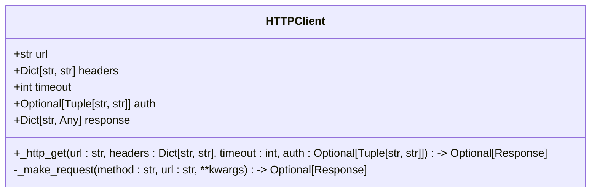
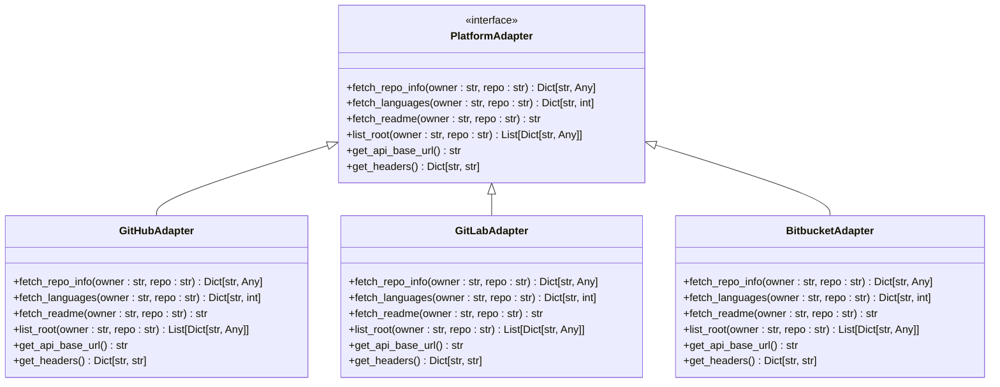
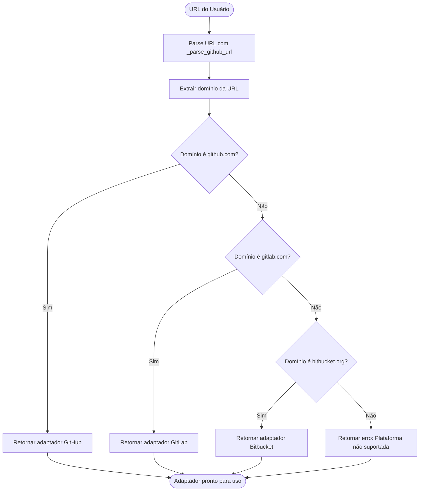
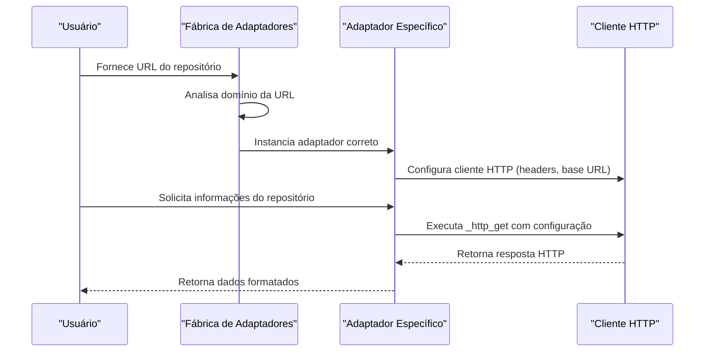

# Abstração do Cliente HTTP

<cite>
**Arquivos Referenciados neste Documento**  
- [stack_agent.py](file://agent/stack_agent.py)
- [main.py](file://agent/main.py)
</cite>

## Sumário
1. [Introdução](#introdução)
2. [Análise do Código Atual](#análise-do-código-atual)
3. [Proposta de Abstração HTTP](#proposta-de-abstração-http)
4. [Interface de Adaptador de Plataforma](#interface-de-adaptador-de-plataforma)
5. [Injeção de Dependência e Fábrica de Adaptadores](#injeção-de-dependência-e-fábrica-de-adaptadores)
6. [Benefícios da Abstração](#benefícios-da-abstração)
7. [Conclusão](#conclusão)

## Introdução

Este documento apresenta uma proposta de refatoração para o código do agente de análise de repositórios, com foco na abstração do cliente HTTP atualmente acoplado ao GitHub. O objetivo é criar uma solução genérica que permita a integração com múltiplas plataformas como GitHub, GitLab e Bitbucket, através de uma interface comum e injeção de dependência. A refatoração visa melhorar a manutenibilidade, facilitar testes unitários e permitir a adição de novas plataformas com mínimo esforço.

## Análise do Código Atual

O código atual no módulo `stack_agent.py` contém funções específicas do GitHub que realizam chamadas HTTP diretamente usando a biblioteca `requests`. Essas funções estão fortemente acopladas à API do GitHub, dificultando a extensão para outras plataformas.

As principais funções identificadas são:
- `_gh_get`: Realiza requisições GET para a API do GitHub
- `_github_headers`: Gera cabeçalhos específicos do GitHub
- Funções de busca como `_fetch_repo_info`, `_fetch_languages`, `_fetch_readme` e `_list_root`

Essas funções utilizam URLs fixas do GitHub e tratamento de resposta específico da API do GitHub, criando um alto acoplamento que impede a reutilização para outras plataformas.

**Section sources**
- [stack_agent.py](file://agent/stack_agent.py#L122-L181)

## Proposta de Abstração HTTP

### Função Genérica `_http_get`

Propomos a criação de uma função genérica `_http_get` que encapsule a lógica de requisição HTTP, aceitando parâmetros configuráveis:



A função `_http_get` deve aceitar os seguintes parâmetros:
- **URL**: Endereço completo do endpoint
- **Cabeçalhos**: Dicionário de cabeçalhos HTTP personalizáveis
- **Timeout**: Tempo limite para a requisição
- **Autenticação**: Credenciais de autenticação no formato adequado para a plataforma

Essa abstração permite configurar dinamicamente o cliente HTTP para diferentes plataformas, removendo o acoplamento com o GitHub.

**Section sources**
- [stack_agent.py](file://agent/stack_agent.py#L131-L138)

## Interface de Adaptador de Plataforma

### Definição da Interface `PlatformAdapter`

Propomos a definição de uma interface comum `PlatformAdapter` que padronize as operações de acesso a repositórios:



**Diagram sources**
- [stack_agent.py](file://agent/stack_agent.py#L142-L181)

### Implementações Específicas

Cada plataforma implementará a interface `PlatformAdapter` com suas particularidades:

**GitHubAdapter**: Utiliza a API REST do GitHub com autenticação via token Bearer e URLs baseadas em `https://api.github.com`.

**GitLabAdapter**: Implementa chamadas para a API do GitLab, com autenticação via token e URLs baseadas no endpoint do GitLab.

**BitbucketAdapter**: Adapta as chamadas para a API do Bitbucket, considerando suas especificidades de autenticação e estrutura de resposta.

## Injeção de Dependência e Fábrica de Adaptadores

### Detecção de Plataforma

A detecção da plataforma será baseada na URL fornecida pelo usuário, utilizando e estendendo a função `_parse_github_url` existente:



**Diagram sources**
- [stack_agent.py](file://agent/stack_agent.py#L110-L118)

### Fábrica de Adaptadores

A fábrica de adaptadores será responsável por instanciar o adaptador correto com base na URL:

```python
def create_platform_adapter(url: str) -> PlatformAdapter:
    """Cria o adaptador de plataforma apropriado com base na URL."""
    if "github.com" in url:
        return GitHubAdapter()
    elif "gitlab.com" in url:
        return GitLabAdapter()
    elif "bitbucket.org" in url:
        return BitbucketAdapter()
    else:
        raise ValueError(f"Plataforma não suportada: {url}")
```

### Exemplo de Uso com Injeção de Dependência



**Diagram sources**
- [stack_agent.py](file://agent/stack_agent.py#L142-L181)

## Benefícios da Abstração

### Manutenibilidade

A separação de responsabilidades entre cliente HTTP, adaptadores de plataforma e lógica de negócio permite:
- Atualizações na camada HTTP sem afetar a lógica de negócio
- Correção de bugs em um adaptador sem impactar outros
- Facilidade de atualização de APIs de plataformas

### Testes Unitários

A abstração possibilita testes mais eficazes:
- Mocking de adaptadores para testes isolados
- Testes de integração com diferentes plataformas
- Verificação de comportamento do cliente HTTP independentemente da plataforma

### Extensibilidade

A arquitetura proposta facilita a adição de novas plataformas:
- Implementação de novo adaptador seguindo a interface
- Registro na fábrica de adaptadores
- Testes específicos para a nova plataforma

### Reutilização de Código

A função `_http_get` genérica pode ser utilizada em outras partes do sistema que necessitem de comunicação HTTP, promovendo a reutilização de código e consistência nas chamadas.

## Conclusão

A refatoração proposta para abstrair o cliente HTTP e implementar uma interface de adaptador de plataforma representa uma melhoria significativa na arquitetura do sistema. Ao remover o acoplamento direto com o GitHub, ganhamos flexibilidade para integrar com múltiplas plataformas de hospedagem de código, além de melhorar a manutenibilidade, testabilidade e extensibilidade do código. A implementação da fábrica de adaptadores com detecção automática de plataforma proporciona uma experiência transparente para o usuário, que pode fornecer URLs de diferentes plataformas sem necessidade de configuração adicional. Esta abordagem segue princípios de design sólidos como inversão de dependência e aberto/fechado, preparando o sistema para futuras expansões e adaptações.