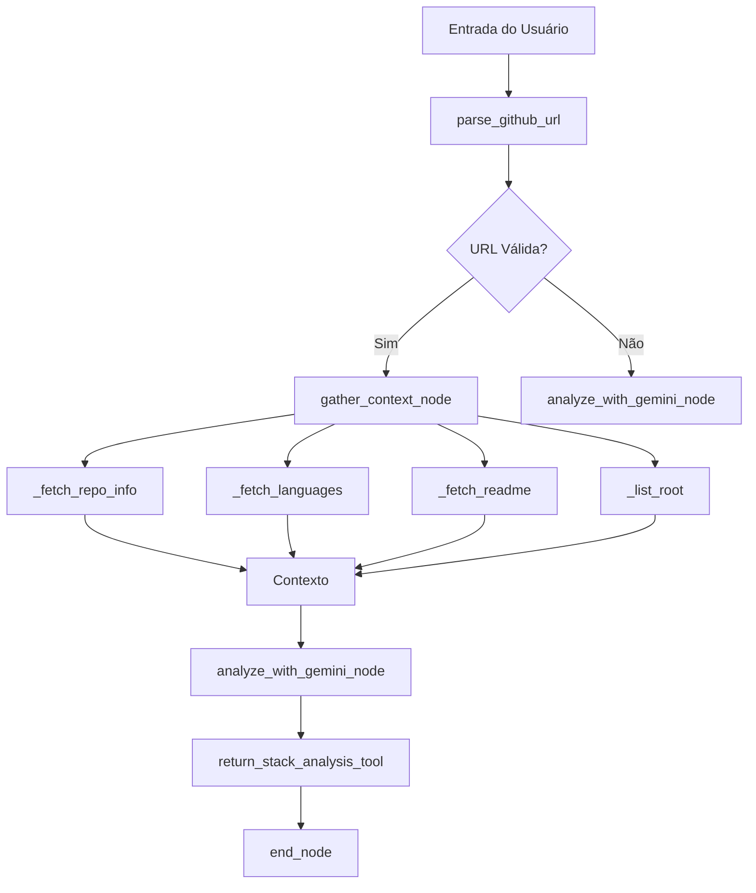
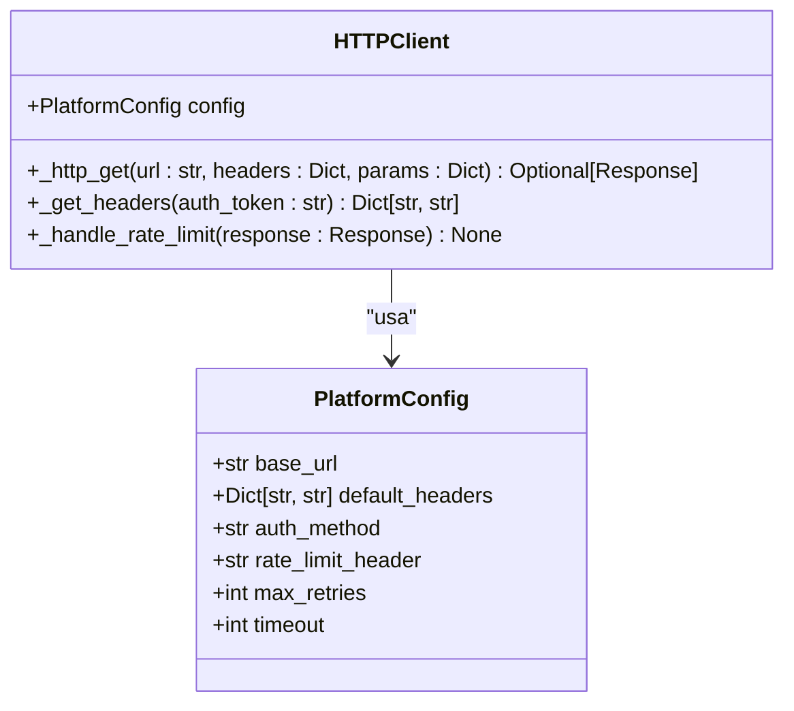
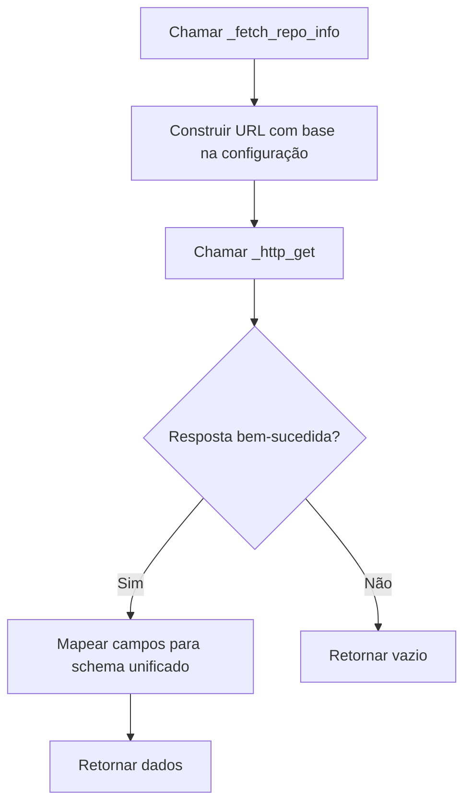
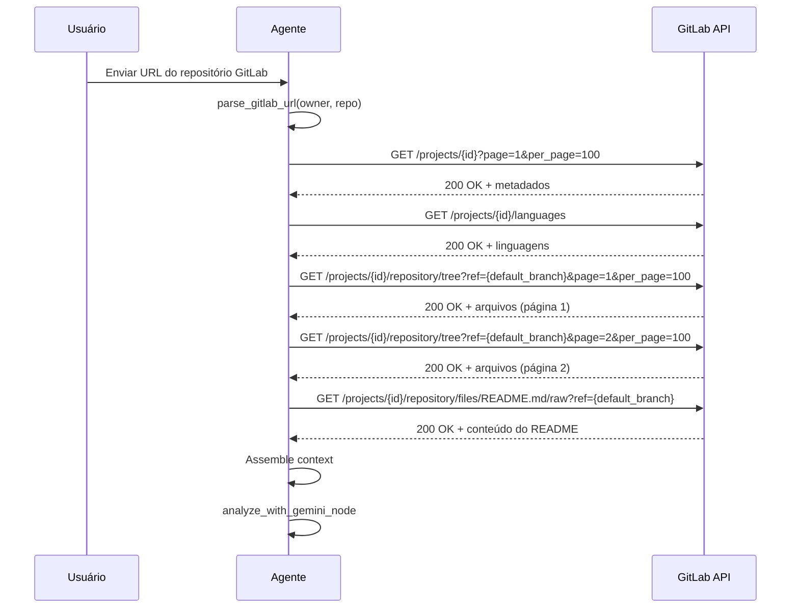

# Integrar Novas Plataformas de Código

<cite>
**Arquivos Referenciados neste Documento**  
- [stack_agent.py](file://agent/stack_agent.py)
- [OPENROUTER_SETUP.md](file://OPENROUTER_SETUP.md)
</cite>

## Sumário
1. [Introdução](#introdução)
2. [Análise da Arquitetura Atual](#análise-da-arquitetura-atual)
3. [Diferenças entre APIs de Plataformas](#diferenças-entre-apis-de-plataformas)
4. [Abstração de Requisições HTTP](#abstração-de-requisições-http)
5. [Adaptação das Funções de Coleta](#adaptação-das-funções-de-coleta)
6. [Exemplo de Integração com GitLab](#exemplo-de-integração-com-gitlab)
7. [Estratégias de Fallback e Tolerância a Falhas](#estratégias-de-fallback-e-tolerância-a-falhas)
8. [Testes em Ambientes de Staging](#testes-em-ambientes-de-staging)
9. [Manutenção do Contexto Unificado para o Gemini](#manutenção-do-contexto-unificado-para-o-gemini)
10. [Conclusão](#conclusão)

## Introdução
Este documento detalha a extensão da funcionalidade de análise de repositórios para suportar plataformas além do GitHub, como GitLab e Bitbucket. A arquitetura atual do sistema, baseada no agente `stack_agent.py`, foi projetada para extrair metadados, linguagens, README e arquivos manifestos de repositórios no GitHub. A expansão para outras plataformas requer a abstração das chamadas HTTP, adaptação às diferentes APIs, tratamento de autenticação, paginação e rate limiting, além da manutenção de um contexto unificado para o modelo Gemini. Este guia fornece uma abordagem sistemática para essa integração, com foco em reutilização de código e manutenibilidade.

**Seções fontes**
- [stack_agent.py](file://agent/stack_agent.py#L1-L506)

## Análise da Arquitetura Atual
A análise de repositórios é realizada pelo módulo `stack_agent.py`, que define um grafo de estado (`StateGraph`) composto por três nós principais: `gather_context`, `analyze` e `end`. O nó `gather_context` é responsável por extrair a URL do repositório da mensagem do usuário, coletar dados do repositório e preparar o contexto para análise. As funções `_fetch_repo_info`, `_fetch_languages`, `_fetch_readme` e `_list_root` são especializadas para a API do GitHub, utilizando a função auxiliar `_gh_get` para realizar requisições HTTP com headers específicos. O contexto coletado é então passado para o nó `analyze`, que utiliza o modelo Gemini via OpenRouter para gerar uma análise estruturada do stack tecnológico. A estrutura de dados `StackAgentState` mantém o estado do agente, incluindo logs de ferramentas, análise, contexto e mensagens.

**Fontes do diagrama**
- [stack_agent.py](file://agent/stack_agent.py#L1-L506)

**Seções fontes**
- [stack_agent.py](file://agent/stack_agent.py#L1-L506)

## Diferenças entre APIs de Plataformas
As APIs do GitHub, GitLab e Bitbucket apresentam diferenças significativas em termos de endpoints, autenticação, estrutura de resposta e políticas de rate limiting. A API do GitHub utiliza o header `Accept: application/vnd.github+json` e autenticação via token Bearer. A API do GitLab também usa autenticação Bearer, mas não requer um header Accept específico. A API do Bitbucket utiliza autenticação Basic (nome de usuário e token) e tem uma estrutura de endpoints diferente. Em relação aos endpoints, o GitHub usa `/repos/{owner}/{repo}`, enquanto o GitLab usa `/projects/{id}` e o Bitbucket usa `/repositories/{workspace}/{repo_slug}`. A paginação é feita via parâmetros `page` e `per_page` no GitHub e GitLab, enquanto o Bitbucket usa `pagelen` e `page`. O rate limiting é implementado via headers `X-RateLimit-*` no GitHub e GitLab, e `X-RateLimit-*` no Bitbucket. Essas diferenças exigem uma camada de abstração para isolar a lógica de negócio da especificidade de cada API.

**Seções fontes**
- [stack_agent.py](file://agent/stack_agent.py#L118-L159)

## Abstração de Requisições HTTP
Para suportar múltiplas plataformas, a função `_gh_get` deve ser substituída por uma função genérica `_http_get` que encapsule a lógica de requisição HTTP. Essa função deve receber a URL, os headers, os parâmetros de consulta e um objeto de configuração da plataforma. A configuração da plataforma deve incluir o método de autenticação, os headers padrão e a lógica de tratamento de rate limiting. A função `_http_get` deve lidar com erros de rede, timeouts e códigos de status HTTP, retornando uma resposta bem-sucedida ou `None`. A função `_github_headers` deve ser generalizada para `_get_headers`, que recebe a configuração da plataforma e o token de autenticação, retornando os headers apropriados. Essa abstração permite que as funções de coleta sejam independentes da plataforma, recebendo apenas a configuração necessária.

**Fontes do diagrama**
- [stack_agent.py](file://agent/stack_agent.py#L145-L159)

**Seções fontes**
- [stack_agent.py](file://agent/stack_agent.py#L145-L159)

## Adaptação das Funções de Coleta
As funções `_fetch_repo_info`, `_fetch_languages`, `_fetch_readme` e `_list_root` devem ser adaptadas para aceitar um parâmetro de configuração da plataforma, ao invés de depender diretamente da API do GitHub. Cada função deve construir a URL do endpoint com base na configuração da plataforma e chamar `_http_get` para obter a resposta. Os dados retornados devem ser mapeados para um schema unificado, independentemente da plataforma de origem. Por exemplo, o campo `default_branch` pode ser `default_branch` no GitHub, `default_branch` no GitLab e `mainbranch` no Bitbucket. O mapeamento de campos deve ser definido na configuração da plataforma. A função `_fetch_readme` deve ser modificada para lidar com diferentes endpoints de arquivos e formatos de resposta. A função `_list_root` deve ser adaptada para lidar com a paginação, fazendo múltiplas requisições quando necessário.

**Fontes do diagrama**
- [stack_agent.py](file://agent/stack_agent.py#L162-L188)

**Seções fontes**
- [stack_agent.py](file://agent/stack_agent.py#L162-L188)

## Exemplo de Integração com GitLab
A integração com o GitLab requer a definição de uma configuração específica para a plataforma. A URL base é `https://gitlab.com/api/v4`. A autenticação é feita via token Bearer, sem necessidade de um header Accept específico. O endpoint para metadados do repositório é `/projects/{id}`, onde o ID é uma combinação de `owner` e `repo` codificada em URL. A paginação é feita via parâmetros `page` e `per_page`, com um limite padrão de 20 itens por página. O rate limiting é implementado via headers `RateLimit-*`, e a função `_http_get` deve pausar a execução se o limite for atingido. A função `_fetch_languages` deve chamar o endpoint `/projects/{id}/languages`. A função `_fetch_readme` deve listar os arquivos no diretório raiz e buscar o conteúdo do arquivo README via endpoint `/projects/{id}/repository/files/{file_path}/raw`. A função `_list_root` deve lidar com a paginação, fazendo múltiplas requisições até que todas as páginas sejam coletadas.

**Fontes do diagrama**
- [stack_agent.py](file://agent/stack_agent.py#L162-L239)

**Seções fontes**
- [stack_agent.py](file://agent/stack_agent.py#L162-L239)

## Estratégias de Fallback e Tolerância a Falhas
Para garantir a robustez do sistema, estratégias de fallback e tratamento de falhas devem ser implementadas. A função `_http_get` deve incluir retry com backoff exponencial para erros de rede e rate limiting. Se uma plataforma específica falhar, o sistema pode tentar uma URL alternativa ou um endpoint de fallback. Por exemplo, se o endpoint `/readme` do GitHub falhar, o sistema pode tentar listar os arquivos no diretório raiz e buscar o conteúdo do arquivo README manualmente. Um mecanismo de fallback entre plataformas pode ser implementado, onde, se a análise de uma plataforma falhar, o sistema tenta interpretar a URL como pertencente a outra plataforma. Logs detalhados devem ser mantidos para depuração, registrando cada tentativa de requisição e sua falha. A análise deve prosseguir com os dados parciais disponíveis, em vez de falhar completamente.

**Seções fontes**
- [stack_agent.py](file://agent/stack_agent.py#L145-L159)

## Testes em Ambientes de Staging
A integração com novas plataformas deve ser testada em ambientes de staging antes da implantação em produção. Um ambiente de staging do GitLab ou Bitbucket pode ser configurado com repositórios de teste que contenham uma variedade de linguagens, arquivos manifestos e estruturas de diretórios. Testes automatizados devem verificar se as funções de coleta retornam os dados esperados, se o mapeamento de campos está correto e se o contexto unificado é gerado com sucesso. Testes de carga devem ser realizados para validar o tratamento de rate limiting e paginação. A análise final do Gemini deve ser verificada para garantir que a qualidade da saída não é afetada pela mudança de plataforma. O OpenRouter fornece um dashboard para monitorar o uso e os erros, que pode ser utilizado para validar a integração.

**Seções fontes**
- [OPENROUTER_SETUP.md](file://OPENROUTER_SETUP.md#L1-L234)

## Manutenção do Contexto Unificado para o Gemini
O contexto passado para o Gemini deve ser mantido unificado, independentemente da plataforma de origem. Isso significa que os campos `repo_info`, `languages`, `readme` e `root_files` devem ter a mesma estrutura e semântica, independentemente de serem provenientes do GitHub, GitLab ou Bitbucket. A camada de adaptação é responsável por mapear os campos específicos de cada API para o schema unificado. Por exemplo, o campo `star_count` no GitHub deve ser mapeado para `stargazers_count`, enquanto no GitLab deve ser mapeado para `star_count`. O prompt de análise, definido em `_build_analysis_prompt`, permanece inalterado, pois opera sobre o contexto unificado. Isso garante que o modelo Gemini receba uma entrada consistente, mantendo a qualidade e a precisão da análise.

**Seções fontes**
- [stack_agent.py](file://agent/stack_agent.py#L266-L298)

## Conclusão
A extensão da funcionalidade de análise de repositórios para suportar múltiplas plataformas é uma evolução natural para aumentar a utilidade do sistema. A chave para uma integração bem-sucedida é a abstração da camada de acesso a dados, isolando a lógica de negócio das especificidades de cada API. A substituição de `_gh_get` por `_http_get`, a generalização das funções de coleta e a definição de uma configuração por plataforma permitem uma arquitetura flexível e escalável. O exemplo de integração com o GitLab demonstra como esses princípios podem ser aplicados na prática. Com estratégias de fallback robustas e testes abrangentes em ambientes de staging, o sistema pode fornecer uma análise confiável e consistente de repositórios de qualquer plataforma suportada, mantendo um contexto unificado de alta qualidade para o modelo Gemini.