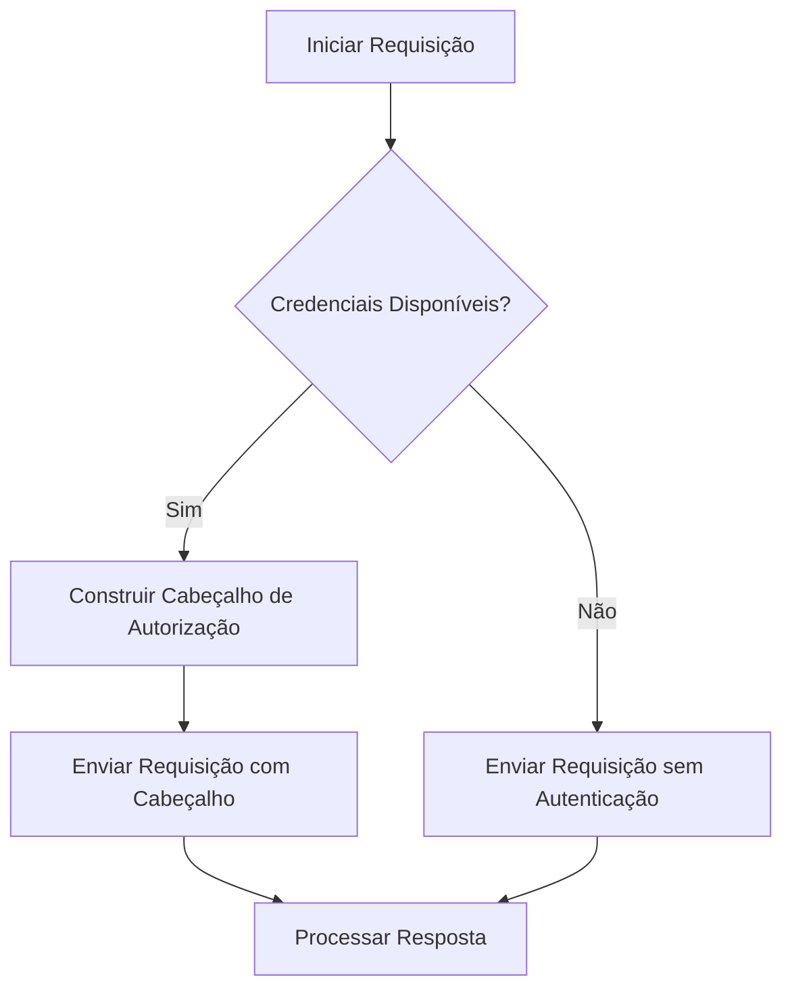
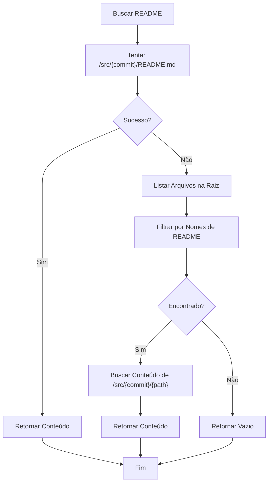

# Integração com Bitbucket

<cite>
**Arquivos Referenciados neste Documento**   
- [stack_agent.py](file://agent/stack_agent.py)
- [main.py](file://agent/main.py)
</cite>

## Sumário
1. [Introdução](#introdução)
2. [Estrutura da API do Bitbucket Cloud](#estrutura-da-api-do-bitbucket-cloud)
3. [Autenticação com a API do Bitbucket](#autenticação-com-a-api-do-bitbucket)
4. [Adaptação das Funções de Busca](#adaptação-das-funções-de-busca)
   - [_fetch_repo_info](#_fetch_repo_info)
   - [_fetch_languages](#_fetch_languages)
   - [_list_root](#_list_root)
   - [_fetch_readme](#_fetch_readme)
5. [Conversão de Respostas para Formato Unificado](#conversão-de-respostas-para-formato-unificado)
6. [Tratamento de Erros e Fallbacks](#tratamento-de-erros-e-fallbacks)
7. [Conclusão](#conclusão)

## Introdução

Este documento detalha os passos necessários para estender o agente de análise de repositórios para suportar o Bitbucket Cloud. Atualmente, o agente está configurado para analisar repositórios do GitHub, utilizando sua API REST. A integração com o Bitbucket envolve a modificação da lógica de requisição HTTP para usar a API REST do Bitbucket (`api.bitbucket.org/2.0`), a implementação de mecanismos de autenticação adequados (OAuth 2.0 ou Basic Auth com app password), e a adaptação das funções existentes para lidar com as diferenças estruturais entre as APIs dos dois provedores.

A principal diferença crítica é a ausência de um endpoint direto para o conteúdo de arquivos no Bitbucket, o que exige o uso do endpoint `/src/{commit}/{path}` para recuperar arquivos específicos. Este documento fornece um guia completo para realizar essa integração, garantindo que os dados coletados sejam convertidos para o formato unificado usado no contexto do Gemini.

## Estrutura da API do Bitbucket Cloud

A API REST do Bitbucket Cloud está disponível em `https://api.bitbucket.org/2.0`. A estrutura de endpoints é baseada em recursos e segue um padrão semelhante ao do GitHub, mas com algumas variações importantes. Os endpoints principais para a análise de repositórios são:

- **Metadados do Repositório**: `GET /repositories/{workspace}/{repo_slug}`
- **Métricas de Linguagem**: `GET /repositories/{workspace}/{repo_slug}/languages`
- **Listagem de Arquivos na Raiz**: `GET /repositories/{workspace}/{repo_slug}/src/{commit}/`
- **Conteúdo de Arquivos**: `GET /repositories/{workspace}/{repo_slug}/src/{commit}/{path}`

Aqui, `{workspace}` é o nome do proprietário do repositório (equivalente ao `owner` no GitHub) e `{repo_slug}` é o nome do repositório. O `{commit}` pode ser o nome de uma branch (ex: `main`) ou um hash de commit específico.

**Section sources**
- [stack_agent.py](file://agent/stack_agent.py#L142-L147)

## Autenticação com a API do Bitbucket

A API do Bitbucket suporta dois métodos principais de autenticação: OAuth 2.0 e Basic Auth com app password.

### OAuth 2.0

O OAuth 2.0 é o método recomendado para aplicações que precisam de acesso a recursos em nome de um usuário. Ele envolve um fluxo de autorização onde o usuário concede permissão à aplicação, que então recebe um token de acesso. Esse token é enviado no cabeçalho `Authorization` como `Bearer <access_token>`.

### Basic Auth com App Password

Para casos mais simples, como scripts ou integrações automatizadas, o Bitbucket permite o uso de "app passwords". Uma app password é gerada no painel de controle do Bitbucket e pode ser usada com autenticação Basic Auth. O cabeçalho `Authorization` deve ser definido como `Basic <base64(username:app_password)>`.

A função `_github_headers` no código atual deve ser adaptada para `_bitbucket_headers`, que irá ler as credenciais do ambiente (por exemplo, `BITBUCKET_USERNAME` e `BITBUCKET_APP_PASSWORD`) e construir o cabeçalho de autorização apropriado.

**Diagram sources**
- [stack_agent.py](file://agent/stack_agent.py#L134-L140)

## Adaptação das Funções de Busca

As funções principais do agente de análise precisam ser modificadas para interagir com a API do Bitbucket. A seguir, detalhamos as adaptações necessárias para cada função.

### _fetch_repo_info

A função `_fetch_repo_info` deve ser atualizada para apontar para o endpoint do Bitbucket. A URL base muda de `https://api.github.com/repos/{owner}/{repo}` para `https://api.bitbucket.org/2.0/repositories/{workspace}/{repo_slug}`. A resposta da API do Bitbucket contém metadados semelhantes, como nome, descrição, proprietário e branch padrão, mas com uma estrutura de JSON diferente. A função deve extrair os campos relevantes e mapeá-los para o formato esperado pelo agente.

**Section sources**
- [stack_agent.py](file://agent/stack_agent.py#L142-L147)

### _fetch_languages

A função `_fetch_languages` deve ser adaptada para usar o endpoint `/repositories/{workspace}/{repo_slug}/languages` do Bitbucket. A resposta é um objeto JSON onde as chaves são os nomes das linguagens e os valores são o número de bytes de código escrito em cada linguagem, similar ao formato do GitHub. Essa função pode ser mantida com poucas alterações, apenas atualizando a URL da requisição.

**Section sources**
- [stack_agent.py](file://agent/stack_agent.py#L151-L153)

### _list_root

A função `_list_root` precisa ser modificada para listar os arquivos na raiz do repositório. No Bitbucket, isso é feito com uma requisição GET para `/repositories/{workspace}/{repo_slug}/src/{commit}/`. O `{commit}` deve ser a branch padrão do repositório, que pode ser obtida dos metadados do repositório. A resposta contém uma lista de objetos, cada um representando um arquivo ou diretório, com campos como `name`, `path` e `type`.

**Section sources**
- [stack_agent.py](file://agent/stack_agent.py#L179-L181)

### _fetch_readme

A função `_fetch_readme` é a mais complexa de adaptar, devido à ausência de um endpoint dedicado para o README no Bitbucket. A estratégia é:

1. Primeiro, tentar buscar o README usando o endpoint `/src/{commit}/README.md`.
2. Se falhar, listar os arquivos na raiz para encontrar arquivos com nomes comuns de README (ex: `README`, `README.txt`, `README.rst`).
3. Para cada arquivo encontrado, fazer uma requisição individual para `/src/{commit}/{path}` para obter seu conteúdo.

O conteúdo retornado é em texto puro, eliminando a necessidade de decodificação base64, que é usada na API do GitHub.

**Diagram sources**
- [stack_agent.py](file://agent/stack_agent.py#L157-L175)

## Conversão de Respostas para Formato Unificado

Para garantir compatibilidade com o restante do sistema, as respostas da API do Bitbucket devem ser convertidas para o mesmo formato de dados usado pela API do GitHub. Isso envolve a criação de uma camada de mapeamento que transforma os campos do JSON do Bitbucket nos campos equivalentes do GitHub. Por exemplo, o campo `full_name` no Bitbucket (que contém `{workspace}/{repo_slug}`) deve ser mapeado para o campo `full_name` no formato do GitHub. Essa camada de conversão permite que o resto do agente (como a função `_build_analysis_prompt`) continue funcionando sem modificações.

## Tratamento de Erros e Fallbacks

O tratamento de erros é crucial ao integrar com APIs externas. Erros comuns incluem repositórios privados (HTTP 403) e permissões insuficientes. A função `_gh_get` deve ser generalizada para `_api_get` e incluir tratamento robusto de exceções e códigos de status HTTP.

Um mecanismo de fallback pode ser implementado para URLs públicas. Se a autenticação falhar ou o repositório for público, o agente pode tentar acessar o conteúdo diretamente via URLs públicas do Bitbucket (ex: `https://bitbucket.org/{workspace}/{repo_slug}/raw/{commit}/{path}`). Isso garante que a análise possa prosseguir mesmo quando a autenticação não está disponível.

## Conclusão

A integração com o Bitbucket Cloud é uma extensão viável e necessária para aumentar a versatilidade do agente de análise. Ao seguir os passos descritos neste documento — adaptando a lógica de requisição HTTP, implementando autenticação adequada, modificando as funções de busca para lidar com as particularidades da API do Bitbucket e criando uma camada de conversão de dados — o agente pode analisar repositórios do Bitbucket com o mesmo nível de profundidade e precisão que faz com repositórios do GitHub. O tratamento cuidadoso de erros e a implementação de fallbacks garantem uma experiência de usuário robusta e confiável.