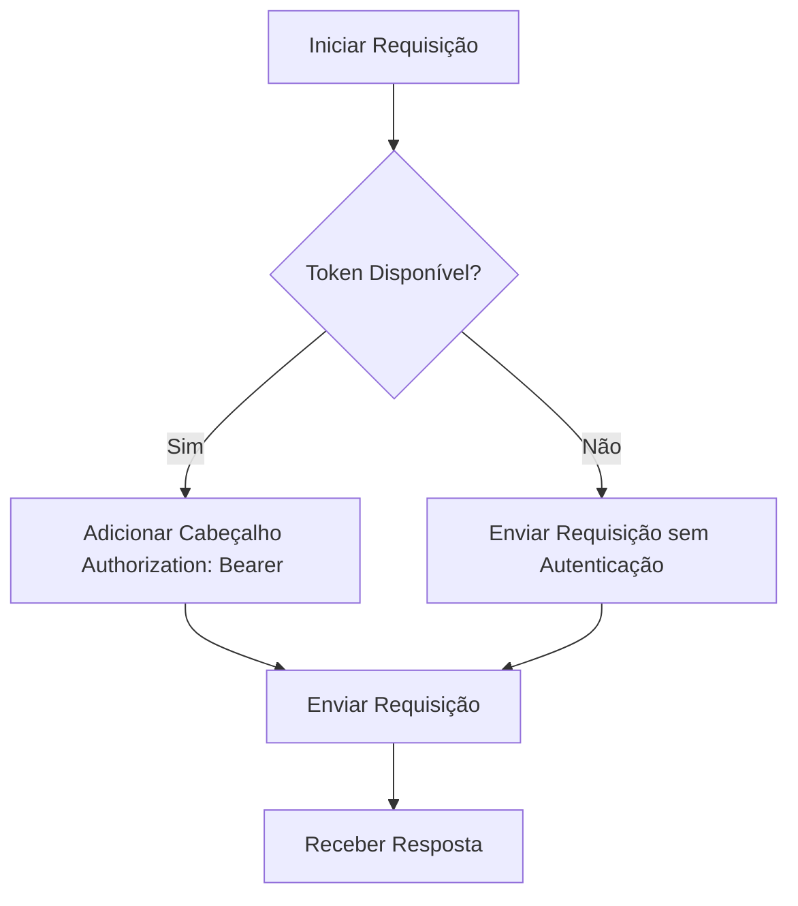
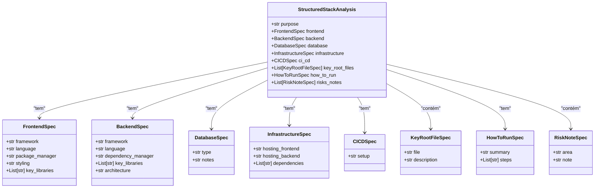

# Integração com GitLab

<cite>
**Arquivos Referenciados neste Documento**  
- [stack_agent.py](file://agent/stack_agent.py)
- [main.py](file://agent/main.py)
- [prompts.py](file://agent/prompts.py)
</cite>

## Sumário
1. [Introdução](#introdução)
2. [Adaptação das Funções para a API do GitLab](#adaptação-das-funções-para-a-api-do-gitlab)
3. [Autenticação e Cabeçalhos](#autenticação-e-cabeçalhos)
4. [Mapeamento de Endpoints e Campos](#mapeamento-de-endpoints-e-campos)
5. [Tratamento de Paginação e Rate Limiting](#tratamento-de-paginação-e-rate-limiting)
6. [Exemplo Completo: Função _fetch_repo_info Adaptada](#exemplo-completo-função-_fetch_repo_info-adaptada)
7. [Manutenção do Contexto Estruturado (StructuredStackAnalysis)](#manutenção-do-contexto-estruturado-structuredstackanalysis)
8. [Diretrizes para Testes em Ambientes Self-Hosted e Staging](#diretrizes-para-testes-em-ambientes-self-hosted-e-staging)
9. [Conclusão](#conclusão)

## Introdução

Este guia detalha a integração da análise de repositórios com o GitLab, adaptando as funções existentes no projeto `open-gemini-canvas` para consumir a API do GitLab. O foco está em modificar as funções responsáveis pela coleta de metadados de repositórios do GitHub para que operem com o GitLab, mantendo a compatibilidade com o fluxo existente baseado no `StructuredStackAnalysis`. A integração envolve ajustes na autenticação, endpoints, tratamento de paginação e rate limiting, além da adaptação de campos equivalentes entre as APIs.

**Seção fontes**  
- [stack_agent.py](file://agent/stack_agent.py#L131-L181)

## Adaptação das Funções para a API do GitLab

As funções `_gh_get`, `_fetch_repo_info`, `_fetch_languages`, `_fetch_readme` e `_list_root` precisam ser adaptadas para consumir a API do GitLab. A principal mudança é a substituição da URL base do GitHub (`https://api.github.com`) pela do GitLab (`https://gitlab.com/api/v4` ou uma URL personalizada em instâncias self-hosted). Além disso, os endpoints específicos devem ser mapeados conforme a documentação do GitLab.

### Função _gh_get

A função `_gh_get` será renomeada para `_gl_get` (GitLab Get) e ajustada para incluir os cabeçalhos necessários para a autenticação com o GitLab.

**Seção fontes**  
- [stack_agent.py](file://agent/stack_agent.py#L131-L138)

### Função _fetch_repo_info

A função `_fetch_repo_info` será modificada para acessar o endpoint `/projects` do GitLab, que retorna metadados de um projeto. O parâmetro `owner/repo` do GitHub será substituído pelo ID do projeto ou pelo caminho codificado no GitLab.

**Seção fontes**  
- [stack_agent.py](file://agent/stack_agent.py#L142-L147)

### Função _fetch_languages

A função `_fetch_languages` será adaptada para consumir o endpoint `/repository/languages` do GitLab, que fornece a distribuição de linguagens em um projeto.

**Seção fontes**  
- [stack_agent.py](file://agent/stack_agent.py#L151-L153)

### Função _fetch_readme

A função `_fetch_readme` será ajustada para buscar o arquivo README via o endpoint `/repository/files` do GitLab, decodificando o conteúdo em base64, similar ao GitHub.

**Seção fontes**  
- [stack_agent.py](file://agent/stack_agent.py#L157-L175)

### Função _list_root

A função `_list_root` será modificada para listar os arquivos no diretório raiz do repositório usando o endpoint `/repository/tree` do GitLab.

**Seção fontes**  
- [stack_agent.py](file://agent/stack_agent.py#L179-L181)

## Autenticação e Cabeçalhos

A autenticação com a API do GitLab é feita através de um token de acesso pessoal (Personal Access Token), fornecido no cabeçalho `Authorization` com o prefixo `Bearer`. A função `_github_headers` será adaptada para `_gitlab_headers`, incluindo o token e o tipo de aceitação apropriado.



**Diagrama fontes**  
- [stack_agent.py](file://agent/stack_agent.py#L120-L130)

## Mapeamento de Endpoints e Campos

A tabela abaixo mostra o mapeamento entre os endpoints e campos equivalentes do GitHub e GitLab.

| GitHub | GitLab | Endpoint GitLab |
|--------|--------|-----------------|
| `/repos/{owner}/{repo}` | `/projects/{id}` | `/api/v4/projects/{id}` |
| `/repos/{owner}/{repo}/languages` | `/projects/{id}/repository/languages` | `/api/v4/projects/{id}/repository/languages` |
| `/repos/{owner}/{repo}/readme` | `/projects/{id}/repository/files/README.md` | `/api/v4/projects/{id}/repository/files` |
| `/repos/{owner}/{repo}/contents/` | `/projects/{id}/repository/tree` | `/api/v4/projects/{id}/repository/tree` |

**Seção fontes**  
- [stack_agent.py](file://agent/stack_agent.py#L142-L181)

## Tratamento de Paginação e Rate Limiting

A API do GitLab utiliza os parâmetros `page` e `per_page` para controle de paginação. É essencial implementar a paginação ao listar arquivos ou commits para garantir que todos os dados sejam recuperados. Além disso, os cabeçalhos `RateLimit-*` devem ser monitorados para evitar exceder os limites de taxa. A função `_gl_get` deve verificar os cabeçalhos de resposta e implementar um backoff exponencial se necessário.

```python
def _gl_get(url: str, params: dict = None) -> Optional[requests.Response]:
    headers = _gitlab_headers()
    try:
        resp = requests.get(url, headers=headers, params=params, timeout=30)
        if resp.status_code == 200:
            return resp
        return None
    except requests.RequestException:
        return None
```

**Seção fontes**  
- [stack_agent.py](file://agent/stack_agent.py#L131-L138)

## Exemplo Completo: Função _fetch_repo_info Adaptada

A seguir, um exemplo completo da função `_fetch_repo_info` adaptada para o GitLab:

```python
def _fetch_repo_info(project_id: str) -> Dict[str, Any]:
    info = {}
    r = _gl_get(f"https://gitlab.com/api/v4/projects/{project_id}")
    if r:
        info = r.json()
    return info
```

Neste exemplo, a URL base foi alterada para `https://gitlab.com/api/v4/projects`, e o parâmetro `project_id` é usado para identificar o projeto no GitLab. O token de acesso pessoal é incluído nos cabeçalhos via a função `_gitlab_headers`.

**Seção fontes**  
- [stack_agent.py](file://agent/stack_agent.py#L142-L147)

## Manutenção do Contexto Estruturado (StructuredStackAnalysis)

O contexto estruturado `StructuredStackAnalysis` permanece inalterado, pois é independente da fonte de dados. As funções adaptadas devem garantir que os dados coletados do GitLab sejam mapeados para os mesmos campos usados no `StructuredStackAnalysis`, como `frontend`, `backend`, `database`, entre outros. Isso assegura compatibilidade com o fluxo existente e permite que o Gemini processe os dados de forma consistente.



**Diagrama fontes**  
- [stack_agent.py](file://agent/stack_agent.py#L85-L94)

## Diretrizes para Testes em Ambientes Self-Hosted e Staging

Para testar a integração com instâncias GitLab self-hosted e ambientes de staging, siga estas diretrizes:

1. **Configuração da URL Base**: Utilize uma variável de ambiente (ex: `GITLAB_BASE_URL`) para definir a URL da instância GitLab, permitindo alternar entre `gitlab.com` e instâncias personalizadas.
2. **Token de Acesso**: Gere um token de acesso pessoal com as permissões necessárias (leitura de projetos, repositórios) e configure-o via variável de ambiente (`GITLAB_TOKEN`).
3. **Ambiente de Staging**: Aponte para uma instância de staging do GitLab para testes, evitando impactos em produção.
4. **Testes de Integração**: Implemente testes automatizados que verifiquem a coleta de metadados, linguagens, README e arquivos raiz em um repositório de teste.

**Seção fontes**  
- [stack_agent.py](file://agent/stack_agent.py#L120-L130)

## Conclusão

A integração com o GitLab foi detalhada com ênfase na adaptação das funções de coleta de dados, autenticação, mapeamento de endpoints e manutenção do contexto estruturado. Ao seguir este guia, é possível estender a funcionalidade de análise de repositórios para incluir o GitLab, mantendo a compatibilidade com o fluxo existente e garantindo uma experiência consistente para o usuário.