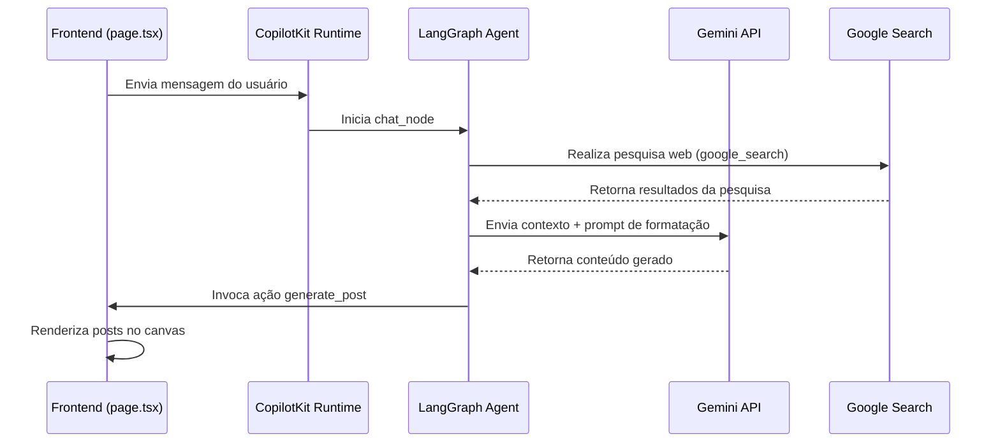
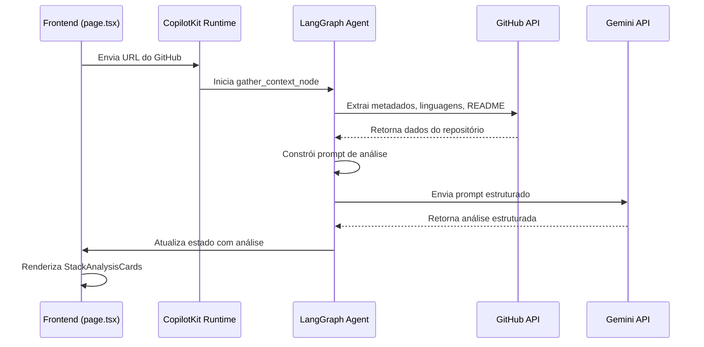
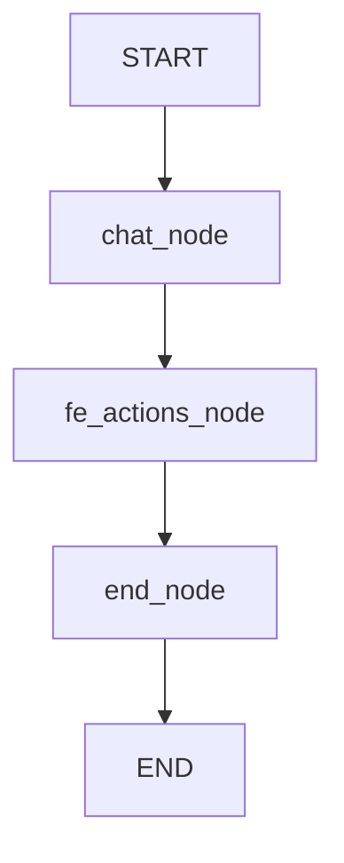

# Fluxos de Trabalho

<cite>
**Arquivos Referenciados neste Documento**   
- [agent/main.py](file://agent/main.py)
- [agent/posts_generator_agent.py](file://agent/posts_generator_agent.py)
- [agent/stack_agent.py](file://agent/stack_agent.py)
- [agent/prompts.py](file://agent/prompts.py)
- [app/api/copilotkit/route.ts](file://app/api/copilotkit/route.ts)
- [app/post-generator/page.tsx](file://app/post-generator/page.tsx)
- [app/stack-analyzer/page.tsx](file://app/stack-analyzer/page.tsx)
- [app/prompts/prompts.ts](file://app/prompts/prompts.ts)
- [components/ui/stack-analysis-cards.tsx](file://components/ui/stack-analysis-cards.tsx)
- [components/ui/tool-logs.tsx](file://components/ui/tool-logs.tsx)
</cite>

## Sumário
1. [Introdução](#introdução)
2. [Fluxo de Geração de Posts](#fluxo-de-geração-de-posts)
3. [Fluxo de Análise de Stack](#fluxo-de-análise-de-stack)
4. [Componentes do Grafo](#componentes-do-grafo)
5. [Tratamento de Erros](#tratamento-de-erros)
6. [Extensibilidade e Modificação](#extensibilidade-e-modificação)
7. [Considerações de Desempenho](#considerações-de-desempenho)

## Introdução
Este documento detalha os fluxos de trabalho do sistema Open Gemini Canvas, com foco nos grafos de agentes implementados com LangGraph. O sistema possui dois agentes principais: um para geração de posts para LinkedIn e X (Twitter), e outro para análise de stacks de repositórios GitHub. Ambos os fluxos utilizam o modelo Gemini da Google, integrado com ferramentas externas e interfaces de usuário reativas.

## Fluxo de Geração de Posts

O fluxo de geração de posts inicia com a entrada do usuário na interface web e culmina na exibição de posts formatados. O processo envolve pesquisa web, geração de conteúdo com Gemini e formatação específica para cada plataforma.



**Fontes do Diagrama**
- [agent/posts_generator_agent.py](file://agent/posts_generator_agent.py#L50-L150)
- [app/post-generator/page.tsx](file://app/post-generator/page.tsx#L150-L250)
- [agent/prompts.py](file://agent/prompts.py#L20-L35)

**Fontes da Seção**
- [agent/posts_generator_agent.py](file://agent/posts_generator_agent.py)
- [app/post-generator/page.tsx](file://app/post-generator/page.tsx)

## Fluxo de Análise de Stack

O fluxo de análise de stack começa com a entrada de uma URL do GitHub, extrai metadados do repositório, analisa com Gemini e estrutura os resultados para exibição na interface.



**Fontes do Diagrama**
- [agent/stack_agent.py](file://agent/stack_agent.py#L200-L450)
- [app/stack-analyzer/page.tsx](file://app/stack-analyzer/page.tsx#L100-L200)
- [components/ui/stack-analysis-cards.tsx](file://components/ui/stack-analysis-cards.tsx)

**Fontes da Seção**
- [agent/stack_agent.py](file://agent/stack_agent.py)
- [app/stack-analyzer/page.tsx](file://app/stack-analyzer/page.tsx)

## Componentes do Grafo

### Estados (AgentState)
Os grafos utilizam estados personalizados para manter o contexto durante a execução.

**Post Generation Agent State**
```python
class AgentState(CopilotKitState):
    tool_logs: List[Dict[str, Any]]
    response: Dict[str, Any]
```

**Stack Analysis Agent State**
```python
class StackAgentState(CopilotKitState):
    tool_logs: List[Dict[str, Any]]
    analysis: Dict[str, Any]
    show_cards: bool
    context: Dict[str, Any]
    last_user_content: str
```

**Fontes da Seção**
- [agent/posts_generator_agent.py](file://agent/posts_generator_agent.py#L25-L35)
- [agent/stack_agent.py](file://agent/stack_agent.py#L40-L60)

### Nós e Arestas

#### Agente de Geração de Posts


- **chat_node**: Realiza pesquisa web e prepara contexto
- **fe_actions_node**: Gera posts formatados usando Gemini
- **end_node**: Finaliza o fluxo

#### Agente de Análise de Stack
```mermaid
graph TD
START --> gather_context
gather_context --> analyze
analyze --> end
end --> END
```

- **gather_context_node**: Extrai metadados do repositório GitHub
- **analyze_with_gemini_node**: Analisa o stack com Gemini
- **end_node**: Finaliza e atualiza a interface

**Fontes do Diagrama**
- [agent/posts_generator_agent.py](file://agent/posts_generator_agent.py#L130-L150)
- [agent/stack_agent.py](file://agent/stack_agent.py#L480-L500)

**Fontes da Seção**
- [agent/posts_generator_agent.py](file://agent/posts_generator_agent.py)
- [agent/stack_agent.py](file://agent/stack_agent.py)

## Tratamento de Erros

O sistema implementa tratamento de erros em múltiplos níveis:

1. **Nível de API**: Uso de timeouts e tratamento de exceções em requisições ao GitHub
2. **Nível de LLM**: Retentativas configuradas no cliente Gemini (max_retries=2)
3. **Nível de Interface**: Exibição de logs de ferramentas com status de processamento
4. **Fallbacks**: Quando a saída estruturada falha, o sistema tenta coerção de esquema

Exemplo de tratamento no agente de stack:
```python
try:
    # Tentativa com ferramentas
    bound = model.bind_tools([return_stack_analysis_tool])
    tool_msg = await bound.ainvoke(messages, config)
except Exception:
    pass

if structured_payload is None:
    # Fallback para saída estruturada
    try:
        structured_model = model.with_structured_output(StructuredStackAnalysis)
        structured_response = await structured_model.ainvoke(messages, config)
    except Exception:
        structured_payload = None
```

**Fontes da Seção**
- [agent/stack_agent.py](file://agent/stack_agent.py#L300-L350)
- [components/ui/tool-logs.tsx](file://components/ui/tool-logs.tsx)

## Extensibilidade e Modificação

### Adicionando Novas Ferramentas
Para adicionar uma nova ferramenta ao agente de geração de posts, basta:
1. Definir a ferramenta com o decorador `@tool`
2. Adicionar ao `bind_tools` no `fe_actions_node`
3. Criar um handler no frontend com `useCopilotAction`

### Modificando o Prompt
Os prompts estão centralizados em `agent/prompts.py`:
- `system_prompt`: Regras gerais de uso da pesquisa
- `system_prompt_3`: Instruções para geração de posts
- `system_prompt_4`: Confirmação de uso da pesquisa

### Criando Novos Agentes
Novos agentes podem ser registrados em `agent/main.py`:
```python
sdk = CopilotKitSDK(
    agents=[
        LangGraphAgent(
            name="novo_agente",
            description="Descrição do novo agente",
            graph=novo_grafo,
        ),
    ]
)
```

**Fontes da Seção**
- [agent/posts_generator_agent.py](file://agent/posts_generator_agent.py)
- [agent/stack_agent.py](file://agent/stack_agent.py)
- [agent/main.py](file://agent/main.py)

## Considerações de Desempenho

### Tempo de Resposta
- **Geração de Posts**: 8-15 segundos (dependendo da complexidade da pesquisa)
- **Análise de Stack**: 12-20 segundos (devido à extração de múltiplos arquivos do GitHub)

### Limites de Taxa
- **Gemini API**: Governado pela chave da Google API
- **GitHub API**: 60 requisições por hora para não autenticadas, 5000 para autenticadas
- **Google Search**: Integrado ao Gemini, sujeito aos limites do modelo

### Otimizações Implementadas
1. **Cache de Estado**: Uso de `MemorySaver` do LangGraph para manter estado entre chamadas
2. **Emissão Progressiva**: Atualização da interface com `copilotkit_emit_state` durante o processamento
3. **Paralelismo Limitado**: Operações sequenciais para garantir integridade do fluxo

**Fontes da Seção**
- [agent/posts_generator_agent.py](file://agent/posts_generator_agent.py#L150)
- [agent/stack_agent.py](file://agent/stack_agent.py#L200)
- [agent/main.py](file://agent/main.py#L20)