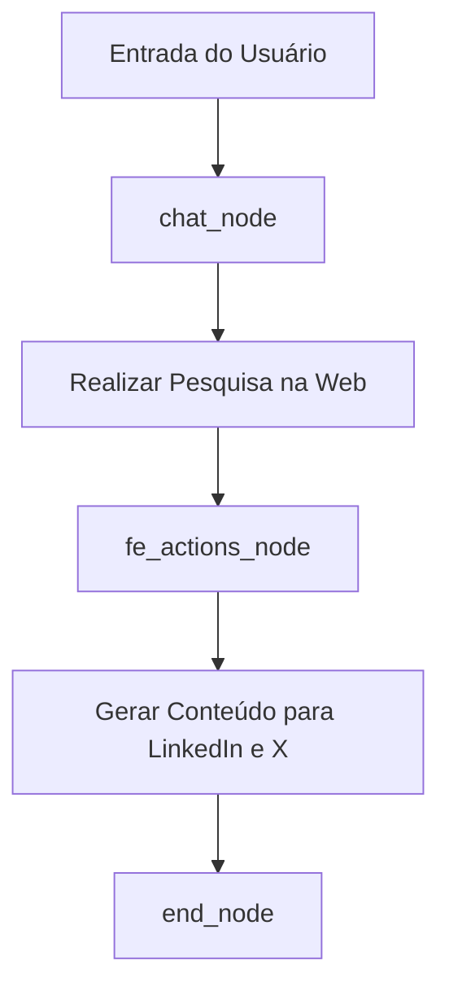
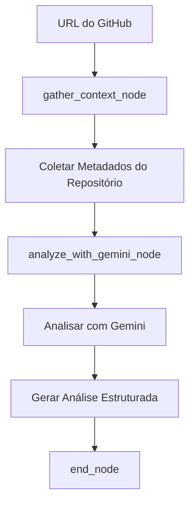
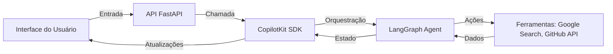

# Funcionalidades Principais

<cite>
**Arquivos Referenciados neste Documento**  
- [agent/posts_generator_agent.py](file://agent/posts_generator_agent.py)
- [agent/stack_agent.py](file://agent/stack_agent.py)
- [agent/prompts.py](file://agent/prompts.py)
- [app/post-generator/page.tsx](file://app/post-generator/page.tsx)
- [app/stack-analyzer/page.tsx](file://app/stack-analyzer/page.tsx)
- [app/prompts/prompts.ts](file://app/prompts/prompts.ts)
- [agent/main.py](file://agent/main.py)
</cite>

## Sumário
1. [Introdução](#introdução)
2. [Geração de Posts](#geração-de-posts)
3. [Análise de Stack](#análise-de-stack)
4. [Fluxos de Trabalho](#fluxos-de-trabalho)
5. [Casos de Uso e Exemplos](#casos-de-uso-e-exemplos)
6. [Limitações e Dicas](#limitações-e-dicas)
7. [Conclusão](#conclusão)

## Introdução

Este documento detalha as funcionalidades principais do sistema Open Gemini Canvas, focando em duas capacidades centrais: a **Geração de Posts** para LinkedIn e X (Twitter), e a **Análise de Stack** de repositórios GitHub. O sistema utiliza agentes de IA baseados em LangGraph e o modelo Gemini da Google, integrados com ferramentas de busca na web e análise de código. A interface do usuário, construída com Next.js e React, permite uma interação fluida com esses agentes, exibindo resultados em tempo real. A arquitetura é orientada a eventos, onde ações do usuário disparam fluxos de trabalho complexos que envolvem pesquisa, geração de conteúdo e análise estruturada.

## Geração de Posts

A funcionalidade de Geração de Posts permite que o usuário insira um tópico de interesse, como "inteligência artificial em saúde", e o sistema automaticamente crie conteúdo formatado e otimizado para as plataformas LinkedIn e X.

### Fluxo de Trabalho da Geração de Posts

O processo é orquestrado pelo agente definido em `posts_generator_agent.py` e segue um grafo de estados (LangGraph) com três nós principais: `chat_node`, `fe_actions_node` e `end_node`.

**Diagram sources**
- [agent/posts_generator_agent.py](file://agent/posts_generator_agent.py#L0-L163)

**Section sources**
- [agent/posts_generator_agent.py](file://agent/posts_generator_agent.py#L0-L163)
- [app/post-generator/page.tsx](file://app/post-generator/page.tsx#L0-L410)

### Processo de Pesquisa e Geração

1.  **Análise Inicial e Pesquisa na Web**: O `chat_node` recebe a entrada do usuário e utiliza o modelo Gemini com a ferramenta de `google_search` habilitada. O prompt do sistema (`system_prompt`) instrui o modelo a sempre realizar uma busca na web para obter informações atualizadas e precisas sobre o tópico fornecido. O modelo gera uma consulta de busca e a executa.
2.  **Processamento do Conteúdo**: Após a busca, o conteúdo recuperado da web é armazenado no estado do agente (`state["response"]`). O grafo então avança para o `fe_actions_node`.
3.  **Geração de Posts Formatados**: O `fe_actions_node` inicializa um novo modelo Gemini, desta vez com acesso à ferramenta `generate_post`. O prompt `system_prompt_3` instrui o modelo a usar essa ferramenta para criar posts. O modelo recebe o conteúdo da pesquisa como contexto (`{context}`) e gera dois objetos: um para o post do LinkedIn e outro para o post do X, com títulos e conteúdo adequados ao estilo de cada plataforma.
4.  **Exibição na Interface**: A ferramenta `generate_post` é chamada com os dados gerados. O frontend, escutando essa ação via `useCopilotAction`, atualiza o estado da aplicação e exibe os posts em uma visualização dividida, com o post do LinkedIn ocupando 75% da tela e o do X os 25% restantes.

### Exemplos de Prompts e Saídas

*   **Prompt do Usuário**: "Gere um post sobre os avanços recentes na energia solar."
*   **Prompt do Sistema (Contexto)**: O conteúdo da pesquisa web sobre "avanços recentes na energia solar" é inserido no `system_prompt_3`.
*   **Saída Esperada (Estrutura)**:
    *   **LinkedIn**: Um post formal com emojis profissionais, destacando inovações tecnológicas e seu impacto no mercado.
    *   **X (Twitter)**: Um post conciso com hashtags como `#EnergiaSolar` e `#Sustentabilidade`, usando uma linguagem mais direta e envolvente.

## Análise de Stack

A funcionalidade de Análise de Stack permite ao usuário fornecer a URL de um repositório GitHub, e o sistema gera uma análise estruturada e detalhada da tecnologia utilizada, propósito do projeto e outras informações relevantes.

### Fluxo de Trabalho da Análise de Stack

O processo é gerenciado pelo agente em `stack_agent.py`, que também utiliza um grafo de estados com os nós `gather_context_node`, `analyze_with_gemini_node` e `end_node`.

**Diagram sources**
- [agent/stack_agent.py](file://agent/stack_agent.py#L0-L503)

**Section sources**
- [agent/stack_agent.py](file://agent/stack_agent.py#L0-L503)
- [app/stack-analyzer/page.tsx](file://app/stack-analyzer/page.tsx#L0-L347)

### Processo de Extração e Análise

1.  **Coleta de Contexto**: O `gather_context_node` analisa a mensagem do usuário para extrair a URL do GitHub usando a função `_parse_github_url`. Com o nome do proprietário e do repositório, ele faz várias chamadas à API do GitHub:
    *   `_fetch_repo_info`: Obtém metadados gerais (nome, descrição, data de criação).
    *   `_fetch_languages`: Obtém a distribuição de linguagens de programação no repositório.
    *   `_fetch_readme`: Recupera o conteúdo do arquivo README.
    *   `_list_root` e `_fetch_manifest_contents`: Listam os arquivos na raiz e baixam o conteúdo de arquivos de manifesto comuns (como `package.json`, `requirements.txt`, `go.mod`) para inferir tecnologias específicas.
2.  **Construção do Prompt**: Todos os dados coletados são estruturados e inseridos no prompt gerado por `_build_analysis_prompt`. Esse prompt fornece ao modelo Gemini um contexto rico e detalhado sobre o repositório.
3.  **Análise Estruturada com Gemini**: O `analyze_with_gemini_node` envia o prompt para o modelo Gemini. O modelo é instruído a usar a ferramenta `return_stack_analysis` para retornar uma resposta em formato JSON estruturado, conforme definido pelo esquema `StructuredStackAnalysis`. Este esquema inclui campos para `frontend`, `backend`, `database`, `ci_cd`, entre outros.
4.  **Exibição dos Resultados**: Quando a ferramenta `return_stack_analysis` é chamada com os dados analisados, o frontend (em `stack-analyzer/page.tsx`) detecta isso através do estado do agente (`state["show_cards"] = True`). O componente `StackAnalysisCards` é então renderizado, exibindo a análise em cartões organizados por categoria (Frontend, Backend, etc.).

## Fluxos de Trabalho

Os fluxos de trabalho são gerenciados pela biblioteca LangGraph, que orquestra a execução dos nós do agente com base no estado atual. A integração com o frontend é feita através do CopilotKit, que permite a comunicação bidirecional entre o backend e a interface.

### Arquitetura de Integração

**Diagram sources**
- [agent/main.py](file://agent/main.py#L0-L62)
- [agent/posts_generator_agent.py](file://agent/posts_generator_agent.py#L0-L163)
- [agent/stack_agent.py](file://agent/stack_agent.py#L0-L503)

**Section sources**
- [agent/main.py](file://agent/main.py#L0-L62)

## Casos de Uso e Exemplos

*   **Caso de Uso - Geração de Posts**: Um profissional de marketing deseja compartilhar insights sobre "tendências de DevOps em 2024". Ele insere esse tópico, o sistema pesquisa as últimas tendências, e gera um post do LinkedIn com uma análise detalhada e um post do X com uma lista de hashtags populares e um resumo impactante.
*   **Caso de Uso - Análise de Stack**: Um desenvolvedor está avaliando um projeto de código aberto para contribuir. Ele insere a URL do repositório, e o sistema retorna uma análise que identifica o uso de React no frontend, Node.js com Express no backend, PostgreSQL como banco de dados e um pipeline de CI/CD configurado com GitHub Actions.

## Limitações e Dicas

*   **Limitações Conhecidas**:
    *   A análise de stack depende da disponibilidade e acessibilidade dos dados no repositório público. Repositórios privados ou com estruturas incomuns podem não ser analisados com precisão.
    *   A geração de posts pode ser afetada pela qualidade e relevância dos resultados da pesquisa na web.
    *   O sistema requer uma chave de API válida para o Google Gemini e, opcionalmente, para a API do GitHub para evitar limites de taxa.
*   **Dicas para Melhores Resultados**:
    *   Para a geração de posts, seja o mais específico possível com o tópico (por exemplo, "impacto do 5G na indústria automotiva" em vez de apenas "5G").
    *   Para a análise de stack, certifique-se de fornecer a URL completa e correta do repositório GitHub.
    *   Utilize as ações rápidas fornecidas na interface para começar com exemplos funcionais.

## Conclusão

As funcionalidades de Geração de Posts e Análise de Stack demonstram a potência da integração entre modelos de linguagem avançados, ferramentas externas e interfaces de usuário modernas. O sistema automatiza tarefas complexas de pesquisa e análise, fornecendo aos usuários insights e conteúdo de alta qualidade de forma eficiente. A arquitetura modular baseada em agentes e grafos de estados permite uma fácil extensão e manutenção, posicionando o Open Gemini Canvas como uma plataforma versátil para aplicações de IA.