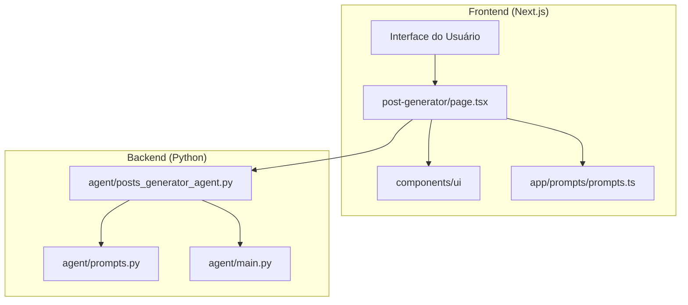
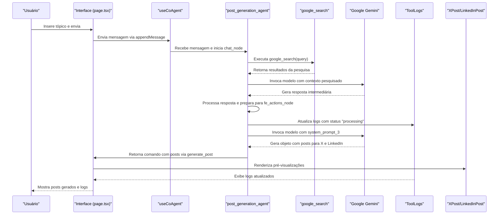
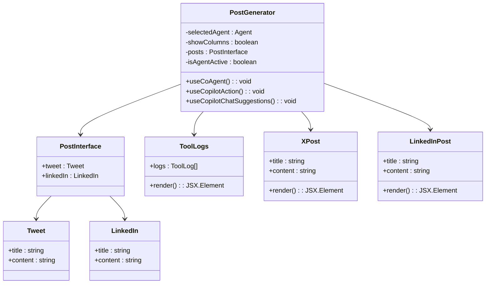
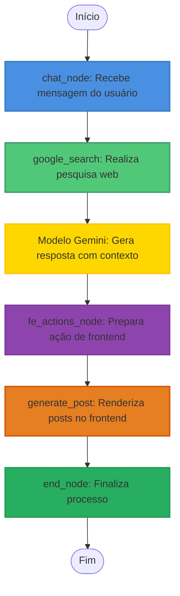
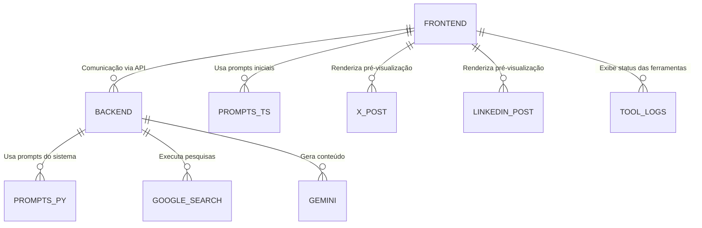

# Geração de Posts

<cite>
**Arquivos Referenciados neste Documento**  
- [post-generator/page.tsx](file://app/post-generator/page.tsx)
- [posts_generator_agent.py](file://agent/posts_generator_agent.py)
- [prompts.py](file://agent/prompts.py)
- [prompts.ts](file://app/prompts/prompts.ts)
- [x-post.tsx](file://components/ui/x-post.tsx)
- [linkedin-post.tsx](file://components/ui/linkedin-post.tsx)
- [tool-logs.tsx](file://components/ui/tool-logs.tsx)
</cite>

## Sumário
1. [Introdução](#introdução)
2. [Estrutura do Projeto](#estrutura-do-projeto)
3. [Componentes Principais](#componentes-principais)
4. [Visão Geral da Arquitetura](#visão-geral-da-arquitetura)
5. [Análise Detalhada dos Componentes](#análise-detalhada-dos-componentes)
6. [Análise de Dependências](#análise-de-dependências)
7. [Considerações de Desempenho](#considerações-de-desempenho)
8. [Guia de Solução de Problemas](#guia-de-solução-de-problemas)
9. [Conclusão](#conclusão)

## Introdução

O sistema de Geração de Posts é uma aplicação web avançada que utiliza inteligência artificial para criar conteúdo personalizado para redes sociais, especificamente LinkedIn e X (Twitter). O sistema combina a potência do modelo de IA Google Gemini com pesquisa web em tempo real para gerar posts informativos, atualizados e otimizados para cada plataforma. A interação do usuário é intuitiva, permitindo a inserção de tópicos e a geração automática de conteúdo formatado com base em prompts sofisticados. Este documento detalha o fluxo completo da funcionalidade, desde a interface do usuário até a geração final do conteúdo.

## Estrutura do Projeto

A aplicação segue uma arquitetura modular com uma clara separação entre a camada de frontend (Next.js) e a camada de backend/agentes (Python com LangGraph). Os componentes principais estão organizados em diretórios distintos, facilitando a manutenção e a escalabilidade.

**Diagram sources**
- [post-generator/page.tsx](file://app/post-generator/page.tsx)
- [posts_generator_agent.py](file://agent/posts_generator_agent.py)

**Section sources**
- [post-generator/page.tsx](file://app/post-generator/page.tsx)
- [posts_generator_agent.py](file://agent/posts_generator_agent.py)

## Componentes Principais

Os componentes principais do sistema de Geração de Posts são a interface do usuário em `post-generator/page.tsx`, o agente de IA `posts_generator_agent.py`, os prompts definidos em `prompts.py` e `prompts.ts`, e os componentes de UI `x-post.tsx` e `linkedin-post.tsx` para exibição das pré-visualizações. O gerenciamento de estado é feito através de hooks personalizados como `useCoAgent` e `useCopilotAction`, enquanto os logs das ferramentas são exibidos pelo componente `ToolLogs`.

**Section sources**
- [post-generator/page.tsx](file://app/post-generator/page.tsx#L1-L50)
- [posts_generator_agent.py](file://agent/posts_generator_agent.py#L1-L20)
- [prompts.py](file://agent/prompts.py#L1-L10)
- [prompts.ts](file://app/prompts/prompts.ts#L1-L5)

## Visão Geral da Arquitetura

A arquitetura do sistema é baseada em um fluxo de trabalho orientado a eventos, onde a ação do usuário aciona uma cadeia de processos envolvendo comunicação entre frontend e backend, execução de ferramentas de IA e atualização da interface.

**Diagram sources**
- [post-generator/page.tsx](file://app/post-generator/page.tsx#L150-L400)
- [posts_generator_agent.py](file://agent/posts_generator_agent.py#L50-L170)

## Análise Detalhada dos Componentes

### Análise do Componente de Geração de Posts

O componente principal `PostGenerator` em `page.tsx` é responsável por gerenciar todo o fluxo de interação do usuário, estado da aplicação e comunicação com o agente de IA. Ele utiliza hooks do CopilotKit para integrar-se com o backend e renderizar dinamicamente os resultados.

#### Análise do Fluxo de Estado e Ações

O gerenciamento de estado é centralizado no hook `useCoAgent`, que inicializa o estado do agente com uma lista vazia de `tool_logs`. O hook `useCopilotAction` define a ação `generate_post`, que é acionada pelo backend quando os posts são gerados. Essa ação recebe um objeto com as propriedades `tweet` e `linkedIn`, cada uma contendo `title` e `content`, e atualiza o estado local para exibir as pré-visualizações.

**Diagram sources**
- [post-generator/page.tsx](file://app/post-generator/page.tsx#L62-L71)
- [post-generator/page.tsx](file://app/post-generator/page.tsx#L100-L150)

**Section sources**
- [post-generator/page.tsx](file://app/post-generator/page.tsx#L1-L410)

#### Análise do Agente de Geração de Posts

O agente `posts_generator_agent.py` é implementado usando LangGraph e define um grafo de estado com três nós principais: `chat_node`, `fe_actions_node` e `end_node`. O `chat_node` inicia a conversa, realiza a pesquisa web usando a ferramenta `google_search` e gera uma resposta inicial. O `fe_actions_node` então utiliza o modelo Gemini para gerar os posts formatados para X e LinkedIn, acionando a ação `generate_post` no frontend. O fluxo é controlado por uma função de roteamento que determina o próximo nó com base no estado da conversa.

**Diagram sources**
- [posts_generator_agent.py](file://agent/posts_generator_agent.py#L50-L170)

**Section sources**
- [posts_generator_agent.py](file://agent/posts_generator_agent.py#L1-L175)

#### Análise dos Prompts

Os prompts são definidos em dois arquivos: `prompts.py` para o backend e `prompts.ts` para o frontend. No backend, `system_prompt` instrui o agente a sempre realizar uma pesquisa web antes de responder, garantindo que a informação seja atual. O `system_prompt_3` fornece diretrizes específicas para a geração de posts, incluindo formatação com emojis, uso de hashtags para X e tom mais formal para LinkedIn. No frontend, `initialPrompt` define a mensagem inicial exibida ao usuário.

**Section sources**
- [prompts.py](file://agent/prompts.py#L1-L50)
- [prompts.ts](file://app/prompts/prompts.ts#L1-L10)

## Análise de Dependências

O sistema depende de várias bibliotecas e serviços externos. O frontend utiliza Next.js, React e Tailwind CSS, além de bibliotecas específicas do CopilotKit para integração com o backend. O backend depende do LangChain, LangGraph e da API do OpenRouter para acessar o modelo Gemini. A comunicação entre frontend e backend é feita através de rotas API definidas em `app/api/copilotkit/route.ts`.

**Diagram sources**
- [package.json](file://package.json)
- [pyproject.toml](file://agent/pyproject.toml)

**Section sources**
- [package.json](file://package.json)
- [agent/pyproject.toml](file://agent/pyproject.toml)

## Considerações de Desempenho

O desempenho do sistema é influenciado principalmente pela latência das chamadas à API do Gemini e à ferramenta de pesquisa web. O uso de `async/await` permite que as operações de E/S sejam executadas de forma não bloqueante, mantendo a interface responsiva. A renderização das pré-visualizações é otimizada com componentes compactos (`XPostCompact`, `LinkedInPostCompact`) durante o processo de geração, reduzindo o custo de renderização.

## Guia de Solução de Problemas

Problemas comuns incluem falhas na pesquisa web devido a conectividade ou limites de taxa da API, e erros na geração de posts devido a prompts mal formatados. O componente `ToolLogs` é essencial para o diagnóstico, exibindo o status de cada etapa do processo (processamento ou concluído). Para otimizar os resultados, recomenda-se formular prompts claros e específicos, evitando ambiguidades que possam levar a pesquisas irrelevantes.

**Section sources**
- [tool-logs.tsx](file://components/ui/tool-logs.tsx#L1-L50)

## Conclusão

O sistema de Geração de Posts demonstra uma integração eficaz entre frontend e backend, utilizando IA para automatizar a criação de conteúdo para redes sociais. A arquitetura modular, o uso de prompts bem definidos e a interface de usuário intuitiva tornam o sistema poderoso e fácil de usar. A dependência de conectividade para pesquisa web é uma limitação conhecida, mas também uma força, pois garante que o conteúdo gerado seja baseado em informações atualizadas. Futuras melhorias podem incluir suporte a mais plataformas sociais e personalização avançada do estilo de escrita.