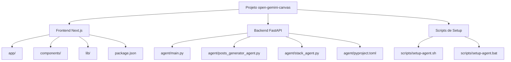

# Guia de Configuração e Execução

<cite>
**Arquivos Referenciados neste Documento**  
- [README.md](file://README.md)
- [package.json](file://package.json)
- [agent/main.py](file://agent/main.py)
- [agent/.env.example](file://agent/.env.example)
- [.env.example](file://.env.example)
- [scripts/setup-agent.sh](file://scripts/setup-agent.sh)
- [scripts/setup-agent.bat](file://scripts/setup-agent.bat)
- [agent/pyproject.toml](file://agent/pyproject.toml)
- [agent/posts_generator_agent.py](file://agent/posts_generator_agent.py)
- [agent/stack_agent.py](file://agent/stack_agent.py)
</cite>

## Sumário
1. [Introdução](#introdução)
2. [Estrutura do Projeto](#estrutura-do-projeto)
3. [Clonagem do Repositório](#clonagem-do-repositório)
4. [Configuração dos Arquivos `.env`](#configuração-dos-arquivos-env)
5. [Configuração do Ambiente Python com Poetry](#configuração-do-ambiente-python-com-poetry)
6. [Instalação de Dependências com pnpm](#instalação-de-dependências-com-pnpm)
7. [Execução do Projeto com `pnpm dev`](#execução-do-projeto-com-pnpm-dev)
8. [Verificação da Execução Correta](#verificação-da-execução-correta)
9. [Solução de Problemas Comuns](#solução-de-problemas-comuns)
10. [Dicas para Depuração](#dicas-para-depuração)

## Introdução

Este guia fornece instruções completas e práticas para configurar, instalar e executar o projeto **open-gemini-canvas**, uma aplicação full-stack que combina um frontend Next.js com um backend FastAPI, ambos integrados ao Google Gemini via CopilotKit e LangGraph. O projeto inclui dois agentes de IA: um gerador de posts para LinkedIn e Twitter, e um analisador de stacks tecnológicos a partir de URLs de repositórios GitHub.

O guia abrange todos os passos necessários, desde a clonagem do repositório até a execução completa, com ênfase em detalhes críticos como a configuração de variáveis de ambiente, scripts de setup para diferentes sistemas operacionais, e a solução de erros comuns. As instruções são adaptadas para Windows, Linux e macOS, garantindo uma experiência de configuração suave em qualquer ambiente.

**Seção fontes**
- [README.md](file://README.md#L1-L86)

## Estrutura do Projeto

O projeto possui uma arquitetura clara e modular, dividida entre frontend e backend:

- **Raiz do Projeto (`/`)**: Contém o frontend Next.js, incluindo páginas, componentes, hooks e arquivos de configuração como `package.json` e `next.config.mjs`.
- **`agent/`**: Diretório do backend em Python, que executa o servidor FastAPI e contém os agentes de IA baseados em LangGraph.
- **`scripts/`**: Contém os scripts `setup-agent.sh` (para Linux/macOS) e `setup-agent.bat` (para Windows) para automatizar a configuração do ambiente Python.
- **`components/`**: Componentes de UI reutilizáveis, principalmente baseados no Radix UI e Tailwind CSS.
- **`app/`**: Páginas e rotas da aplicação Next.js, incluindo as páginas de `post-generator` e `stack-analyzer`.

Essa separação permite que o frontend e o backend sejam desenvolvidos e executados independentemente, mas coordenados através de scripts de inicialização.

**Diagrama de Estrutura do Projeto**


**Fontes do Diagrama**
- [README.md](file://README.md#L60-L65)
- [package.json](file://package.json#L1-L86)
- [agent/main.py](file://agent/main.py#L1-L62)

## Clonagem do Repositório

O primeiro passo é clonar o repositório do GitHub para o seu ambiente local. Abra um terminal (ou prompt de comando no Windows) e execute o seguinte comando:

```bash
git clone https://github.com/user-attachments/assets/1e95c9e1-2d55-4f63-b805-be49fe94a493 open-gemini-canvas
```

Substitua a URL acima pela URL correta do repositório, se necessário. Após a clonagem, navegue até o diretório do projeto:

```bash
cd open-gemini-canvas
```

Este diretório será o ponto de partida para todos os comandos subsequentes.

**Seção fontes**
- [README.md](file://README.md#L45-L47)

## Configuração dos Arquivos `.env`

A aplicação requer chaves de API para se comunicar com o Google Gemini. Essas credenciais devem ser configuradas em arquivos `.env` separados para o frontend e o backend.

### 1. Backend (`agent/.env`)

Navegue até o diretório `agent` e crie um arquivo chamado `.env`:

```bash
cd agent
touch .env
```

Abra o arquivo `.env` em um editor de texto e adicione sua chave de API do Google:

```env
GOOGLE_API_KEY=sua_chave_de_api_aqui
```

O arquivo `agent/.env.example` fornece um modelo com outras variáveis opcionais, como `OPENROUTER_API_KEY`, mas `GOOGLE_API_KEY` é obrigatório para o funcionamento dos agentes.

### 2. Frontend (`.env` na raiz)

Retorne ao diretório raiz do projeto e crie um arquivo `.env`:

```bash
cd ..
touch .env
```

Adicione a mesma chave de API:

```env
GOOGLE_API_KEY=sua_chave_de_api_aqui
```

O arquivo `.env.example` na raiz mostra que há variáveis legadas como `NEXT_PUBLIC_LANGGRAPH_URL`, mas a chave `GOOGLE_API_KEY` é a principal para a autenticação com o Gemini.

**Importante**: Certifique-se de que a chave de API é válida e tem permissões para acessar o Gemini. Chaves inválidas ou ausentes causarão falhas na inicialização do backend.

**Seção fontes**
- [README.md](file://README.md#L50-L60)
- [agent/.env.example](file://agent/.env.example#L1-L8)
- [.env.example](file://.env.example#L1-L11)

## Configuração do Ambiente Python com Poetry

O backend é uma aplicação Python que utiliza Poetry para gerenciamento de dependências e ambientes virtuais. Os scripts `setup-agent.sh` e `setup-agent.bat` automatizam esse processo para diferentes sistemas operacionais.

### Função dos Scripts

- **`scripts/setup-agent.sh`**: Script para Linux e macOS. Ele navega até o diretório `agent`, cria um ambiente virtual Python com `venv`, ativa-o e instala as dependências usando Poetry.
- **`scripts/setup-agent.bat`**: Script equivalente para Windows. Ele executa comandos PowerShell para criar e ativar o ambiente virtual, instalar o Poetry via `pip` e, em seguida, instalar as dependências do projeto.

### Execução Automática

Esses scripts são chamados automaticamente durante a instalação das dependências do projeto, graças ao script `postinstall` definido no `package.json`. Isso significa que, ao executar `pnpm install`, o ambiente Python será configurado automaticamente, independentemente do sistema operacional.

### Execução Manual (Opcional)

Se precisar configurar manualmente, navegue até `agent/` e execute:

**Linux/macOS:**
```bash
./scripts/setup-agent.sh
```

**Windows:**
```bash
.\scripts\setup-agent.bat
```

O script criará um diretório `.venv` dentro de `agent/` e instalará todas as dependências listadas em `pyproject.toml`, como `fastapi`, `langgraph`, `copilotkit` e `langchain-google-genai`.

**Seção fontes**
- [scripts/setup-agent.sh](file://scripts/setup-agent.sh#L1-L14)
- [scripts/setup-agent.bat](file://scripts/setup-agent.bat#L1-L11)
- [package.json](file://package.json#L11-L12)
- [agent/pyproject.toml](file://agent/pyproject.toml#L1-L27)

## Instalação de Dependências com pnpm

O projeto utiliza `pnpm` como gerenciador de pacotes para o frontend. Após clonar o repositório e configurar os arquivos `.env`, instale as dependências com o seguinte comando na raiz do projeto:

```bash
pnpm install
```

Este comando executa duas ações principais:

1. Instala todas as dependências JavaScript/TypeScript listadas no `package.json`, como `next`, `react`, `fastapi`, `copilotkit` e bibliotecas de UI.
2. Aciona automaticamente o script `postinstall`, que por sua vez executa `npm run install:agent`. Este comando chama o script de setup apropriado (`setup-agent.bat` no Windows ou `setup-agent.sh` no Linux/macOS) para configurar o ambiente Python do backend.

Isso garante que tanto o frontend quanto o backend estejam prontos para execução com um único comando.

**Seção fontes**
- [README.md](file://README.md#L72-L74)
- [package.json](file://package.json#L11-L12)

## Execução do Projeto com `pnpm dev`

Com todas as dependências instaladas e as variáveis de ambiente configuradas, inicie a aplicação com:

```bash
pnpm dev
```

Este comando, definido no `package.json`, utiliza o pacote `concurrently` para executar dois processos em paralelo:

- **`dev:ui`**: Inicia o servidor de desenvolvimento do Next.js na porta `3000`.
- **`dev:agent`**: Navega até o diretório `agent/` e executa o servidor FastAPI com `poetry run python main.py`.

O servidor FastAPI, por padrão, escuta na porta `8000`, conforme definido na variável de ambiente `PORT` no arquivo `main.py`. O frontend se comunica com o backend através da rota `/copilotkit`.

Após a execução bem-sucedida, a aplicação estará disponível em [http://localhost:3000](http://localhost:3000).

**Seção fontes**
- [README.md](file://README.md#L72-L74)
- [package.json](file://package.json#L6-L8)
- [agent/main.py](file://agent/main.py#L51-L57)

## Verificação da Execução Correta

Para garantir que ambos os servidores iniciaram corretamente, verifique as seguintes condições:

### 1. Backend FastAPI

- A saída do terminal deve mostrar mensagens indicando que o servidor FastAPI está rodando, geralmente algo como `Uvicorn running on http://0.0.0.0:8000`.
- Acesse a rota de saúde do backend em [http://localhost:8000/healthz](http://localhost:8000/healthz). Deve retornar um JSON: `{"status": "ok"}`.
- A rota principal [http://localhost:8000/](http://localhost:8000/) deve retornar `{"message": "Hello, World!"}`.

### 2. Frontend Next.js

- O terminal deve mostrar uma mensagem como `ready on http://localhost:3000`.
- Abra [http://localhost:3000](http://localhost:3000) no navegador. A interface do usuário deve carregar sem erros.
- Teste os agentes (Post Generator e Stack Analyzer) inserindo entradas válidas. Se os agentes retornarem respostas, a integração com o backend está funcionando.

**Seção fontes**
- [agent/main.py](file://agent/main.py#L49-L57)
- [package.json](file://package.json#L7-L8)

## Solução de Problemas Comuns

### 1. Portas Ocupadas

**Erro**: `Error: listen EADDRINUSE: address already in use :::3000` ou `:::8000`.

**Solução**:
- Para a porta `3000` (Next.js), encerre o processo com:
  ```bash
  npx kill-port 3000
  ```
  Ou encontre e encerre manualmente o processo.
- Para a porta `8000` (FastAPI), use:
  ```bash
  npx kill-port 8000
  ```
- Alternativamente, altere a porta no código-fonte:
  - Frontend: Modifique o comando `dev:ui` no `package.json` para `next dev --port 3001`.
  - Backend: Altere a variável `PORT` no arquivo `agent/.env` para `8001`.

### 2. Chaves de API Ausentes ou Inválidas

**Erro**: Erros 401 ou mensagens como "API key not valid" nos logs do backend.

**Solução**:
- Verifique se os arquivos `.env` existem nos diretórios `agent/` e na raiz.
- Confirme que `GOOGLE_API_KEY` está definida corretamente em ambos os arquivos.
- Gere uma nova chave no [Google AI Studio](https://aistudio.google.com/) e substitua no `.env`.

### 3. Falha na Instalação do Poetry

**Erro**: `poetry: command not found` no script de setup.

**Solução**:
- Instale o Poetry manualmente seguindo as instruções em [https://python-poetry.org/docs/](https://python-poetry.org/docs/).
- No Windows, o script `setup-agent.bat` tenta instalar o Poetry com `pip install poetry`. Se falhar, instale-o globalmente antes de executar `pnpm install`.

### 4. Erros de Importação Python

**Erro**: `ModuleNotFoundError` ao executar `main.py`.

**Solução**:
- Certifique-se de que o ambiente virtual foi ativado e as dependências foram instaladas.
- Execute manualmente `cd agent && poetry install` para garantir que todas as dependências do `pyproject.toml` sejam instaladas.

**Seção fontes**
- [agent/main.py](file://agent/main.py#L51)
- [agent/posts_generator_agent.py](file://agent/posts_generator_agent.py#L27)
- [agent/stack_agent.py](file://agent/stack_agent.py#L397)

## Dicas para Depuração

### 1. Verificação de Logs

- **Frontend**: Os logs do Next.js são exibidos diretamente no terminal onde `pnpm dev` foi executado. Procure por erros em vermelho.
- **Backend**: Os logs do FastAPI também aparecem no mesmo terminal (identificados como `agent`). Eles mostram detalhes das requisições, erros de autenticação e falhas nos agentes.

### 2. Teste Direto das Rotas da API

Use ferramentas como `curl` ou Postman para testar as rotas do backend diretamente:

- **Health Check**:
  ```bash
  curl http://localhost:8000/healthz
  ```

- **Root Endpoint**:
  ```bash
  curl http://localhost:8000/
  ```

Se essas rotas não responderem, o problema está no backend.

### 3. Depuração dos Agentes

Os agentes `posts_generator_agent` e `stack_agent` usam `GOOGLE_API_KEY` para se conectar ao Gemini. Se os agentes não gerarem respostas:

- Verifique se a chave de API está sendo carregada corretamente com `print(os.getenv("GOOGLE_API_KEY"))` temporariamente no `main.py`.
- Confira se o modelo `gemini-2.5-pro` está disponível na sua chave de API.

### 4. Uso de Variáveis de Ambiente

Sempre use `.env` para variáveis sensíveis. Nunca as comite ao repositório. O `.gitignore` já deve estar configurado para ignorar arquivos `.env`.

**Seção fontes**
- [agent/main.py](file://agent/main.py#L4-L5)
- [agent/posts_generator_agent.py](file://agent/posts_generator_agent.py#L27)
- [agent/stack_agent.py](file://agent/stack_agent.py#L397)